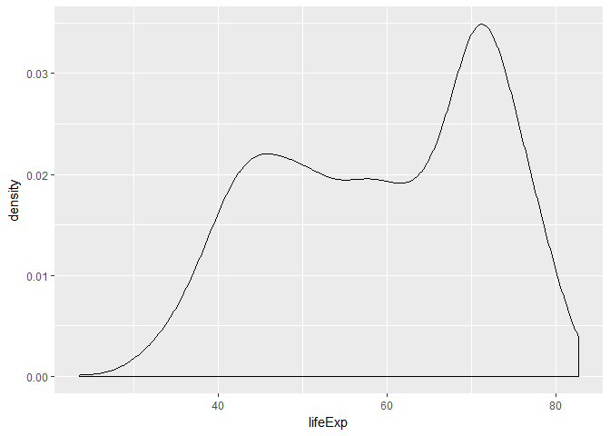

In this worksheet, we’ll be exploring various plot types (i.e.,
geometric objects), only using the `x` and `y` aesthetics (and `group`).

1.  To get started, load the `tidyverse` and `gapminder` R packages.

<!-- -->

    suppressPackageStartupMessages(library(tidyverse))
    library(gapminder)

Scatterplot
-----------

Let’s look at a *scatterplot* of `gdpPercap` vs. `lifeExp`.

1.  Fill out the grammar components below. Again, bold *must* be
    specified to make a `ggplot2` plot.
    -   We’ll ignore “coordinate system” and “facetting” after this.

<table>
<thead>
<tr class="header">
<th>Grammar Component</th>
<th>Specification</th>
</tr>
</thead>
<tbody>
<tr class="odd">
<td><strong>data</strong></td>
<td><code>gapminder</code></td>
</tr>
<tr class="even">
<td><strong>aesthetic mapping</strong></td>
<td><code>aes(x=gdpPercap, y=lifeExp)</code></td>
</tr>
<tr class="odd">
<td><strong>geometric object</strong></td>
<td><code>geom_point</code></td>
</tr>
<tr class="even">
<td>scale</td>
<td>log</td>
</tr>
<tr class="odd">
<td>statistical transform</td>
<td>none</td>
</tr>
<tr class="even">
<td>coordinate system</td>
<td>rectangular</td>
</tr>
<tr class="odd">
<td>facetting</td>
<td>none</td>
</tr>
</tbody>
</table>

1.  Populate the data and aesthetic mapping in `ggplot`. What is
    returned? What’s missing?

<!-- -->

    ggplot(gapminder, aes(x=gdpPercap, y=lifeExp))

1.  Add the missing component as a *layer*.

<!-- -->

    ggplot(gapminder, aes(x=gdpPercap, y=lifeExp)) + geom_point()

Notice the “metaprogramming” again!

1.  You *must* remember to put the aesthetic mappings in the `aes`
    function! What happens if you forget?

<!-- -->

    ggplot(gapminder, x=gdpPercap, y=lifeExp)

1.  Put the x-axis on a log scale, first by transforming the x variable.
    -   Note: `ggplot2` does some data wrangling and computations
        itself! We don’t always have to modify the data frame.

<!-- -->

    ggplot(gapminder, aes(x=log(gdpPercap), y=lifeExp)) + geom_point()

1.  Try again, this time by changing the *scale* (this way is better).

<!-- -->

    ggplot(gapminder, aes(x=gdpPercap, y=lifeExp)) + geom_point() + scale_x_log10()

1.  The aesthetic mappings can be specified on the geom layer if you
    want, instead of the main `ggplot` call. Give it a try:

<!-- -->

    ggplot(gapminder) + geom_point(aes(x=gdpPercap, y=lifeExp)) + scale_x_log10()

1.  Optional: git stage and commit

**Uses of a scatterplot**:

-   Visualize 2-dimensional distributions; dependence.
-   2 numeric variables

Histograms, and Kernel Density Plots
------------------------------------

Let’s build a histogram of life expectancy.

1.  Fill out the grammar components below. Again, bold *must* be
    specified to make a `ggplot2` plot.

<table>
<thead>
<tr class="header">
<th>Grammar Component</th>
<th>Specification</th>
</tr>
</thead>
<tbody>
<tr class="odd">
<td><strong>data</strong></td>
<td><code>gapminder</code></td>
</tr>
<tr class="even">
<td><strong>aesthetic mapping</strong></td>
<td><code>aes(x=lifeExp)</code></td>
</tr>
<tr class="odd">
<td><strong>geometric object</strong></td>
<td><code>geom_histogram</code></td>
</tr>
<tr class="even">
<td>scale</td>
<td>linear</td>
</tr>
<tr class="odd">
<td>statistical transform</td>
<td>none</td>
</tr>
</tbody>
</table>

1.  Build the histogram of life expectancy.

<!-- -->

    ggplot(gapminder, aes(x=lifeExp)) + geom_histogram()

    ## `stat_bin()` using `bins = 30`. Pick better value with `binwidth`.

1.  Change the number of bins to 50.

<!-- -->

    ggplot(gapminder, aes(x=lifeExp)) + geom_histogram(bins=50)

1.  Instead of a histogram, let’s create a kernel density plot.

<!-- -->

    ggplot(gapminder, aes(x=lifeExp)) + geom_density()

1.  Optional: git stage and commit

**Uses of a histogram**: Explore the distribution of a single numeric
variable.

Box plots, and violin plots
---------------------------

Let’s make *box plots* of population for each continent. Note: y-axis is
much better on a log scale!

1.  Fill out the grammar components below. Again, bold *must* be
    specified to make a `ggplot2` plot.

<table>
<thead>
<tr class="header">
<th>Grammar Component</th>
<th>Specification</th>
</tr>
</thead>
<tbody>
<tr class="odd">
<td><strong>data</strong></td>
<td><code>gapminder</code></td>
</tr>
<tr class="even">
<td><strong>aesthetic mapping</strong></td>
<td><code>aes(x=continent, y=pop)</code></td>
</tr>
<tr class="odd">
<td><strong>geometric object</strong></td>
<td><code>geom_boxplot</code></td>
</tr>
<tr class="even">
<td>scale</td>
<td>log</td>
</tr>
<tr class="odd">
<td>statistical transform</td>
<td>none</td>
</tr>
</tbody>
</table>

1.  Initiate the `ggplot` call, with the log y scale, and store it in
    the variable `a`. Print out `a`.

<!-- -->

    a <- ggplot(gapminder, aes(x=continent, y=pop)) + scale_y_log10()
    a

1.  Add the boxplot geom to `a`.

<!-- -->

    a + geom_boxplot()

1.  A violin plot is a kernel density on its side, made symmetric. Add
    that geom to `a`.
    -   What’s better here, boxplots or violin plots? Why?

<!-- -->

    a + geom_violin()

1.  Optional: git stage and commit

**Use of boxplot**: Visualize 1-dimensional distributions (of a single
numeric variable).

Jitter plots
------------

Let’s work up to the concept of a *jitter plot*. As above, let’s explore
the population for each continent, but using points (again, with the
y-axis on a log scale).

Let’s hold off on identifying the grammar.

1.  Initiate the `ggplot` call to make a scatterplot of `continent` vs
    `pop`; initiate the log y scale. Store the call in the variable `b`.

<!-- -->

    b <- ggplot(gapminder, aes(x=continent, y=pop)) + scale_y_log10()

1.  Add the point geom to `b`. Why is this an ineffective plot?

<!-- -->

    b + geom_point()

1.  A solution is to jitter the points. Add the jitter geom. Re-run the
    command a few times – does the plot change? Why?

<!-- -->

    b + geom_jitter()

    b + geom_jitter()

    b + geom_jitter()

1.  How does the grammar differ from a box plot or violin plot?
    -   ANSWER:
2.  We can add multiple geom *layers* to our plot. Put a jitterplot
    overtop of the violin plot, starting with our base `b`. Try
    vice-versa.

<!-- -->

    b + geom_violin() + geom_jitter()

    b + geom_jitter() + geom_violin() 

1.  Optional: git stage and commit

**Uses of jitterplot**: Visualize 1-dimensional distributions, AND get a
sense of the sample size.

Time/Line Plots
---------------

Let’s make some time/line plot, starting with Canada’s life expectancy
over time.

1.  Fill out the grammar components below. Again, bold *must* be
    specified to make a `ggplot2` plot.

<table>
<thead>
<tr class="header">
<th>Grammar Component</th>
<th>Specification</th>
</tr>
</thead>
<tbody>
<tr class="odd">
<td><strong>data</strong></td>
<td><code>gapminder</code></td>
</tr>
<tr class="even">
<td><strong>aesthetic mapping</strong></td>
<td><code>aes(x=year, y=lifeExp)</code></td>
</tr>
<tr class="odd">
<td><strong>geometric object</strong></td>
<td><code>geom_line</code></td>
</tr>
<tr class="even">
<td>scale</td>
<td>log</td>
</tr>
<tr class="odd">
<td>statistical transform</td>
<td>none</td>
</tr>
</tbody>
</table>

1.  In one readable call, write code that:
    1.  Filters the data to Canada only
    2.  Pipes the filtered data into `ggplot`
    3.  Makes the time plot of `lifeExp` over time
    4.  Also displays the points

<!-- -->

    gapminder %>% filter(country=="Canada") %>% ggplot(aes(x=year, y=lifeExp)) + geom_line() + geom_point() 

1.  Attempt to overlay line plots for all countries. That is, repeat the
    above code, but don’t filter. What’s wrong here?

<!-- -->

    gapminder %>% ggplot(aes(x=year, y=lifeExp)) + geom_line() + geom_point()

1.  Use the `group` aesthetic to fix the problem.

<!-- -->

    gapminder %>% ggplot(aes(x=year, y=lifeExp, group=country)) + geom_line() + geom_point() 

1.  Optional: git stage and commit

**Uses of time/line plots**: Visualize trends of a numeric variable over
time.

Path plots
----------

Let’s see how Rwanda’s life expectancy and GDP per capita have evolved
over time, using a path plot.

1.  Make a scatterplot. Store it in the variable `c`.

<!-- -->

    c <- gapminder %>% filter(country=="Rwanda") %>% ggplot(aes(x=lifeExp, y=gdpPercap)) + geom_point()

1.  We want to connect the dots from earliest point to latest. What
    happens if we add the “line” geom to `c`?

<!-- -->

    c + geom_line()

1.  Add the appropriate geom to `c`. In that geom, specify a property of
    the geom: `arrow=arrow()`.

<!-- -->

    c + geom_path(arrow=arrow())

1.  Optional: git stage and commit

**Uses of path plots**: The four “corners” of the plot usually indicate
different qualities. This plot allows you to see how Rwanda (or some
entity) evolves over these qualities.

Bar plots
---------

How many countries are in each continent? Use the year 2007.

1.  Fill out the grammar components below. Again, bold *must* be
    specified to make a `ggplot2` plot.

<table>
<thead>
<tr class="header">
<th>Grammar Component</th>
<th>Specification</th>
</tr>
</thead>
<tbody>
<tr class="odd">
<td><strong>data</strong></td>
<td><code>gapminder</code></td>
</tr>
<tr class="even">
<td><strong>aesthetic mapping</strong></td>
<td><code>aes(x=continent)</code></td>
</tr>
<tr class="odd">
<td><strong>geometric object</strong></td>
<td><code>geom_bar</code></td>
</tr>
<tr class="even">
<td>scale</td>
<td>log</td>
</tr>
<tr class="odd">
<td>statistical transform</td>
<td>none</td>
</tr>
</tbody>
</table>

1.  After filtering the gapminder data to 2007, make a bar chart of the
    number of countries in each continent. Store everything except the
    geom in the variable `d`.

<!-- -->

    d <- gapminder %>% filter(year==2007) %>% ggplot(aes(x=continent))
    d + geom_bar()

1.  Notice the y-axis. Oddly, `ggplot2` doesn’t make it obvious how to
    change to proportion. Try adding a `y` aesthetic:
    `y=..count../sum(..count..)`.

<!-- -->

    gapminder %>% filter(year==2007) %>% ggplot(aes(x=continent, y=..count../sum(..count..))) + geom_bar()

1.  Optional: git stage, commit, and push!

**Uses of bar plots**: Get a sense of relative quantities of categories,
or see the probability mass function of a categorical random variable.
