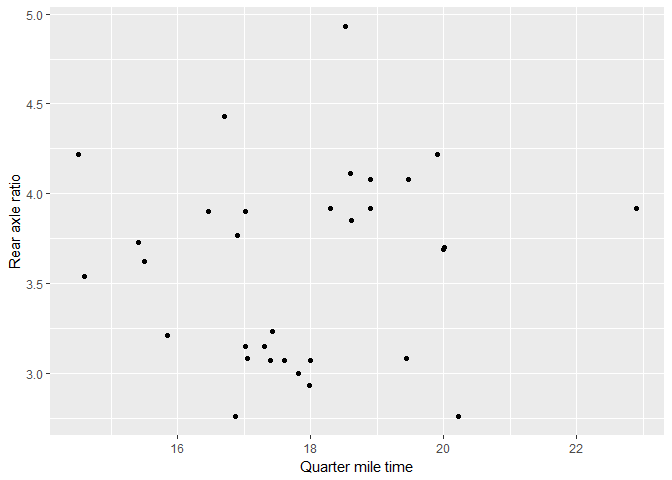

cm014 Worksheet: The Model-Fitting Paradigm in R
================

``` r
suppressPackageStartupMessages(library(tidyverse))
library(gapminder)
library(broom)
```

So you want to fit a model to your data. How can you achieve this with
R?

Topics:

1.  What *is* model-fitting?
2.  How do we fit a model in R?
3.  How can we obtain tidy results from the model output?

## What is Model-Fitting?

When variables are not independent, then we can gain information about
one variable if we know something about the other.

Examples: Use the scatterplot below:

1.  A car weighs 4000 lbs. What can we say about its mpg?
2.  A car weights less than 3000 lbs. What can we say about its mpg?

<!-- end list -->

``` r
ggplot(mtcars, aes(wt, mpg)) +
  geom_point() +
  labs(x = "Weight (1000's of lbs)")
```

<!-- -->

Example: What can we say about rear axle ratio if we know something
about quarter mile time?

``` r
ggplot(mtcars, aes(qsec, drat)) + 
  geom_point() +
  labs(x = "Quarter mile time",
       y = "Rear axle ratio")
```

<!-- -->

If EDA isn’t enough, we can answer these questions by fitting a model: a
curve that predicts Y given X. Aka, a **regression curve** or a
**machine learning model**.

(There are more comprehensive models too, such as modelling entire
distributions, but that’s not what we’re doing here)

There are typically two goals of fitting a model:

1.  Make predictions.
2.  Interpret variable relationships.

## Fitting a model in R

Model fitting methods tend to use a common format in R:

    method(formula, data, options)

They also tend to have a common output: a special *list*.

**Method**:

A function such as:

  - Linear Regression: `lm`
  - Generalized Linear Regression: `glm`
  - Local regression: `loess`
  - Quantile regression: `quantreg::rq`
  - …

**Formula**:

In R, takes the form `y ~ x1 + x2 + ... + xp` (use column names in your
data frame).

**Data**: The data frame.

**Options**: Specific to the method.

Exercise:

1.  Fit a linear regression model to life expectancy (“Y”) from log(GDP
    per capita) (“X”) by filling in the formula. Notice what appears as
    the output.
2.  On a new line, use the `unclass` function to uncover the object’s
    true nature: a list. Note: it might be easier to use the `names`
    function to see what components are included in the list.

<!-- end list -->

``` r
(my_lm <- lm(lifeExp ~ log(gdpPercap), data=gapminder))
```

    ## 
    ## Call:
    ## lm(formula = lifeExp ~ log(gdpPercap), data = gapminder)
    ## 
    ## Coefficients:
    ##    (Intercept)  log(gdpPercap)  
    ##         -9.101           8.405

``` r
unclass(my_lm)
```

    ## $coefficients
    ##    (Intercept) log(gdpPercap) 
    ##      -9.100889       8.405085 
    ## 
    ## $residuals
    ##             1             2             3             4             5 
    ## -1.806406e+01 -1.696812e+01 -1.562700e+01 -1.343579e+01 -1.034035e+01 
    ##             6             7             8             9            10 
    ## -8.498661e+00 -8.918503e+00 -6.795054e+00 -3.656093e+00 -3.383894e+00 
    ##            11            12            13            14            15 
    ## -4.147522e+00 -4.914964e+00  2.314653e+00  4.740780e+00  8.812978e+00 
    ##            16            17            18            19            20 
    ##  8.726919e+00  8.661483e+00  9.362154e+00  1.062247e+01  1.195599e+01 
    ##            21            22            23            24            25 
    ##  1.492874e+01  1.423250e+01  1.385729e+01  1.249241e+01 -1.341067e+01 
    ##            26            27            28            29            30 
    ## -1.254738e+01 -8.527017e+00 -7.451293e+00 -6.468623e+00 -4.320887e+00 
    ##            31            32            33            34            35 
    ## -2.286477e+00  2.238386e+00  5.218220e+00  7.013007e+00  8.036389e+00 
    ##            36            37            38            39            40 
    ##  7.974509e+00 -2.952331e+01 -2.824275e+01 -2.715889e+01 -2.733767e+01 
    ##            41            42            43            44            45 
    ## -2.531901e+01 -1.873450e+01 -1.754120e+01 -1.651690e+01 -1.643307e+01 
    ##            46            47            48            49            50 
    ## -1.491310e+01 -1.652985e+01 -1.940788e+01 -1.409110e+00 -7.422627e-01 
    ##            51            52            53            54            55 
    ## -3.313150e-01 -8.587146e-01 -7.661315e-01  1.020343e-01  2.516724e+00 
    ##            56            57            58            59            60 
    ##  3.217323e+00  4.157554e+00  4.186143e+00  7.103900e+00  4.945867e+00 
    ##            61            62            63            64            65 
    ##  7.739812e-01  1.254667e+00  9.339776e-01 -3.509572e-01 -7.376194e-01 
    ##            66            67            68            69            70 
    ##  8.217680e-02  8.239488e-01  1.422702e+00  2.092714e+00  2.169473e+00 
    ##            71            72            73            74            75 
    ##  2.632754e+00  2.529316e+00  2.590866e+00  2.010580e-01  6.187708e-01 
    ##            76            77            78            79            80 
    ## -2.703749e-01 -1.973794e+00 -1.862793e+00 -1.604494e+00 -6.211489e-01 
    ##            81            82            83            84            85 
    ## -6.342399e-01  2.204568e-01  7.818357e-01  7.203570e-01 -1.726134e+01 
    ##            86            87            88            89            90 
    ## -1.575419e+01 -1.343395e+01 -1.168760e+01 -1.007772e+01 -8.263762e+00 
    ##            91            92            93            94            95 
    ## -4.748531e+00 -2.744399e+00 -1.122365e+00 -3.355990e-01 -6.646732e-01 
    ##            96            97            98            99           100 
    ## -1.854398e+00 -8.286152e+00 -6.139765e+00 -4.579876e+00 -2.759111e+00 
    ##           101           102           103           104           105 
    ##  1.729502e-01  1.457625e+00  4.328534e+00  6.255458e+00  8.546014e+00 
    ##           106           107           108           109           110 
    ##  1.068466e+01  1.197897e+01  1.232722e+01  1.209774e+00  1.170255e+00 
    ##           111           112           113           114           115 
    ##  1.142827e+00  3.261883e-01 -1.169098e+00 -9.596679e-01 -6.107801e-01 
    ##           116           117           118           119           120 
    ##  2.117146e-01  2.543796e-01  6.959210e-01  6.382271e-01  9.185956e-01 
    ##           121           122           123           124           125 
    ## -1.124793e+01 -8.254775e+00 -5.905823e+00 -4.370277e+00 -2.637238e+00 
    ##           126           127           128           129           130 
    ## -1.097779e-02 -1.164441e-01  1.666013e+00  3.489001e+00  4.057341e+00 
    ##           131           132           133           134           135 
    ##  2.782970e+00  4.696267e+00 -1.682287e+01 -1.341552e+01 -1.208542e+01 
    ##           136           137           138           139           140 
    ## -1.191603e+01 -1.142402e+01 -9.580678e+00 -4.761750e+00 -2.222475e-01 
    ##           141           142           143           144           145 
    ##  1.871686e+00  2.989275e+00  4.604960e+00  5.325000e+00  5.086072e+00 
    ##           146           147           148           149           150 
    ##  6.943415e+00  8.462902e+00  9.309865e+00  9.657875e+00  1.030292e+01 
    ##           151           152           153           154           155 
    ##  9.816773e+00  9.893292e+00  1.536129e+01  1.115939e+01  1.004419e+01 
    ##           156           157           158           159           160 
    ##  9.017586e+00  1.634079e-02  1.375612e+00  2.699144e+00  2.703790e+00 
    ##           161           162           163           164           165 
    ##  1.979895e-01  5.443028e-01 -2.122635e-01 -6.808453e-01 -3.643913e+00 
    ##           166           167           168           169           170 
    ## -1.453507e+01 -2.248265e+01 -1.950718e+01 -4.314150e+00 -3.333299e+00 
    ##           171           172           173           174           175 
    ## -3.422072e+00 -1.686822e+00 -2.958789e+00 -3.407576e+00 -2.015865e+00 
    ##           176           177           178           179           180 
    ## -1.027108e+00  1.801989e+00  2.995000e+00  4.431998e+00  4.901532e+00 
    ##           181           182           183           184           185 
    ##  3.128547e+00  8.392432e+00  8.380568e+00  7.015207e+00  6.082830e+00 
    ##           186           187           188           189           190 
    ##  4.790335e+00  4.410433e+00  4.654440e+00  6.757144e+00  6.342312e+00 
    ##           191           192           193           194           195 
    ##  6.027507e+00  4.138620e+00 -1.185580e+01 -9.997180e+00 -8.413550e+00 
    ##           196           197           198           199           200 
    ## -6.332310e+00 -4.049096e+00 -3.299498e-01  9.628671e-01  1.371274e+00 
    ##           201           202           203           204           205 
    ##  1.894756e+00  1.828588e+00  1.380018e+00  1.684727e+00 -8.434838e-01 
    ##           206           207           208           209           210 
    ## -2.841195e-01  1.785430e+00  2.021758e+00  1.549836e+00  1.882734e+00 
    ##           211           212           213           214           215 
    ##  3.391000e+00  3.244930e+00 -3.625817e-01  2.836682e+00  5.179589e+00 
    ##           216           217           218           219           220 
    ##  7.712878e+00 -1.150761e+00 -5.783084e-01  3.336231e-01  1.896630e+00 
    ##           221           222           223           224           225 
    ## -1.383402e+00 -1.232306e+01  5.955096e+00  8.148132e+00  1.005673e+01 
    ##           226           227           228           229           230 
    ##  1.017060e+01  8.713503e+00  6.235794e+00 -1.177515e+01 -1.082052e+01 
    ##           231           232           233           234           235 
    ## -9.142101e+00 -7.615583e+00 -6.291606e+00 -4.467059e+00 -3.243889e+00 
    ##           236           237           238           239           240 
    ## -2.014144e+00  4.462072e-01 -1.192313e+00 -4.647344e+00 -4.530413e+00 
    ##           241           242           243           244           245 
    ## -6.398611e-01 -2.215842e-01  4.881803e-01 -1.733616e-01 -8.146118e-01 
    ##           246           247           248           249           250 
    ## -7.645055e-01  4.835908e-01  3.159077e-01  1.495921e+00  1.361286e+00 
    ##           251           252           253           254           255 
    ##  1.338804e+00  1.499633e+00 -1.407535e+01 -1.296343e+01 -1.096812e+01 
    ##           256           257           258           259           260 
    ## -8.553560e+00 -6.071162e+00 -3.056797e+00 -2.927917e-01  2.942422e+00 
    ##           261           262           263           264           265 
    ##  2.878117e+00 -3.683159e-01 -3.105681e+00 -1.292431e+00 -1.224904e+01 
    ##           266           267           268           269           270 
    ## -1.133832e+01 -1.001010e+01 -6.868440e+00 -4.222771e+00 -2.633219e+00 
    ##           271           272           273           274           275 
    ##  2.455167e+00  2.501659e+00  2.290227e+00  2.572022e+00  3.458475e-01 
    ##           276           277           278           279           280 
    ## -2.788424e+00 -5.739226e+00 -5.175646e+00 -3.712868e+00 -2.141245e+00 
    ##           281           282           283           284           285 
    ##  1.622035e-01  4.984321e+00  7.918860e+00  9.132450e+00  8.124146e+00 
    ##           286           287           288           289           290 
    ##  7.404552e+00  8.916859e+00  7.924756e+00  2.732699e+00  6.226414e+00 
    ##           291           292           293           294           295 
    ##  1.577739e+00  1.353914e+01  1.743943e+01  1.752475e+01  1.688756e+01 
    ##           296           297           298           299           300 
    ##  1.561416e+01  1.549215e+01  1.450538e+01  1.350697e+01  1.054317e+01 
    ##           301           302           303           304           305 
    ## -4.727165e+00 -9.286003e-01  1.227873e+00  2.721730e+00  2.719096e+00 
    ##           306           307           308           309           310 
    ##  3.621930e+00  5.245240e+00  5.445442e+00  5.218083e+00  6.130910e+00 
    ##           311           312           313           314           315 
    ##  8.012761e+00  7.566182e+00 -9.068294e+00 -8.109536e+00 -7.360278e+00 
    ##           316           317           318           319           320 
    ## -7.775504e+00 -5.574828e+00  6.413103e-01  1.983876e+00  3.658732e+00 
    ##           321           322           323           324           325 
    ##  7.124900e+00  1.035504e+01  1.340042e+01  1.630986e+01 -7.733884e+00 
    ##           326           327           328           329           330 
    ## -7.476368e+00 -5.917328e+00 -3.651258e+00 -2.130417e+00  7.648539e-01 
    ##           331           332           333           334           335 
    ##  2.143782e+00  1.783929e+00  3.157188e+00  3.412385e+00  7.960922e+00 
    ##           336           337           338           339           340 
    ##  8.275816e+00 -1.318635e+01 -1.096190e+01 -8.106640e+00 -5.198790e+00 
    ##           341           342           343           344           345 
    ## -3.863238e+00 -3.264781e+00 -5.586813e+00 -3.553779e+00 -4.212357e+00 
    ##           346           347           348           349           350 
    ## -6.488845e+00 -6.480598e+00 -4.479411e+00  1.286006e-01  1.860723e+00 
    ##           351           352           353           354           355 
    ##  3.447375e+00  4.479554e+00  5.165860e+00  6.833792e+00  1.053271e+01 
    ##           356           357           358           359           360 
    ##  1.126784e+01  1.147196e+01  1.234209e+01  1.198143e+01  1.077295e+01 
    ##           361           362           363           364           365 
    ## -1.124171e+01 -9.903368e+00 -8.630893e+00 -7.651288e+00 -6.440079e+00 
    ##           366           367           368           369           370 
    ## -4.346303e+00 -3.016292e+00 -7.653528e-01 -1.114622e+00 -5.844398e+00 
    ##           371           372           373           374           375 
    ## -6.330329e+00 -4.286434e+00  2.689093e+00  3.476436e+00  3.875923e+00 
    ##           376           377           378           379           380 
    ##  3.232886e+00  2.030897e+00  1.295942e+00 -2.002060e-01  4.863129e-01 
    ##           381           382           383           384           385 
    ##  5.631963e+00  5.472407e+00  5.295168e+00  4.243346e+00 -3.998152e+00 
    ##           386           387           388           389           390 
    ## -1.822412e+00  2.460667e+00  4.716216e+00  7.737771e+00  8.112932e+00 
    ##           391           392           393           394           395 
    ##  8.029910e+00  8.242371e+00  1.098537e+01  1.296765e+01  1.267459e+01 
    ##           396           397           398           399           400 
    ##  1.089437e+01  1.705132e+00  2.327637e+00  1.472938e+00  9.663015e-01 
    ##           401           402           403           404           405 
    ## -2.978273e-01 -8.980424e-01 -9.695345e-01 -8.447440e-01  1.082663e+00 
    ##           406           407           408           409           410 
    ##  1.721329e+00  2.447495e+00  1.233661e+00  2.729809e+00  2.620299e+00 
    ##           411           412           413           414           415 
    ##  1.463080e+00  7.298244e-01 -1.782449e-01  3.753618e-01 -1.898182e-01 
    ##           416           417           418           419           420 
    ## -1.253274e+00 -1.144429e+00 -1.381738e+00 -9.528048e-01 -5.769797e-01 
    ##           421           422           423           424           425 
    ## -2.240035e+01 -2.047822e+01 -1.855891e+01 -1.617530e+01 -1.557687e+01 
    ##           426           427           428           429           430 
    ## -1.190031e+01 -9.036645e+00 -7.810497e+00 -4.633385e+00 -1.175145e+00 
    ##           431           432           433           434           435 
    ## -1.017682e+00 -3.340169e-01 -5.845742e+00 -2.784545e+00  2.289591e-01 
    ##           436           437           438           439           440 
    ##  3.563617e+00  4.083342e+00  4.536510e+00  5.932164e+00  8.138092e+00 
    ##           441           442           443           444           445 
    ##  1.014072e+01  1.019840e+01  9.127377e+00  8.180257e+00 -1.118489e+01 
    ##           446           447           448           449           450 
    ## -8.781039e+00 -6.150331e+00 -5.069691e+00 -4.150404e+00 -3.611155e+00 
    ##           451           452           453           454           455 
    ## -1.225784e+00  2.562560e+00  4.174474e+00  6.496620e+00  1.047783e+01 
    ##           456           457           458           459           460 
    ##  9.832651e+00 -1.000671e+01 -7.689924e+00 -6.394343e+00 -4.675977e+00 
    ##           461           462           463           464           465 
    ## -3.748636e+00 -4.250761e+00 -3.491912e+00 -5.701114e-01  3.505431e+00 
    ##           466           467           468           469           470 
    ##  6.249453e+00  7.742138e+00  7.926913e+00 -1.306556e+01 -1.072836e+01 
    ##           471           472           473           474           475 
    ## -7.821714e+00 -5.477925e+00 -3.432010e+00 -6.021189e+00 -4.211451e+00 
    ##           476           477           478           479           480 
    ##  2.252653e+00  5.301536e+00  6.791841e+00  7.676016e+00  8.248147e+00 
    ##           481           482           483           484           485 
    ## -6.247830e+00 -5.806090e+00 -6.936986e+00 -9.231220e+00 -5.107540e+00 
    ##           486           487           488           489           490 
    ## -6.579711e+00 -4.667741e+00 -3.012436e+00 -2.456902e+00 -9.411776e+00 
    ##           491           492           493           494           495 
    ## -1.677183e+01 -1.837347e+01 -3.685950e+00 -1.947155e+00 -6.907527e-01 
    ##           496           497           498           499           500 
    ## -4.027744e-01  7.711725e-01  1.305410e+00  3.484826e-01  2.971615e+00 
    ##           501           502           503           504           505 
    ##  5.568775e+00  5.179312e+00  8.528324e+00  1.281373e+01 -6.344277e+00 
    ##           506           507           508           509           510 
    ## -4.135481e+00 -1.598079e+00 -1.285101e+00 -6.641543e-01  4.720832e-01 
    ##           511           512           513           514           515 
    ##  5.661558e-01  2.394288e+00  6.395993e+00  6.005633e+00  7.100976e+00 
    ##           516           517           518           519           520 
    ##  7.096634e+00  1.956138e+00  1.544446e+00  9.824789e-01  7.761977e-01 
    ##           521           522           523           524           525 
    ## -4.836225e-01  4.666526e-01  1.051457e+00  2.248991e-01  1.293569e+00 
    ##           526           527           528           529           530 
    ##  1.556043e+00  1.341966e+00  9.125966e-01  2.059362e+00  1.823688e+00 
    ##           531           532           533           534           535 
    ##  1.738832e+00  1.032055e+00  6.065354e-02  4.412522e-01  6.286220e-01 
    ##           536           537           538           539           540 
    ##  1.374799e+00  1.545874e+00  2.331746e+00  2.349677e+00  2.979603e+00 
    ##           541           542           543           544           545 
    ## -2.420340e+01 -2.344774e+01 -2.437133e+01 -2.220798e+01 -2.072554e+01 
    ##           546           547           548           549           550 
    ## -2.205209e+01 -1.522006e+01 -9.559720e+00 -9.482993e+00 -1.110302e+01 
    ##           551           552           553           554           555 
    ## -1.344193e+01 -1.391545e+01 -1.288140e+01 -1.141304e+01 -1.076495e+01 
    ##           556           557           558           559           560 
    ## -1.051210e+01 -8.301327e+00 -6.088227e+00 -1.871892e+00  4.437396e+00 
    ##           561           562           563           564           565 
    ##  7.105739e+00  1.047429e+01  1.256661e+01  1.287585e+01  2.013794e+00 
    ##           566           567           568           569           570 
    ##  6.307903e-01 -1.546981e-01 -7.770145e-01 -2.260753e+00 -1.851605e+00 
    ##           571           572           573           574           575 
    ## -1.151894e+00 -1.045115e+00 -4.357425e-01  4.367704e-01  1.113242e+00 
    ##           576           577           578           579           580 
    ##  1.272183e+00 -5.029680e+00 -4.538769e+00 -3.969764e+00 -1.882564e+00 
    ##           581           582           583           584           585 
    ## -4.628817e-01  2.853766e+00  5.897049e+00  8.165261e+00  9.196346e+00 
    ##           586           587           588           589           590 
    ##  9.552643e+00  8.601450e+00  8.680790e+00  6.297661e+00  5.515049e+00 
    ##           591           592           593           594           595 
    ##  5.466682e+00  4.040241e+00  2.001822e+00  2.422545e+00  3.370150e+00 
    ##           596           597           598           599           600 
    ##  4.343697e+00  3.993671e+00  4.273719e+00  3.121935e+00  2.655872e+00 
    ##           601           602           603           604           605 
    ## -1.439308e+01 -1.290381e+01 -1.050909e+01 -8.830738e+00 -6.939042e+00 
    ##           606           607           608           609           610 
    ## -6.253649e+00 -4.042542e+00 -3.319053e-01  1.885582e+00  4.383324e+00 
    ##           611           612           613           614           615 
    ##  6.732715e+00  7.465082e+00 -9.694100e+00 -9.768631e+00 -1.004327e+01 
    ##           616           617           618           619           620 
    ## -8.869023e+00 -7.605471e+00 -7.072020e+00 -4.773785e+00 -1.590184e+00 
    ##           621           622           623           624           625 
    ##  1.551748e+00  3.671446e+00  5.186909e+00  7.543988e+00 -6.335692e+00 
    ##           626           627           628           629           630 
    ## -8.411665e+00 -9.007892e+00 -1.065453e+01 -1.080769e+01 -9.239820e+00 
    ##           631           632           633           634           635 
    ## -8.148133e+00 -5.142753e+00 -3.225256e+00 -2.175723e+00  1.185574e+00 
    ##           636           637           638           639           640 
    ##  2.018238e+00 -1.650719e+01 -1.285525e+01 -1.029384e+01 -5.851323e+00 
    ##           641           642           643           644           645 
    ## -5.149113e+00 -4.316747e+00 -3.371110e+00 -3.705693e-01  2.970102e+00 
    ##           646           647           648           649           650 
    ##  5.240881e+00  7.166247e+00  1.041273e+01 -1.365503e+01 -1.099934e+01 
    ##           651           652           653           654           655 
    ## -7.886674e+00 -5.864570e+00 -2.876619e+00 -1.342184e+00  2.381294e+00 
    ##           656           657           658           659           660 
    ##  6.234228e+00  7.979867e+00  9.027754e+00  1.009682e+01  1.059377e+01 
    ##           661           662           663           664           665 
    ##  2.615584e+00  4.956648e+00  5.696382e+00  5.707890e+00  5.237197e+00 
    ##           666           667           668           669           670 
    ##  4.345065e+00  3.979159e+00  2.045082e+00  1.668587e+00  2.920557e+00 
    ##           671           672           673           674           675 
    ##  3.889910e+00  2.301263e+00  1.111208e+00  2.334630e+00  2.008940e+00 
    ##           676           677           678           679           680 
    ##  1.773112e+00  1.306621e+00  3.356619e-01 -8.292123e-01 -9.292522e-01 
    ##           681           682           683           684           685 
    ##  4.186386e-01  1.398392e+00  9.571343e-01  8.062349e-02  6.859652e+00 
    ##           686           687           688           689           690 
    ##  5.817922e+00  5.077920e+00  3.007679e+00  2.303531e+00  2.117504e+00 
    ##           691           692           693           694           695 
    ##  1.578572e+00  5.927703e-01  2.707289e+00  1.964836e+00  2.633532e+00 
    ##           696           697           698           699           700 
    ##  2.635734e+00 -6.508863e+00 -4.276466e+00 -1.840863e+00  1.222255e+00 
    ##           701           702           703           704           705 
    ##  4.405781e+00  6.985188e+00  8.946198e+00  9.793388e+00  9.984266e+00 
    ##           706           707           708           709           710 
    ##  9.631639e+00  9.231531e+00  8.199344e+00 -9.069820e+00 -7.762947e+00 
    ##           711           712           713           714           715 
    ## -5.068369e+00 -7.155666e-01 -6.419206e-01  1.019039e+00  3.697632e+00 
    ##           716           717           718           719           720 
    ##  6.481896e+00  6.422481e+00  7.519826e+00  1.075559e+01  1.106398e+01 
    ##           721           722           723           724           725 
    ## -1.342270e+01 -1.178855e+01 -1.167099e+01 -1.141859e+01 -1.274778e+01 
    ##           726           727           728           729           730 
    ## -1.206484e+01 -6.395352e+00 -1.834794e+00  1.487826e-01  1.332264e+00 
    ##           731           732           733           734           735 
    ##  1.801868e+00  1.399574e+00 -1.555965e+01 -1.589755e+01 -1.533185e+01 
    ##           736           737           738           739           740 
    ## -1.290399e+01 -1.099869e+01 -1.113124e+01 -9.408201e+00 -4.547799e+00 
    ##           741           742           743           744           745 
    ## -5.980744e-01  4.067580e-01 -4.348642e+00 -2.002054e+00  4.076903e+00 
    ##           746           747           748           749           750 
    ##  5.462004e+00  5.429495e+00  5.012629e+00  3.371138e+00  2.801526e+00 
    ##           751           752           753           754           755 
    ##  2.832469e+00  3.295793e+00  2.422376e+00  2.699740e-01 -8.347663e-01 
    ##           756           757           758           759           760 
    ## -1.220584e+00  4.598829e+00  4.729238e+00  3.949193e+00  3.908916e+00 
    ##           761           762           763           764           765 
    ##  1.250901e+00  2.346061e+00  2.526042e+00  2.766881e+00  3.652775e+00 
    ##           766           767           768           769           770 
    ##  3.761633e+00  4.792290e+00  4.556583e+00  3.569266e+00  3.449424e+00 
    ##           771           772           773           774           775 
    ##  2.550639e+00  2.728388e+00  2.158247e+00  2.186822e+00  2.439065e+00 
    ##           776           777           778           779           780 
    ##  2.621181e+00  2.494933e+00  2.915669e+00  3.282739e+00  3.409854e+00 
    ##           781           782           783           784           785 
    ##  6.258941e-01  5.427420e-01  2.719305e+00  3.317829e+00  3.179605e+00 
    ##           786           787           788           789           790 
    ##  5.225956e+00  7.095936e+00  7.272562e+00  5.978419e+00  6.801941e+00 
    ##           791           792           793           794           795 
    ##  6.738355e+00  6.875360e+00  4.249818e+00  4.246320e+00  3.939428e+00 
    ##           796           797           798           799           800 
    ##  3.246115e+00  1.824105e+00  2.802098e+00  3.234136e+00  3.587730e+00 
    ##           801           802           803           804           805 
    ##  2.753518e+00  3.481540e+00  4.853601e+00  4.604640e+00 -9.468166e+00 
    ##           806           807           808           809           810 
    ## -8.623415e+00 -8.007691e+00 -5.807861e+00  1.289233e+00  3.364882e+00 
    ##           811           812           813           814           815 
    ##  2.795184e+00  4.364127e+00  8.691941e+00  9.940974e+00  1.098405e+01 
    ##           816           817           818           819           820 
    ##  1.089745e+01 -5.358336e+00 -3.792905e+00 -9.643783e-02  1.230782e+00 
    ##           821           822           823           824           825 
    ##  2.912018e+00  5.202473e+00  7.295268e+00  7.783223e+00  7.853661e+00 
    ##           826           827           828           829           830 
    ##  2.860187e+00 -9.146168e-02  1.951144e+00  3.855792e-01  1.324218e+00 
    ##           831           832           833           834           835 
    ##  3.633004e+00  4.574087e+00  4.023288e+00  6.327246e+00  8.267787e+00 
    ##           836           837           838           839           840 
    ##  9.814855e+00  9.962971e+00  1.435347e+01  1.351009e+01  1.442371e+01 
    ##           841           842           843           844           845 
    ## -1.759656e+00  3.834579e-01  2.723427e+00  2.808715e+00  4.332625e+00 
    ##           846           847           848           849           850 
    ##  2.876077e+00  3.649255e+00  2.830526e+00  2.326044e+00  2.387176e+00 
    ##           851           852           853           854           855 
    ##  3.234482e+00  3.183254e+00 -3.277780e+01 -3.069930e+01 -2.680554e+01 
    ##           856           857           858           859           860 
    ## -2.126018e+01 -2.070534e+01 -1.392616e+01 -6.608781e+00 -2.828318e+00 
    ##           861           862           863           864           865 
    ## -3.636259e+00 -3.871658e+00 -1.964783e+00 -3.786919e+00 -6.276455e+00 
    ##           866           867           868           869           870 
    ## -4.655117e+00 -1.515590e+00 -1.590478e-01 -4.585392e-01 -1.004267e+00 
    ##           871           872           873           874           875 
    ##  9.321681e-01  4.828026e+00  4.109224e+00  3.069772e+00  3.312571e+00 
    ##           876           877           878           879           880 
    ##  3.301340e+00  3.330501e+00  5.254648e+00  6.244745e+00  5.381490e+00 
    ##           881           882           883           884           885 
    ##  6.691242e+00  5.718665e+00  8.022964e+00  1.037394e+01  1.091701e+01 
    ##           886           887           888           889           890 
    ##  5.163778e+00 -6.409581e+00 -1.015513e+01 -5.836502e+00 -5.468589e+00 
    ##           891           892           893           894           895 
    ## -4.629717e+00 -4.587273e+00 -4.501357e+00 -1.448533e+00  5.849046e-01 
    ##           896           897           898           899           900 
    ##  2.791428e+00 -4.361831e+00 -2.572388e+00  1.063495e-01  4.120680e+00 
    ##           901           902           903           904           905 
    ## -1.355105e+01 -1.407484e+01 -1.721000e+01 -2.337951e+01 -2.178045e+01 
    ##           906           907           908           909           910 
    ## -1.747919e+01 -1.079598e+01 -3.448992e+00  7.502391e-01  3.702172e+00 
    ##           911           912           913           914           915 
    ##  4.824696e+00  4.066590e+00 -1.536080e+01 -1.398789e+01 -1.228669e+01 
    ##           916           917           918           919           920 
    ## -1.020578e+01 -8.805094e+00 -5.730596e+00 -2.214166e+00 -8.237719e-01 
    ##           921           922           923           924           925 
    ##  2.919503e+00  6.134600e+00  9.262417e+00  1.011550e+01 -4.327618e+00 
    ##           926           927           928           929           930 
    ## -4.388001e+00 -3.414613e+00 -3.570682e+00 -2.681617e+00 -1.740892e+00 
    ##           931           932           933           934           935 
    ##  5.287413e-01  2.307778e+00  5.286150e+00  1.626764e+00 -5.267192e-01 
    ##           936           937           938           939           940 
    ##  1.657477e+00 -5.580910e+00 -1.844654e+00  7.980598e-01  3.492681e+00 
    ##           941           942           943           944           945 
    ##  5.250484e+00  5.014289e+00  5.648118e+00  6.603387e+00  5.050836e+00 
    ##           946           947           948           949           950 
    ##  3.514220e+00  4.559005e+00  4.085225e+00 -8.606393e+00 -7.663168e+00 
    ##           951           952           953           954           955 
    ## -6.132863e+00 -5.370903e+00 -4.423716e+00 -4.082534e+00 -9.984835e-01 
    ##           956           957           958           959           960 
    ##  5.947405e-01  1.970636e+00  2.922141e+00  3.277280e+00  5.157128e+00 
    ##           961           962           963           964           965 
    ## -5.920884e+00 -5.216943e+00 -5.168531e+00 -5.624457e+00 -4.403446e+00 
    ##           966           967           968           969           970 
    ## -1.501286e+00  1.337943e+00  4.228832e+00  6.780723e+00  8.157681e+00 
    ##           971           972           973           974           975 
    ##  9.448142e+00  1.024952e+01 -3.663584e+00  3.161816e+00  3.487956e+00 
    ##           976           977           978           979           980 
    ##  4.979276e+00  6.033093e+00  4.949058e+00  6.782189e+00  6.625059e+00 
    ##           981           982           983           984           985 
    ##  5.644518e+00  4.924864e+00  4.506411e+00  3.720033e+00 -8.647265e+00 
    ##           986           987           988           989           990 
    ## -5.693270e+00 -3.453343e+00 -3.558471e+00 -2.721897e+00 -1.056600e+00 
    ##           991           992           993           994           995 
    ## -5.744461e-01  2.367156e+00  3.597789e+00  5.555096e+00  5.987247e+00 
    ##           996           997           998           999          1000 
    ##  6.365489e+00 -4.697509e+00 -2.943248e+00 -1.169175e+00  5.807437e-01 
    ##          1001          1002          1003          1004          1005 
    ##  1.837014e+00  2.335246e+00  2.701124e+00  4.124186e+00  7.439665e+00 
    ##          1006          1007          1008          1009          1010 
    ##  9.260826e+00  9.676078e+00  8.345559e+00  2.021024e+00  1.532367e+00 
    ##          1011          1012          1013          1014          1015 
    ##  1.851854e+00  3.288817e+00  4.434828e+00  5.099872e+00  4.818725e+00 
    ##          1016          1017          1018          1019          1020 
    ##  5.209244e+00  1.011607e+01  1.079755e+01  9.215329e+00  6.881930e+00 
    ##          1021          1022          1023          1024          1025 
    ## -1.048783e+01 -7.704600e+00 -4.807165e+00 -3.138787e+00 -1.624741e+00 
    ##          1026          1027          1028          1029          1030 
    ## -4.842426e-01  2.334101e+00  5.199616e+00  7.346520e+00  9.516985e+00 
    ##          1031          1032          1033          1034          1035 
    ##  1.072698e+01  1.093932e+01 -1.130095e+01 -9.279904e+00 -7.875075e+00 
    ##          1036          1037          1038          1039          1040 
    ## -6.072464e+00 -5.927490e+00 -6.773248e-01  3.220997e-01  1.818588e+00 
    ##          1041          1042          1043          1044          1045 
    ##  2.800212e+00  3.688797e+00 -1.098064e+00 -5.247077e+00 -3.347409e+00 
    ##          1046          1047          1048          1049          1050 
    ##  1.769463e+00  4.106133e+00  9.267512e+00  1.276802e+01  1.543371e+01 
    ##          1051          1052          1053          1054          1055 
    ##  1.630837e+01  1.740237e+01  1.925682e+01  1.876070e+01  1.508945e+01 
    ##          1056          1057          1058          1059          1060 
    ##  1.359400e+01 -1.467564e+01 -1.183359e+01 -1.027911e+01 -9.007220e+00 
    ##          1061          1062          1063          1064          1065 
    ## -6.193062e+00 -3.910675e+00 -2.035559e+00  8.932230e-01  1.808790e+00 
    ##          1066          1067          1068          1069          1070 
    ## -1.488479e+00 -9.282919e+00 -9.257076e+00 -7.714091e+00 -6.950890e+00 
    ##          1071          1072          1073          1074          1075 
    ## -5.976550e+00 -4.201764e+00 -1.682186e+00  8.574949e-01  3.414737e+00 
    ##          1076          1077          1078          1079          1080 
    ##  5.713154e+00  7.674313e+00  1.037556e+01  1.191305e+01  1.409081e+01 
    ##          1081          1082          1083          1084          1085 
    ##  4.757504e+00  3.667673e+00  2.848327e+00  1.898109e+00  1.336524e-01 
    ##          1086          1087          1088          1089          1090 
    ##  6.078889e-01  1.342770e+00  1.281813e+00  8.241609e-01  4.145893e-01 
    ##          1091          1092          1093          1094          1095 
    ## -4.214746e-04  4.985756e-01  6.219441e-01  2.432482e-01  6.091789e-01 
    ##          1096          1097          1098          1099          1100 
    ##  1.051135e-01 -3.973740e-01 -1.651125e-01  7.602216e-01  6.091788e-01 
    ##          1101          1102          1103          1104          1105 
    ##  2.908834e+00  2.980996e+00  3.727448e+00  4.127723e+00 -1.618837e+01 
    ##          1106          1107          1108          1109          1110 
    ## -1.395407e+01 -1.117359e+01 -9.980930e+00 -6.795351e+00 -5.797080e+00 
    ##          1111          1112          1113          1114          1115 
    ## -1.194249e-01  3.938922e+00  1.037138e+01  1.263940e+01  1.426112e+01 
    ##          1116          1117          1118          1119          1120 
    ##  1.543910e+01 -9.229475e+00 -8.851013e+00 -9.453584e+00 -9.286494e+00 
    ##          1121          1122          1123          1124          1125 
    ## -8.019415e+00 -5.885800e+00 -5.566125e+00 -1.016980e+00  2.992975e+00 
    ##          1126          1127          1128          1129          1130 
    ##  6.927676e+00  9.815113e+00  1.192993e+01 -1.326106e+01 -1.196300e+01 
    ##          1131          1132          1133          1134          1135 
    ## -1.078087e+01 -8.040496e+00 -1.059039e+01 -1.019515e+01 -6.961961e+00 
    ##          1136          1137          1138          1139          1140 
    ## -4.811098e+00 -5.541426e+00 -5.575811e+00 -6.381722e+00 -7.984878e+00 
    ##          1141          1142          1143          1144          1145 
    ##  4.277373e+00  3.840696e+00  2.665728e+00  1.628793e+00  6.478322e-01 
    ##          1146          1147          1148          1149          1150 
    ## -5.649185e-02 -4.699493e-01 -2.077745e+00 -1.270247e+00 -1.910119e+00 
    ##          1151          1152          1153          1154          1155 
    ## -1.845467e+00 -1.535508e+00 -1.645258e+01 -1.566818e+01 -1.481447e+01 
    ##          1156          1157          1158          1159          1160 
    ## -1.501614e+01 -1.667385e+01 -1.237133e+01 -7.760717e+00 -5.572833e+00 
    ##          1161          1162          1163          1164          1165 
    ## -2.339348e+00 -1.513611e+00  1.493974e-01  5.802034e-01 -2.338486e+00 
    ##          1166          1167          1168          1169          1170 
    ## -9.516405e-01  5.511129e-01  1.339181e+00  2.560022e+00  3.721560e+00 
    ##          1171          1172          1173          1174          1175 
    ##  4.113767e+00  4.802504e+00  6.171888e+00  6.827778e+00  8.443791e+00 
    ##          1176          1177          1178          1179          1180 
    ##  8.473259e+00 -1.403660e+00  1.115399e+00  2.240745e+00  2.618570e+00 
    ##          1181          1182          1183          1184          1185 
    ##  3.138123e+00  5.622477e+00  5.145558e+00  6.166422e+00  7.617803e+00 
    ##          1186          1187          1188          1189          1190 
    ##  8.287663e+00  8.980099e+00  7.386127e+00  8.066511e+00  8.218895e+00 
    ##          1191          1192          1193          1194          1195 
    ##  8.975513e+00  8.993227e+00  9.076019e+00  7.491132e+00  5.736342e+00 
    ##          1196          1197          1198          1199          1200 
    ##  6.769060e+00  7.210797e+00  8.284285e+00  1.061101e+01  1.078514e+01 
    ##          1201          1202          1203          1204          1205 
    ## -1.618593e+01 -1.484847e+01 -1.331831e+01 -1.227205e+01 -8.483722e+00 
    ##          1206          1207          1208          1209          1210 
    ## -5.957359e+00 -3.200912e+00 -3.762732e-01  4.957472e+00  4.596285e+00 
    ##          1211          1212          1213          1214          1215 
    ##  6.015154e+00  5.628901e+00 -3.235383e+00 -1.297799e+00  1.590842e+00 
    ##          1216          1217          1218          1219          1220 
    ##  2.427512e+00  3.324433e+00  3.836600e+00  5.080888e+00  8.604261e+00 
    ##          1221          1222          1223          1224          1225 
    ##  1.057385e+01  1.178118e+01  1.314944e+01  1.297728e+01  6.372926e-01 
    ##          1226          1227          1228          1229          1230 
    ##  3.742192e+00  4.602170e+00  4.844382e+00  4.405903e+00  2.781120e+00 
    ##          1231          1232          1233          1234          1235 
    ##  4.421246e+00  3.476202e+00  4.831654e+00  4.304123e+00  4.823200e+00 
    ##          1236          1237          1238          1239          1240 
    ##  3.626529e+00  1.437425e+00  1.386255e+00  2.373381e+00  2.088968e+00 
    ##          1241          1242          1243          1244          1245 
    ##  1.812009e+00  1.953456e+00  3.098975e+00  3.516625e+00  2.488594e+00 
    ##          1246          1247          1248          1249          1250 
    ##  2.886113e+00  3.163470e+00  3.747737e+00  5.860144e+00  8.126087e+00 
    ##          1251          1252          1253          1254          1255 
    ##  6.952973e+00  5.870429e+00  4.618630e+00  5.322319e+00  5.163502e+00 
    ##          1256          1257          1258          1259          1260 
    ##  4.589984e+00  2.393498e+00  2.144501e+00  4.134479e+00  4.894191e+00 
    ##          1261          1262          1263          1264          1265 
    ## -4.642331e+00 -2.431216e+00 -1.000459e+00 -1.136812e-01  1.707421e+00 
    ##          1266          1267          1268          1269          1270 
    ##  5.806214e+00  6.960549e+00  8.931047e+00  9.455068e+00  1.065255e+01 
    ##          1271          1272          1273          1274          1275 
    ##  1.129310e+01  1.035867e+01  2.460990e+00  3.608542e+00  4.770870e+00 
    ##          1276          1277          1278          1279          1280 
    ##  2.145720e+00  2.760753e+00  1.706342e+00  1.685657e+00  1.476438e+00 
    ##          1281          1282          1283          1284          1285 
    ##  4.541664e+00  3.998943e+00  5.006053e+00  3.509738e+00 -3.020437e+00 
    ##          1286          1287          1288          1289          1290 
    ## -2.284787e+00 -1.630375e+00  7.842699e-01  6.714925e-02 -5.943439e-01 
    ##          1291          1292          1293          1294          1295 
    ## -1.681919e+00 -3.553508e+00 -2.279621e+01 -8.436792e+00 -3.518746e+00 
    ##          1296          1297          1298          1299          1300 
    ## -1.479832e+00 -1.409952e+00  1.246100e+00  2.352767e+00  2.729049e+00 
    ##          1301          1302          1303          1304          1305 
    ##  3.929824e+00  4.946955e+00  6.040167e+00  9.268558e+00  1.078352e+01 
    ##          1306          1307          1308          1309          1310 
    ##  1.189250e+01  1.283598e+01  1.262642e+01 -2.476457e+01 -2.373322e+01 
    ##          1311          1312          1313          1314          1315 
    ## -2.366541e+01 -2.282371e+01 -2.207347e+01 -1.995011e+01 -1.551055e+01 
    ##          1316          1317          1318          1319          1320 
    ## -8.332831e+00 -7.192888e+00 -3.848777e+00 -2.088071e+00 -2.029939e+00 
    ##          1321          1322          1323          1324          1325 
    ## -1.480647e+01 -1.340914e+01 -1.173981e+01 -9.411714e+00 -7.082774e+00 
    ##          1326          1327          1328          1329          1330 
    ## -3.827529e+00 -9.126732e-02  3.734725e+00  6.603506e+00  8.445484e+00 
    ##          1331          1332          1333          1334          1335 
    ##  9.123340e+00  9.581204e+00 -1.686339e+00 -7.699964e-01  1.154908e-01 
    ##          1336          1337          1338          1339          1340 
    ##  4.854538e-01 -4.053571e-02 -2.054907e-01 -1.659638e+00 -9.771195e-01 
    ##          1341          1342          1343          1344          1345 
    ##  3.933533e+00  5.885240e+00  7.619292e+00  5.870558e+00 -1.755190e+01 
    ##          1346          1347          1348          1349          1350 
    ## -1.742699e+01 -1.711966e+01 -1.642103e+01 -1.610516e+01 -1.468310e+01 
    ##          1351          1352          1353          1354          1355 
    ## -1.372397e+01 -1.112260e+01 -1.118481e+01 -4.405986e+00 -4.943368e+00 
    ##          1356          1357          1358          1359          1360 
    ## -5.148497e+00  4.380808e+00  5.437175e+00  5.899559e+00  5.497203e+00 
    ##          1361          1362          1363          1364          1365 
    ##  2.478068e+00  1.522090e+00 -5.502985e-02 -8.616122e-02 -1.485839e-01 
    ##          1366          1367          1368          1369          1370 
    ## -1.321104e+00 -3.145547e-01 -1.373765e+00  1.748581e+00  3.301086e+00 
    ##          1371          1372          1373          1374          1375 
    ##  4.456387e+00  4.119751e+00  2.315622e+00  1.395407e+00  1.423915e+00 
    ##          1376          1377          1378          1379          1380 
    ##  1.208705e+00  3.499676e+00  2.776815e+00  2.878829e+00  1.098883e+00 
    ##          1381          1382          1383          1384          1385 
    ##  4.518564e+00  4.025907e+00  3.365394e+00  1.382357e+00 -2.896325e-01 
    ##          1386          1387          1388          1389          1390 
    ## -9.045875e-01 -2.127735e+00 -1.314216e+00  2.371189e+00  2.277941e+00 
    ##          1391          1392          1393          1394          1395 
    ##  2.248338e+00  1.657293e+00 -1.705129e+01 -1.591253e+01 -1.462125e+01 
    ##          1396          1397          1398          1399          1400 
    ## -1.208828e+01 -9.892635e+00 -1.011416e+01 -7.372769e+00 -5.207697e+00 
    ##          1401          1402          1403          1404          1405 
    ## -8.663901e+00 -4.559807e+00 -1.968791e+00 -1.554694e-01 -1.700289e+01 
    ##          1406          1407          1408          1409          1410 
    ## -1.528320e+01 -1.373789e+01 -1.352427e+01 -1.249171e+01 -1.094031e+01 
    ##          1411          1412          1413          1414          1415 
    ## -8.853053e+00 -5.418246e+00 -3.692914e+00 -5.635456e+00 -1.276295e+01 
    ##          1416          1417          1418          1419          1420 
    ## -1.833637e+01  4.684877e+00  4.938546e+00  6.110936e+00  5.009555e+00 
    ##          1421          1422          1423          1424          1425 
    ##  4.226770e+00  3.720201e+00  5.203560e+00  4.761150e+00  4.039813e+00 
    ##          1426          1427          1428          1429          1430 
    ##  4.446149e+00  3.821192e+00  3.731234e+00  7.959312e+00  1.190796e+01 
    ##          1431          1432          1433          1434          1435 
    ##  1.262889e+01  1.423845e+01  1.445689e+01  1.447484e+01  1.559835e+01 
    ##          1436          1437          1438          1439          1440 
    ##  1.476019e+01  1.497119e+01  1.326057e+01  1.257871e+01  1.184777e+01 
    ##          1441          1442          1443          1444          1445 
    ## -1.435839e+01 -1.413611e+01 -1.374379e+01 -1.050180e+01 -8.134467e+00 
    ##          1446          1447          1448          1449          1450 
    ## -7.797841e+00 -3.996482e+00 -6.670494e-01  1.232488e+00  2.295671e+00 
    ##          1451          1452          1453          1454          1455 
    ##  1.611448e+00  1.557726e+00 -8.715219e+00 -7.375264e+00 -9.166109e+00 
    ##          1456          1457          1458          1459          1460 
    ## -1.039978e+01 -9.605938e+00 -7.601960e+00 -4.827550e+00 -2.901386e+00 
    ##          1461          1462          1463          1464          1465 
    ## -1.141336e+00 -6.059287e+00 -1.700729e+01 -2.201342e+01  4.885693e+00 
    ##          1466          1467          1468          1469          1470 
    ##  4.251591e+00  3.297129e+00  2.295725e+00  1.545603e+00  1.796426e+00 
    ##          1471          1472          1473          1474          1475 
    ##  2.005343e+00  1.664728e+00  2.530932e+00  3.286539e+00  2.679775e+00 
    ##          1476          1477          1478          1479          1480 
    ##  2.320003e+00 -1.950518e+00 -2.650831e+00 -2.998009e+00 -2.531095e+00 
    ##          1481          1482          1483          1484          1485 
    ## -2.941690e+00 -1.265655e+00 -8.753896e-01 -2.152905e-01 -2.537384e-02 
    ##          1486          1487          1488          1489          1490 
    ##  1.245346e+00  1.903196e+00  2.277287e+00 -7.252188e+00 -6.980127e+00 
    ##          1491          1492          1493          1494          1495 
    ## -5.254788e+00 -6.188694e-01  3.983573e-01  2.471106e+00  4.494658e+00 
    ##          1496          1497          1498          1499          1500 
    ##  8.459731e+00  1.015197e+01  1.088583e+01  1.225278e+01  1.315259e+01 
    ##          1501          1502          1503          1504          1505 
    ##  7.959667e+00  9.988716e+00  1.119406e+01  1.036886e+01  8.648334e+00 
    ##          1506          1507          1508          1509          1510 
    ##  7.155845e+00  6.348129e+00  4.244518e+00  2.419246e+00  1.024764e+00 
    ##          1511          1512          1513          1514          1515 
    ##  1.590929e+00  1.220263e+00 -4.944079e+00 -2.969896e+00 -1.975636e+00 
    ##          1516          1517          1518          1519          1520 
    ## -1.818762e+00 -6.017906e-01  1.280939e+00  2.778240e+00  4.123304e+00 
    ##          1521          1522          1523          1524          1525 
    ##  3.090571e+00  1.496548e+00  1.585834e+00  2.699551e+00  4.219679e+00 
    ##          1526          1527          1528          1529          1530 
    ##  6.613910e+00  7.083155e+00  7.149826e+00  7.902254e+00  7.873214e+00 
    ##          1531          1532          1533          1534          1535 
    ##  8.303009e+00  7.939429e+00  5.481170e+00  3.710756e+00  4.667228e+00 
    ##          1536          1537          1538          1539          1540 
    ##  4.767942e+00 -9.093831e+00 -7.104357e+00 -5.586670e+00 -5.471868e+00 
    ##          1541          1542          1543          1544          1545 
    ## -3.407708e+00  3.379661e-01  4.023040e+00  6.433786e+00  8.818168e+00 
    ##          1546          1547          1548          1549          1550 
    ##  9.580833e+00  9.616864e+00  1.050675e+01  8.417404e-01  9.803474e-01 
    ##          1551          1552          1553          1554          1555 
    ##  2.417320e+00  1.928609e+00  1.054777e+00  1.968936e+00  1.293867e+00 
    ##          1556          1557          1558          1559          1560 
    ##  3.812971e+00  4.113024e+00  2.233743e+00 -4.826693e-01 -3.438173e+00 
    ##          1561          1562          1563          1564          1565 
    ## -7.588823e+00 -4.658787e+00 -3.641761e+00 -2.443164e+00 -1.870010e+00 
    ##          1566          1567          1568          1569          1570 
    ##  1.311674e+00  4.415623e+00  6.690807e+00  8.718121e+00  9.695855e+00 
    ##          1571          1572          1573          1574          1575 
    ##  9.420159e+00  8.497238e+00 -1.106947e+01 -7.578779e+00 -3.945215e+00 
    ##          1576          1577          1578          1579          1580 
    ## -3.356166e+00 -2.364718e+00 -1.651591e+00 -6.774606e-02  4.727901e-01 
    ##          1581          1582          1583          1584          1585 
    ##  2.589841e+00  4.012818e+00  6.142514e+00  4.871541e+00 -6.390764e+00 
    ##          1586          1587          1588          1589          1590 
    ## -4.239166e+00 -1.388754e+00 -1.056966e-01  2.481236e+00  2.818803e+00 
    ##          1591          1592          1593          1594          1595 
    ##  4.103180e+00  6.598457e+00  3.562103e+00 -2.678040e+00 -5.157957e-01 
    ##          1596          1597          1598          1599          1600 
    ##  2.121616e+00  8.844369e-01  1.092468e+00  5.870157e-01  1.337903e-01 
    ##          1601          1602          1603          1604          1605 
    ## -1.979459e-01 -2.221310e-01  6.789633e-01  1.961982e-01  1.214991e+00 
    ##          1606          1607          1608          1609          1610 
    ##  8.499816e-01  1.071517e+00  1.025564e+00 -2.695166e+00 -2.144673e+00 
    ##          1611          1612          1613          1614          1615 
    ## -2.143693e+00 -3.179045e+00 -3.525423e+00 -2.316591e+00 -1.367519e+00 
    ##          1616          1617          1618          1619          1620 
    ## -2.494270e+00 -2.000218e+00 -2.214687e+00 -2.462828e+00 -2.321132e+00 
    ##          1621          1622          1623          1624          1625 
    ##  2.458166e+00  2.816129e+00  4.808582e+00  5.265128e+00  5.079828e+00 
    ##          1626          1627          1628          1629          1630 
    ##  4.783353e+00  5.586419e+00  6.076704e+00  6.172013e+00  6.583443e+00 
    ##          1631          1632          1633          1634          1635 
    ##  9.161566e+00  7.572356e+00 -1.101687e+01 -1.023811e+01 -6.100306e+00 
    ##          1636          1637          1638          1639          1640 
    ## -4.439294e+00 -3.015099e+00 -3.154557e+00 -6.725512e-01  1.975618e+00 
    ##          1641          1642          1643          1644          1645 
    ##  2.241912e+00  3.695234e+00  5.715943e+00  4.321247e+00 -4.324524e+00 
    ##          1646          1647          1648          1649          1650 
    ## -2.784816e+00 -1.421926e+00  2.667565e+00  4.298488e+00  9.641510e+00 
    ##          1651          1652          1653          1654          1655 
    ##  1.276807e+01  1.552043e+01  1.879539e+01  1.896964e+01  1.928485e+01 
    ##          1656          1657          1658          1659          1660 
    ##  1.778687e+01 -9.294268e+00 -8.354229e+00 -7.455444e+00 -5.518733e+00 
    ##          1661          1662          1663          1664          1665 
    ## -2.027010e+00  8.480622e-01  3.116699e+00  4.380861e+00  5.674033e+00 
    ##          1666          1667          1668          1669          1670 
    ##  5.649237e+00  1.073984e+01  1.515797e+01 -1.434153e+01 -1.316444e+01 
    ##          1671          1672          1673          1674          1675 
    ## -1.216883e+01 -1.073154e+01 -1.108749e+01 -9.862629e+00 -5.577491e+00 
    ##          1676          1677          1678          1679          1680 
    ## -1.743737e+00  1.335977e+00  2.754882e+00  4.589577e+00  6.808517e+00 
    ##          1681          1682          1683          1684          1685 
    ## -8.076986e+00 -7.164527e+00 -6.075189e+00 -6.024053e+00 -3.668108e+00 
    ##          1686          1687          1688          1689          1690 
    ## -1.464168e+00 -1.840058e-02  2.364425e-01 -4.467704e+00 -9.300685e+00 
    ##          1691          1692          1693          1694          1695 
    ## -1.034773e+01 -8.592353e+00  7.049697e+00  7.025924e+00  8.778196e+00 
    ##          1696          1697          1698          1699          1700 
    ##  9.763299e+00  8.557864e+00  1.188736e+01  1.339708e+01  1.631589e+01 
    ##          1701          1702          1703          1704 
    ##  1.449487e+01 -1.951402e-01 -5.629868e+00  8.788485e-01 
    ## 
    ## $effects
    ##    (Intercept) log(gdpPercap)                                              
    ##  -2.455077e+03   4.305053e+02  -1.476780e+01  -1.257030e+01  -9.436450e+00 
    ##                                                                            
    ##  -7.613765e+00  -8.102250e+00  -5.935598e+00  -2.711127e+00  -2.432078e+00 
    ##                                                                            
    ##  -3.237944e+00  -4.097607e+00   2.976002e+00   5.341412e+00   9.358728e+00 
    ##                                                                            
    ##   9.217105e+00   9.094258e+00   9.774763e+00   1.102649e+01   1.235080e+01 
    ##                                                                            
    ##   1.545036e+01   1.467690e+01   1.418668e+01   1.274189e+01  -1.288289e+01 
    ##                                                                            
    ##  -1.208483e+01  -8.012039e+00  -7.012153e+00  -6.109062e+00  -4.011739e+00 
    ##                                                                            
    ##  -2.026669e+00   2.501704e+00   5.520230e+00   7.329480e+00   8.322254e+00 
    ##                                                                            
    ##   8.209190e+00  -2.910960e+01  -2.785534e+01  -2.680578e+01  -2.706545e+01 
    ##                                                                            
    ##  -2.504397e+01  -1.827140e+01  -1.705064e+01  -1.598670e+01  -1.592745e+01 
    ##                                                                            
    ##  -1.436245e+01  -1.604115e+01  -1.909140e+01  -1.158262e+00  -5.380463e-01 
    ##                                                                            
    ##  -1.395142e-01  -7.050297e-01  -6.624907e-01   1.851913e-01   2.635540e+00 
    ##                                                                            
    ##   3.331226e+00   4.265707e+00   4.242757e+00   7.229789e+00   4.954424e+00 
    ##                                                                            
    ##   8.583700e-01   1.311786e+00   9.566720e-01  -3.826636e-01  -8.148174e-01 
    ##                                                                            
    ##  -2.269782e-02   7.000713e-01   1.262135e+00   1.910835e+00   1.942978e+00 
    ##                                                                            
    ##   2.366000e+00   2.226352e+00   2.829935e+00   3.253455e-01   6.816523e-01 
    ##                                                                            
    ##  -2.631734e-01  -2.048606e+00  -1.991036e+00  -1.760843e+00  -8.065375e-01 
    ##                                                                            
    ##  -8.612475e-01  -2.955730e-02   4.978478e-01   4.023258e-01  -1.717150e+01 
    ##                                                                            
    ##  -1.571617e+01  -1.342475e+01  -1.172528e+01  -1.018147e+01  -8.385422e+00 
    ##                                                                            
    ##  -4.868089e+00  -2.852511e+00  -1.239038e+00  -4.723594e-01  -8.462676e-01 
    ##                                                                            
    ##  -2.111884e+00  -7.357639e+00  -5.200694e+00  -3.652325e+00  -1.847124e+00 
    ##                                                                            
    ##   1.127303e+00   2.397533e+00   5.260399e+00   7.154305e+00   9.410894e+00 
    ##                                                                            
    ##   1.150260e+01   1.274805e+01   1.303271e+01   1.352335e+00   1.264974e+00 
    ##                                                                            
    ##   1.198756e+00   3.257832e-01  -1.244108e+00  -1.077698e+00  -7.580166e-01 
    ##                                                                            
    ##   4.213714e-02   4.489387e-02   4.629369e-01   3.735473e-01   6.224842e-01 
    ##                                                                            
    ##  -1.045779e+01  -7.432550e+00  -5.080272e+00  -3.572075e+00  -1.853842e+00 
    ##                                                                            
    ##   7.892541e-01   6.157570e-01   2.411280e+00   4.243279e+00   4.800788e+00 
    ##                                                                            
    ##   3.492640e+00   5.390655e+00  -1.632310e+01  -1.284354e+01  -1.152122e+01 
    ##                                                                            
    ##  -1.140547e+01  -1.095795e+01  -9.169409e+00  -4.313728e+00   2.686800e-01 
    ##                                                                            
    ##   2.339728e+00   3.420846e+00   5.028405e+00   5.712888e+00   5.903767e+00 
    ##                                                                            
    ##   7.657439e+00   9.103621e+00   9.875316e+00   1.013688e+01   1.071593e+01 
    ##                                                                            
    ##   1.018057e+01   1.024313e+01   1.587677e+01   1.147790e+01   1.028937e+01 
    ##                                                                            
    ##   9.195885e+00   8.762225e-01   2.211686e+00   3.513589e+00   3.451928e+00 
    ##                                                                            
    ##   7.505079e-01   9.865683e-01   1.207632e-01  -4.452801e-01  -3.486347e+00 
    ##                                                                            
    ##  -1.440376e+01  -2.242707e+01  -1.949343e+01  -3.739390e+00  -2.810404e+00 
    ##                                                                            
    ##  -2.991486e+00  -1.264902e+00  -2.654424e+00  -3.194211e+00  -1.819523e+00 
    ##                                                                            
    ##  -8.636790e-01   2.001952e+00   3.152413e+00   4.582643e+00   5.017985e+00 
    ##                                                                            
    ##   3.656932e+00   8.855529e+00   8.734789e+00   7.284351e+00   6.299164e+00 
    ##                                                                            
    ##   4.961707e+00   4.557505e+00   4.800915e+00   6.987848e+00   6.590035e+00 
    ##                                                                            
    ##   6.195409e+00   4.203553e+00  -1.085477e+01  -9.036251e+00  -7.502140e+00 
    ##                                                                            
    ##  -5.450878e+00  -3.190502e+00   5.725088e-01   1.839445e+00   2.209467e+00 
    ##                                                                            
    ##   2.726236e+00   2.655201e+00   2.177670e+00   2.432264e+00   3.054706e-01 
    ##                                                                            
    ##   8.295892e-01   2.919986e+00   3.108952e+00   2.600353e+00   2.876413e+00 
    ##                                                                            
    ##   4.382708e+00   4.203507e+00   5.910409e-01   3.887866e+00   6.242324e+00 
    ##                                                                            
    ##   8.787326e+00  -2.772910e-02   4.932541e-01   1.362670e+00   2.909338e+00 
    ##                                                                            
    ##  -3.027200e-01  -1.131128e+01   6.912334e+00   9.076804e+00   1.098613e+01 
    ##                                                                            
    ##   1.107693e+01   9.557200e+00   6.875762e+00  -1.101594e+01  -1.009684e+01 
    ##                                                                            
    ##  -8.438491e+00  -6.935509e+00  -5.646157e+00  -3.839612e+00  -2.705537e+00 
    ##                                                                            
    ##  -1.505489e+00   1.071944e+00  -5.487600e-01  -4.045370e+00  -3.945529e+00 
    ##                                                                            
    ##  -5.945021e-01  -2.058281e-01   4.803716e-01  -2.369398e-01  -9.302096e-01 
    ##                                                                            
    ##  -9.279592e-01   3.088488e-01   9.376631e-02   1.277145e+00   1.112798e+00 
    ##                                                                            
    ##   1.046103e+00   1.179930e+00  -1.328773e+01  -1.220906e+01  -1.021433e+01 
    ##                                                                            
    ##  -7.784384e+00  -5.283163e+00  -2.280151e+00   5.303675e-01   3.804663e+00 
    ##                                                                            
    ##   3.778671e+00   5.353629e-01  -2.201231e+00  -3.737629e-01  -1.149143e+01 
    ##                                                                            
    ##  -1.061356e+01  -9.304288e+00  -6.115636e+00  -3.444629e+00  -1.863469e+00 
    ##                                                                            
    ##   3.335382e+00   3.326256e+00   3.081754e+00   3.379732e+00   1.109505e+00 
    ##                                                                            
    ##  -2.146670e+00  -5.360881e+00  -4.825920e+00  -3.377620e+00  -1.844412e+00 
    ##                                                                            
    ##   4.360584e-01   5.303461e+00   8.216371e+00   9.403285e+00   8.296185e+00 
    ##                                                                            
    ##   7.486495e+00   8.978922e+00   7.923811e+00   3.829576e+00   7.209053e+00 
    ##                                                                            
    ##   2.612684e+00   1.450236e+01   1.837133e+01   1.842812e+01   1.770886e+01 
    ##                                                                            
    ##   1.632245e+01   1.614293e+01   1.505436e+01   1.395872e+01   1.084921e+01 
    ##                                                                            
    ##  -4.157603e+00  -3.843298e-01   1.750138e+00   3.221331e+00   3.156530e+00 
    ##                                                                            
    ##   4.010339e+00   5.589054e+00   5.755052e+00   5.494775e+00   6.370990e+00 
    ##                                                                            
    ##   8.272017e+00   7.763609e+00  -8.289835e+00  -7.360475e+00  -6.658245e+00 
    ##                                                                            
    ##  -7.163965e+00  -4.973433e+00   1.400536e+00   2.718744e+00   4.381704e+00 
    ##                                                                            
    ##   7.864816e+00   1.111399e+01   1.418671e+01   1.712351e+01  -6.846753e+00 
    ##                                                                            
    ##  -6.636031e+00  -5.073662e+00  -2.795176e+00  -1.289745e+00   1.645918e+00 
    ##                                                                            
    ##   3.077153e+00   2.717754e+00   4.212056e+00   4.587508e+00   9.217165e+00 
    ##                                                                            
    ##   9.487896e+00  -1.261407e+01  -1.041644e+01  -7.580879e+00  -4.699097e+00 
    ##                                                                            
    ##  -3.420806e+00  -2.826819e+00  -5.275680e+00  -3.195608e+00  -3.840037e+00 
    ##                                                                            
    ##  -6.071861e+00  -6.063605e+00  -4.075535e+00   6.343290e-01   2.325775e+00 
    ##                                                                            
    ##   3.866462e+00   4.840691e+00   5.461987e+00   7.083814e+00   1.082008e+01 
    ##                                                                            
    ##   1.153402e+01   1.170984e+01   1.255466e+01   1.214825e+01   1.086994e+01 
    ##                                                                            
    ##  -1.053561e+01  -9.221716e+00  -7.993681e+00  -7.067933e+00  -5.903080e+00 
    ##                                                                            
    ##  -3.827222e+00  -2.507643e+00  -1.976665e-01  -4.623683e-01  -5.217450e+00 
    ##                                                                            
    ##  -5.678214e+00  -3.613833e+00   3.140848e+00   3.824520e+00   4.150702e+00 
    ##                                                                            
    ##   3.432397e+00   2.143961e+00   1.343013e+00  -2.023458e-01   4.702085e-01 
    ##                                                                            
    ##   5.770604e+00   5.561972e+00   5.333387e+00   4.209632e+00  -3.729545e+00 
    ##                                                                            
    ##  -1.581035e+00   2.752972e+00   4.979041e+00   8.022602e+00   8.339777e+00 
    ##                                                                            
    ##   8.213717e+00   8.417035e+00   1.125362e+01   1.324507e+01   1.290340e+01 
    ##                                                                            
    ##   1.101493e+01   1.908466e+00   2.473483e+00   1.554297e+00   1.010769e+00 
    ##                                                                            
    ##  -2.972608e-01  -9.356223e-01  -1.019135e+00  -9.128608e-01   1.055953e+00 
    ##                                                                            
    ##   1.658300e+00   2.355532e+00   1.059819e+00   2.825259e+00   2.673142e+00 
    ##                                                                            
    ##   1.452463e+00   6.689827e-01  -2.921090e-01   2.365808e-01  -3.474880e-01 
    ##                                                                            
    ##  -1.457063e+00  -1.363965e+00  -1.639312e+00  -1.234349e+00  -8.875454e-01 
    ##                                                                            
    ##  -2.189967e+01  -1.999974e+01  -1.809710e+01  -1.571339e+01  -1.517828e+01 
    ##                                                                            
    ##  -1.144476e+01  -8.559754e+00  -7.333676e+00  -4.096248e+00  -5.667699e-01 
    ##                                                                            
    ##  -4.114957e-01   2.447121e-01  -5.141707e+00  -2.111874e+00   8.785422e-01 
    ##                                                                            
    ##   4.214795e+00   4.646268e+00   5.035729e+00   6.411068e+00   8.612768e+00 
    ##                                                                            
    ##   1.060012e+01   1.060388e+01   9.459531e+00   8.425099e+00  -1.077131e+01 
    ##                                                                            
    ##  -8.389713e+00  -5.783431e+00  -4.738587e+00  -3.864121e+00  -3.398708e+00 
    ##                                                                            
    ##  -1.037515e+00   2.784455e+00   4.367576e+00   6.675630e+00   1.073611e+01 
    ##                                                                            
    ##   1.003612e+01  -9.307384e+00  -6.999357e+00  -5.750604e+00  -4.054024e+00 
    ##                                                                            
    ##  -3.160957e+00  -3.763442e+00  -3.076688e+00  -1.873871e-01   3.895579e+00 
    ##                                                                            
    ##   6.609727e+00   8.061420e+00   8.195821e+00  -1.260658e+01  -1.030567e+01 
    ##                                                                            
    ##  -7.430076e+00  -5.131313e+00  -3.096842e+00  -5.726335e+00  -3.845490e+00 
    ##                                                                            
    ##   2.615402e+00   5.642033e+00   7.085724e+00   7.958127e+00   8.508876e+00 
    ##                                                                            
    ##  -5.130857e+00  -4.728724e+00  -5.958066e+00  -8.394242e+00  -4.173546e+00 
    ##                                                                            
    ##  -5.757147e+00  -3.834933e+00  -2.192591e+00  -1.686617e+00  -8.927711e+00 
    ##                                                                            
    ##  -1.660420e+01  -1.834915e+01  -2.527254e+00  -8.026748e-01   4.217732e-01 
    ##                                                                            
    ##   6.445790e-01   1.789397e+00   2.328915e+00   1.360325e+00   3.985705e+00 
    ##                                                                            
    ##   6.547687e+00   6.017020e+00   9.421632e+00   1.376258e+01  -5.215805e+00 
    ##                                                                            
    ##  -3.021225e+00  -5.157773e-01  -2.679715e-01   3.238462e-01   1.465365e+00 
    ##                                                                            
    ##   1.547774e+00   3.378155e+00   7.476877e+00   7.022902e+00   8.109733e+00 
    ##                                                                            
    ##   8.022147e+00   2.180822e+00   1.718589e+00   1.088498e+00   8.341222e-01 
    ##                                                                            
    ##  -5.116895e-01   4.124225e-01   9.431907e-01   7.525764e-02   1.151356e+00 
    ##                                                                            
    ##   1.370176e+00   1.101730e+00   6.210468e-01   2.255750e+00   1.954430e+00 
    ##                                                                            
    ##   1.807324e+00   1.035235e+00  -3.522371e-03   3.370908e-01   4.918325e-01 
    ##                                                                            
    ##   1.211693e+00   1.347287e+00   2.118423e+00   2.101503e+00   2.715087e+00 
    ##                                                                            
    ##  -2.385206e+01  -2.314277e+01  -2.415661e+01  -2.206601e+01  -2.068115e+01 
    ##                                                                            
    ##  -2.221059e+01  -1.526422e+01  -9.527816e+00  -9.492191e+00  -1.113895e+01 
    ##                                                                            
    ##  -1.342697e+01  -1.391723e+01  -1.184488e+01  -1.039882e+01  -9.794961e+00 
    ##                                                                            
    ##  -9.605983e+00  -7.404192e+00  -5.240481e+00  -1.006260e+00   5.401150e+00 
    ##                                                                            
    ##   8.042921e+00   1.141714e+01   1.350618e+01   1.377438e+01   2.205113e+00 
    ##                                                                            
    ##   7.105730e-01  -1.491539e-01  -8.134342e-01  -2.360129e+00  -1.991768e+00 
    ##                                                                            
    ##  -1.314502e+00  -1.242878e+00  -6.564500e-01   2.012008e-01   8.532362e-01 
    ##                                                                            
    ##   9.906009e-01  -4.191224e+00  -3.742904e+00  -3.215177e+00  -1.110509e+00 
    ##                                                                            
    ##   2.948408e-01   3.665168e+00   6.747909e+00   9.026711e+00   1.003009e+01 
    ##                                                                            
    ##   1.036026e+01   9.377357e+00   9.400998e+00   6.710476e+00   5.823821e+00 
    ##                                                                            
    ##   5.711951e+00   4.176462e+00   2.011723e+00   2.398073e+00   3.322781e+00 
    ##                                                                            
    ##   4.279261e+00   3.902687e+00   4.161835e+00   2.952516e+00   2.423148e+00 
    ##                                                                            
    ##  -1.386263e+01  -1.239690e+01  -1.001778e+01  -8.391166e+00  -6.567906e+00 
    ##                                                                            
    ##  -5.942547e+00  -3.727585e+00   2.289605e-02   2.226418e+00   4.707286e+00 
    ##                                                                            
    ##   7.045214e+00   7.757067e+00  -8.673344e+00  -8.786145e+00  -9.115734e+00 
    ##                                                                            
    ##  -7.951574e+00  -6.702284e+00  -6.220677e+00  -3.916114e+00  -7.129724e-01 
    ##                                                                            
    ##   2.433369e+00   4.524676e+00   6.013759e+00   8.371813e+00  -5.147897e+00 
    ##                                                                            
    ##  -7.338471e+00  -7.994344e+00  -9.740087e+00  -9.936139e+00  -8.346255e+00 
    ##                                                                            
    ##  -7.283371e+00  -4.237333e+00  -2.323706e+00  -1.295017e+00   2.168367e+00 
    ##                                                                            
    ##   2.999112e+00  -1.588962e+01  -1.221768e+01  -9.668698e+00  -5.159275e+00 
    ##                                                                            
    ##  -4.498074e+00  -3.704917e+00  -2.781429e+00   2.499790e-01   3.661231e+00 
    ##                                                                            
    ##   5.957764e+00   7.900306e+00   1.116427e+01  -1.309282e+01  -1.044078e+01 
    ##                                                                            
    ##  -7.337957e+00  -5.348042e+00  -2.359046e+00  -8.987777e-01   2.832795e+00 
    ##                                                                            
    ##   6.695821e+00   8.435428e+00   9.475383e+00   1.055055e+01   1.100502e+01 
    ##                                                                            
    ##   3.073938e+00   5.360826e+00   6.019786e+00   5.943856e+00   5.380784e+00 
    ##                                                                            
    ##   4.395470e+00   3.946709e+00   1.912273e+00   1.469316e+00   2.678398e+00 
    ##                                                                            
    ##   3.628097e+00   1.953391e+00   1.398524e+00   2.578701e+00   2.182877e+00 
    ##                                                                            
    ##   1.880651e+00   1.386996e+00   3.726277e-01  -8.148631e-01  -9.257477e-01 
    ##                                                                            
    ##   4.878715e-01   1.434339e+00   9.186263e-01  -1.862585e-02   7.045581e+00 
    ##                                                                            
    ##   5.928257e+00   5.152734e+00   3.003216e+00   2.245446e+00   1.990768e+00 
    ##                                                                            
    ##   1.398782e+00   3.671465e-01   2.503147e+00   1.726203e+00   2.361946e+00 
    ##                                                                            
    ##   2.317231e+00  -5.509747e+00  -3.301414e+00  -9.002252e-01   2.143267e+00 
    ##                                                                            
    ##   5.316530e+00   7.859385e+00   9.804429e+00   1.061012e+01   1.074570e+01 
    ##                                                                            
    ##   1.032223e+01   9.865507e+00   8.726711e+00  -8.170011e+00  -6.905880e+00 
    ##                                                                            
    ##  -4.207767e+00   1.789422e-01   1.342339e-01   1.726468e+00   4.375957e+00 
    ##                                                                            
    ##   7.115586e+00   6.958828e+00   7.971571e+00   1.123308e+01   1.147591e+01 
    ##                                                                            
    ##  -1.296238e+01  -1.135357e+01  -1.131178e+01  -1.116750e+01  -1.264977e+01 
    ##                                                                            
    ##  -1.203357e+01  -6.223818e+00  -1.620614e+00   3.361002e-01   1.477834e+00 
    ##                                                                            
    ##   1.912313e+00   1.438406e+00  -1.519609e+01  -1.566317e+01  -1.518924e+01 
    ##                                                                            
    ##  -1.278284e+01  -1.089944e+01  -1.116643e+01  -9.439730e+00  -4.509991e+00 
    ##                                                                            
    ##  -2.038324e-01   8.628750e-01  -4.004337e+00  -1.663448e+00   4.367423e+00 
    ##                                                                            
    ##   5.729906e+00   5.644209e+00   5.182218e+00   3.471873e+00   2.852919e+00 
    ##                                                                            
    ##   2.845012e+00   3.278548e+00   2.331082e+00   7.370938e-02  -1.134443e+00 
    ##                                                                            
    ##  -1.575892e+00   4.965698e+00   5.009376e+00   4.142209e+00   4.049575e+00 
    ##                                                                            
    ##   1.259272e+00   2.341912e+00   2.476650e+00   2.683495e+00   3.552784e+00 
    ##                                                                            
    ##   3.615646e+00   4.631483e+00   4.347740e+00   3.877074e+00   3.682830e+00 
    ##                                                                            
    ##   2.696971e+00   2.813316e+00   2.179605e+00   2.161016e+00   2.366603e+00 
    ##                                                                            
    ##   2.501687e+00   2.332580e+00   2.717448e+00   3.045149e+00   3.165576e+00 
    ##                                                                            
    ##   1.100711e+00   8.618969e-01   3.007672e+00   3.557532e+00   3.358429e+00 
    ##                                                                            
    ##   5.439790e+00   7.338560e+00   7.500851e+00   6.158469e+00   6.994238e+00 
    ##                                                                            
    ##   6.936313e+00   7.058997e+00   4.691879e+00   4.595895e+00   4.156757e+00 
    ##                                                                            
    ##   3.336566e+00   1.786979e+00   2.728255e+00   3.111761e+00   3.420247e+00 
    ##                                                                            
    ##   2.529044e+00   3.234557e+00   4.608940e+00   4.328123e+00  -8.796004e+00 
    ##                                                                            
    ##  -8.013554e+00  -7.466677e+00  -5.315573e+00   1.863709e+00   3.844747e+00 
    ##                                                                            
    ##   3.156345e+00   4.704310e+00   9.113703e+00   1.034374e+01   1.137007e+01 
    ##                                                                            
    ##   1.123267e+01  -4.499303e+00  -2.965674e+00   7.470003e-01   2.022704e+00 
    ##                                                                            
    ##   3.658183e+00   5.937214e+00   8.010633e+00   8.495407e+00   8.570499e+00 
    ##                                                                            
    ##   3.572707e+00   6.383831e-01   2.640779e+00   1.168258e+00   1.991497e+00 
    ##                                                                            
    ##   4.290329e+00   5.143734e+00   4.421245e+00   6.692597e+00   8.633121e+00 
    ##                                                                            
    ##   1.018019e+01   1.035886e+01   1.499769e+01   1.416260e+01   1.508663e+01 
    ##                                                                            
    ##  -9.598611e-01   1.067908e+00   3.397743e+00   3.395585e+00   4.793411e+00 
    ##                                                                            
    ##   3.201863e+00   3.915821e+00   2.966010e+00   2.351657e+00   2.325226e+00 
    ##                                                                            
    ##   3.114550e+00   3.002404e+00  -3.344110e+01  -3.137716e+01  -2.742893e+01 
    ##                                                                            
    ##  -2.183156e+01  -2.137143e+01  -1.439976e+01  -6.882286e+00  -3.067593e+00 
    ##                                                                            
    ##  -3.943732e+00  -4.224052e+00  -2.273846e+00  -4.189688e+00  -5.962430e+00 
    ##                                                                            
    ##  -4.413617e+00  -1.254104e+00   8.675484e-02  -2.819274e-01  -8.734112e-01 
    ##                                                                            
    ##   1.102375e+00   5.108642e+00   4.311888e+00   3.197189e+00   3.420538e+00 
    ##                                                                            
    ##   3.372805e+00   4.519350e+00   6.406673e+00   7.332836e+00   6.409447e+00 
    ##                                                                            
    ##   7.720499e+00   6.620286e+00   8.903434e+00   1.126372e+01   1.173343e+01 
    ##                                                                            
    ##   5.919394e+00  -5.676712e+00  -9.487490e+00  -4.853637e+00  -4.509582e+00 
    ##                                                                            
    ##  -3.677334e+00  -3.671964e+00  -3.623143e+00  -4.991714e-01   1.569617e+00 
    ##                                                                            
    ##   3.814710e+00  -3.410648e+00  -1.607355e+00   1.114261e+00   5.206712e+00 
    ##                                                                            
    ##  -1.301528e+01  -1.365460e+01  -1.700117e+01  -2.349181e+01  -2.192816e+01 
    ##                                                                            
    ##  -1.764066e+01  -1.088377e+01  -3.414593e+00   8.473877e-01   3.805001e+00 
    ##                                                                            
    ##   4.925301e+00   4.093420e+00  -1.466679e+01  -1.332420e+01  -1.163354e+01 
    ##                                                                            
    ##  -9.550842e+00  -8.171442e+00  -5.057889e+00  -1.488049e+00  -5.991329e-02 
    ##                                                                            
    ##   3.716238e+00   6.948202e+00   1.010667e+01   1.091100e+01  -3.205179e+00 
    ##                                                                            
    ##  -3.303378e+00  -2.338575e+00  -2.540749e+00  -1.703654e+00  -8.025734e-01 
    ##                                                                            
    ##   1.481815e+00   3.259507e+00   6.275845e+00   2.551609e+00   4.105585e-01 
    ##                                                                            
    ##   2.553259e+00  -4.961757e+00  -1.221866e+00   1.383746e+00   4.043244e+00 
    ##                                                                            
    ##   5.730708e+00   5.401702e+00   5.956630e+00   6.891532e+00   5.236323e+00 
    ##                                                                            
    ##   3.595701e+00   4.638198e+00   4.101947e+00  -7.547808e+00  -6.629962e+00 
    ##                                                                            
    ##  -5.103348e+00  -4.370891e+00  -3.444000e+00  -3.155008e+00  -3.797739e-02 
    ##                                                                            
    ##   1.523286e+00   2.874948e+00   3.805384e+00   4.102200e+00   5.953288e+00 
    ##                                                                            
    ##  -5.018311e+00  -4.355165e+00  -4.376359e+00  -4.925646e+00  -3.739296e+00 
    ##                                                                            
    ##  -8.189202e-01   2.023757e+00   4.927542e+00   7.493039e+00   8.843073e+00 
    ##                                                                            
    ##   1.011385e+01   1.087351e+01  -3.067078e+00   3.747942e+00   4.005625e+00 
    ##                                                                            
    ##   5.503687e+00   6.545047e+00   5.346222e+00   7.181301e+00   6.942431e+00 
    ##                                                                            
    ##   5.887649e+00   5.104033e+00   4.624392e+00   3.776942e+00  -8.229735e+00 
    ##                                                                            
    ##  -5.329845e+00  -3.122413e+00  -3.299186e+00  -2.515499e+00  -8.878048e-01 
    ##                                                                            
    ##  -4.763509e-01   2.496981e+00   3.700455e+00   5.648126e+00   6.050371e+00 
    ##                                                                            
    ##   6.394410e+00  -3.812794e+00  -2.105262e+00  -3.771394e-01   1.325964e+00 
    ##                                                                            
    ##   2.535693e+00   2.987606e+00   3.292459e+00   4.666541e+00   8.066766e+00 
    ##                                                                            
    ##   9.868003e+00   1.024614e+01   8.799687e+00   2.524300e+00   1.931972e+00 
    ##                                                                            
    ##   2.178155e+00   3.539849e+00   4.599413e+00   5.198466e+00   4.868107e+00 
    ##                                                                            
    ##   5.244661e+00   1.031364e+01   1.102023e+01   9.433589e+00   6.991929e+00 
    ##                                                                            
    ##  -9.843137e+00  -7.051187e+00  -4.138929e+00  -2.498318e+00  -1.022147e+00 
    ##                                                                            
    ##   5.375970e-02   2.830911e+00   5.690389e+00   7.816014e+00   9.982869e+00 
    ##                                                                            
    ##   1.116501e+01   1.132736e+01  -1.025342e+01  -8.250017e+00  -6.881724e+00 
    ##                                                                            
    ##  -5.084699e+00  -5.017125e+00   3.483216e-01   1.373898e+00   2.923873e+00 
    ##                                                                            
    ##   3.888994e+00   4.733779e+00  -1.453941e-01  -4.376854e+00  -2.190674e+00 
    ##                                                                            
    ##   2.908657e+00   5.212934e+00   1.040760e+01   1.390099e+01   1.655459e+01 
    ##                                                                            
    ##   1.738728e+01   1.851161e+01   2.039872e+01   1.984636e+01   1.605355e+01 
    ##                                                                            
    ##   1.442137e+01  -1.414461e+01  -1.132719e+01  -9.832752e+00  -8.616984e+00 
    ##                                                                            
    ##  -5.798857e+00  -3.527224e+00  -1.676632e+00   1.291851e+00   2.198129e+00 
    ##                                                                            
    ##  -1.106890e+00  -8.914957e+00  -8.941504e+00  -6.714572e+00  -5.980004e+00 
    ##                                                                            
    ##  -5.033059e+00  -3.269648e+00  -7.493001e-01   1.781507e+00   4.327953e+00 
    ##                                                                            
    ##   6.602268e+00   8.517480e+00   1.118143e+01   1.270483e+01   1.487260e+01 
    ##                                                                            
    ##   4.878293e+00   3.715557e+00   2.856601e+00   1.848794e+00   2.098096e-02 
    ##                                                                            
    ##   4.572376e-01   1.189310e+00   1.096909e+00   6.000847e-01   1.523908e-01 
    ##                                                                            
    ##  -2.968327e-01   1.747570e-01   6.905528e-01   2.651675e-01   6.081378e-01 
    ##                                                                            
    ##   7.475582e-02  -4.603545e-01  -2.317475e-01   6.676127e-01   4.929750e-01 
    ##                                                                            
    ##   2.803461e+00   2.832704e+00   3.548737e+00   3.923073e+00  -1.573592e+01 
    ##                                                                            
    ##  -1.353466e+01  -1.076987e+01  -9.654210e+00  -6.471676e+00  -5.522787e+00 
    ##                                                                            
    ##   2.988088e-01   4.407571e+00   1.093715e+01   1.319339e+01   1.478564e+01 
    ##                                                                            
    ##   1.593053e+01  -8.334738e+00  -7.985274e+00  -8.643616e+00  -8.493871e+00 
    ##                                                                            
    ##  -7.195419e+00  -5.009883e+00  -4.727124e+00  -8.105764e-02   3.972792e+00 
    ##                                                                            
    ##   7.907967e+00   1.078435e+01   1.288959e+01  -1.247519e+01  -1.118385e+01 
    ##                                                                            
    ##  -1.001578e+01  -7.235759e+00  -9.947584e+00  -9.600871e+00  -6.295849e+00 
    ##                                                                            
    ##  -4.104197e+00  -4.883744e+00  -4.919116e+00  -5.723153e+00  -7.395637e+00 
    ##                                                                            
    ##   4.360020e+00   3.878224e+00   2.658202e+00   1.559687e+00   5.323258e-01 
    ##                                                                            
    ##  -2.368455e-01  -6.881967e-01  -2.353118e+00  -1.568896e+00  -2.270083e+00 
    ##                                                                            
    ##  -2.230309e+00  -1.951610e+00  -1.583293e+01  -1.511275e+01  -1.434247e+01 
    ##                                                                            
    ##  -1.469463e+01  -1.660707e+01  -1.233900e+01  -7.756445e+00  -5.673931e+00 
    ##                                                                            
    ##  -2.449029e+00  -1.641099e+00   2.075067e-02   4.135606e-01  -1.410136e+00 
    ##                                                                            
    ##  -5.074078e-02   1.429195e+00   2.167088e+00   3.353972e+00   4.479897e+00 
    ##                                                                            
    ##   4.807688e+00   5.444144e+00   6.767776e+00   7.411547e+00   9.020980e+00 
    ##                                                                            
    ##   8.981518e+00  -8.798818e-01   1.583430e+00   2.653040e+00   2.960714e+00 
    ##                                                                            
    ##   3.419490e+00   5.904568e+00   5.342851e+00   6.362588e+00   7.833127e+00 
    ##                                                                            
    ##   8.480322e+00   9.162231e+00   7.477812e+00   8.665526e+00   8.803155e+00 
    ##                                                                            
    ##   9.544503e+00   9.540819e+00   9.594401e+00   7.930138e+00   6.090255e+00 
    ##                                                                            
    ##   7.142742e+00   7.569326e+00   8.639019e+00   1.100208e+01   1.114544e+01 
    ##                                                                            
    ##  -1.579277e+01  -1.449358e+01  -1.301213e+01  -1.201459e+01  -8.234281e+00 
    ##                                                                            
    ##  -5.725589e+00  -2.976716e+00  -1.484638e-01   5.297817e+00   4.851037e+00 
    ##                                                                            
    ##   6.266124e+00   5.808782e+00  -2.501946e+00  -6.258472e-01   2.242814e+00 
    ##                                                                            
    ##   3.049596e+00   3.917537e+00   4.374260e+00   5.589469e+00   9.167222e+00 
    ##                                                                            
    ##   1.112419e+01   1.229792e+01   1.365232e+01   1.342194e+01   1.008591e+00 
    ##                                                                            
    ##   4.062822e+00   4.885034e+00   5.062644e+00   4.561405e+00   2.882602e+00 
    ##                                                                            
    ##   4.559749e+00   3.592082e+00   4.997841e+00   4.384779e+00   4.851473e+00 
    ##                                                                            
    ##   3.576669e+00   1.894352e+00   1.778079e+00   2.694429e+00   2.316749e+00 
    ##                                                                            
    ##   1.929975e+00   2.033713e+00   3.133821e+00   3.518854e+00   2.422471e+00 
    ##                                                                            
    ##   2.793351e+00   3.031723e+00   3.607624e+00   6.315677e+00   8.507062e+00 
    ##                                                                            
    ##   7.249702e+00   6.071344e+00   4.733105e+00   5.415246e+00   5.238899e+00 
    ##                                                                            
    ##   4.611033e+00   2.359304e+00   2.063381e+00   4.020792e+00   4.772716e+00 
    ##                                                                            
    ##  -4.147406e+00  -1.942082e+00  -5.541466e-01   2.582533e-01   2.007907e+00 
    ##                                                                            
    ##   6.155636e+00   7.247653e+00   9.216001e+00   9.695977e+00   1.089497e+01 
    ##                                                                            
    ##   1.152313e+01   1.052766e+01   2.910198e+00   3.986617e+00   5.091451e+00 
    ##                                                                            
    ##   2.368145e+00   2.916063e+00   1.812880e+00   1.783943e+00   1.571762e+00 
    ##                                                                            
    ##   4.757954e+00   4.181480e+00   5.166347e+00   3.570936e+00  -1.989112e+00 
    ##                                                                            
    ##  -1.282041e+00  -6.592458e-01   1.804554e+00   1.041925e+00   3.407419e-01 
    ##                                                                            
    ##  -8.330395e-01  -2.692425e+00  -2.189106e+01  -7.461678e+00  -2.633666e+00 
    ##                                                                            
    ##  -6.242942e-01  -5.603639e-01   2.102495e+00   3.140314e+00   3.435993e+00 
    ##                                                                            
    ##   4.604828e+00   5.582591e+00   6.649339e+00   9.946955e+00   1.148065e+01 
    ##                                                                            
    ##   1.261001e+01   1.355022e+01   1.328829e+01  -2.454160e+01  -2.358360e+01 
    ##                                                                            
    ##  -2.362714e+01  -2.290304e+01  -2.227375e+01  -2.025062e+01  -1.580666e+01 
    ##                                                                            
    ##  -8.483322e+00  -7.393223e+00  -3.990068e+00  -2.204396e+00  -2.187127e+00 
    ##                                                                            
    ##  -1.411406e+01  -1.274116e+01  -1.108888e+01  -8.752584e+00  -6.420767e+00 
    ##                                                                            
    ##  -3.158372e+00   5.867241e-01   4.429019e+00   7.314318e+00   9.150724e+00 
    ##                                                                            
    ##   9.801093e+00   1.022141e+01  -1.278011e+00  -4.653391e-01   3.468434e-01 
    ##                                                                            
    ##   6.415379e-01   2.910197e-02  -2.018456e-01  -1.705205e+00  -1.036651e+00 
    ##                                                                            
    ##   4.041125e+00   6.044382e+00   7.806592e+00   5.962970e+00  -1.670239e+01 
    ##                                                                            
    ##  -1.661913e+01  -1.634507e+01  -1.567064e+01  -1.539108e+01  -1.396775e+01 
    ##                                                                            
    ##  -1.303471e+01  -1.039444e+01  -1.039642e+01  -3.422616e+00  -4.021781e+00 
    ##                                                                            
    ##  -4.292759e+00   4.926253e+00   5.918060e+00   6.299808e+00   5.802092e+00 
    ##                                                                            
    ##   2.611180e+00   1.571822e+00  -1.003491e-01  -1.999474e-01  -3.480102e-01 
    ##                                                                            
    ##  -1.615596e+00  -6.316852e-01  -1.775443e+00   2.047390e+00   3.542407e+00 
    ##                                                                            
    ##   4.633221e+00   4.259693e+00   2.411663e+00   1.453302e+00   1.469789e+00 
    ##                                                                            
    ##   1.236063e+00   3.601478e+00   2.801858e+00   2.866932e+00   9.881644e-01 
    ##                                                                            
    ##   4.875701e+00   4.279373e+00   3.545555e+00   1.487250e+00  -2.711861e-01 
    ##                                                                            
    ##  -9.521337e-01  -2.224493e+00  -1.424939e+00   2.346293e+00   2.193847e+00 
    ##                                                                            
    ##   2.105929e+00   1.445448e+00  -1.628203e+01  -1.517543e+01  -1.391081e+01 
    ##                                                                            
    ##  -1.135776e+01  -9.154646e+00  -9.421876e+00  -6.614669e+00  -4.426449e+00 
    ##                                                                            
    ##  -7.830800e+00  -3.727936e+00  -1.120094e+00   6.779095e-01  -1.668167e+01 
    ##                                                                            
    ##  -1.500895e+01  -1.347937e+01  -1.333164e+01  -1.232662e+01  -1.078568e+01 
    ##                                                                            
    ##  -8.718861e+00  -5.255570e+00  -3.505136e+00  -5.458542e+00  -1.259563e+01 
    ##                                                                            
    ##  -1.822691e+01   5.071788e+00   5.270631e+00   6.373564e+00   5.165569e+00 
    ##                                                                            
    ##   4.292941e+00   3.717702e+00   5.185109e+00   4.703723e+00   3.930363e+00 
    ##                                                                            
    ##   4.307024e+00   3.620935e+00   3.484202e+00   8.743365e+00   1.269522e+01 
    ##                                                                            
    ##   1.341558e+01   1.500778e+01   1.520536e+01   1.519008e+01   1.625060e+01 
    ##                                                                            
    ##   1.537161e+01   1.553935e+01   1.376185e+01   1.304111e+01   1.222372e+01 
    ##                                                                            
    ##  -1.369996e+01  -1.350635e+01  -1.314595e+01  -9.857073e+00  -7.484414e+00 
    ##                                                                            
    ##  -7.236792e+00  -3.388195e+00   1.315620e-02   1.915966e+00   2.950964e+00 
    ##                                                                            
    ##   2.203917e+00   2.066412e+00  -7.949432e+00  -6.634793e+00  -8.551226e+00 
    ##                                                                            
    ##  -9.892387e+00  -9.178002e+00  -7.210705e+00  -4.445628e+00  -2.526599e+00 
    ##                                                                            
    ##  -7.305023e-01  -5.675859e+00  -1.664360e+01  -2.167778e+01   5.021370e+00 
    ##                                                                            
    ##   4.340004e+00   3.316950e+00   2.248565e+00   1.449457e+00   1.682737e+00 
    ##                                                                            
    ##   1.862822e+00   1.480681e+00   2.343004e+00   3.080873e+00   2.427118e+00 
    ##                                                                            
    ##   2.022336e+00  -1.986695e+00  -2.748340e+00  -3.136916e+00  -2.706760e+00 
    ##                                                                            
    ##  -3.170472e+00  -1.491968e+00  -1.117770e+00  -4.778584e-01  -3.040228e-01 
    ##                                                                            
    ##   9.641063e-01   1.599816e+00   1.947475e+00  -6.599059e+00  -6.406599e+00 
    ##                                                                            
    ##  -4.692315e+00  -8.315606e-03   9.108069e-01   2.915272e+00   4.887544e+00 
    ##                                                                            
    ##   8.911734e+00   1.058218e+01   1.125831e+01   1.261931e+01   1.351201e+01 
    ##                                                                            
    ##   8.709819e+00   1.066891e+01   1.181463e+01   1.087258e+01   9.017053e+00 
    ##                                                                            
    ##   7.423891e+00   6.527271e+00   4.298641e+00   2.372965e+00   8.893258e-01 
    ##                                                                            
    ##   1.411600e+00   9.743544e-01  -4.030109e+00  -2.047880e+00  -1.064005e+00 
    ##                                                                            
    ##  -9.577628e-01   2.350536e-01   2.102219e+00   3.629743e+00   4.990438e+00 
    ##                                                                            
    ##   3.960034e+00   2.380218e+00   2.428534e+00   3.476733e+00   5.116104e+00 
    ##                                                                            
    ##   7.495836e+00   7.891730e+00   7.877737e+00   8.579031e+00   8.470796e+00 
    ##                                                                            
    ##   8.838029e+00   8.405256e+00   5.809688e+00   3.964739e+00   4.917977e+00 
    ##                                                                            
    ##   4.945731e+00  -8.237097e+00  -6.270899e+00  -4.797943e+00  -4.785300e+00 
    ##                                                                            
    ##  -2.755757e+00   1.013012e+00   4.739256e+00   7.185177e+00   9.616835e+00 
    ##                                                                            
    ##   1.039572e+01   1.046409e+01   1.135513e+01   1.303316e+00   1.346151e+00 
    ##                                                                            
    ##   2.720942e+00   2.195262e+00   1.270062e+00   2.128666e+00   1.408463e+00 
    ##                                                                            
    ##   3.993714e+00   4.294517e+00   2.359813e+00  -4.398830e-01  -3.537415e+00 
    ##                                                                            
    ##  -6.900309e+00  -3.954193e+00  -2.991831e+00  -1.840922e+00  -1.379036e+00 
    ##                                                                            
    ##   1.763264e+00   4.825820e+00   7.079661e+00   9.066604e+00   1.000716e+01 
    ##                                                                            
    ##   9.681188e+00   8.690817e+00  -1.047315e+01  -7.019970e+00  -3.400818e+00 
    ##                                                                            
    ##  -2.873424e+00  -1.944700e+00  -1.298460e+00   2.874351e-01   7.707091e-01 
    ##                                                                            
    ##   2.853325e+00   4.228965e+00   6.363136e+00   5.009793e+00  -5.484634e+00 
    ##                                                                            
    ##  -3.349540e+00  -4.962339e-01   7.335815e-01   3.306378e+00   3.681469e+00 
    ##                                                                            
    ##   5.032602e+00   7.559110e+00   4.509582e+00  -1.805086e+00   3.170475e-01 
    ##                                                                            
    ##   2.913645e+00   9.707123e-01   1.140158e+00   6.030934e-01   1.104874e-01 
    ##                                                                            
    ##  -2.579565e-01  -3.110888e-01   5.758381e-01   3.886543e-02   1.042919e+00 
    ##                                                                            
    ##   6.344237e-01   8.173923e-01   7.340508e-01  -2.715064e+00  -2.183248e+00 
    ##                                                                            
    ##  -2.209153e+00  -3.303782e+00  -3.684798e+00  -2.507044e+00  -1.569971e+00 
    ##                                                                            
    ##  -2.752686e+00  -2.280170e+00  -2.529579e+00  -2.805694e+00  -2.693547e+00 
    ##                                                                            
    ##   2.719531e+00   3.054497e+00   5.076244e+00   5.541822e+00   5.341928e+00 
    ##                                                                            
    ##   5.004157e+00   5.787745e+00   6.254745e+00   6.322435e+00   6.694247e+00 
    ##                                                                            
    ##   9.328236e+00   7.639335e+00  -1.084868e+01  -1.014621e+01  -5.960739e+00 
    ##                                                                            
    ##  -4.338912e+00  -2.944959e+00  -3.154841e+00  -6.211981e-01   2.064929e+00 
    ##                                                                            
    ##   2.305284e+00   3.775707e+00   5.848789e+00   4.365264e+00  -3.357364e+00 
    ##                                                                            
    ##  -1.852626e+00  -5.313567e-01   3.618501e+00   5.220070e+00   1.055685e+01 
    ##                                                                            
    ##   1.368619e+01   1.639175e+01   1.960812e+01   1.967635e+01   1.991566e+01 
    ##                                                                            
    ##   1.831561e+01  -8.615679e+00  -7.734379e+00  -6.893818e+00  -5.015710e+00 
    ##                                                                            
    ##  -1.576680e+00   1.247619e+00   3.464942e+00   4.677661e+00   5.919278e+00 
    ##                                                                            
    ##   5.842031e+00   1.107534e+01   1.561933e+01  -1.345487e+01  -1.228694e+01 
    ##                                                                            
    ##  -1.129934e+01  -9.875762e+00  -1.035212e+01  -9.243242e+00  -4.982515e+00 
    ##                                                                            
    ##  -1.147836e+00   1.946936e+00   3.328373e+00   5.146118e+00   7.358662e+00 
    ##                                                                            
    ##  -7.310929e+00  -6.440593e+00  -5.383286e+00  -5.395484e+00  -3.038905e+00 
    ##                                                                            
    ##  -8.003810e-01   6.831793e-01   9.849416e-01  -3.718575e+00  -8.513080e+00 
    ##                                                                            
    ##  -9.560197e+00  -7.858503e+00   8.141563e+00   8.041447e+00   9.788607e+00 
    ##                                                                            
    ##   1.074933e+01   9.437507e+00   1.281526e+01   1.428088e+01   1.723450e+01 
    ##                                                             
    ##   1.541920e+01   6.872326e-01  -4.695699e+00   1.925590e+00 
    ## 
    ## $rank
    ## [1] 2
    ## 
    ## $fitted.values
    ##        1        2        3        4        5        6        7        8 
    ## 46.86506 47.30012 47.62400 47.45579 46.42835 46.93666 48.77250 47.61705 
    ##        9       10       11       12       13       14       15       16 
    ## 45.33009 45.14689 46.27652 48.74296 52.91535 54.53922 56.00702 57.49308 
    ##       17       18       19       20       21       22       23       24 
    ## 59.02852 59.56785 59.79753 60.04401 56.65226 58.71750 61.79371 63.93059 
    ##       25       26       27       28       29       30       31       32 
    ## 56.48767 58.23238 56.83002 58.85829 60.98662 62.33489 63.65448 63.56061 
    ##       33       34       35       36       37       38       39       40 
    ## 62.52578 62.13899 62.95761 64.32649 59.53831 60.24175 61.15889 63.32267 
    ##       41       42       43       44       45       46       47       48 
    ## 63.24701 58.21750 57.48320 56.42290 57.08007 55.87610 57.53285 62.13888 
    ##       49       50       51       52       53       54       55       56 
    ## 63.89411 65.14126 65.47331 66.49271 67.83113 68.37897 67.42528 67.55668 
    ##       57       58       59       60       61       62       63       64 
    ## 67.71045 69.08886 67.23610 70.37413 68.34602 69.07533 69.99602 71.45096 
    ##       65       66       67       68       69       70       71       72 
    ## 72.66762 73.40782 73.91605 74.89730 75.46729 76.66053 77.73725 78.70568 
    ##       73       74       75       76       77       78       79       80 
    ## 64.20913 67.27894 68.92123 70.41037 72.60379 74.03279 74.78449 75.56115 
    ##       81       82       83       84       85       86       87       88 
    ## 76.67424 77.28954 78.19816 79.10864 68.20034 69.58619 70.35695 71.61060 
    ##       89       90       91       92       93       94       95       96 
    ## 73.37772 73.85676 73.80053 73.49440 73.72337 74.26060 75.45967 77.48940 
    ##       97       98       99      100      101      102      103      104 
    ## 45.77015 45.48777 45.79588 46.21211 45.07905 45.46537 45.68047 46.56354 
    ##      105      106      107      108      109      110      111      112 
    ## 47.47199 48.72734 50.03403 51.73478 66.79023 68.06975 69.10717 70.61381 
    ##      113      114      115      116      117      118      119      120 
    ## 72.60910 73.75967 74.54078 75.13829 76.20562 76.83408 77.68177 78.52240 
    ##      121      122      123      124      125      126      127      128 
    ## 49.47093 48.61278 48.52382 49.25528 49.65124 49.20098 51.02044 50.67099 
    ##      129      130      131      132      133      134      135      136 
    ## 50.43000 50.71966 51.62303 52.03173 57.23687 55.30552 55.51342 56.94803 
    ##      137      138      139      140      141      142      143      144 
    ## 58.13802 59.60368 58.62075 57.47325 58.08531 59.06072 59.27804 60.22900 
    ##      145      146      147      148      149      150      151      152 
    ## 48.73393 51.50659 53.46710 55.48014 57.79212 59.55708 60.87323 61.24671 
    ##      153      154      155      156      157      158      159      160 
    ## 56.81671 62.08461 64.04581 65.83441 47.60566 48.24239 48.82086 50.59421 
    ##      161      162      163      164      165      166      167      168 
    ## 55.82601 58.77470 61.69626 64.30285 66.38891 67.09107 69.11665 70.23518 
    ##      169      170      171      172      173      174      175      176 
    ## 55.23115 56.61830 59.08707 59.31882 62.46279 64.89658 65.35187 66.23211 
    ##      177      178      179      180      181      182      183      184 
    ## 65.25501 66.39300 66.57400 67.48847 56.47145 58.21757 61.12943 63.40479 
    ##      185      186      187      188      189      190      191      192 
    ## 64.81717 66.01967 66.66957 66.68556 64.43286 63.97769 66.11249 68.86638 
    ##      193      194      195      196      197      198      199      200 
    ## 43.83080 44.90318 46.22755 47.02931 47.64010 46.46695 47.15913 48.18573 
    ##      201      202      203      204      205      206      207      208 
    ## 48.36524 48.49541 49.26998 50.61027 39.87448 40.81712 40.25957 41.52624 
    ##      209      210      211      212      213      214      215      216 
    ## 42.50716 44.02727 44.08000 44.96607 45.09858 42.48932 42.18041 41.86712 
    ##      217      218      219      220      221      222      223      224 
    ## 40.56776 41.94431 43.08138 43.51837 41.70040 43.54306 45.00190 45.76587 
    ##      225      226      227      228      229      230      231      232 
    ## 45.74627 46.36340 48.03850 53.48721 50.29815 51.24852 51.78510 52.41458 
    ##      233      234      235      236      237      238      239      240 
    ## 53.34061 53.82206 56.20489 56.99914 53.86779 53.39131 54.50334 54.96041 
    ##      241      242      243      244      245      246      247      248 
    ## 69.38986 70.18158 70.81182 72.30336 73.69461 74.97451 75.27641 76.54409 
    ##      249      250      251      252      253      254      255      256 
    ## 76.45408 77.24871 78.43120 79.15337 49.53835 50.42743 50.44312 50.03156 
    ##      257      258      259      260      261      262      263      264 
    ## 49.52816 49.83180 48.58779 47.54258 46.51788 46.43432 46.41368 46.03343 
    ##      265      266      267      268      269      270      271      272 
    ## 50.34104 51.21932 51.72610 50.46944 49.79177 50.01622 47.06183 48.54934 
    ##      273      274      275      276      277      278      279      280 
    ## 49.43377 49.00098 50.17915 53.43942 60.48423 61.24965 61.63687 62.66425 
    ##      281      282      283      284      285      286      287      288 
    ## 63.27880 62.06768 62.64614 63.35955 66.00185 68.41145 68.94314 70.62824 
    ##      289      290      291      292      293      294      295      296 
    ## 41.26730 44.32255 42.92362 44.84198 45.67945 46.44261 48.63744 51.65984 
    ##      297      298      299      300      301      302      303      304 
    ## 53.19785 55.92062 58.52103 62.41783 55.37017 56.04660 56.63513 57.24127 
    ##      305      306      307      308      309      310      311      312 
    ## 58.90390 60.21507 61.40776 62.32256 63.20292 64.18209 63.66924 65.32282 
    ##      313      314      315      316      317      318      319      320 
    ## 49.78329 50.56954 51.82728 54.24750 54.51883 50.29769 50.94912 51.26727 
    ##      321      322      323      324      325      326      327      328 
    ## 50.81410 50.30496 49.57358 48.84214 46.87688 48.12837 48.03933 47.70726 
    ##      329      330      331      332      333      334      335      336 
    ## 48.11942 47.03915 45.64022 45.62807 42.39081 39.17461 37.00508 38.18618 
    ##      337      338      339      340      341      342      343      344 
    ## 55.29735 56.01490 56.54164 57.23879 58.77024 58.88978 62.28181 61.02378 
    ##      345      346      347      348      349      350      351      352 
    ## 60.64536 59.45085 59.45060 59.80141 57.07740 58.16528 59.39462 60.94445 
    ##      353      354      355      356      357      358      359      360 
    ## 62.68314 63.91621 62.91729 63.48416 64.24104 64.91791 66.14157 68.00905 
    ##      361      362      363      364      365      366      367      368 
    ## 51.71871 52.37237 53.56089 55.00129 56.24108 56.72030 56.99929 55.42035 
    ##      369      370      371      372      373      374      375      376 
    ## 53.15862 53.83540 53.16233 52.61443 58.52091 61.29356 63.25408 65.26711 
    ##      377      378      379      380      381      382      383      384 
    ## 67.57910 69.34406 70.66021 71.03369 66.89504 68.20759 69.58083 71.50465 
    ##      385      386      387      388      389      390      391      392 
    ## 63.41915 64.14741 62.78533 63.57378 62.98523 64.53607 65.68709 65.93163 
    ##      393      394      395      396      397      398      399      400 
    ## 63.42863 63.18335 64.48341 67.37863 65.16487 66.70236 68.42706 69.41370 
    ##      401      402      403      404      405      406      407      408 
    ## 70.58783 71.60804 71.92953 72.42474 71.31734 72.28867 73.06250 75.25234 
    ##      409      410      411      412      413      414      415      416 
    ## 68.05019 69.18970 70.88692 72.23018 73.64824 74.31464 74.81982 76.05327 
    ##      417      418      419      420      421      422      423      424 
    ## 76.47443 77.49174 78.13280 78.90898 57.21235 57.80622 58.25191 58.24930 
    ##      425      426      427      428      429      430      431      432 
    ## 59.94287 58.41931 57.84865 57.85050 56.23738 54.33214 54.39068 55.12502 
    ##      433      434      435      436      437      438      439      440 
    ## 51.77374 52.61255 53.23004 53.18738 55.54766 57.25149 57.79484 57.90791 
    ##      441      442      443      444      445      446      447      448 
    ## 58.31628 59.75860 61.71962 64.05474 59.54189 60.13704 60.79033 61.74769 
    ##      449      450      451      452      453      454      455      456 
    ## 62.94640 64.92115 65.56778 64.66844 65.43853 65.81538 63.69517 65.16135 
    ##      457      458      459      460      461      462      463      464 
    ## 51.89971 52.13392 53.38634 53.96898 54.88564 57.56976 59.49791 60.36711 
    ##      465      466      467      468      469      470      471      472 
    ## 60.16857 60.96755 62.06386 63.41109 58.32756 59.29836 60.12871 61.33293 
    ##      473      474      475      476      477      478      479      480 
    ## 61.63901 62.71719 60.81545 60.90135 61.49646 62.74316 63.05798 63.62985 
    ##      481      482      483      484      485      486      487      488 
    ## 40.72983 41.78909 44.42199 48.21822 45.62354 48.60371 48.32974 48.67644 
    ##      489      490      491      492      493      494      495      496 
    ## 50.00190 57.65678 66.11983 69.95247 39.61395 39.99415 40.84875 42.59177 
    ##      497      498      499      500      501      502      503      504 
    ## 43.37083 43.22959 43.54152 43.48138 44.42223 48.19869 46.71168 45.22627 
    ##      505      506      507      508      509      510      511      512 
    ## 40.42228 40.80248 41.65708 43.40010 44.17915 44.03792 44.34984 44.28971 
    ##      513      514      515      516      517      518      519      520 
    ## 41.69501 43.39637 43.62402 45.85037 64.59386 65.94555 67.76752 69.05380 
    ##      521      522      523      524      525      526      527      528 
    ## 71.35362 72.05335 73.49854 74.60510 74.40643 75.57396 77.02803 78.40040 
    ##      529      530      531      532      533      534      535      536 
    ## 65.35064 67.10631 68.77117 70.51794 72.31935 73.38875 74.26138 74.96520 
    ##      537      538      539      540      541      542      543      544 
    ## 75.91413 76.30825 77.24032 77.67740 61.20640 62.44674 64.86033 66.80598 
    ##      545      546      547      548      549      550      551      552 
    ## 69.41554 74.84209 71.78406 69.74972 70.84899 71.56402 70.20293 70.65045 
    ##      553      554      555      556      557      558      559      560 
    ## 42.88140 43.47804 44.66095 46.36910 46.60933 47.93023 47.45189 44.82760 
    ##      561      562      563      564      565      566      567      568 
    ## 45.53826 45.38671 45.47439 46.57215 65.48621 68.46921 70.45470 71.57701 
    ##      569      570      571      572      573      574      575      576 
    ## 73.26075 74.35160 74.95189 75.89211 76.50574 76.90323 77.55676 78.13382 
    ##      577      578      579      580      581      582      583      584 
    ## 48.17868 49.31777 50.42176 49.95456 50.33788 48.90223 47.84695 47.56374 
    ##      585      586      587      588      589      590      591      592 
    ## 48.30465 49.00336 49.85155 51.34121 59.56234 62.34495 64.04332 66.95976 
    ##      593      594      595      596      597      598      599      600 
    ## 70.33818 71.25746 71.86985 72.32630 73.03633 73.59528 75.13406 76.82713 
    ##      601      602      603      604      605      606      607      608 
    ## 56.41608 57.04581 57.46309 58.84674 60.67704 62.28265 62.17954 61.11391 
    ##      609      610      611      612      613      614      615      616 
    ## 61.48742 61.93868 62.24528 62.79392 43.30310 44.32663 45.79627 46.06602 
    ##      617      618      619      620      621      622      623      624 
    ## 46.44747 47.83402 47.66479 47.14218 47.02425 47.78355 48.48909 48.46301 
    ##      625      626      627      628      629      630      631      632 
    ## 38.83569 41.90067 43.49589 46.14653 47.29369 46.70482 47.47513 46.38775 
    ##      633      634      635      636      637      638      639      640 
    ## 46.49126 47.04872 44.31843 44.36976 54.08619 53.55125 53.88384 52.09432 
    ##      641      642      643      644      645      646      647      648 
    ## 53.19111 54.23975 54.83211 54.00657 52.11890 51.43012 50.97075 50.50327 
    ##      649      650      651      652      653      654      655      656 
    ## 55.56703 55.66434 55.92767 56.78857 56.76062 58.74418 58.52771 58.25777 
    ##      657      658      659      660      661      662      663      664 
    ## 58.41913 58.63125 58.46818 59.60423 58.34442 59.79335 61.95362 64.29211 
    ##      665      666      667      668      669      670      671      672 
    ## 66.76280 69.25493 71.47084 74.15492 75.93241 77.07944 77.60509 79.90674 
    ##      673      674      675      676      677      678      679      680 
    ## 62.91879 64.07537 65.95106 67.72689 68.45338 69.61434 70.21921 70.50925 
    ##      681      682      683      684      685      686      687      688 
    ## 68.75136 69.64161 71.63287 73.25738 65.63035 67.65208 68.60208 70.72232 
    ##      689      690      691      692      693      694      695      696 
    ## 72.15647 73.99250 75.41143 76.63723 76.06271 76.98516 77.86647 79.12127 
    ##      697      698      699      700      701      702      703      704 
    ## 43.88186 44.52547 45.44586 45.97075 46.24522 47.22281 47.64980 48.75961 
    ##      705      706      707      708      709      710      711      712 
    ## 50.23873 52.13336 53.64747 56.49866 46.53782 47.68095 47.58637 46.67957 
    ##      713      714      715      716      717      718      719      720 
    ## 49.84492 51.68296 52.46137 53.65510 56.25852 58.52117 57.83241 59.58602 
    ##      721      722      723      724      725      726      727      728 
    ## 58.29170 58.96955 60.99599 63.88759 67.98178 69.76684 66.01535 64.87479 
    ##      729      730      731      732      733      734      735      736 
    ## 65.59322 66.70974 67.64913 69.56443 60.87965 64.33455 66.78885 67.36299 
    ##      737      738      739      740      741      742      743      744 
    ## 67.94869 71.54424 71.44620 69.59180 60.05907 58.40424 61.39464 61.54705 
    ##      745      746      747      748      749      750      751      752 
    ## 62.83310 63.43800 64.86050 66.06737 67.90886 69.22847 70.26753 71.06421 
    ##      753      754      755      756      757      758      759      760 
    ## 73.04462 75.85203 78.61777 80.10558 60.79117 63.11076 65.44081 66.84108 
    ##      761      762      763      764      765      766      767      768 
    ## 70.37910 70.71394 71.92396 72.83312 73.27722 74.50737 74.90371 76.18842 
    ##      769      770      771      772      773      774      775      776 
    ## 62.37073 64.36058 66.68936 68.33161 70.03175 71.29318 72.54094 73.79882 
    ##      777      778      779      780      781      782      783      784 
    ## 74.94507 75.90433 76.95726 77.13615 57.90411 62.06726 62.89069 64.19217 
    ##      785      786      787      788      789      790      791      792 
    ## 65.82039 64.88404 64.11406 64.49744 65.78758 65.46006 65.30864 65.69164 
    ##      793      794      795      796      797      798      799      800 
    ## 58.78018 61.25368 64.79057 68.18389 71.59590 72.57790 73.87586 75.08227 
    ##      801      802      803      804      805      806      807      808 
    ## 76.60648 77.20846 77.14640 77.99836 52.62617 54.29241 56.13369 57.43686 
    ##      809      810      811      812      813      814      815      816 
    ## 55.23877 57.76912 60.94382 61.50487 59.32306 59.83103 60.27895 61.63755 
    ##      817      818      819      820      821      822      823      824 
    ## 47.62834 48.47890 48.04544 49.42322 50.64698 50.95253 51.47073 51.55578 
    ##      825      826      827      828      829      830      831      832 
    ## 51.43134 51.54681 51.08346 52.15886 49.67042 52.75678 53.02300 55.36791 
    ##      833      834      835      836      837      838      839      840 
    ## 59.95971 60.83175 60.83221 60.83215 60.01503 53.37353 53.15191 52.87329 
    ##      841      842      843      844      845      846      847      848 
    ## 49.21266 52.29754 52.56857 54.90729 58.27938 61.88992 63.47374 66.97947 
    ##      849      850      851      852      853      854      855      856 
    ## 69.91796 72.25982 73.81052 75.43975 88.34280 88.73230 87.27554 85.88418 
    ##      857      858      859      860      861      862      863      864 
    ## 88.41734 83.26916 77.91778 77.00232 78.82626 80.02766 78.86878 81.37492 
    ##      865      866      867      868      869      870      871      872 
    ## 62.20445 64.14412 63.60959 64.02905 65.87954 67.10327 66.05083 63.09797 
    ##      873      874      875      876      877      878      879      880 
    ## 65.18278 67.19523 67.71543 68.69166 38.80750 39.79235 41.50226 43.11051 
    ##      881      882      883      884      885      886      887      888 
    ## 43.07576 46.48934 47.05504 46.80606 48.76799 50.39422 51.00258 52.74713 
    ##      889      890      891      892      893      894      895      896 
    ## 44.31650 44.95459 45.13172 46.12327 47.11536 45.21253 44.26710 43.23557 
    ##      897      898      899      900      901      902      903      904 
    ## 45.16383 44.79339 43.64665 41.55732 56.27405 59.36384 65.01800 73.60651 
    ##      905      906      907      908      909      910      911      912 
    ## 74.55345 74.92119 72.95098 69.68299 68.00476 67.85283 67.91230 69.88541 
    ##      913      914      915      916      917      918      919      920 
    ## 52.04180 52.85289 53.13469 53.08678 53.65609 52.61160 51.18317 50.17377 
    ##      921      922      923      924      925      926      927      928 
    ## 49.29450 48.84340 48.02358 49.32750 40.58362 41.59500 41.82461 43.05768 
    ##      929      930      931      932      933      934      935      936 
    ## 44.44762 45.50789 45.11326 45.14922 44.13385 45.86824 45.53572 46.64552 
    ##      937      938      939      940      941      942      943      944 
    ## 54.04391 53.94665 54.93894 55.87832 57.75952 60.24171 62.35188 62.89661 
    ##      945      946      947      948      949      950      951      952 
    ## 65.64216 68.42378 68.48499 70.15577 42.29139 42.97017 43.06886 43.85790 
    ##      953      954      955      956      957      958      959      960 
    ## 44.40072 45.79653 44.91448 45.76926 46.41736 46.98086 48.54072 49.30987 
    ##      961      962      963      964      965      966      967      968 
    ## 46.46388 47.55494 49.41653 51.91346 52.84045 52.35329 52.26106 51.91617 
    ##      969      970      971      972      973      974      975      976 
    ## 51.55228 52.27232 52.79886 53.91448 54.64958 54.92718 56.75804 56.57772 
    ##      977      978      979      980      981      982      983      984 
    ## 56.91091 59.98094 59.92881 62.11494 64.10048 65.81114 67.44759 69.08097 
    ##      985      986      987      988      989      990      991      992 
    ## 59.43626 60.88327 61.75234 63.66847 65.08290 66.08860 67.97945 67.13084 
    ##      993      994      995      996      997      998      999     1000 
    ## 67.85721 68.11490 68.91475 69.82951 46.94151 48.19125 49.42018 50.67226 
    ##     1001     1002     1003     1004     1005     1006     1007     1008 
    ## 51.91699 53.15575 54.78788 56.09781 53.83133 54.36417 55.35692 58.45744 
    ##     1009     1010     1011     1012     1013     1014     1015     1016 
    ## 57.14298 59.91563 61.87615 63.88918 66.20117 67.96613 69.28228 69.65576 
    ##     1017     1018     1019     1020     1021     1022     1023     1024 
    ## 65.31893 64.64745 64.76567 67.66107 53.36083 53.12760 52.73117 53.47379 
    ##     1025     1026     1027     1028     1029     1030     1031     1032 
    ## 54.48674 56.21424 57.31590 57.47738 58.04648 58.14302 58.88802 60.22468 
    ##     1033     1034     1035     1036     1037     1038     1039     1040 
    ## 42.58695 43.05890 44.03607 44.18546 46.25549 43.17232 42.47290 41.04241 
    ##     1041     1042     1043     1044     1045     1046     1047     1048 
    ## 41.48379 42.65520 45.12406 47.32908 39.66641 40.13554 41.00187 40.11149 
    ##     1049     1050     1051     1052     1053     1054     1055     1056 
    ## 40.30198 40.62529 41.74763 40.93663 40.06318 41.56730 44.81855 48.47500 
    ##     1057     1058     1059     1060     1061     1062     1063     1064 
    ## 56.40064 57.05959 58.66511 60.16622 60.06006 60.34767 61.00356 59.94178 
    ##     1065     1066     1067     1068     1069     1070     1071     1072 
    ## 60.19021 60.39748 60.76192 62.16308 43.87109 44.63689 45.36955 45.67376 
    ##     1073     1074     1075     1076     1077     1078     1079     1080 
    ## 45.65319 45.89051 46.17926 46.82385 48.05269 49.05044 49.42695 49.69419 
    ##     1081     1082     1083     1084     1085     1086     1087     1088 
    ## 67.37250 69.32233 70.38167 71.92189 73.61635 74.63211 74.70723 75.54819 
    ##     1089     1090     1091     1092     1093     1094     1095     1096 
    ## 76.59584 77.61541 78.53042 79.26342 68.76806 70.01675 70.63082 71.41489 
    ##     1097     1098     1099     1100     1101     1102     1103     1104 
    ## 72.28737 72.38511 73.07978 73.71082 73.42117 74.56900 75.38255 76.07628 
    ##     1105     1106     1107     1108     1109     1110     1111     1112 
    ## 58.50237 59.38607 59.80559 61.86493 61.94635 63.26708 59.41742 58.06908 
    ##     1113     1114     1115     1116     1117     1118     1119     1120 
    ## 55.47162 55.78660 56.57488 57.45990 46.67347 47.44901 48.94058 49.40449 
    ##     1121     1122     1123     1124     1125     1126     1127     1128 
    ## 48.56542 47.17680 48.16412 45.57198 44.39802 44.38532 44.68089 44.93707 
    ##     1129     1130     1131     1132     1133     1134     1135     1136 
    ## 49.58506 49.76500 50.14087 49.08050 53.41139 54.70915 52.78796 51.69710 
    ##     1137     1138     1139     1140     1141     1142     1143     1144 
    ## 53.01343 53.03981 52.98972 54.84388 68.39263 69.59930 70.80427 72.45121 
    ##     1145     1146     1147     1148     1149     1150     1151     1152 
    ## 73.69217 75.42649 76.43995 77.96775 78.59025 80.23012 80.89547 81.73151 
    ##     1153     1154     1155     1156     1157     1158     1159     1160 
    ## 54.03058 55.74818 57.97947 62.00414 68.81685 69.73833 70.48872 73.30683 
    ##     1161     1162     1163     1164     1165     1166     1167     1168 
    ## 73.53635 74.01261 74.04360 75.05980 45.77449 46.50864 47.11889 48.46082 
    ##     1169     1170     1171     1172     1173     1174     1175     1176 
    ## 49.36898 50.32144 52.04423 53.44250 54.66611 54.99022 55.16621 57.00974 
    ##     1177     1178     1179     1180     1181     1182     1183     1184 
    ## 56.59466 58.08560 59.57625 61.45243 63.07788 63.05852 65.32644 65.35658 
    ##     1185     1186     1187     1188     1189     1190     1191     1192 
    ## 64.84420 65.45034 65.73190 68.15087 54.58249 54.97710 55.38549 55.95777 
    ##     1193     1194     1195     1196     1197     1198     1199     1200 
    ## 56.73898 58.86187 61.13766 60.60894 61.01420 61.11571 60.14399 60.96686 
    ##     1201     1202     1203     1204     1205     1206     1207     1208 
    ## 60.08793 61.11147 62.41431 63.71705 63.93172 64.40436 64.60691 64.51027 
    ##     1209     1210     1211     1212     1213     1214     1215     1216 
    ## 61.50053 63.78971 63.89085 65.79210 50.98738 52.63180 53.16616 53.96549 
    ##     1217     1218     1219     1220     1221     1222     1223     1224 
    ## 54.74057 56.22340 57.00111 55.54674 55.88415 56.78282 57.15356 58.71072 
    ##     1225     1226     1227     1228     1229     1230     1231     1232 
    ## 60.67271 62.02781 63.03783 64.76562 66.44410 67.88888 66.89875 67.50380 
    ##     1233     1234     1235     1236     1237     1238     1239     1240 
    ## 66.15835 68.44588 69.84680 71.93647 58.38257 60.12375 62.01662 64.51103 
    ##     1241     1242     1243     1244     1245     1246     1247     1248 
    ## 67.44799 68.45654 69.67103 70.54337 72.37141 73.08389 74.12653 74.35026 
    ##     1249     1250     1251     1252     1253     1254     1255     1256 
    ## 58.41986 60.41391 62.66703 65.22957 67.54137 68.11768 68.58650 70.04002 
    ##     1257     1258     1259     1260     1261     1262     1263     1264 
    ## 71.51750 72.77250 73.64352 73.85181 57.36633 57.52122 58.66646 60.65568 
    ##     1265     1266     1267     1268     1269     1270     1271     1272 
    ## 62.56658 61.25779 62.92445 62.98195 64.15993 64.11945 64.45090 66.08333 
    ##     1273     1274     1275     1276     1277     1278     1279     1280 
    ## 58.58901 60.49146 62.02913 64.65428 66.44925 67.75366 67.97434 68.05356 
    ##     1281     1282     1283     1284     1285     1286     1287     1288 
    ## 64.81834 65.72106 66.31595 68.96626 43.02044 43.78479 44.63037 43.31573 
    ##     1289     1290     1291     1292     1293     1294     1295     1296 
    ## 44.53285 45.59434 47.89992 47.57351 46.39521 44.52379 46.93175 47.72183 
    ##     1297     1298     1299     1300     1301     1302     1303     1304 
    ## 47.88095 47.69890 49.54023 51.69595 52.55018 53.60305 54.31083 52.45944 
    ##     1305     1306     1307     1308     1309     1310     1311     1312 
    ## 51.95848 51.41350 51.50102 52.90158 64.63957 66.60122 69.57941 72.72471 
    ##     1313     1314     1315     1316     1317     1318     1319     1320 
    ## 75.95947 78.64011 78.52255 74.62783 75.96089 74.38178 73.71407 74.80694 
    ##     1321     1322     1323     1324     1325     1326     1327     1328 
    ## 52.08447 52.73814 53.19381 52.97471 52.89777 52.70653 52.47027 52.03427 
    ##     1329     1330     1331     1332     1333     1334     1335     1336 
    ## 51.59249 51.74152 52.47666 53.48080 59.68234 62.45500 64.41551 66.42855 
    ##     1337     1338     1339     1340     1341     1342     1343     1344 
    ## 68.74054 70.50549 71.82164 72.19512 67.72547 66.34676 65.59371 68.13144 
    ##     1345     1346     1347     1348     1349     1350     1351     1352 
    ## 47.88290 48.99699 49.88666 50.53403 51.50516 51.47110 52.16897 51.12860 
    ##     1353     1354     1355     1356     1357     1358     1359     1360 
    ## 49.51781 44.30299 45.95537 47.71650 56.01519 57.74183 59.89844 62.44880 
    ##     1361     1362     1363     1364     1365     1366     1367     1368 
    ## 67.04293 69.27291 71.81503 73.64616 75.93658 78.47910 79.08455 81.34576 
    ##     1369     1370     1371     1372     1373     1374     1375     1376 
    ## 62.61142 64.14891 65.87361 66.86025 68.03438 69.05459 69.37609 69.87129 
    ##     1377     1378     1379     1380     1381     1382     1383     1384 
    ## 67.88032 69.93319 70.92117 73.56412 61.05144 63.82409 65.78461 67.79764 
    ##     1385     1386     1387     1388     1389     1390     1391     1392 
    ## 70.10963 71.87459 73.19074 73.56422 71.26881 72.85206 74.41166 76.26871 
    ##     1393     1394     1395     1396     1397     1398     1399     1400 
    ## 50.02929 50.88953 51.60225 51.06528 50.86564 52.08816 50.32777 49.70870 
    ##     1401     1402     1403     1404     1405     1406     1407     1408 
    ## 48.32190 48.35481 47.90479 48.31447 62.01189 63.26820 63.68889 65.45127 
    ##     1409     1410     1411     1412     1413     1414     1415     1416 
    ## 66.18771 66.46731 67.01405 66.25225 65.58091 65.87146 66.12795 67.67537 
    ##     1417     1418     1419     1420     1421     1422     1423     1424 
    ## 60.25512 61.72145 63.57906 66.43044 68.83323 70.66980 71.09644 72.13885 
    ##     1425     1426     1427     1428     1429     1430     1431     1432 
    ## 73.53019 74.32385 75.95881 77.20977 49.63369 49.54804 49.56311 50.02755 
    ##     1433     1434     1435     1436     1437     1438     1439     1440 
    ## 50.58511 51.47416 53.15865 54.25081 55.40781 57.19643 58.23629 60.54823 
    ##     1441     1442     1443     1444     1445     1446     1447     1448 
    ## 52.99339 53.76011 54.61379 53.35980 53.21747 55.59784 54.33448 52.41105 
    ##     1449     1450     1451     1452     1453     1454     1455     1456 
    ## 52.32351 53.07733 54.75755 56.99827 50.12222 50.79926 54.15811 57.03278 
    ##     1457     1458     1459     1460     1461     1462     1463     1464 
    ## 59.15794 60.13896 60.38855 60.57939 59.61534 60.34829 60.87629 61.62642 
    ##     1465     1466     1467     1468     1469     1470     1471     1472 
    ## 66.97431 68.23841 70.07287 71.86427 73.17440 73.64357 74.41466 75.52527 
    ##     1473     1474     1475     1476     1477     1478     1479     1480 
    ## 75.62907 76.10346 77.36022 78.56400 71.57052 73.21083 74.31801 75.30109 
    ##     1481     1482     1483     1484     1485     1486     1487     1488 
    ## 76.72169 76.65565 77.08539 77.62529 78.05537 78.12465 78.71680 79.42371 
    ##     1489     1490     1491     1492     1493     1494     1495     1496 
    ## 53.13519 55.26413 55.55979 54.27387 56.89764 58.72389 60.09534 58.51427 
    ##     1497     1498     1499     1500     1501     1502     1503     1504 
    ## 59.09703 60.64117 60.80022 60.99041 50.54033 52.41128 54.00594 57.13114 
    ##     1505     1506     1507     1508     1509     1510     1511     1512 
    ## 60.74167 63.43416 65.81187 69.15548 71.84075 74.22524 75.39907 77.17974 
    ##     1513     1514     1515     1516     1517     1518     1519     1520 
    ## 46.15908 45.94390 46.22164 47.57576 48.22179 48.63806 47.82976 47.41170 
    ##     1521     1522     1523     1524     1525     1526     1527     1528 
    ## 47.34943 46.96945 48.06517 49.81745 46.62832 47.01609 48.97784 51.13517 
    ##     1529     1530     1531     1532     1533     1534     1535     1536 
    ## 52.50275 54.62079 56.29399 58.14457 61.81683 63.81024 63.89677 65.84806 
    ##     1537     1538     1539     1540     1541     1542     1543     1544 
    ## 47.68983 48.31236 49.50867 52.24087 53.16671 52.54903 51.44796 50.50721 
    ##     1545     1546     1547     1548     1549     1550     1551     1552 
    ## 49.24283 48.80917 47.94414 47.91325 58.25826 60.81965 62.48268 63.47139 
    ##     1553     1554     1555     1556     1557     1558     1559     1560 
    ## 64.84522 66.33106 67.53813 65.76903 65.74898 67.23126 69.45867 73.25717 
    ##     1561     1562     1563     1564     1565     1566     1567     1568 
    ## 52.18882 51.75879 53.22076 54.49616 57.47201 58.52533 59.63238 60.20319 
    ##     1569     1570     1571     1572     1573     1574     1575     1576 
    ## 61.28288 62.27715 63.62184 65.42576 54.65447 55.65778 56.04322 57.69217 
    ##     1577     1578     1579     1580     1581     1582     1583     1584 
    ## 59.36972 61.15859 61.10375 62.63521 63.55616 64.82218 64.70249 66.90546 
    ##     1585     1586     1587     1588     1589     1590     1591     1592 
    ## 46.36876 46.81017 46.73275 48.15670 48.53476 47.53120 45.74582 44.91054 
    ##     1593     1594     1595     1596     1597     1598     1599     1600 
    ## 45.26290 47.25604 48.32880 49.42038 68.29556 69.32753 70.17298 71.22621 
    ##     1601     1602     1603     1604     1605     1606     1607     1608 
    ## 72.20795 72.98213 73.36104 74.81080 75.20501 76.36802 77.39948 78.39944 
    ##     1609     1610     1611     1612     1613     1614     1615     1616 
    ## 71.13517 71.63467 72.35369 73.93904 74.86542 75.69659 76.01752 77.51427 
    ##     1617     1618     1619     1620     1621     1622     1623     1624 
    ## 78.09022 79.02469 79.77283 80.56313 63.61283 64.22787 63.44442 63.20287 
    ##     1625     1626     1627     1628     1629     1630     1631     1632 
    ## 63.59317 64.69765 65.21858 65.84130 66.57999 67.63956 66.14543 68.81164 
    ##     1633     1634     1635     1636     1637     1638     1639     1640 
    ## 66.10487 68.14511 66.87031 67.91829 68.72710 70.61056 69.22955 68.21438 
    ##     1641     1642     1643     1644     1645     1646     1647     1648 
    ## 68.90809 68.45077 67.05006 69.42575 44.73652 45.67182 46.78493 45.17043 
    ##     1649     1650     1651     1652     1653     1654     1655     1656 
    ## 45.95551 46.12249 46.04793 47.29957 48.86661 51.70236 53.73215 56.46213 
    ##     1657     1658     1659     1660     1661     1662     1663     1664 
    ## 52.45427 54.02523 55.58244 57.14973 58.55901 59.91694 61.28930 62.66514 
    ##     1665     1666     1667     1668     1669     1670     1671     1672 
    ## 64.04397 65.44676 61.63016 58.26403 46.88953 47.13444 47.34883 47.71554 
    ##     1673     1674     1675     1676     1677     1678     1679     1680 
    ## 50.93549 54.03763 54.69049 54.66574 54.26302 55.26512 55.71842 55.88948 
    ##     1681     1682     1683     1684     1685     1686     1687     1688 
    ## 50.11499 51.24153 52.09819 53.79205 53.77511 52.85017 51.83940 50.58456 
    ##     1689     1690     1691     1692     1693     1694     1695     1696 
    ## 50.56770 49.53869 49.54073 50.97635 41.40130 43.44308 43.57980 44.23170 
    ##     1697     1698     1699     1700     1701     1702     1703     1704 
    ## 47.07714 45.78664 46.96592 46.03511 45.88213 47.00414 45.61887 42.60815 
    ## 
    ## $assign
    ## [1] 0 1
    ## 
    ## $qr
    ## $qr
    ##       (Intercept) log(gdpPercap)
    ## 1    -41.27953488  -3.367911e+02
    ## 2      0.02422508   5.121963e+01
    ## 3      0.02422508   2.683405e-02
    ## 4      0.02422508   2.722478e-02
    ## 5      0.02422508   2.961136e-02
    ## 6      0.02422508   2.843064e-02
    ## 7      0.02422508   2.416625e-02
    ## 8      0.02422508   2.685018e-02
    ## 9      0.02422508   3.216246e-02
    ## 10     0.02422508   3.258800e-02
    ## 11     0.02422508   2.996404e-02
    ## 12     0.02422508   2.423486e-02
    ## 13     0.02422508   1.454303e-02
    ## 14     0.02422508   1.077102e-02
    ## 15     0.02422508   7.361532e-03
    ## 16     0.02422508   3.909639e-03
    ## 17     0.02422508   3.430471e-04
    ## 18     0.02422508  -9.097329e-04
    ## 19     0.02422508  -1.443254e-03
    ## 20     0.02422508  -2.015788e-03
    ## 21     0.02422508   5.862732e-03
    ## 22     0.02422508   1.065495e-03
    ## 23     0.02422508  -6.080075e-03
    ## 24     0.02422508  -1.104375e-02
    ## 25     0.02422508   6.245051e-03
    ## 26     0.02422508   2.192366e-03
    ## 27     0.02422508   5.449837e-03
    ## 28     0.02422508   7.384539e-04
    ## 29     0.02422508  -4.205341e-03
    ## 30     0.02422508  -7.337159e-03
    ## 31     0.02422508  -1.040237e-02
    ## 32     0.02422508  -1.018434e-02
    ## 33     0.02422508  -7.780576e-03
    ## 34     0.02422508  -6.882126e-03
    ## 35     0.02422508  -8.783653e-03
    ## 36     0.02422508  -1.196336e-02
    ## 37     0.02422508  -8.411239e-04
    ## 38     0.02422508  -2.475118e-03
    ## 39     0.02422508  -4.605503e-03
    ## 40     0.02422508  -9.631628e-03
    ## 41     0.02422508  -9.455892e-03
    ## 42     0.02422508   2.226914e-03
    ## 43     0.02422508   3.932593e-03
    ## 44     0.02422508   6.395504e-03
    ## 45     0.02422508   4.868991e-03
    ## 46     0.02422508   7.665648e-03
    ## 47     0.02422508   3.817266e-03
    ## 48     0.02422508  -6.881867e-03
    ## 49     0.02422508  -1.095900e-02
    ## 50     0.02422508  -1.385595e-02
    ## 51     0.02422508  -1.462726e-02
    ## 52     0.02422508  -1.699518e-02
    ## 53     0.02422508  -2.010412e-02
    ## 54     0.02422508  -2.137666e-02
    ## 55     0.02422508  -1.916138e-02
    ## 56     0.02422508  -1.946660e-02
    ## 57     0.02422508  -1.982379e-02
    ## 58     0.02422508  -2.302563e-02
    ## 59     0.02422508  -1.872195e-02
    ## 60     0.02422508  -2.601113e-02
    ## 61     0.02422508  -2.130013e-02
    ## 62     0.02422508  -2.299422e-02
    ## 63     0.02422508  -2.513284e-02
    ## 64     0.02422508  -2.851244e-02
    ## 65     0.02422508  -3.133856e-02
    ## 66     0.02422508  -3.305795e-02
    ## 67     0.02422508  -3.423849e-02
    ## 68     0.02422508  -3.651778e-02
    ## 69     0.02422508  -3.784177e-02
    ## 70     0.02422508  -4.061350e-02
    ## 71     0.02422508  -4.311455e-02
    ## 72     0.02422508  -4.536409e-02
    ## 73     0.02422508  -1.169076e-02
    ## 74     0.02422508  -1.882147e-02
    ## 75     0.02422508  -2.263625e-02
    ## 76     0.02422508  -2.609532e-02
    ## 77     0.02422508  -3.119031e-02
    ## 78     0.02422508  -3.450966e-02
    ## 79     0.02422508  -3.625575e-02
    ## 80     0.02422508  -3.805980e-02
    ## 81     0.02422508  -4.064535e-02
    ## 82     0.02422508  -4.207461e-02
    ## 83     0.02422508  -4.418520e-02
    ## 84     0.02422508  -4.630011e-02
    ## 85     0.02422508  -2.096173e-02
    ## 86     0.02422508  -2.418085e-02
    ## 87     0.02422508  -2.597121e-02
    ## 88     0.02422508  -2.888327e-02
    ## 89     0.02422508  -3.298803e-02
    ## 90     0.02422508  -3.410077e-02
    ## 91     0.02422508  -3.397015e-02
    ## 92     0.02422508  -3.325905e-02
    ## 93     0.02422508  -3.379090e-02
    ## 94     0.02422508  -3.503882e-02
    ## 95     0.02422508  -3.782409e-02
    ## 96     0.02422508  -4.253884e-02
    ## 97     0.02422508   3.114026e-02
    ## 98     0.02422508   3.179621e-02
    ## 99     0.02422508   3.108051e-02
    ## 100    0.02422508   3.011366e-02
    ## 101    0.02422508   3.274559e-02
    ## 102    0.02422508   3.184822e-02
    ## 103    0.02422508   3.134859e-02
    ## 104    0.02422508   2.929734e-02
    ## 105    0.02422508   2.718716e-02
    ## 106    0.02422508   2.427116e-02
    ## 107    0.02422508   2.123591e-02
    ## 108    0.02422508   1.728531e-02
    ## 109    0.02422508  -1.768625e-02
    ## 110    0.02422508  -2.065838e-02
    ## 111    0.02422508  -2.306817e-02
    ## 112    0.02422508  -2.656787e-02
    ## 113    0.02422508  -3.120263e-02
    ## 114    0.02422508  -3.387523e-02
    ## 115    0.02422508  -3.568964e-02
    ## 116    0.02422508  -3.707755e-02
    ## 117    0.02422508  -3.955682e-02
    ## 118    0.02422508  -4.101663e-02
    ## 119    0.02422508  -4.298570e-02
    ## 120    0.02422508  -4.493836e-02
    ## 121    0.02422508   2.254390e-02
    ## 122    0.02422508   2.453727e-02
    ## 123    0.02422508   2.474389e-02
    ## 124    0.02422508   2.304484e-02
    ## 125    0.02422508   2.212508e-02
    ## 126    0.02422508   2.317096e-02
    ## 127    0.02422508   1.894461e-02
    ## 128    0.02422508   1.975635e-02
    ## 129    0.02422508   2.031613e-02
    ## 130    0.02422508   1.964329e-02
    ## 131    0.02422508   1.754490e-02
    ## 132    0.02422508   1.659554e-02
    ## 133    0.02422508   4.504789e-03
    ## 134    0.02422508   8.991029e-03
    ## 135    0.02422508   8.508094e-03
    ## 136    0.02422508   5.175700e-03
    ## 137    0.02422508   2.411533e-03
    ## 138    0.02422508  -9.929659e-04
    ## 139    0.02422508   1.290231e-03
    ## 140    0.02422508   3.955709e-03
    ## 141    0.02422508   2.533969e-03
    ## 142    0.02422508   2.682343e-04
    ## 143    0.02422508  -2.365566e-04
    ## 144    0.02422508  -2.445496e-03
    ## 145    0.02422508   2.425585e-02
    ## 146    0.02422508   1.781538e-02
    ## 147    0.02422508   1.326140e-02
    ## 148    0.02422508   8.585413e-03
    ## 149    0.02422508   3.215004e-03
    ## 150    0.02422508  -8.847245e-04
    ## 151    0.02422508  -3.941940e-03
    ## 152    0.02422508  -4.809482e-03
    ## 153    0.02422508   5.480749e-03
    ## 154    0.02422508  -6.755804e-03
    ## 155    0.02422508  -1.131138e-02
    ## 156    0.02422508  -1.546604e-02
    ## 157    0.02422508   2.687665e-02
    ## 158    0.02422508   2.539763e-02
    ## 159    0.02422508   2.405393e-02
    ## 160    0.02422508   1.993469e-02
    ## 161    0.02422508   7.781996e-03
    ## 162    0.02422508   9.326339e-04
    ## 163    0.02422508  -5.853731e-03
    ## 164    0.02422508  -1.190843e-02
    ## 165    0.02422508  -1.675406e-02
    ## 166    0.02422508  -1.838507e-02
    ## 167    0.02422508  -2.309018e-02
    ## 168    0.02422508  -2.568837e-02
    ## 169    0.02422508   9.163768e-03
    ## 170    0.02422508   5.941628e-03
    ## 171    0.02422508   2.070344e-04
    ## 172    0.02422508  -3.312875e-04
    ## 173    0.02422508  -7.634257e-03
    ## 174    0.02422508  -1.328758e-02
    ## 175    0.02422508  -1.434515e-02
    ## 176    0.02422508  -1.638983e-02
    ## 177    0.02422508  -1.412017e-02
    ## 178    0.02422508  -1.676355e-02
    ## 179    0.02422508  -1.718399e-02
    ## 180    0.02422508  -1.930816e-02
    ## 181    0.02422508   6.282728e-03
    ## 182    0.02422508   2.226762e-03
    ## 183    0.02422508  -4.537066e-03
    ## 184    0.02422508  -9.822391e-03
    ## 185    0.02422508  -1.310313e-02
    ## 186    0.02422508  -1.589635e-02
    ## 187    0.02422508  -1.740598e-02
    ## 188    0.02422508  -1.744313e-02
    ## 189    0.02422508  -1.221043e-02
    ## 190    0.02422508  -1.115314e-02
    ## 191    0.02422508  -1.611198e-02
    ## 192    0.02422508  -2.250885e-02
    ## 193    0.02422508   3.564509e-02
    ## 194    0.02422508   3.315411e-02
    ## 195    0.02422508   3.007780e-02
    ## 196    0.02422508   2.821543e-02
    ## 197    0.02422508   2.679666e-02
    ## 198    0.02422508   2.952171e-02
    ## 199    0.02422508   2.791387e-02
    ## 200    0.02422508   2.552924e-02
    ## 201    0.02422508   2.511225e-02
    ## 202    0.02422508   2.480989e-02
    ## 203    0.02422508   2.301068e-02
    ## 204    0.02422508   1.989738e-02
    ## 205    0.02422508   4.483503e-02
    ## 206    0.02422508   4.264542e-02
    ## 207    0.02422508   4.394053e-02
    ## 208    0.02422508   4.099824e-02
    ## 209    0.02422508   3.871970e-02
    ## 210    0.02422508   3.518873e-02
    ## 211    0.02422508   3.506624e-02
    ## 212    0.02422508   3.300803e-02
    ## 213    0.02422508   3.270022e-02
    ## 214    0.02422508   3.876115e-02
    ## 215    0.02422508   3.947870e-02
    ## 216    0.02422508   4.020642e-02
    ## 217    0.02422508   4.322465e-02
    ## 218    0.02422508   4.002713e-02
    ## 219    0.02422508   3.738589e-02
    ## 220    0.02422508   3.637082e-02
    ## 221    0.02422508   4.059369e-02
    ## 222    0.02422508   3.631347e-02
    ## 223    0.02422508   3.292479e-02
    ## 224    0.02422508   3.115021e-02
    ## 225    0.02422508   3.119573e-02
    ## 226    0.02422508   2.976223e-02
    ## 227    0.02422508   2.587123e-02
    ## 228    0.02422508   1.321469e-02
    ## 229    0.02422508   2.062239e-02
    ## 230    0.02422508   1.841484e-02
    ## 231    0.02422508   1.716843e-02
    ## 232    0.02422508   1.570624e-02
    ## 233    0.02422508   1.355522e-02
    ## 234    0.02422508   1.243688e-02
    ## 235    0.02422508   6.901917e-03
    ## 236    0.02422508   5.056981e-03
    ## 237    0.02422508   1.233065e-02
    ## 238    0.02422508   1.343744e-02
    ## 239    0.02422508   1.085435e-02
    ## 240    0.02422508   9.792651e-03
    ## 241    0.02422508  -2.372482e-02
    ## 242    0.02422508  -2.556387e-02
    ## 243    0.02422508  -2.702782e-02
    ## 244    0.02422508  -3.049245e-02
    ## 245    0.02422508  -3.372411e-02
    ## 246    0.02422508  -3.669712e-02
    ## 247    0.02422508  -3.739840e-02
    ## 248    0.02422508  -4.034304e-02
    ## 249    0.02422508  -4.013395e-02
    ## 250    0.02422508  -4.197977e-02
    ## 251    0.02422508  -4.472650e-02
    ## 252    0.02422508  -4.640399e-02
    ## 253    0.02422508   2.238731e-02
    ## 254    0.02422508   2.032209e-02
    ## 255    0.02422508   2.028565e-02
    ## 256    0.02422508   2.124165e-02
    ## 257    0.02422508   2.241096e-02
    ## 258    0.02422508   2.170567e-02
    ## 259    0.02422508   2.459530e-02
    ## 260    0.02422508   2.702318e-02
    ## 261    0.02422508   2.940339e-02
    ## 262    0.02422508   2.959751e-02
    ## 263    0.02422508   2.964544e-02
    ## 264    0.02422508   3.052871e-02
    ## 265    0.02422508   2.052278e-02
    ## 266    0.02422508   1.848265e-02
    ## 267    0.02422508   1.730547e-02
    ## 268    0.02422508   2.022452e-02
    ## 269    0.02422508   2.179864e-02
    ## 270    0.02422508   2.127728e-02
    ## 271    0.02422508   2.813988e-02
    ## 272    0.02422508   2.468462e-02
    ## 273    0.02422508   2.263022e-02
    ## 274    0.02422508   2.363553e-02
    ## 275    0.02422508   2.089881e-02
    ## 276    0.02422508   1.332568e-02
    ## 277    0.02422508  -3.038348e-03
    ## 278    0.02422508  -4.816305e-03
    ## 279    0.02422508  -5.715764e-03
    ## 280    0.02422508  -8.102210e-03
    ## 281    0.02422508  -9.529721e-03
    ## 282    0.02422508  -6.716474e-03
    ## 283    0.02422508  -8.060153e-03
    ## 284    0.02422508  -9.717299e-03
    ## 285    0.02422508  -1.585498e-02
    ## 286    0.02422508  -2.145211e-02
    ## 287    0.02422508  -2.268715e-02
    ## 288    0.02422508  -2.660140e-02
    ## 289    0.02422508   4.159972e-02
    ## 290    0.02422508   3.450284e-02
    ## 291    0.02422508   3.775233e-02
    ## 292    0.02422508   3.329628e-02
    ## 293    0.02422508   3.135095e-02
    ## 294    0.02422508   2.957824e-02
    ## 295    0.02422508   2.447998e-02
    ## 296    0.02422508   1.745939e-02
    ## 297    0.02422508   1.388682e-02
    ## 298    0.02422508   7.562237e-03
    ## 299    0.02422508   1.521874e-03
    ## 300    0.02422508  -7.529828e-03
    ## 301    0.02422508   8.840856e-03
    ## 302    0.02422508   7.269598e-03
    ## 303    0.02422508   5.902538e-03
    ## 304    0.02422508   4.494557e-03
    ## 305    0.02422508   6.325048e-04
    ## 306    0.02422508  -2.413140e-03
    ## 307    0.02422508  -5.183581e-03
    ## 308    0.02422508  -7.308520e-03
    ## 309    0.02422508  -9.353464e-03
    ## 310    0.02422508  -1.162794e-02
    ## 311    0.02422508  -1.043666e-02
    ## 312    0.02422508  -1.427768e-02
    ## 313    0.02422508   2.181833e-02
    ## 314    0.02422508   1.999201e-02
    ## 315    0.02422508   1.707046e-02
    ## 316    0.02422508   1.144863e-02
    ## 317    0.02422508   1.081839e-02
    ## 318    0.02422508   2.062347e-02
    ## 319    0.02422508   1.911028e-02
    ## 320    0.02422508   1.837128e-02
    ## 321    0.02422508   1.942392e-02
    ## 322    0.02422508   2.060657e-02
    ## 323    0.02422508   2.230545e-02
    ## 324    0.02422508   2.400449e-02
    ## 325    0.02422508   2.856949e-02
    ## 326    0.02422508   2.566248e-02
    ## 327    0.02422508   2.586930e-02
    ## 328    0.02422508   2.664065e-02
    ## 329    0.02422508   2.568327e-02
    ## 330    0.02422508   2.819258e-02
    ## 331    0.02422508   3.144208e-02
    ## 332    0.02422508   3.147030e-02
    ## 333    0.02422508   3.898997e-02
    ## 334    0.02422508   4.646072e-02
    ## 335    0.02422508   5.150023e-02
    ## 336    0.02422508   4.875670e-02
    ## 337    0.02422508   9.009986e-03
    ## 338    0.02422508   7.343243e-03
    ## 339    0.02422508   6.119694e-03
    ## 340    0.02422508   4.500318e-03
    ## 341    0.02422508   9.429919e-04
    ## 342    0.02422508   6.653109e-04
    ## 343    0.02422508  -7.213875e-03
    ## 344    0.02422508  -4.291650e-03
    ## 345    0.02422508  -3.412632e-03
    ## 346    0.02422508  -6.379575e-04
    ## 347    0.02422508  -6.373836e-04
    ## 348    0.02422508  -1.452270e-03
    ## 349    0.02422508   4.875205e-03
    ## 350    0.02422508   2.348227e-03
    ## 351    0.02422508  -5.073656e-04
    ## 352    0.02422508  -4.107372e-03
    ## 353    0.02422508  -8.146099e-03
    ## 354    0.02422508  -1.101033e-02
    ## 355    0.02422508  -8.689999e-03
    ## 356    0.02422508  -1.000675e-02
    ## 357    0.02422508  -1.176487e-02
    ## 358    0.02422508  -1.333714e-02
    ## 359    0.02422508  -1.617951e-02
    ## 360    0.02422508  -2.051740e-02
    ## 361    0.02422508   1.732266e-02
    ## 362    0.02422508   1.580429e-02
    ## 363    0.02422508   1.304353e-02
    ## 364    0.02422508   9.697704e-03
    ## 365    0.02422508   6.817854e-03
    ## 366    0.02422508   5.704688e-03
    ## 367    0.02422508   5.056636e-03
    ## 368    0.02422508   8.724279e-03
    ## 369    0.02422508   1.397794e-02
    ## 370    0.02422508   1.240589e-02
    ## 371    0.02422508   1.396933e-02
    ## 372    0.02422508   1.524201e-02
    ## 373    0.02422508   1.522151e-03
    ## 374    0.02422508  -4.918320e-03
    ## 375    0.02422508  -9.472301e-03
    ## 376    0.02422508  -1.414829e-02
    ## 377    0.02422508  -1.951870e-02
    ## 378    0.02422508  -2.361842e-02
    ## 379    0.02422508  -2.667564e-02
    ## 380    0.02422508  -2.754318e-02
    ## 381    0.02422508  -1.792971e-02
    ## 382    0.02422508  -2.097858e-02
    ## 383    0.02422508  -2.416841e-02
    ## 384    0.02422508  -2.863717e-02
    ## 385    0.02422508  -9.855746e-03
    ## 386    0.02422508  -1.154739e-02
    ## 387    0.02422508  -8.383479e-03
    ## 388    0.02422508  -1.021493e-02
    ## 389    0.02422508  -8.847808e-03
    ## 390    0.02422508  -1.245018e-02
    ## 391    0.02422508  -1.512383e-02
    ## 392    0.02422508  -1.569186e-02
    ## 393    0.02422508  -9.877769e-03
    ## 394    0.02422508  -9.308020e-03
    ## 395    0.02422508  -1.232786e-02
    ## 396    0.02422508  -1.905303e-02
    ## 397    0.02422508  -1.391078e-02
    ## 398    0.02422508  -1.748216e-02
    ## 399    0.02422508  -2.148838e-02
    ## 400    0.02422508  -2.378019e-02
    ## 401    0.02422508  -2.650752e-02
    ## 402    0.02422508  -2.887732e-02
    ## 403    0.02422508  -2.962410e-02
    ## 404    0.02422508  -3.077440e-02
    ## 405    0.02422508  -2.820206e-02
    ## 406    0.02422508  -3.045832e-02
    ## 407    0.02422508  -3.225582e-02
    ## 408    0.02422508  -3.734248e-02
    ## 409    0.02422508  -2.061296e-02
    ## 410    0.02422508  -2.325988e-02
    ## 411    0.02422508  -2.720226e-02
    ## 412    0.02422508  -3.032245e-02
    ## 413    0.02422508  -3.361641e-02
    ## 414    0.02422508  -3.516434e-02
    ## 415    0.02422508  -3.633780e-02
    ## 416    0.02422508  -3.920294e-02
    ## 417    0.02422508  -4.018122e-02
    ## 418    0.02422508  -4.254428e-02
    ## 419    0.02422508  -4.403338e-02
    ## 420    0.02422508  -4.583632e-02
    ## 421    0.02422508   4.561729e-03
    ## 422    0.02422508   3.182271e-03
    ## 423    0.02422508   2.146988e-03
    ## 424    0.02422508   2.153056e-03
    ## 425    0.02422508  -1.780862e-03
    ## 426    0.02422508   1.758137e-03
    ## 427    0.02422508   3.083715e-03
    ## 428    0.02422508   3.079413e-03
    ## 429    0.02422508   6.826434e-03
    ## 430    0.02422508   1.125202e-02
    ## 431    0.02422508   1.111605e-02
    ## 432    0.02422508   9.410300e-03
    ## 433    0.02422508   1.719481e-02
    ## 434    0.02422508   1.524640e-02
    ## 435    0.02422508   1.381205e-02
    ## 436    0.02422508   1.391114e-02
    ## 437    0.02422508   8.428567e-03
    ## 438    0.02422508   4.470818e-03
    ## 439    0.02422508   3.208707e-03
    ## 440    0.02422508   2.946058e-03
    ## 441    0.02422508   1.997466e-03
    ## 442    0.02422508  -1.352820e-03
    ## 443    0.02422508  -5.907991e-03
    ## 444    0.02422508  -1.133213e-02
    ## 445    0.02422508  -8.494430e-04
    ## 446    0.02422508  -2.231885e-03
    ## 447    0.02422508  -3.749385e-03
    ## 448    0.02422508  -5.973190e-03
    ## 449    0.02422508  -8.757623e-03
    ## 450    0.02422508  -1.334468e-02
    ## 451    0.02422508  -1.484670e-02
    ## 452    0.02422508  -1.275766e-02
    ## 453    0.02422508  -1.454645e-02
    ## 454    0.02422508  -1.542183e-02
    ## 455    0.02422508  -1.049690e-02
    ## 456    0.02422508  -1.390261e-02
    ## 457    0.02422508   1.690221e-02
    ## 458    0.02422508   1.635816e-02
    ## 459    0.02422508   1.344898e-02
    ## 460    0.02422508   1.209561e-02
    ## 461    0.02422508   9.966346e-03
    ## 462    0.02422508   3.731523e-03
    ## 463    0.02422508  -7.472861e-04
    ## 464    0.02422508  -2.766308e-03
    ## 465    0.02422508  -2.305124e-03
    ## 466    0.02422508  -4.161031e-03
    ## 467    0.02422508  -6.707608e-03
    ## 468    0.02422508  -9.837012e-03
    ## 469    0.02422508   1.971262e-03
    ## 470    0.02422508  -2.837495e-04
    ## 471    0.02422508  -2.212546e-03
    ## 472    0.02422508  -5.009751e-03
    ## 473    0.02422508  -5.720739e-03
    ## 474    0.02422508  -8.225189e-03
    ## 475    0.02422508  -3.807734e-03
    ## 476    0.02422508  -4.007258e-03
    ## 477    0.02422508  -5.389628e-03
    ## 478    0.02422508  -8.285515e-03
    ## 479    0.02422508  -9.016806e-03
    ## 480    0.02422508  -1.034517e-02
    ## 481    0.02422508   4.284818e-02
    ## 482    0.02422508   4.038768e-02
    ## 483    0.02422508   3.427185e-02
    ## 484    0.02422508   2.545376e-02
    ## 485    0.02422508   3.148082e-02
    ## 486    0.02422508   2.455833e-02
    ## 487    0.02422508   2.519472e-02
    ## 488    0.02422508   2.438940e-02
    ## 489    0.02422508   2.131054e-02
    ## 490    0.02422508   3.529399e-03
    ## 491    0.02422508  -1.612901e-02
    ## 492    0.02422508  -2.503168e-02
    ## 493    0.02422508   4.544021e-02
    ## 494    0.02422508   4.455705e-02
    ## 495    0.02422508   4.257194e-02
    ## 496    0.02422508   3.852316e-02
    ## 497    0.02422508   3.671354e-02
    ## 498    0.02422508   3.704161e-02
    ## 499    0.02422508   3.631705e-02
    ## 500    0.02422508   3.645673e-02
    ## 501    0.02422508   3.427130e-02
    ## 502    0.02422508   2.549913e-02
    ## 503    0.02422508   2.895324e-02
    ## 504    0.02422508   3.240363e-02
    ## 505    0.02422508   4.356258e-02
    ## 506    0.02422508   4.267943e-02
    ## 507    0.02422508   4.069432e-02
    ## 508    0.02422508   3.664554e-02
    ## 509    0.02422508   3.483592e-02
    ## 510    0.02422508   3.516399e-02
    ## 511    0.02422508   3.443943e-02
    ## 512    0.02422508   3.457911e-02
    ## 513    0.02422508   4.060622e-02
    ## 514    0.02422508   3.665421e-02
    ## 515    0.02422508   3.612540e-02
    ## 516    0.02422508   3.095394e-02
    ## 517    0.02422508  -1.258442e-02
    ## 518    0.02422508  -1.572420e-02
    ## 519    0.02422508  -1.995636e-02
    ## 520    0.02422508  -2.294420e-02
    ## 521    0.02422508  -2.828634e-02
    ## 522    0.02422508  -2.991170e-02
    ## 523    0.02422508  -3.326868e-02
    ## 524    0.02422508  -3.583905e-02
    ## 525    0.02422508  -3.537757e-02
    ## 526    0.02422508  -3.808955e-02
    ## 527    0.02422508  -4.146716e-02
    ## 528    0.02422508  -4.465497e-02
    ## 529    0.02422508  -1.434230e-02
    ## 530    0.02422508  -1.842047e-02
    ## 531    0.02422508  -2.228769e-02
    ## 532    0.02422508  -2.634519e-02
    ## 533    0.02422508  -3.052958e-02
    ## 534    0.02422508  -3.301364e-02
    ## 535    0.02422508  -3.504063e-02
    ## 536    0.02422508  -3.667551e-02
    ## 537    0.02422508  -3.887972e-02
    ## 538    0.02422508  -3.979522e-02
    ## 539    0.02422508  -4.196028e-02
    ## 540    0.02422508  -4.297553e-02
    ## 541    0.02422508  -4.715858e-03
    ## 542    0.02422508  -7.596968e-03
    ## 543    0.02422508  -1.320339e-02
    ## 544    0.02422508  -1.772286e-02
    ## 545    0.02422508  -2.378448e-02
    ## 546    0.02422508  -3.638953e-02
    ## 547    0.02422508  -2.928617e-02
    ## 548    0.02422508  -2.456072e-02
    ## 549    0.02422508  -2.711416e-02
    ## 550    0.02422508  -2.877506e-02
    ## 551    0.02422508  -2.561346e-02
    ## 552    0.02422508  -2.665298e-02
    ## 553    0.02422508   3.785040e-02
    ## 554    0.02422508   3.646450e-02
    ## 555    0.02422508   3.371678e-02
    ## 556    0.02422508   2.974900e-02
    ## 557    0.02422508   2.919098e-02
    ## 558    0.02422508   2.612273e-02
    ## 559    0.02422508   2.723383e-02
    ## 560    0.02422508   3.332966e-02
    ## 561    0.02422508   3.167891e-02
    ## 562    0.02422508   3.203094e-02
    ## 563    0.02422508   3.182727e-02
    ## 564    0.02422508   2.927735e-02
    ## 565    0.02422508  -1.465720e-02
    ## 566    0.02422508  -2.158628e-02
    ## 567    0.02422508  -2.619828e-02
    ## 568    0.02422508  -2.880525e-02
    ## 569    0.02422508  -3.271632e-02
    ## 570    0.02422508  -3.525021e-02
    ## 571    0.02422508  -3.664459e-02
    ## 572    0.02422508  -3.882859e-02
    ## 573    0.02422508  -4.025395e-02
    ## 574    0.02422508  -4.117726e-02
    ## 575    0.02422508  -4.269531e-02
    ## 576    0.02422508  -4.403573e-02
    ## 577    0.02422508   2.554561e-02
    ## 578    0.02422508   2.289968e-02
    ## 579    0.02422508   2.033526e-02
    ## 580    0.02422508   2.142049e-02
    ## 581    0.02422508   2.053010e-02
    ## 582    0.02422508   2.386490e-02
    ## 583    0.02422508   2.631617e-02
    ## 584    0.02422508   2.697403e-02
    ## 585    0.02422508   2.525299e-02
    ## 586    0.02422508   2.363001e-02
    ## 587    0.02422508   2.165978e-02
    ## 588    0.02422508   1.819952e-02
    ## 589    0.02422508  -8.969422e-04
    ## 590    0.02422508  -7.360536e-03
    ## 591    0.02422508  -1.130559e-02
    ## 592    0.02422508  -1.808005e-02
    ## 593    0.02422508  -2.592762e-02
    ## 594    0.02422508  -2.806296e-02
    ## 595    0.02422508  -2.948546e-02
    ## 596    0.02422508  -3.054574e-02
    ## 597    0.02422508  -3.219502e-02
    ## 598    0.02422508  -3.349338e-02
    ## 599    0.02422508  -3.706775e-02
    ## 600    0.02422508  -4.100048e-02
    ## 601    0.02422508   6.411341e-03
    ## 602    0.02422508   4.948573e-03
    ## 603    0.02422508   3.979312e-03
    ## 604    0.02422508   7.652936e-04
    ## 605    0.02422508  -3.486231e-03
    ## 606    0.02422508  -7.215817e-03
    ## 607    0.02422508  -6.976316e-03
    ## 608    0.02422508  -4.501000e-03
    ## 609    0.02422508  -5.368614e-03
    ## 610    0.02422508  -6.416820e-03
    ## 611    0.02422508  -7.129026e-03
    ## 612    0.02422508  -8.403420e-03
    ## 613    0.02422508   3.687086e-02
    ## 614    0.02422508   3.449335e-02
    ## 615    0.02422508   3.107960e-02
    ## 616    0.02422508   3.045300e-02
    ## 617    0.02422508   2.956695e-02
    ## 618    0.02422508   2.634620e-02
    ## 619    0.02422508   2.673931e-02
    ## 620    0.02422508   2.795324e-02
    ## 621    0.02422508   2.822717e-02
    ## 622    0.02422508   2.646343e-02
    ## 623    0.02422508   2.482457e-02
    ## 624    0.02422508   2.488515e-02
    ## 625    0.02422508   4.724798e-02
    ## 626    0.02422508   4.012851e-02
    ## 627    0.02422508   3.642303e-02
    ## 628    0.02422508   3.026600e-02
    ## 629    0.02422508   2.760132e-02
    ## 630    0.02422508   2.896917e-02
    ## 631    0.02422508   2.717985e-02
    ## 632    0.02422508   2.970567e-02
    ## 633    0.02422508   2.946525e-02
    ## 634    0.02422508   2.817033e-02
    ## 635    0.02422508   3.451241e-02
    ## 636    0.02422508   3.439316e-02
    ## 637    0.02422508   1.182334e-02
    ## 638    0.02422508   1.306592e-02
    ## 639    0.02422508   1.229338e-02
    ## 640    0.02422508   1.645015e-02
    ## 641    0.02422508   1.390247e-02
    ## 642    0.02422508   1.146665e-02
    ## 643    0.02422508   1.009068e-02
    ## 644    0.02422508   1.200829e-02
    ## 645    0.02422508   1.639307e-02
    ## 646    0.02422508   1.799300e-02
    ## 647    0.02422508   1.906004e-02
    ## 648    0.02422508   2.014594e-02
    ## 649    0.02422508   8.383581e-03
    ## 650    0.02422508   8.157526e-03
    ## 651    0.02422508   7.545846e-03
    ## 652    0.02422508   5.546112e-03
    ## 653    0.02422508   5.611039e-03
    ## 654    0.02422508   1.003511e-03
    ## 655    0.02422508   1.506358e-03
    ## 656    0.02422508   2.133373e-03
    ## 657    0.02422508   1.758557e-03
    ## 658    0.02422508   1.265849e-03
    ## 659    0.02422508   1.644637e-03
    ## 660    0.02422508  -9.942481e-04
    ## 661    0.02422508   1.932114e-03
    ## 662    0.02422508  -1.433550e-03
    ## 663    0.02422508  -6.451527e-03
    ## 664    0.02422508  -1.188350e-02
    ## 665    0.02422508  -1.762255e-02
    ## 666    0.02422508  -2.341140e-02
    ## 667    0.02422508  -2.855863e-02
    ## 668    0.02422508  -3.479334e-02
    ## 669    0.02422508  -3.892220e-02
    ## 670    0.02422508  -4.158658e-02
    ## 671    0.02422508  -4.280758e-02
    ## 672    0.02422508  -4.815396e-02
    ## 673    0.02422508  -8.693483e-03
    ## 674    0.02422508  -1.138004e-02
    ## 675    0.02422508  -1.573699e-02
    ## 676    0.02422508  -1.986198e-02
    ## 677    0.02422508  -2.154951e-02
    ## 678    0.02422508  -2.424624e-02
    ## 679    0.02422508  -2.565128e-02
    ## 680    0.02422508  -2.632500e-02
    ## 681    0.02422508  -2.224168e-02
    ## 682    0.02422508  -2.430959e-02
    ## 683    0.02422508  -2.893498e-02
    ## 684    0.02422508  -3.270848e-02
    ## 685    0.02422508  -1.499203e-02
    ## 686    0.02422508  -1.968821e-02
    ## 687    0.02422508  -2.189492e-02
    ## 688    0.02422508  -2.681992e-02
    ## 689    0.02422508  -3.015124e-02
    ## 690    0.02422508  -3.441606e-02
    ## 691    0.02422508  -3.771202e-02
    ## 692    0.02422508  -4.055938e-02
    ## 693    0.02422508  -3.922486e-02
    ## 694    0.02422508  -4.136758e-02
    ## 695    0.02422508  -4.341472e-02
    ## 696    0.02422508  -4.632943e-02
    ## 697    0.02422508   3.552648e-02
    ## 698    0.02422508   3.403148e-02
    ## 699    0.02422508   3.189354e-02
    ## 700    0.02422508   3.067431e-02
    ## 701    0.02422508   3.003675e-02
    ## 702    0.02422508   2.776595e-02
    ## 703    0.02422508   2.677412e-02
    ## 704    0.02422508   2.419619e-02
    ## 705    0.02422508   2.076041e-02
    ## 706    0.02422508   1.635947e-02
    ## 707    0.02422508   1.284243e-02
    ## 708    0.02422508   6.219539e-03
    ## 709    0.02422508   2.935708e-02
    ## 710    0.02422508   2.670177e-02
    ## 711    0.02422508   2.692146e-02
    ## 712    0.02422508   2.902783e-02
    ## 713    0.02422508   2.167518e-02
    ## 714    0.02422508   1.740569e-02
    ## 715    0.02422508   1.559756e-02
    ## 716    0.02422508   1.282469e-02
    ## 717    0.02422508   6.777343e-03
    ## 718    0.02422508   1.521531e-03
    ## 719    0.02422508   3.121417e-03
    ## 720    0.02422508  -9.519490e-04
    ## 721    0.02422508   2.054553e-03
    ## 722    0.02422508   4.800195e-04
    ## 723    0.02422508  -4.227109e-03
    ## 724    0.02422508  -1.094386e-02
    ## 725    0.02422508  -2.045406e-02
    ## 726    0.02422508  -2.460048e-02
    ## 727    0.02422508  -1.588633e-02
    ## 728    0.02422508  -1.323699e-02
    ## 729    0.02422508  -1.490578e-02
    ## 730    0.02422508  -1.749929e-02
    ## 731    0.02422508  -1.968136e-02
    ## 732    0.02422508  -2.413031e-02
    ## 733    0.02422508  -3.956852e-03
    ## 734    0.02422508  -1.198207e-02
    ## 735    0.02422508  -1.768305e-02
    ## 736    0.02422508  -1.901669e-02
    ## 737    0.02422508  -2.037718e-02
    ## 738    0.02422508  -2.872911e-02
    ## 739    0.02422508  -2.850139e-02
    ## 740    0.02422508  -2.419389e-02
    ## 741    0.02422508  -2.050784e-03
    ## 742    0.02422508   1.793146e-03
    ## 743    0.02422508  -5.153109e-03
    ## 744    0.02422508  -5.507140e-03
    ## 745    0.02422508  -8.494427e-03
    ## 746    0.02422508  -9.899518e-03
    ## 747    0.02422508  -1.320379e-02
    ## 748    0.02422508  -1.600717e-02
    ## 749    0.02422508  -2.028468e-02
    ## 750    0.02422508  -2.334994e-02
    ## 751    0.02422508  -2.576351e-02
    ## 752    0.02422508  -2.761407e-02
    ## 753    0.02422508  -3.221429e-02
    ## 754    0.02422508  -3.873547e-02
    ## 755    0.02422508  -4.515987e-02
    ## 756    0.02422508  -4.861585e-02
    ## 757    0.02422508  -3.751335e-03
    ## 758    0.02422508  -9.139401e-03
    ## 759    0.02422508  -1.455175e-02
    ## 760    0.02422508  -1.780439e-02
    ## 761    0.02422508  -2.602267e-02
    ## 762    0.02422508  -2.680045e-02
    ## 763    0.02422508  -2.961115e-02
    ## 764    0.02422508  -3.172299e-02
    ## 765    0.02422508  -3.275459e-02
    ## 766    0.02422508  -3.561202e-02
    ## 767    0.02422508  -3.653267e-02
    ## 768    0.02422508  -3.951685e-02
    ## 769    0.02422508  -7.420426e-03
    ## 770    0.02422508  -1.204253e-02
    ## 771    0.02422508  -1.745196e-02
    ## 772    0.02422508  -2.126666e-02
    ## 773    0.02422508  -2.521584e-02
    ## 774    0.02422508  -2.814594e-02
    ## 775    0.02422508  -3.104430e-02
    ## 776    0.02422508  -3.396617e-02
    ## 777    0.02422508  -3.662874e-02
    ## 778    0.02422508  -3.885697e-02
    ## 779    0.02422508  -4.130276e-02
    ## 780    0.02422508  -4.171829e-02
    ## 781    0.02422508   2.954888e-03
    ## 782    0.02422508  -6.715497e-03
    ## 783    0.02422508  -8.628218e-03
    ## 784    0.02422508  -1.165135e-02
    ## 785    0.02422508  -1.543348e-02
    ## 786    0.02422508  -1.325847e-02
    ## 787    0.02422508  -1.146992e-02
    ## 788    0.02422508  -1.236044e-02
    ## 789    0.02422508  -1.535725e-02
    ## 790    0.02422508  -1.459647e-02
    ## 791    0.02422508  -1.424476e-02
    ## 792    0.02422508  -1.513440e-02
    ## 793    0.02422508   9.198938e-04
    ## 794    0.02422508  -4.825675e-03
    ## 795    0.02422508  -1.304135e-02
    ## 796    0.02422508  -2.092351e-02
    ## 797    0.02422508  -2.884911e-02
    ## 798    0.02422508  -3.113016e-02
    ## 799    0.02422508  -3.414514e-02
    ## 800    0.02422508  -3.694744e-02
    ## 801    0.02422508  -4.048796e-02
    ## 802    0.02422508  -4.188626e-02
    ## 803    0.02422508  -4.174210e-02
    ## 804    0.02422508  -4.372108e-02
    ## 805    0.02422508   1.521476e-02
    ## 806    0.02422508   1.134431e-02
    ## 807    0.02422508   7.067300e-03
    ## 808    0.02422508   4.040229e-03
    ## 809    0.02422508   9.146076e-03
    ## 810    0.02422508   3.268445e-03
    ## 811    0.02422508  -4.105908e-03
    ## 812    0.02422508  -5.409159e-03
    ## 813    0.02422508  -3.411286e-04
    ## 814    0.02422508  -1.521061e-03
    ## 815    0.02422508  -2.561514e-03
    ## 816    0.02422508  -5.717349e-03
    ## 817    0.02422508   2.682398e-02
    ## 818    0.02422508   2.484823e-02
    ## 819    0.02422508   2.585511e-02
    ## 820    0.02422508   2.265473e-02
    ## 821    0.02422508   1.981211e-02
    ## 822    0.02422508   1.910238e-02
    ## 823    0.02422508   1.789866e-02
    ## 824    0.02422508   1.770111e-02
    ## 825    0.02422508   1.799017e-02
    ## 826    0.02422508   1.772194e-02
    ## 827    0.02422508   1.879823e-02
    ## 828    0.02422508   1.630025e-02
    ## 829    0.02422508   2.208052e-02
    ## 830    0.02422508   1.491136e-02
    ## 831    0.02422508   1.429298e-02
    ## 832    0.02422508   8.846088e-03
    ## 833    0.02422508  -1.819980e-03
    ## 834    0.02422508  -3.845604e-03
    ## 835    0.02422508  -3.846669e-03
    ## 836    0.02422508  -3.846512e-03
    ## 837    0.02422508  -1.948472e-03
    ## 838    0.02422508   1.347874e-02
    ## 839    0.02422508   1.399354e-02
    ## 840    0.02422508   1.464072e-02
    ## 841    0.02422508   2.314384e-02
    ## 842    0.02422508   1.597810e-02
    ## 843    0.02422508   1.534854e-02
    ## 844    0.02422508   9.916058e-03
    ## 845    0.02422508   2.083193e-03
    ## 846    0.02422508  -6.303572e-03
    ## 847    0.02422508  -9.982556e-03
    ## 848    0.02422508  -1.812585e-02
    ## 849    0.02422508  -2.495150e-02
    ## 850    0.02422508  -3.039132e-02
    ## 851    0.02422508  -3.399335e-02
    ## 852    0.02422508  -3.777780e-02
    ## 853    0.02422508  -6.774967e-02
    ## 854    0.02422508  -6.865443e-02
    ## 855    0.02422508  -6.527059e-02
    ## 856    0.02422508  -6.203868e-02
    ## 857    0.02422508  -6.792283e-02
    ## 858    0.02422508  -5.596438e-02
    ## 859    0.02422508  -4.353391e-02
    ## 860    0.02422508  -4.140743e-02
    ## 861    0.02422508  -4.564417e-02
    ## 862    0.02422508  -4.843484e-02
    ## 863    0.02422508  -4.574295e-02
    ## 864    0.02422508  -5.156433e-02
    ## 865    0.02422508  -7.034185e-03
    ## 866    0.02422508  -1.153973e-02
    ## 867    0.02422508  -1.029811e-02
    ## 868    0.02422508  -1.127244e-02
    ## 869    0.02422508  -1.557086e-02
    ## 870    0.02422508  -1.841340e-02
    ## 871    0.02422508  -1.596875e-02
    ## 872    0.02422508  -9.109697e-03
    ## 873    0.02422508  -1.395238e-02
    ## 874    0.02422508  -1.862701e-02
    ## 875    0.02422508  -1.983536e-02
    ## 876    0.02422508  -2.210300e-02
    ## 877    0.02422508   4.731347e-02
    ## 878    0.02422508   4.502581e-02
    ## 879    0.02422508   4.105395e-02
    ## 880    0.02422508   3.731822e-02
    ## 881    0.02422508   3.739894e-02
    ## 882    0.02422508   2.946971e-02
    ## 883    0.02422508   2.815567e-02
    ## 884    0.02422508   2.873399e-02
    ## 885    0.02422508   2.417673e-02
    ## 886    0.02422508   2.039924e-02
    ## 887    0.02422508   1.898611e-02
    ## 888    0.02422508   1.493378e-02
    ## 889    0.02422508   3.451688e-02
    ## 890    0.02422508   3.303470e-02
    ## 891    0.02422508   3.262325e-02
    ## 892    0.02422508   3.032002e-02
    ## 893    0.02422508   2.801555e-02
    ## 894    0.02422508   3.243553e-02
    ## 895    0.02422508   3.463164e-02
    ## 896    0.02422508   3.702772e-02
    ## 897    0.02422508   3.254866e-02
    ## 898    0.02422508   3.340914e-02
    ## 899    0.02422508   3.607284e-02
    ## 900    0.02422508   4.092605e-02
    ## 901    0.02422508   6.741271e-03
    ## 902    0.02422508  -4.358590e-04
    ## 903    0.02422508  -1.356963e-02
    ## 904    0.02422508  -3.351946e-02
    ## 905    0.02422508  -3.571907e-02
    ## 906    0.02422508  -3.657329e-02
    ## 907    0.02422508  -3.199677e-02
    ## 908    0.02422508  -2.440572e-02
    ## 909    0.02422508  -2.050744e-02
    ## 910    0.02422508  -2.015452e-02
    ## 911    0.02422508  -2.029267e-02
    ## 912    0.02422508  -2.487590e-02
    ## 913    0.02422508   1.657216e-02
    ## 914    0.02422508   1.468812e-02
    ## 915    0.02422508   1.403354e-02
    ## 916    0.02422508   1.414482e-02
    ## 917    0.02422508   1.282239e-02
    ## 918    0.02422508   1.524860e-02
    ## 919    0.02422508   1.856664e-02
    ## 920    0.02422508   2.091131e-02
    ## 921    0.02422508   2.295373e-02
    ## 922    0.02422508   2.400156e-02
    ## 923    0.02422508   2.590588e-02
    ## 924    0.02422508   2.287708e-02
    ## 925    0.02422508   4.318781e-02
    ## 926    0.02422508   4.083852e-02
    ## 927    0.02422508   4.030516e-02
    ## 928    0.02422508   3.744093e-02
    ## 929    0.02422508   3.421232e-02
    ## 930    0.02422508   3.174946e-02
    ## 931    0.02422508   3.266613e-02
    ## 932    0.02422508   3.258259e-02
    ## 933    0.02422508   3.494115e-02
    ## 934    0.02422508   3.091243e-02
    ## 935    0.02422508   3.168482e-02
    ## 936    0.02422508   2.910691e-02
    ## 937    0.02422508   1.192155e-02
    ## 938    0.02422508   1.214746e-02
    ## 939    0.02422508   9.842529e-03
    ## 940    0.02422508   7.660492e-03
    ## 941    0.02422508   3.290750e-03
    ## 942    0.02422508  -2.475022e-03
    ## 943    0.02422508  -7.376637e-03
    ## 944    0.02422508  -8.641964e-03
    ## 945    0.02422508  -1.501947e-02
    ## 946    0.02422508  -2.148075e-02
    ## 947    0.02422508  -2.162295e-02
    ## 948    0.02422508  -2.550392e-02
    ## 949    0.02422508   3.922091e-02
    ## 950    0.02422508   3.764421e-02
    ## 951    0.02422508   3.741496e-02
    ## 952    0.02422508   3.558213e-02
    ## 953    0.02422508   3.432126e-02
    ## 954    0.02422508   3.107898e-02
    ## 955    0.02422508   3.312785e-02
    ## 956    0.02422508   3.114234e-02
    ## 957    0.02422508   2.963689e-02
    ## 958    0.02422508   2.832797e-02
    ## 959    0.02422508   2.470465e-02
    ## 960    0.02422508   2.291802e-02
    ## 961    0.02422508   2.952883e-02
    ## 962    0.02422508   2.699446e-02
    ## 963    0.02422508   2.267027e-02
    ## 964    0.02422508   1.687028e-02
    ## 965    0.02422508   1.471702e-02
    ## 966    0.02422508   1.584862e-02
    ## 967    0.02422508   1.606285e-02
    ## 968    0.02422508   1.686398e-02
    ## 969    0.02422508   1.770924e-02
    ## 970    0.02422508   1.603669e-02
    ## 971    0.02422508   1.481362e-02
    ## 972    0.02422508   1.222220e-02
    ## 973    0.02422508   1.051466e-02
    ## 974    0.02422508   9.869836e-03
    ## 975    0.02422508   5.617019e-03
    ## 976    0.02422508   6.035876e-03
    ## 977    0.02422508   5.261943e-03
    ## 978    0.02422508  -1.869293e-03
    ## 979    0.02422508  -1.748202e-03
    ## 980    0.02422508  -6.826258e-03
    ## 981    0.02422508  -1.143838e-02
    ## 982    0.02422508  -1.541197e-02
    ## 983    0.02422508  -1.921321e-02
    ## 984    0.02422508  -2.300730e-02
    ## 985    0.02422508  -6.040890e-04
    ## 986    0.02422508  -3.965268e-03
    ## 987    0.02422508  -5.983996e-03
    ## 988    0.02422508  -1.043488e-02
    ## 989    0.02422508  -1.372038e-02
    ## 990    0.02422508  -1.605648e-02
    ## 991    0.02422508  -2.044863e-02
    ## 992    0.02422508  -1.847746e-02
    ## 993    0.02422508  -2.016470e-02
    ## 994    0.02422508  -2.076328e-02
    ## 995    0.02422508  -2.262121e-02
    ## 996    0.02422508  -2.474606e-02
    ## 997    0.02422508   2.841938e-02
    ## 998    0.02422508   2.551642e-02
    ## 999    0.02422508   2.266180e-02
    ## 1000   0.02422508   1.975340e-02
    ## 1001   0.02422508   1.686208e-02
    ## 1002   0.02422508   1.398460e-02
    ## 1003   0.02422508   1.019343e-02
    ## 1004   0.02422508   7.150635e-03
    ## 1005   0.02422508   1.241533e-02
    ## 1006   0.02422508   1.117763e-02
    ## 1007   0.02422508   8.871620e-03
    ## 1008   0.02422508   1.669573e-03
    ## 1009   0.02422508   4.722880e-03
    ## 1010   0.02422508  -1.717591e-03
    ## 1011   0.02422508  -6.271572e-03
    ## 1012   0.02422508  -1.094756e-02
    ## 1013   0.02422508  -1.631797e-02
    ## 1014   0.02422508  -2.041770e-02
    ## 1015   0.02422508  -2.347491e-02
    ## 1016   0.02422508  -2.434245e-02
    ## 1017   0.02422508  -1.426865e-02
    ## 1018   0.02422508  -1.270891e-02
    ## 1019   0.02422508  -1.298351e-02
    ## 1020   0.02422508  -1.970909e-02
    ## 1021   0.02422508   1.350825e-02
    ## 1022   0.02422508   1.405000e-02
    ## 1023   0.02422508   1.497086e-02
    ## 1024   0.02422508   1.324586e-02
    ## 1025   0.02422508   1.089292e-02
    ## 1026   0.02422508   6.880190e-03
    ## 1027   0.02422508   4.321205e-03
    ## 1028   0.02422508   3.946100e-03
    ## 1029   0.02422508   2.624176e-03
    ## 1030   0.02422508   2.399938e-03
    ## 1031   0.02422508   6.694052e-04
    ## 1032   0.02422508  -2.435473e-03
    ## 1033   0.02422508   3.853437e-02
    ## 1034   0.02422508   3.743809e-02
    ## 1035   0.02422508   3.516827e-02
    ## 1036   0.02422508   3.482126e-02
    ## 1037   0.02422508   3.001290e-02
    ## 1038   0.02422508   3.717463e-02
    ## 1039   0.02422508   3.879929e-02
    ## 1040   0.02422508   4.212210e-02
    ## 1041   0.02422508   4.109685e-02
    ## 1042   0.02422508   3.837583e-02
    ## 1043   0.02422508   3.264103e-02
    ## 1044   0.02422508   2.751911e-02
    ## 1045   0.02422508   4.531835e-02
    ## 1046   0.02422508   4.422864e-02
    ## 1047   0.02422508   4.221628e-02
    ## 1048   0.02422508   4.428450e-02
    ## 1049   0.02422508   4.384202e-02
    ## 1050   0.02422508   4.309101e-02
    ## 1051   0.02422508   4.048398e-02
    ## 1052   0.02422508   4.236783e-02
    ## 1053   0.02422508   4.439671e-02
    ## 1054   0.02422508   4.090286e-02
    ## 1055   0.02422508   3.335070e-02
    ## 1056   0.02422508   2.485730e-02
    ## 1057   0.02422508   6.447212e-03
    ## 1058   0.02422508   4.916581e-03
    ## 1059   0.02422508   1.187178e-03
    ## 1060   0.02422508  -2.299668e-03
    ## 1061   0.02422508  -2.053079e-03
    ## 1062   0.02422508  -2.721159e-03
    ## 1063   0.02422508  -4.244683e-03
    ## 1064   0.02422508  -1.778319e-03
    ## 1065   0.02422508  -2.355391e-03
    ## 1066   0.02422508  -2.836847e-03
    ## 1067   0.02422508  -3.683388e-03
    ## 1068   0.02422508  -6.938067e-03
    ## 1069   0.02422508   3.555150e-02
    ## 1070   0.02422508   3.377266e-02
    ## 1071   0.02422508   3.207080e-02
    ## 1072   0.02422508   3.136416e-02
    ## 1073   0.02422508   3.141196e-02
    ## 1074   0.02422508   3.086070e-02
    ## 1075   0.02422508   3.018996e-02
    ## 1076   0.02422508   2.869269e-02
    ## 1077   0.02422508   2.583827e-02
    ## 1078   0.02422508   2.352065e-02
    ## 1079   0.02422508   2.264605e-02
    ## 1080   0.02422508   2.202530e-02
    ## 1081   0.02422508  -1.903878e-02
    ## 1082   0.02422508  -2.356795e-02
    ## 1083   0.02422508  -2.602865e-02
    ## 1084   0.02422508  -2.960635e-02
    ## 1085   0.02422508  -3.354232e-02
    ## 1086   0.02422508  -3.590179e-02
    ## 1087   0.02422508  -3.607628e-02
    ## 1088   0.02422508  -3.802969e-02
    ## 1089   0.02422508  -4.046324e-02
    ## 1090   0.02422508  -4.283155e-02
    ## 1091   0.02422508  -4.495698e-02
    ## 1092   0.02422508  -4.665964e-02
    ## 1093   0.02422508  -2.228046e-02
    ## 1094   0.02422508  -2.518099e-02
    ## 1095   0.02422508  -2.660738e-02
    ## 1096   0.02422508  -2.842865e-02
    ## 1097   0.02422508  -3.045531e-02
    ## 1098   0.02422508  -3.068234e-02
    ## 1099   0.02422508  -3.229595e-02
    ## 1100   0.02422508  -3.376177e-02
    ## 1101   0.02422508  -3.308894e-02
    ## 1102   0.02422508  -3.575520e-02
    ## 1103   0.02422508  -3.764495e-02
    ## 1104   0.02422508  -3.925637e-02
    ## 1105   0.02422508   1.565215e-03
    ## 1106   0.02422508  -4.874924e-04
    ## 1107   0.02422508  -1.461978e-03
    ## 1108   0.02422508  -6.245519e-03
    ## 1109   0.02422508  -6.434649e-03
    ## 1110   0.02422508  -9.502505e-03
    ## 1111   0.02422508  -5.603271e-04
    ## 1112   0.02422508   2.571682e-03
    ## 1113   0.02422508   8.605201e-03
    ## 1114   0.02422508   7.873533e-03
    ## 1115   0.02422508   6.042492e-03
    ## 1116   0.02422508   3.986720e-03
    ## 1117   0.02422508   2.904198e-02
    ## 1118   0.02422508   2.724052e-02
    ## 1119   0.02422508   2.377582e-02
    ## 1120   0.02422508   2.269823e-02
    ## 1121   0.02422508   2.464728e-02
    ## 1122   0.02422508   2.787283e-02
    ## 1123   0.02422508   2.557942e-02
    ## 1124   0.02422508   3.160059e-02
    ## 1125   0.02422508   3.432751e-02
    ## 1126   0.02422508   3.435701e-02
    ## 1127   0.02422508   3.367047e-02
    ## 1128   0.02422508   3.307539e-02
    ## 1129   0.02422508   2.227879e-02
    ## 1130   0.02422508   2.186083e-02
    ## 1131   0.02422508   2.098774e-02
    ## 1132   0.02422508   2.345082e-02
    ## 1133   0.02422508   1.339081e-02
    ## 1134   0.02422508   1.037630e-02
    ## 1135   0.02422508   1.483893e-02
    ## 1136   0.02422508   1.737285e-02
    ## 1137   0.02422508   1.431521e-02
    ## 1138   0.02422508   1.425392e-02
    ## 1139   0.02422508   1.437027e-02
    ## 1140   0.02422508   1.006334e-02
    ## 1141   0.02422508  -2.140839e-02
    ## 1142   0.02422508  -2.421132e-02
    ## 1143   0.02422508  -2.701028e-02
    ## 1144   0.02422508  -3.083587e-02
    ## 1145   0.02422508  -3.371844e-02
    ## 1146   0.02422508  -3.774702e-02
    ## 1147   0.02422508  -4.010113e-02
    ## 1148   0.02422508  -4.364997e-02
    ## 1149   0.02422508  -4.509595e-02
    ## 1150   0.02422508  -4.890513e-02
    ## 1151   0.02422508  -5.045063e-02
    ## 1152   0.02422508  -5.239263e-02
    ## 1153   0.02422508   1.195252e-02
    ## 1154   0.02422508   7.962788e-03
    ## 1155   0.02422508   2.779824e-03
    ## 1156   0.02422508  -6.568892e-03
    ## 1157   0.02422508  -2.239380e-02
    ## 1158   0.02422508  -2.453426e-02
    ## 1159   0.02422508  -2.627730e-02
    ## 1160   0.02422508  -3.282336e-02
    ## 1161   0.02422508  -3.335649e-02
    ## 1162   0.02422508  -3.446278e-02
    ## 1163   0.02422508  -3.453477e-02
    ## 1164   0.02422508  -3.689524e-02
    ## 1165   0.02422508   3.113020e-02
    ## 1166   0.02422508   2.942486e-02
    ## 1167   0.02422508   2.800735e-02
    ## 1168   0.02422508   2.489024e-02
    ## 1169   0.02422508   2.278073e-02
    ## 1170   0.02422508   2.056830e-02
    ## 1171   0.02422508   1.656650e-02
    ## 1172   0.02422508   1.331855e-02
    ## 1173   0.02422508   1.047627e-02
    ## 1174   0.02422508   9.723409e-03
    ## 1175   0.02422508   9.314618e-03
    ## 1176   0.02422508   5.032366e-03
    ## 1177   0.02422508   5.996537e-03
    ## 1178   0.02422508   2.533302e-03
    ## 1179   0.02422508  -9.292656e-04
    ## 1180   0.02422508  -5.287342e-03
    ## 1181   0.02422508  -9.063014e-03
    ## 1182   0.02422508  -9.018059e-03
    ## 1183   0.02422508  -1.428610e-02
    ## 1184   0.02422508  -1.435610e-02
    ## 1185   0.02422508  -1.316591e-02
    ## 1186   0.02422508  -1.457389e-02
    ## 1187   0.02422508  -1.522792e-02
    ## 1188   0.02422508  -2.084683e-02
    ## 1189   0.02422508   1.067051e-02
    ## 1190   0.02422508   9.753878e-03
    ## 1191   0.02422508   8.805267e-03
    ## 1192   0.02422508   7.475931e-03
    ## 1193   0.02422508   5.661300e-03
    ## 1194   0.02422508   7.301487e-04
    ## 1195   0.02422508  -4.556174e-03
    ## 1196   0.02422508  -3.328040e-03
    ## 1197   0.02422508  -4.269406e-03
    ## 1198   0.02422508  -4.505203e-03
    ## 1199   0.02422508  -2.248030e-03
    ## 1200   0.02422508  -4.159425e-03
    ## 1201   0.02422508  -2.117819e-03
    ## 1202   0.02422508  -4.495347e-03
    ## 1203   0.02422508  -7.521650e-03
    ## 1204   0.02422508  -1.054773e-02
    ## 1205   0.02422508  -1.104637e-02
    ## 1206   0.02422508  -1.214424e-02
    ## 1207   0.02422508  -1.261474e-02
    ## 1208   0.02422508  -1.239026e-02
    ## 1209   0.02422508  -5.399067e-03
    ## 1210   0.02422508  -1.071651e-02
    ## 1211   0.02422508  -1.095142e-02
    ## 1212   0.02422508  -1.536775e-02
    ## 1213   0.02422508   1.902141e-02
    ## 1214   0.02422508   1.520168e-02
    ## 1215   0.02422508   1.396044e-02
    ## 1216   0.02422508   1.210371e-02
    ## 1217   0.02422508   1.030332e-02
    ## 1218   0.02422508   6.858918e-03
    ## 1219   0.02422508   5.052409e-03
    ## 1220   0.02422508   8.430702e-03
    ## 1221   0.02422508   7.646939e-03
    ## 1222   0.02422508   5.559458e-03
    ## 1223   0.02422508   4.698299e-03
    ## 1224   0.02422508   1.081238e-03
    ## 1225   0.02422508  -3.476162e-03
    ## 1226   0.02422508  -6.623860e-03
    ## 1227   0.02422508  -8.969992e-03
    ## 1228   0.02422508  -1.298339e-02
    ## 1229   0.02422508  -1.688224e-02
    ## 1230   0.02422508  -2.023826e-02
    ## 1231   0.02422508  -1.793834e-02
    ## 1232   0.02422508  -1.934377e-02
    ## 1233   0.02422508  -1.621849e-02
    ## 1234   0.02422508  -2.153208e-02
    ## 1235   0.02422508  -2.478622e-02
    ## 1236   0.02422508  -2.964022e-02
    ## 1237   0.02422508   1.843476e-03
    ## 1238   0.02422508  -2.201005e-03
    ## 1239   0.02422508  -6.597870e-03
    ## 1240   0.02422508  -1.239202e-02
    ## 1241   0.02422508  -1.921414e-02
    ## 1242   0.02422508  -2.155686e-02
    ## 1243   0.02422508  -2.437792e-02
    ## 1244   0.02422508  -2.640426e-02
    ## 1245   0.02422508  -3.065050e-02
    ## 1246   0.02422508  -3.230549e-02
    ## 1247   0.02422508  -3.472740e-02
    ## 1248   0.02422508  -3.524710e-02
    ## 1249   0.02422508   1.756877e-03
    ## 1250   0.02422508  -2.875021e-03
    ## 1251   0.02422508  -8.108671e-03
    ## 1252   0.02422508  -1.406108e-02
    ## 1253   0.02422508  -1.943105e-02
    ## 1254   0.02422508  -2.076973e-02
    ## 1255   0.02422508  -2.185872e-02
    ## 1256   0.02422508  -2.523503e-02
    ## 1257   0.02422508  -2.866701e-02
    ## 1258   0.02422508  -3.158218e-02
    ## 1259   0.02422508  -3.360544e-02
    ## 1260   0.02422508  -3.408926e-02
    ## 1261   0.02422508   4.204059e-03
    ## 1262   0.02422508   3.844286e-03
    ## 1263   0.02422508   1.184055e-03
    ## 1264   0.02422508  -3.436613e-03
    ## 1265   0.02422508  -7.875344e-03
    ## 1266   0.02422508  -4.835212e-03
    ## 1267   0.02422508  -8.706629e-03
    ## 1268   0.02422508  -8.840197e-03
    ## 1269   0.02422508  -1.157647e-02
    ## 1270   0.02422508  -1.148244e-02
    ## 1271   0.02422508  -1.225233e-02
    ## 1272   0.02422508  -1.604425e-02
    ## 1273   0.02422508   1.363958e-03
    ## 1274   0.02422508  -3.055146e-03
    ## 1275   0.02422508  -6.626931e-03
    ## 1276   0.02422508  -1.272477e-02
    ## 1277   0.02422508  -1.689421e-02
    ## 1278   0.02422508  -1.992416e-02
    ## 1279   0.02422508  -2.043678e-02
    ## 1280   0.02422508  -2.062079e-02
    ## 1281   0.02422508  -1.310584e-02
    ## 1282   0.02422508  -1.520273e-02
    ## 1283   0.02422508  -1.658457e-02
    ## 1284   0.02422508  -2.274086e-02
    ## 1285   0.02422508   3.752744e-02
    ## 1286   0.02422508   3.575197e-02
    ## 1287   0.02422508   3.378780e-02
    ## 1288   0.02422508   3.684152e-02
    ## 1289   0.02422508   3.401433e-02
    ## 1290   0.02422508   3.154864e-02
    ## 1291   0.02422508   2.619313e-02
    ## 1292   0.02422508   2.695133e-02
    ## 1293   0.02422508   2.968836e-02
    ## 1294   0.02422508   3.403537e-02
    ## 1295   0.02422508   2.844205e-02
    ## 1296   0.02422508   2.660680e-02
    ## 1297   0.02422508   2.623719e-02
    ## 1298   0.02422508   2.666007e-02
    ## 1299   0.02422508   2.238292e-02
    ## 1300   0.02422508   1.737551e-02
    ## 1301   0.02422508   1.539127e-02
    ## 1302   0.02422508   1.294561e-02
    ## 1303   0.02422508   1.130153e-02
    ## 1304   0.02422508   1.560204e-02
    ## 1305   0.02422508   1.676570e-02
    ## 1306   0.02422508   1.803161e-02
    ## 1307   0.02422508   1.782832e-02
    ## 1308   0.02422508   1.457502e-02
    ## 1309   0.02422508  -1.269061e-02
    ## 1310   0.02422508  -1.724723e-02
    ## 1311   0.02422508  -2.416511e-02
    ## 1312   0.02422508  -3.147117e-02
    ## 1313   0.02422508  -3.898504e-02
    ## 1314   0.02422508  -4.521178e-02
    ## 1315   0.02422508  -4.493869e-02
    ## 1316   0.02422508  -3.589184e-02
    ## 1317   0.02422508  -3.898834e-02
    ## 1318   0.02422508  -3.532030e-02
    ## 1319   0.02422508  -3.376931e-02
    ## 1320   0.02422508  -3.630788e-02
    ## 1321   0.02422508   1.647303e-02
    ## 1322   0.02422508   1.495467e-02
    ## 1323   0.02422508   1.389620e-02
    ## 1324   0.02422508   1.440514e-02
    ## 1325   0.02422508   1.458386e-02
    ## 1326   0.02422508   1.502809e-02
    ## 1327   0.02422508   1.557689e-02
    ## 1328   0.02422508   1.658964e-02
    ## 1329   0.02422508   1.761583e-02
    ## 1330   0.02422508   1.726967e-02
    ## 1331   0.02422508   1.556204e-02
    ## 1332   0.02422508   1.322958e-02
    ## 1333   0.02422508  -1.175684e-03
    ## 1334   0.02422508  -7.616155e-03
    ## 1335   0.02422508  -1.217014e-02
    ## 1336   0.02422508  -1.684612e-02
    ## 1337   0.02422508  -2.221653e-02
    ## 1338   0.02422508  -2.631626e-02
    ## 1339   0.02422508  -2.937348e-02
    ## 1340   0.02422508  -3.024102e-02
    ## 1341   0.02422508  -1.985868e-02
    ## 1342   0.02422508  -1.665614e-02
    ## 1343   0.02422508  -1.490692e-02
    ## 1344   0.02422508  -2.080170e-02
    ## 1345   0.02422508   2.623266e-02
    ## 1346   0.02422508   2.364480e-02
    ## 1347   0.02422508   2.157822e-02
    ## 1348   0.02422508   2.007448e-02
    ## 1349   0.02422508   1.781869e-02
    ## 1350   0.02422508   1.789780e-02
    ## 1351   0.02422508   1.627676e-02
    ## 1352   0.02422508   1.869338e-02
    ## 1353   0.02422508   2.243501e-02
    ## 1354   0.02422508   3.454827e-02
    ## 1355   0.02422508   3.071003e-02
    ## 1356   0.02422508   2.661919e-02
    ## 1357   0.02422508   7.342554e-03
    ## 1358   0.02422508   3.331843e-03
    ## 1359   0.02422508  -1.677655e-03
    ## 1360   0.02422508  -7.601756e-03
    ## 1361   0.02422508  -1.827325e-02
    ## 1362   0.02422508  -2.345316e-02
    ## 1363   0.02422508  -2.935812e-02
    ## 1364   0.02422508  -3.361157e-02
    ## 1365   0.02422508  -3.893188e-02
    ## 1366   0.02422508  -4.483778e-02
    ## 1367   0.02422508  -4.624415e-02
    ## 1368   0.02422508  -5.149661e-02
    ## 1369   0.02422508  -7.979501e-03
    ## 1370   0.02422508  -1.155087e-02
    ## 1371   0.02422508  -1.555709e-02
    ## 1372   0.02422508  -1.784890e-02
    ## 1373   0.02422508  -2.057623e-02
    ## 1374   0.02422508  -2.294604e-02
    ## 1375   0.02422508  -2.369282e-02
    ## 1376   0.02422508  -2.484312e-02
    ## 1377   0.02422508  -2.021839e-02
    ## 1378   0.02422508  -2.498688e-02
    ## 1379   0.02422508  -2.728182e-02
    ## 1380   0.02422508  -3.342099e-02
    ## 1381   0.02422508  -4.355893e-03
    ## 1382   0.02422508  -1.079636e-02
    ## 1383   0.02422508  -1.535034e-02
    ## 1384   0.02422508  -2.002633e-02
    ## 1385   0.02422508  -2.539674e-02
    ## 1386   0.02422508  -2.949647e-02
    ## 1387   0.02422508  -3.255368e-02
    ## 1388   0.02422508  -3.342123e-02
    ## 1389   0.02422508  -2.808934e-02
    ## 1390   0.02422508  -3.176699e-02
    ## 1391   0.02422508  -3.538972e-02
    ## 1392   0.02422508  -3.970336e-02
    ## 1393   0.02422508   2.124692e-02
    ## 1394   0.02422508   1.924871e-02
    ## 1395   0.02422508   1.759316e-02
    ## 1396   0.02422508   1.884046e-02
    ## 1397   0.02422508   1.930421e-02
    ## 1398   0.02422508   1.646448e-02
    ## 1399   0.02422508   2.055359e-02
    ## 1400   0.02422508   2.199161e-02
    ## 1401   0.02422508   2.521293e-02
    ## 1402   0.02422508   2.513649e-02
    ## 1403   0.02422508   2.618181e-02
    ## 1404   0.02422508   2.523019e-02
    ## 1405   0.02422508  -6.586885e-03
    ## 1406   0.02422508  -9.505113e-03
    ## 1407   0.02422508  -1.048230e-02
    ## 1408   0.02422508  -1.457604e-02
    ## 1409   0.02422508  -1.628669e-02
    ## 1410   0.02422508  -1.693617e-02
    ## 1411   0.02422508  -1.820617e-02
    ## 1412   0.02422508  -1.643660e-02
    ## 1413   0.02422508  -1.487720e-02
    ## 1414   0.02422508  -1.555208e-02
    ## 1415   0.02422508  -1.614788e-02
    ## 1416   0.02422508  -1.974232e-02
    ## 1417   0.02422508  -2.506176e-03
    ## 1418   0.02422508  -5.912244e-03
    ## 1419   0.02422508  -1.022720e-02
    ## 1420   0.02422508  -1.685053e-02
    ## 1421   0.02422508  -2.243185e-02
    ## 1422   0.02422508  -2.669792e-02
    ## 1423   0.02422508  -2.768895e-02
    ## 1424   0.02422508  -3.011031e-02
    ## 1425   0.02422508  -3.334218e-02
    ## 1426   0.02422508  -3.518574e-02
    ## 1427   0.02422508  -3.898351e-02
    ## 1428   0.02422508  -4.188930e-02
    ## 1429   0.02422508   2.216584e-02
    ## 1430   0.02422508   2.236480e-02
    ## 1431   0.02422508   2.232978e-02
    ## 1432   0.02422508   2.125097e-02
    ## 1433   0.02422508   1.995582e-02
    ## 1434   0.02422508   1.789070e-02
    ## 1435   0.02422508   1.397787e-02
    ## 1436   0.02422508   1.144096e-02
    ## 1437   0.02422508   8.753418e-03
    ## 1438   0.02422508   4.598714e-03
    ## 1439   0.02422508   2.183281e-03
    ## 1440   0.02422508  -3.187017e-03
    ## 1441   0.02422508   1.436176e-02
    ## 1442   0.02422508   1.258077e-02
    ## 1443   0.02422508   1.059779e-02
    ## 1444   0.02422508   1.351063e-02
    ## 1445   0.02422508   1.384125e-02
    ## 1446   0.02422508   8.311999e-03
    ## 1447   0.02422508   1.124659e-02
    ## 1448   0.02422508   1.571444e-02
    ## 1449   0.02422508   1.591778e-02
    ## 1450   0.02422508   1.416677e-02
    ## 1451   0.02422508   1.026387e-02
    ## 1452   0.02422508   5.059001e-03
    ## 1453   0.02422508   2.103106e-02
    ## 1454   0.02422508   1.945838e-02
    ## 1455   0.02422508   1.165628e-02
    ## 1456   0.02422508   4.978841e-03
    ## 1457   0.02422508   4.242287e-05
    ## 1458   0.02422508  -2.236346e-03
    ## 1459   0.02422508  -2.816107e-03
    ## 1460   0.02422508  -3.259392e-03
    ## 1461   0.02422508  -1.020045e-03
    ## 1462   0.02422508  -2.722582e-03
    ## 1463   0.02422508  -3.949054e-03
    ## 1464   0.02422508  -5.691496e-03
    ## 1465   0.02422508  -1.811384e-02
    ## 1466   0.02422508  -2.105016e-02
    ## 1467   0.02422508  -2.531135e-02
    ## 1468   0.02422508  -2.947251e-02
    ## 1469   0.02422508  -3.251573e-02
    ## 1470   0.02422508  -3.360556e-02
    ## 1471   0.02422508  -3.539667e-02
    ## 1472   0.02422508  -3.797647e-02
    ## 1473   0.02422508  -3.821757e-02
    ## 1474   0.02422508  -3.931951e-02
    ## 1475   0.02422508  -4.223879e-02
    ## 1476   0.02422508  -4.503498e-02
    ## 1477   0.02422508  -2.879016e-02
    ## 1478   0.02422508  -3.260036e-02
    ## 1479   0.02422508  -3.517217e-02
    ## 1480   0.02422508  -3.745574e-02
    ## 1481   0.02422508  -4.075557e-02
    ## 1482   0.02422508  -4.060218e-02
    ## 1483   0.02422508  -4.160039e-02
    ## 1484   0.02422508  -4.285450e-02
    ## 1485   0.02422508  -4.385352e-02
    ## 1486   0.02422508  -4.401445e-02
    ## 1487   0.02422508  -4.538992e-02
    ## 1488   0.02422508  -4.703197e-02
    ## 1489   0.02422508   1.403238e-02
    ## 1490   0.02422508   9.087168e-03
    ## 1491   0.02422508   8.400391e-03
    ## 1492   0.02422508   1.138739e-02
    ## 1493   0.02422508   5.292753e-03
    ## 1494   0.02422508   1.050643e-03
    ## 1495   0.02422508  -2.135027e-03
    ## 1496   0.02422508   1.537569e-03
    ## 1497   0.02422508   1.838942e-04
    ## 1498   0.02422508  -3.402904e-03
    ## 1499   0.02422508  -3.772360e-03
    ## 1500   0.02422508  -4.214135e-03
    ## 1501   0.02422508   2.005984e-02
    ## 1502   0.02422508   1.571390e-02
    ## 1503   0.02422508   1.200975e-02
    ## 1504   0.02422508   4.750383e-03
    ## 1505   0.02422508  -3.636343e-03
    ## 1506   0.02422508  -9.890596e-03
    ## 1507   0.02422508  -1.541368e-02
    ## 1508   0.02422508  -2.318039e-02
    ## 1509   0.02422508  -2.941788e-02
    ## 1510   0.02422508  -3.495668e-02
    ## 1511   0.02422508  -3.768332e-02
    ## 1512   0.02422508  -4.181954e-02
    ## 1513   0.02422508   3.023684e-02
    ## 1514   0.02422508   3.073668e-02
    ## 1515   0.02422508   3.009153e-02
    ## 1516   0.02422508   2.694610e-02
    ## 1517   0.02422508   2.544547e-02
    ## 1518   0.02422508   2.447854e-02
    ## 1519   0.02422508   2.635610e-02
    ## 1520   0.02422508   2.732720e-02
    ## 1521   0.02422508   2.747184e-02
    ## 1522   0.02422508   2.835447e-02
    ## 1523   0.02422508   2.580929e-02
    ## 1524   0.02422508   2.173899e-02
    ## 1525   0.02422508   2.914686e-02
    ## 1526   0.02422508   2.824613e-02
    ## 1527   0.02422508   2.368927e-02
    ## 1528   0.02422508   1.867811e-02
    ## 1529   0.02422508   1.550145e-02
    ## 1530   0.02422508   1.058155e-02
    ## 1531   0.02422508   6.694946e-03
    ## 1532   0.02422508   2.396325e-03
    ## 1533   0.02422508  -6.133790e-03
    ## 1534   0.02422508  -1.076420e-02
    ## 1535   0.02422508  -1.096519e-02
    ## 1536   0.02422508  -1.549773e-02
    ## 1537   0.02422508   2.668113e-02
    ## 1538   0.02422508   2.523510e-02
    ## 1539   0.02422508   2.245624e-02
    ## 1540   0.02422508   1.610975e-02
    ## 1541   0.02422508   1.395916e-02
    ## 1542   0.02422508   1.539393e-02
    ## 1543   0.02422508   1.795156e-02
    ## 1544   0.02422508   2.013677e-02
    ## 1545   0.02422508   2.307374e-02
    ## 1546   0.02422508   2.408108e-02
    ## 1547   0.02422508   2.609042e-02
    ## 1548   0.02422508   2.616217e-02
    ## 1549   0.02422508   2.132242e-03
    ## 1550   0.02422508  -3.817494e-03
    ## 1551   0.02422508  -7.680460e-03
    ## 1552   0.02422508  -9.977090e-03
    ## 1553   0.02422508  -1.316830e-02
    ## 1554   0.02422508  -1.661968e-02
    ## 1555   0.02422508  -1.942353e-02
    ## 1556   0.02422508  -1.531416e-02
    ## 1557   0.02422508  -1.526758e-02
    ## 1558   0.02422508  -1.871070e-02
    ## 1559   0.02422508  -2.388465e-02
    ## 1560   0.02422508  -3.270801e-02
    ## 1561   0.02422508   1.623064e-02
    ## 1562   0.02422508   1.722955e-02
    ## 1563   0.02422508   1.383360e-02
    ## 1564   0.02422508   1.087103e-02
    ## 1565   0.02422508   3.958584e-03
    ## 1566   0.02422508   1.511887e-03
    ## 1567   0.02422508  -1.059628e-03
    ## 1568   0.02422508  -2.385549e-03
    ## 1569   0.02422508  -4.893500e-03
    ## 1570   0.02422508  -7.203033e-03
    ## 1571   0.02422508  -1.032656e-02
    ## 1572   0.02422508  -1.451680e-02
    ## 1573   0.02422508   1.050330e-02
    ## 1574   0.02422508   8.172773e-03
    ## 1575   0.02422508   7.277461e-03
    ## 1576   0.02422508   3.447192e-03
    ## 1577   0.02422508  -4.495106e-04
    ## 1578   0.02422508  -4.604797e-03
    ## 1579   0.02422508  -4.477401e-03
    ## 1580   0.02422508  -8.034764e-03
    ## 1581   0.02422508  -1.017399e-02
    ## 1582   0.02422508  -1.311478e-02
    ## 1583   0.02422508  -1.283674e-02
    ## 1584   0.02422508  -1.795392e-02
    ## 1585   0.02422508   2.974978e-02
    ## 1586   0.02422508   2.872447e-02
    ## 1587   0.02422508   2.890428e-02
    ## 1588   0.02422508   2.559667e-02
    ## 1589   0.02422508   2.471848e-02
    ## 1590   0.02422508   2.704962e-02
    ## 1591   0.02422508   3.119678e-02
    ## 1592   0.02422508   3.313701e-02
    ## 1593   0.02422508   3.231854e-02
    ## 1594   0.02422508   2.768877e-02
    ## 1595   0.02422508   2.519691e-02
    ## 1596   0.02422508   2.266132e-02
    ## 1597   0.02422508  -2.118293e-02
    ## 1598   0.02422508  -2.358004e-02
    ## 1599   0.02422508  -2.554390e-02
    ## 1600   0.02422508  -2.799038e-02
    ## 1601   0.02422508  -3.027081e-02
    ## 1602   0.02422508  -3.206913e-02
    ## 1603   0.02422508  -3.294927e-02
    ## 1604   0.02422508  -3.631686e-02
    ## 1605   0.02422508  -3.723254e-02
    ## 1606   0.02422508  -3.993404e-02
    ## 1607   0.02422508  -4.232998e-02
    ## 1608   0.02422508  -4.465272e-02
    ## 1609   0.02422508  -2.777890e-02
    ## 1610   0.02422508  -2.893918e-02
    ## 1611   0.02422508  -3.060936e-02
    ## 1612   0.02422508  -3.429190e-02
    ## 1613   0.02422508  -3.644373e-02
    ## 1614   0.02422508  -3.837442e-02
    ## 1615   0.02422508  -3.911988e-02
    ## 1616   0.02422508  -4.259661e-02
    ## 1617   0.02422508  -4.393446e-02
    ## 1618   0.02422508  -4.610509e-02
    ## 1619   0.02422508  -4.784291e-02
    ## 1620   0.02422508  -4.967867e-02
    ## 1621   0.02422508  -1.030564e-02
    ## 1622   0.02422508  -1.173428e-02
    ## 1623   0.02422508  -9.914436e-03
    ## 1624   0.02422508  -9.353360e-03
    ## 1625   0.02422508  -1.025997e-02
    ## 1626   0.02422508  -1.282550e-02
    ## 1627   0.02422508  -1.403555e-02
    ## 1628   0.02422508  -1.548203e-02
    ## 1629   0.02422508  -1.719790e-02
    ## 1630   0.02422508  -1.965912e-02
    ## 1631   0.02422508  -1.618849e-02
    ## 1632   0.02422508  -2.238170e-02
    ## 1633   0.02422508  -1.609427e-02
    ## 1634   0.02422508  -2.083345e-02
    ## 1635   0.02422508  -1.787226e-02
    ## 1636   0.02422508  -2.030658e-02
    ## 1637   0.02422508  -2.218532e-02
    ## 1638   0.02422508  -2.656031e-02
    ## 1639   0.02422508  -2.335244e-02
    ## 1640   0.02422508  -2.099435e-02
    ## 1641   0.02422508  -2.260573e-02
    ## 1642   0.02422508  -2.154344e-02
    ## 1643   0.02422508  -1.828980e-02
    ## 1644   0.02422508  -2.380819e-02
    ## 1645   0.02422508   3.354123e-02
    ## 1646   0.02422508   3.136868e-02
    ## 1647   0.02422508   2.878309e-02
    ## 1648   0.02422508   3.253332e-02
    ## 1649   0.02422508   3.070970e-02
    ## 1650   0.02422508   3.032184e-02
    ## 1651   0.02422508   3.049502e-02
    ## 1652   0.02422508   2.758764e-02
    ## 1653   0.02422508   2.394765e-02
    ## 1654   0.02422508   1.736063e-02
    ## 1655   0.02422508   1.264573e-02
    ## 1656   0.02422508   6.304388e-03
    ## 1657   0.02422508   1.561405e-02
    ## 1658   0.02422508   1.196494e-02
    ## 1659   0.02422508   8.347766e-03
    ## 1660   0.02422508   4.707184e-03
    ## 1661   0.02422508   1.433643e-03
    ## 1662   0.02422508  -1.720621e-03
    ## 1663   0.02422508  -4.908419e-03
    ## 1664   0.02422508  -8.104286e-03
    ## 1665   0.02422508  -1.130710e-02
    ## 1666   0.02422508  -1.456559e-02
    ## 1667   0.02422508  -5.700176e-03
    ## 1668   0.02422508   2.118828e-03
    ## 1669   0.02422508   2.854012e-02
    ## 1670   0.02422508   2.797123e-02
    ## 1671   0.02422508   2.747324e-02
    ## 1672   0.02422508   2.662143e-02
    ## 1673   0.02422508   1.914194e-02
    ## 1674   0.02422508   1.193614e-02
    ## 1675   0.02422508   1.041964e-02
    ## 1676   0.02422508   1.047714e-02
    ## 1677   0.02422508   1.141258e-02
    ## 1678   0.02422508   9.084866e-03
    ## 1679   0.02422508   8.031906e-03
    ## 1680   0.02422508   7.634558e-03
    ## 1681   0.02422508   2.104786e-02
    ## 1682   0.02422508   1.843107e-02
    ## 1683   0.02422508   1.644117e-02
    ## 1684   0.02422508   1.250658e-02
    ## 1685   0.02422508   1.254594e-02
    ## 1686   0.02422508   1.469444e-02
    ## 1687   0.02422508   1.704230e-02
    ## 1688   0.02422508   1.995711e-02
    ## 1689   0.02422508   1.999626e-02
    ## 1690   0.02422508   2.238652e-02
    ## 1691   0.02422508   2.238178e-02
    ## 1692   0.02422508   1.904703e-02
    ## 1693   0.02422508   4.128845e-02
    ## 1694   0.02422508   3.654572e-02
    ## 1695   0.02422508   3.622812e-02
    ## 1696   0.02422508   3.471386e-02
    ## 1697   0.02422508   2.810433e-02
    ## 1698   0.02422508   3.110197e-02
    ## 1699   0.02422508   2.836266e-02
    ## 1700   0.02422508   3.052481e-02
    ## 1701   0.02422508   3.088017e-02
    ## 1702   0.02422508   2.827389e-02
    ## 1703   0.02422508   3.149167e-02
    ## 1704   0.02422508   3.848512e-02
    ## attr(,"assign")
    ## [1] 0 1
    ## 
    ## $qraux
    ## [1] 1.024225 1.027586
    ## 
    ## $pivot
    ## [1] 1 2
    ## 
    ## $tol
    ## [1] 1e-07
    ## 
    ## $rank
    ## [1] 2
    ## 
    ## attr(,"class")
    ## [1] "qr"
    ## 
    ## $df.residual
    ## [1] 1702
    ## 
    ## $xlevels
    ## named list()
    ## 
    ## $call
    ## lm(formula = lifeExp ~ log(gdpPercap), data = gapminder)
    ## 
    ## $terms
    ## lifeExp ~ log(gdpPercap)
    ## attr(,"variables")
    ## list(lifeExp, log(gdpPercap))
    ## attr(,"factors")
    ##                log(gdpPercap)
    ## lifeExp                     0
    ## log(gdpPercap)              1
    ## attr(,"term.labels")
    ## [1] "log(gdpPercap)"
    ## attr(,"order")
    ## [1] 1
    ## attr(,"intercept")
    ## [1] 1
    ## attr(,"response")
    ## [1] 1
    ## attr(,".Environment")
    ## <environment: R_GlobalEnv>
    ## attr(,"predvars")
    ## list(lifeExp, log(gdpPercap))
    ## attr(,"dataClasses")
    ##        lifeExp log(gdpPercap) 
    ##      "numeric"      "numeric" 
    ## 
    ## $model
    ##       lifeExp log(gdpPercap)
    ## 1    28.80100       6.658583
    ## 2    30.33200       6.710344
    ## 3    31.99700       6.748878
    ## 4    34.02000       6.728864
    ## 5    36.08800       6.606625
    ## 6    38.43800       6.667101
    ## 7    39.85400       6.885521
    ## 8    40.82200       6.748051
    ## 9    41.67400       6.475959
    ## 10   41.76300       6.454162
    ## 11   42.12900       6.588561
    ## 12   43.82800       6.882007
    ## 13   55.23000       7.378419
    ## 14   59.28000       7.571620
    ## 15   64.82000       7.746253
    ## 16   66.22000       7.923057
    ## 17   67.69000       8.105737
    ## 18   68.93000       8.169904
    ## 19   70.42000       8.197231
    ## 20   72.00000       8.226555
    ## 21   71.58100       7.823021
    ## 22   72.95000       8.068733
    ## 23   75.65100       8.434727
    ## 24   76.42300       8.688964
    ## 25   43.07700       7.803438
    ## 26   45.68500       8.011015
    ## 27   48.30300       7.844169
    ## 28   51.40700       8.085484
    ## 29   54.51800       8.338704
    ## 30   58.01400       8.499114
    ## 31   61.36800       8.656113
    ## 32   65.79900       8.644946
    ## 33   67.74400       8.521826
    ## 34   69.15200       8.475808
    ## 35   70.99400       8.573203
    ## 36   72.30100       8.736066
    ## 37   30.01500       8.166390
    ## 38   31.99900       8.250082
    ## 39   34.00000       8.359200
    ## 40   35.98500       8.616636
    ## 41   37.92800       8.607635
    ## 42   39.48300       8.009246
    ## 43   39.94200       7.921882
    ## 44   39.90600       7.795732
    ## 45   40.64700       7.873920
    ## 46   40.96300       7.730676
    ## 47   41.00300       7.927789
    ## 48   42.73100       8.475794
    ## 49   62.48500       8.684624
    ## 50   64.39900       8.833004
    ## 51   65.14200       8.872510
    ## 52   65.63400       8.993794
    ## 53   67.06500       9.153033
    ## 54   68.48100       9.218212
    ## 55   69.94200       9.104746
    ## 56   70.77400       9.120380
    ## 57   71.86800       9.138675
    ## 58   73.27500       9.302672
    ## 59   74.34000       9.082239
    ## 60   75.32000       9.455588
    ## 61   69.12000       9.214292
    ## 62   70.33000       9.301063
    ## 63   70.93000       9.410602
    ## 64   71.10000       9.583704
    ## 65   71.93000       9.728457
    ## 66   73.49000       9.816523
    ## 67   74.74000       9.876990
    ## 68   76.32000       9.993734
    ## 69   77.56000      10.061549
    ## 70   78.83000      10.203516
    ## 71   80.37000      10.331619
    ## 72   81.23500      10.446839
    ## 73   66.80000       8.722104
    ## 74   67.48000       9.087336
    ## 75   69.54000       9.282728
    ## 76   70.14000       9.459900
    ## 77   70.63000       9.720863
    ## 78   72.17000       9.890880
    ## 79   73.18000       9.980314
    ## 80   74.94000      10.072717
    ## 81   76.04000      10.205147
    ## 82   77.51000      10.278353
    ## 83   78.98000      10.386457
    ## 84   79.82900      10.494782
    ## 85   50.93900       9.196960
    ## 86   53.83200       9.361842
    ## 87   56.92300       9.453543
    ## 88   59.92300       9.602698
    ## 89   63.30000       9.812942
    ## 90   65.59300       9.869936
    ## 91   69.05200       9.863246
    ## 92   70.75000       9.826824
    ## 93   72.60100       9.854065
    ## 94   73.92500       9.917983
    ## 95   74.79500      10.060643
    ## 96   75.63500      10.302131
    ## 97   37.48400       6.528315
    ## 98   39.34800       6.494718
    ## 99   41.21600       6.531375
    ## 100  43.45300       6.580897
    ## 101  45.25200       6.446091
    ## 102  46.92300       6.492054
    ## 103  50.00900       6.517644
    ## 104  52.81900       6.622709
    ## 105  56.01800       6.730792
    ## 106  59.41200       6.880148
    ## 107  62.01300       7.035612
    ## 108  64.06200       7.237961
    ## 109  68.00000       9.029191
    ## 110  69.24000       9.181422
    ## 111  70.25000       9.304851
    ## 112  70.94000       9.484104
    ## 113  71.44000       9.721495
    ## 114  72.80000       9.858384
    ## 115  73.93000       9.951318
    ## 116  75.35000      10.022406
    ## 117  76.46000      10.149393
    ## 118  77.53000      10.224164
    ## 119  78.32000      10.325019
    ## 120  79.44100      10.425034
    ## 121  38.22300       6.968617
    ## 122  40.35800       6.866518
    ## 123  42.61800       6.855935
    ## 124  44.88500       6.942960
    ## 125  47.01400       6.990069
    ## 126  49.19000       6.936499
    ## 127  50.90400       7.152972
    ## 128  52.33700       7.111395
    ## 129  53.91900       7.082723
    ## 130  54.77700       7.117185
    ## 131  54.40600       7.224664
    ## 132  56.72800       7.273290
    ## 133  40.41400       7.892574
    ## 134  41.89000       7.662790
    ## 135  43.42800       7.687526
    ## 136  45.03200       7.858210
    ## 137  46.71400       7.999790
    ## 138  50.02300       8.174167
    ## 139  53.85900       8.057222
    ## 140  57.25100       7.920698
    ## 141  59.95700       7.993519
    ## 142  62.05000       8.109569
    ## 143  63.88300       8.135424
    ## 144  65.55400       8.248565
    ## 145  53.82000       6.880932
    ## 146  58.45000       7.210810
    ## 147  61.93000       7.444064
    ## 148  64.79000       7.683566
    ## 149  67.45000       7.958636
    ## 150  69.86000       8.168623
    ## 151  70.69000       8.325212
    ## 152  71.14000       8.369647
    ## 153  72.17800       7.842586
    ## 154  73.24400       8.469337
    ## 155  74.09000       8.702672
    ## 156  74.85200       8.915472
    ## 157  47.62200       6.746695
    ## 158  49.61800       6.822451
    ## 159  51.52000       6.891274
    ## 160  53.29800       7.102260
    ## 161  56.02400       7.724717
    ## 162  59.31900       8.075538
    ## 163  61.48400       8.423134
    ## 164  63.62200       8.733253
    ## 165  62.74500       8.981444
    ## 166  52.55600       9.064984
    ## 167  46.63400       9.305978
    ## 168  50.72800       9.439057
    ## 169  50.91700       7.653943
    ## 170  53.28500       7.818980
    ## 171  55.66500       8.112703
    ## 172  57.63200       8.140276
    ## 173  59.50400       8.514331
    ## 174  61.48900       8.803893
    ## 175  63.33600       8.858061
    ## 176  65.20500       8.962788
    ## 177  67.05700       8.846538
    ## 178  69.38800       8.981931
    ## 179  71.00600       9.003465
    ## 180  72.39000       9.112264
    ## 181  59.60000       7.801509
    ## 182  66.61000       8.009254
    ## 183  69.51000       8.355694
    ## 184  70.42000       8.626407
    ## 185  70.90000       8.794445
    ## 186  70.81000       8.937513
    ## 187  71.08000       9.014835
    ## 188  71.34000       9.016738
    ## 189  71.19000       8.748721
    ## 190  70.32000       8.694567
    ## 191  72.14000       8.948557
    ## 192  73.00500       9.276202
    ## 193  31.97500       6.297579
    ## 194  34.90600       6.425166
    ## 195  37.81400       6.582734
    ## 196  40.69700       6.678124
    ## 197  43.59100       6.750793
    ## 198  46.13700       6.611217
    ## 199  48.12200       6.693570
    ## 200  49.55700       6.815709
    ## 201  50.26000       6.837068
    ## 202  50.32400       6.852554
    ## 203  50.65000       6.944709
    ## 204  52.29500       7.104171
    ## 205  39.03100       5.826874
    ## 206  40.53300       5.939025
    ## 207  42.04500       5.872690
    ## 208  43.54800       6.023393
    ## 209  44.05700       6.140099
    ## 210  45.91000       6.320954
    ## 211  47.47100       6.327228
    ## 212  48.21100       6.432649
    ## 213  44.73600       6.448414
    ## 214  45.32600       6.137976
    ## 215  47.36000       6.101223
    ## 216  49.58000       6.063950
    ## 217  39.41700       5.909357
    ## 218  41.36600       6.073133
    ## 219  43.41500       6.208416
    ## 220  45.41500       6.260408
    ## 221  40.31700       6.044114
    ## 222  31.22000       6.263345
    ## 223  50.95700       6.436912
    ## 224  53.91400       6.527805
    ## 225  55.80300       6.525474
    ## 226  56.53400       6.598897
    ## 227  56.75200       6.798193
    ## 228  59.72300       7.446456
    ## 229  38.52300       7.067036
    ## 230  40.42800       7.180107
    ## 231  42.64300       7.243947
    ## 232  44.79900       7.318840
    ## 233  47.04900       7.429014
    ## 234  49.35500       7.486295
    ## 235  52.96100       7.769794
    ## 236  54.98500       7.864291
    ## 237  54.31400       7.491737
    ## 238  52.19900       7.435047
    ## 239  49.85600       7.567352
    ## 240  50.43000       7.621732
    ## 241  68.75000       9.338484
    ## 242  69.96000       9.432680
    ## 243  71.30000       9.507662
    ## 244  72.13000       9.685119
    ## 245  72.88000       9.850644
    ## 246  74.21000      10.002920
    ## 247  75.76000      10.038839
    ## 248  76.86000      10.189663
    ## 249  77.95000      10.178953
    ## 250  78.61000      10.273496
    ## 251  79.77000      10.414182
    ## 252  80.65300      10.500103
    ## 253  35.46300       6.976638
    ## 254  37.46400       7.082418
    ## 255  39.47500       7.084284
    ## 256  41.47800       7.035318
    ## 257  43.45700       6.975426
    ## 258  46.77500       7.011551
    ## 259  48.29500       6.863545
    ## 260  50.48500       6.739190
    ## 261  49.39600       6.617277
    ## 262  46.06600       6.607334
    ## 263  43.30800       6.604879
    ## 264  44.74100       6.559639
    ## 265  38.09200       7.072139
    ## 266  39.88100       7.176633
    ## 267  41.71600       7.236928
    ## 268  43.60100       7.087415
    ## 269  45.56900       7.006789
    ## 270  47.38300       7.033493
    ## 271  49.51700       6.681993
    ## 272  51.05100       6.858971
    ## 273  51.72400       6.964196
    ## 274  51.57300       6.912704
    ## 275  50.52500       7.052878
    ## 276  50.65100       7.440771
    ## 277  54.74500       8.278931
    ## 278  56.07400       8.369997
    ## 279  57.92400       8.416067
    ## 280  60.52300       8.538300
    ## 281  63.44100       8.611416
    ## 282  67.05200       8.467323
    ## 283  70.56500       8.536146
    ## 284  72.49200       8.621024
    ## 285  74.12600       8.935394
    ## 286  75.81600       9.222077
    ## 287  77.86000       9.285335
    ## 288  78.55300       9.485821
    ## 289  44.00000       5.992585
    ## 290  50.54896       6.356085
    ## 291  44.50136       6.189647
    ## 292  58.38112       6.417885
    ## 293  63.11888       6.517524
    ## 294  63.96736       6.608321
    ## 295  65.52500       6.869452
    ## 296  67.27400       7.229044
    ## 297  68.69000       7.412030
    ## 298  70.42600       7.735973
    ## 299  72.02800       8.045358
    ## 300  72.96100       8.508983
    ## 301  50.64300       7.670482
    ## 302  55.11800       7.750961
    ## 303  57.86300       7.820982
    ## 304  59.96300       7.893098
    ## 305  61.62300       8.090911
    ## 306  63.83700       8.246908
    ## 307  66.65300       8.388809
    ## 308  67.76800       8.497647
    ## 309  68.42100       8.602389
    ## 310  70.31300       8.718886
    ## 311  71.68200       8.657869
    ## 312  72.88900       8.854605
    ## 313  40.71500       7.005781
    ## 314  42.46000       7.099324
    ## 315  44.46700       7.248965
    ## 316  46.47200       7.536913
    ## 317  48.94400       7.569194
    ## 318  50.93900       7.066981
    ## 319  52.93300       7.144486
    ## 320  54.92600       7.182338
    ## 321  57.93900       7.128422
    ## 322  60.66000       7.067847
    ## 323  62.97400       6.980831
    ## 324  65.15200       6.893806
    ## 325  39.14300       6.659989
    ## 326  40.65200       6.808885
    ## 327  42.12200       6.798292
    ## 328  44.05600       6.758783
    ## 329  45.98900       6.807820
    ## 330  47.80400       6.679294
    ## 331  47.78400       6.512856
    ## 332  47.41200       6.511411
    ## 333  45.54800       6.126256
    ## 334  42.58700       5.743607
    ## 335  44.96600       5.485485
    ## 336  46.46200       5.626008
    ## 337  42.11100       7.661819
    ## 338  45.05300       7.747189
    ## 339  48.43500       7.809859
    ## 340  52.04000       7.892803
    ## 341  54.90700       8.075008
    ## 342  55.62500       8.089231
    ## 343  56.69500       8.492800
    ## 344  57.47000       8.343124
    ## 345  56.43300       8.298101
    ## 346  52.96200       8.155984
    ## 347  52.97000       8.155954
    ## 348  55.32200       8.197692
    ## 349  57.20600       7.873601
    ## 350  60.02600       8.003032
    ## 351  62.84200       8.149295
    ## 352  65.42400       8.333686
    ## 353  67.84900       8.540548
    ## 354  70.75000       8.687253
    ## 355  73.45000       8.568406
    ## 356  74.75200       8.635850
    ## 357  75.71300       8.725900
    ## 358  77.26000       8.806431
    ## 359  78.12300       8.952016
    ## 360  78.78200       9.174201
    ## 361  40.47700       7.236048
    ## 362  42.46900       7.313817
    ## 363  44.93000       7.455223
    ## 364  47.35000       7.626595
    ## 365  49.80100       7.774100
    ## 366  52.37400       7.831116
    ## 367  53.98300       7.864309
    ## 368  54.65500       7.676453
    ## 369  52.04400       7.407362
    ## 370  47.99100       7.487882
    ## 371  46.83200       7.407804
    ## 372  48.32800       7.342617
    ## 373  61.21000       8.045344
    ## 374  64.77000       8.375222
    ## 375  67.13000       8.608475
    ## 376  68.50000       8.847978
    ## 377  69.61000       9.123048
    ## 378  70.64000       9.333034
    ## 379  70.46000       9.489624
    ## 380  71.52000       9.534059
    ## 381  72.52700       9.041661
    ## 382  73.68000       9.197823
    ## 383  74.87600       9.361205
    ## 384  75.74800       9.590093
    ## 385  59.42100       8.628115
    ## 386  62.32500       8.714760
    ## 387  65.24600       8.552706
    ## 388  68.29000       8.646513
    ## 389  70.72300       8.576489
    ## 390  72.64900       8.761001
    ## 391  73.71700       8.897944
    ## 392  74.17400       8.927039
    ## 393  74.41400       8.629243
    ## 394  76.15100       8.600061
    ## 395  77.15800       8.754736
    ## 396  78.27300       9.099197
    ## 397  66.87000       8.835813
    ## 398  69.03000       9.018737
    ## 399  69.90000       9.223934
    ## 400  70.38000       9.341320
    ## 401  70.29000       9.481013
    ## 402  70.71000       9.602393
    ## 403  70.96000       9.640643
    ## 404  71.58000       9.699561
    ## 405  72.40000       9.567806
    ## 406  74.01000       9.683372
    ## 407  75.51000       9.775439
    ## 408  76.48600      10.035976
    ## 409  70.78000       9.179096
    ## 410  71.81000       9.314670
    ## 411  72.35000       9.516597
    ## 412  72.96000       9.676412
    ## 413  73.47000       9.845128
    ## 414  74.69000       9.924412
    ## 415  74.63000       9.984516
    ## 416  74.80000      10.131267
    ## 417  75.33000      10.181375
    ## 418  76.11000      10.302409
    ## 419  77.18000      10.378681
    ## 420  78.33200      10.471027
    ## 421  34.81200       7.889658
    ## 422  37.32800       7.960313
    ## 423  39.69300       8.013340
    ## 424  42.07400       8.013029
    ## 425  44.36600       8.214523
    ## 426  46.51900       8.033256
    ## 427  48.81200       7.965361
    ## 428  50.04000       7.965581
    ## 429  51.60400       7.773660
    ## 430  53.15700       7.546983
    ## 431  53.37300       7.553948
    ## 432  54.79100       7.641316
    ## 433  45.92800       7.242596
    ## 434  49.82800       7.342393
    ## 435  53.45900       7.415860
    ## 436  56.75100       7.410784
    ## 437  59.63100       7.691600
    ## 438  61.78800       7.894314
    ## 439  63.72700       7.958959
    ## 440  66.04600       7.972412
    ## 441  68.45700       8.020998
    ## 442  69.95700       8.192598
    ## 443  70.84700       8.425913
    ## 444  72.23500       8.703735
    ## 445  48.35700       8.166816
    ## 446  51.35600       8.237624
    ## 447  54.64000       8.315350
    ## 448  56.67800       8.429252
    ## 449  58.79600       8.571870
    ## 450  61.31000       8.806817
    ## 451  64.34200       8.883750
    ## 452  67.23100       8.776750
    ## 453  69.61300       8.868371
    ## 454  72.31200       8.913208
    ## 455  74.17300       8.660955
    ## 456  74.99400       8.835394
    ## 457  41.89300       7.257583
    ## 458  44.44400       7.285448
    ## 459  46.99200       7.434456
    ## 460  49.29300       7.503775
    ## 461  51.13700       7.612835
    ## 462  53.31900       7.932180
    ## 463  56.00600       8.161583
    ## 464  59.79700       8.264997
    ## 465  63.67400       8.241375
    ## 466  67.21700       8.336434
    ## 467  69.80600       8.466869
    ## 468  71.33800       8.627156
    ## 469  45.26200       8.022340
    ## 470  48.57000       8.137841
    ## 471  52.30700       8.236633
    ## 472  55.85500       8.379905
    ## 473  58.20700       8.416322
    ## 474  56.69600       8.544599
    ## 475  56.60400       8.318338
    ## 476  63.15400       8.328558
    ## 477  66.79800       8.399362
    ## 478  69.53500       8.547689
    ## 479  70.73400       8.585145
    ## 480  71.87800       8.653183
    ## 481  34.48200       5.928640
    ## 482  35.98300       6.054666
    ## 483  37.48500       6.367916
    ## 484  38.98700       6.819575
    ## 485  40.51600       6.510872
    ## 486  42.02400       6.865439
    ## 487  43.66200       6.832844
    ## 488  45.66400       6.874092
    ## 489  47.54500       7.031790
    ## 490  48.24500       7.942533
    ## 491  49.34800       8.949430
    ## 492  51.57900       9.405421
    ## 493  35.92800       5.795877
    ## 494  38.04700       5.841112
    ## 495  40.15800       5.942788
    ## 496  42.18900       6.150166
    ## 497  44.14200       6.242854
    ## 498  44.53500       6.226050
    ## 499  43.89000       6.263162
    ## 500  46.45300       6.256007
    ## 501  49.99100       6.367944
    ## 502  53.37800       6.817251
    ## 503  55.24000       6.640333
    ## 504  58.04000       6.463606
    ## 505  34.07800       5.892048
    ## 506  36.66700       5.937283
    ## 507  40.05900       6.038960
    ## 508  42.11500       6.246337
    ## 509  43.51500       6.339025
    ## 510  44.51000       6.322221
    ## 511  44.91600       6.359333
    ## 512  46.68400       6.352179
    ## 513  48.09100       6.043472
    ## 514  49.40200       6.245892
    ## 515  50.72500       6.272978
    ## 516  52.94700       6.537858
    ## 517  66.55000       8.767877
    ## 518  67.49000       8.928695
    ## 519  68.75000       9.145465
    ## 520  69.83000       9.298501
    ## 521  70.87000       9.572124
    ## 522  72.52000       9.655374
    ## 523  74.55000       9.827317
    ## 524  74.83000       9.958970
    ## 525  75.70000       9.935333
    ## 526  77.13000      10.074240
    ## 527  78.37000      10.247240
    ## 528  79.31300      10.410519
    ## 529  67.41000       8.857915
    ## 530  68.93000       9.066797
    ## 531  70.51000       9.264875
    ## 532  71.55000       9.472698
    ## 533  72.38000       9.687021
    ## 534  73.83000       9.814254
    ## 535  74.89000       9.918076
    ## 536  76.34000      10.001813
    ## 537  77.46000      10.114712
    ## 538  78.64000      10.161604
    ## 539  79.59000      10.272497
    ## 540  80.65700      10.324498
    ## 541  37.00300       8.364852
    ## 542  38.99900       8.512421
    ## 543  40.48900       8.799580
    ## 544  44.59800       9.031066
    ## 545  48.69000       9.341540
    ## 546  52.79000       9.987165
    ## 547  56.56400       9.623335
    ## 548  60.19000       9.381298
    ## 549  61.36600       9.512085
    ## 550  60.46100       9.597155
    ## 551  56.76100       9.435220
    ## 552  56.73500       9.488463
    ## 553  30.00000       6.184624
    ## 554  32.06500       6.255609
    ## 555  33.89600       6.396347
    ## 556  35.85700       6.599575
    ## 557  38.30800       6.628156
    ## 558  41.84200       6.785311
    ## 559  45.58000       6.728401
    ## 560  49.26500       6.416175
    ## 561  52.64400       6.500726
    ## 562  55.86100       6.482695
    ## 563  58.04100       6.493127
    ## 564  59.44800       6.623733
    ## 565  67.50000       8.874044
    ## 566  69.10000       9.228949
    ## 567  70.30000       9.465173
    ## 568  70.80000       9.598702
    ## 569  71.00000       9.799026
    ## 570  72.50000       9.928810
    ## 571  73.80000      10.000230
    ## 572  74.84700      10.112093
    ## 573  76.07000      10.185100
    ## 574  77.34000      10.232391
    ## 575  78.67000      10.310145
    ## 576  79.40600      10.378801
    ## 577  43.14900       6.814871
    ## 578  44.77900       6.950395
    ## 579  46.45200       7.081743
    ## 580  48.07200       7.026158
    ## 581  49.87500       7.071763
    ## 582  51.75600       6.900956
    ## 583  53.74400       6.775403
    ## 584  55.72900       6.741708
    ## 585  57.50100       6.829859
    ## 586  58.55600       6.912987
    ## 587  58.45300       7.013902
    ## 588  60.02200       7.191135
    ## 589  65.86000       8.169249
    ## 590  67.86000       8.500311
    ## 591  69.51000       8.702376
    ## 592  71.00000       9.049361
    ## 593  72.34000       9.451310
    ## 594  73.68000       9.560682
    ## 595  75.24000       9.633542
    ## 596  76.67000       9.687849
    ## 597  77.03000       9.772325
    ## 598  77.86900       9.838826
    ## 599  78.25600      10.021904
    ## 600  79.48300      10.223337
    ## 601  42.02300       7.794921
    ## 602  44.14200       7.869843
    ## 603  46.95400       7.919489
    ## 604  50.01600       8.084110
    ## 605  53.73800       8.301871
    ## 606  56.02900       8.492899
    ## 607  58.13700       8.480632
    ## 608  60.78200       8.353847
    ## 609  63.37300       8.398286
    ## 610  66.32200       8.451975
    ## 611  68.97800       8.488454
    ## 612  70.25900       8.553728
    ## 613  33.60900       6.234796
    ## 614  34.55800       6.356571
    ## 615  35.75300       6.531422
    ## 616  37.19700       6.563516
    ## 617  38.84200       6.608899
    ## 618  40.76200       6.773865
    ## 619  42.89100       6.753730
    ## 620  45.55200       6.691553
    ## 621  48.57600       6.677522
    ## 622  51.45500       6.767861
    ## 623  53.67600       6.851802
    ## 624  56.00700       6.848700
    ## 625  32.50000       5.703283
    ## 626  33.48900       6.067940
    ## 627  34.48800       6.257733
    ## 628  35.49200       6.573094
    ## 629  36.48600       6.709578
    ## 630  37.46500       6.639518
    ## 631  39.32700       6.731166
    ## 632  41.24500       6.601794
    ## 633  43.26600       6.614109
    ## 634  44.87300       6.680434
    ## 635  45.50400       6.355595
    ## 636  46.38800       6.361703
    ## 637  37.57900       7.517720
    ## 638  40.69600       7.454076
    ## 639  43.59000       7.493645
    ## 640  46.24300       7.280737
    ## 641  48.04200       7.411228
    ## 642  49.92300       7.535990
    ## 643  51.46100       7.606467
    ## 644  53.63600       7.508248
    ## 645  55.08900       7.283661
    ## 646  56.67100       7.201713
    ## 647  58.13700       7.147059
    ## 648  60.91600       7.091440
    ## 649  41.91200       7.693904
    ## 650  44.66500       7.705482
    ## 651  48.04100       7.736812
    ## 652  50.92400       7.839238
    ## 653  53.88400       7.835912
    ## 654  57.40200       8.071908
    ## 655  60.90900       8.046152
    ## 656  64.49200       8.014037
    ## 657  66.39900       8.033235
    ## 658  67.65900       8.058471
    ## 659  68.56500       8.039070
    ## 660  70.19800       8.174233
    ## 661  60.96000       8.024345
    ## 662  64.75000       8.196733
    ## 663  67.65000       8.453752
    ## 664  70.00000       8.731976
    ## 665  72.00000       9.025928
    ## 666  73.60000       9.322431
    ## 667  75.45000       9.586070
    ## 668  76.20000       9.905409
    ## 669  77.60100      10.116888
    ## 670  80.00000      10.253357
    ## 671  81.49500      10.315896
    ## 672  82.20800      10.589735
    ## 673  64.03000       8.568585
    ## 674  66.41000       8.706189
    ## 675  67.96000       8.929351
    ## 676  69.50000       9.140631
    ## 677  69.76000       9.227065
    ## 678  69.95000       9.365191
    ## 679  69.39000       9.437156
    ## 680  69.58000       9.471664
    ## 681  69.17000       9.262518
    ## 682  71.04000       9.368436
    ## 683  72.59000       9.605347
    ## 684  73.33800       9.798624
    ## 685  72.49000       8.891194
    ## 686  73.47000       9.131730
    ## 687  73.68000       9.244757
    ## 688  73.73000       9.497014
    ## 689  74.46000       9.667643
    ## 690  76.11000       9.886085
    ## 691  76.99000      10.054903
    ## 692  77.23000      10.200744
    ## 693  78.77000      10.132390
    ## 694  78.95000      10.242140
    ## 695  80.50000      10.346993
    ## 696  81.75700      10.496284
    ## 697  37.37300       6.303655
    ## 698  40.24900       6.380228
    ## 699  43.60500       6.489732
    ## 700  47.19300       6.552181
    ## 701  50.65100       6.584836
    ## 702  54.20800       6.701146
    ## 703  56.59600       6.751947
    ## 704  58.55300       6.883988
    ## 705  60.22300       7.059967
    ## 706  61.76500       7.285381
    ## 707  62.87900       7.465523
    ## 708  64.69800       7.804745
    ## 709  37.46800       6.619649
    ## 710  39.91800       6.755653
    ## 711  42.51800       6.744400
    ## 712  45.96400       6.636513
    ## 713  49.20300       7.013113
    ## 714  52.70200       7.231795
    ## 715  56.15900       7.324406
    ## 716  60.13700       7.466432
    ## 717  62.68100       7.776175
    ## 718  66.04100       8.045375
    ## 719  68.58800       7.963430
    ## 720  70.65000       8.172066
    ## 721  44.86900       8.018074
    ## 722  47.18100       8.098721
    ## 723  49.32500       8.339819
    ## 724  52.46900       8.683848
    ## 725  55.23400       9.170957
    ## 726  57.70200       9.383335
    ## 727  59.62000       8.937000
    ## 728  63.04000       8.801301
    ## 729  65.74200       8.886776
    ## 730  68.04200       9.019614
    ## 731  69.45100       9.131380
    ## 732  70.96400       9.359253
    ## 733  45.32000       8.325976
    ## 734  48.43700       8.737025
    ## 735  51.45700       9.029027
    ## 736  54.45900       9.097335
    ## 737  56.95000       9.167019
    ## 738  60.41300       9.594802
    ## 739  62.03800       9.583138
    ## 740  65.04400       9.362510
    ## 741  59.46100       8.228348
    ## 742  58.81100       8.031463
    ## 743  57.04600       8.387248
    ## 744  59.54500       8.405381
    ## 745  66.91000       8.558389
    ## 746  68.90000       8.630357
    ## 747  70.29000       8.799601
    ## 748  71.08000       8.943189
    ## 749  71.28000       9.162281
    ## 750  72.03000       9.319283
    ## 751  73.10000       9.442905
    ## 752  74.36000       9.537690
    ## 753  75.46700       9.773311
    ## 754  76.12200      10.107324
    ## 755  77.78300      10.436379
    ## 756  78.88500      10.613393
    ## 757  65.39000       8.315450
    ## 758  67.84000       8.591424
    ## 759  69.39000       8.868643
    ## 760  70.75000       9.035242
    ## 761  71.63000       9.456179
    ## 762  73.06000       9.496017
    ## 763  74.45000       9.639980
    ## 764  75.60000       9.748147
    ## 765  76.93000       9.800985
    ## 766  78.26900       9.947342
    ## 767  79.69600       9.994497
    ## 768  80.74500      10.147346
    ## 769  65.94000       8.503379
    ## 770  67.81000       8.740122
    ## 771  69.24000       9.017190
    ## 772  71.06000       9.212578
    ## 773  72.19000       9.414853
    ## 774  73.48000       9.564932
    ## 775  74.98000       9.713385
    ## 776  76.42000       9.863042
    ## 777  77.44000       9.999418
    ## 778  78.82000      10.113547
    ## 779  80.24000      10.238820
    ## 780  80.54600      10.260103
    ## 781  58.53000       7.971959
    ## 782  62.61000       8.467273
    ## 783  65.61000       8.565242
    ## 784  67.51000       8.720086
    ## 785  69.00000       8.913804
    ## 786  70.11000       8.802402
    ## 787  71.21000       8.710793
    ## 788  71.77000       8.756405
    ## 789  71.76600       8.909900
    ## 790  72.26200       8.870933
    ## 791  72.04700       8.852919
    ## 792  72.56700       8.898486
    ## 793  63.03000       8.076191
    ## 794  65.50000       8.370477
    ## 795  68.73000       8.791281
    ## 796  71.43000       9.195002
    ## 797  73.42000       9.600948
    ## 798  75.38000       9.717783
    ## 799  77.11000       9.872209
    ## 800  78.67000      10.015742
    ## 801  79.36000      10.197086
    ## 802  80.69000      10.268706
    ## 803  82.00000      10.261323
    ## 804  82.60300      10.362685
    ## 805  43.15800       7.344013
    ## 806  45.66900       7.542256
    ## 807  48.12600       7.761323
    ## 808  51.62900       7.916369
    ## 809  56.52800       7.654849
    ## 810  61.13400       7.955899
    ## 811  63.73900       8.333611
    ## 812  65.86900       8.400363
    ## 813  68.01500       8.140780
    ## 814  69.77200       8.201216
    ## 815  71.26300       8.254507
    ## 816  72.53500       8.416148
    ## 817  42.27000       6.749393
    ## 818  44.68600       6.850590
    ## 819  47.94900       6.799018
    ## 820  50.65400       6.962941
    ## 821  53.55900       7.108539
    ## 822  56.15500       7.144891
    ## 823  58.76600       7.206545
    ## 824  59.33900       7.216663
    ## 825  59.28500       7.201858
    ## 826  54.40700       7.215597
    ## 827  50.99200       7.160469
    ## 828  54.11000       7.288415
    ## 829  50.05600       6.992352
    ## 830  54.08100       7.359553
    ## 831  56.65600       7.391226
    ## 832  59.94200       7.670214
    ## 833  63.98300       8.216526
    ## 834  67.15900       8.320278
    ## 835  69.10000       8.320333
    ## 836  70.64700       8.320324
    ## 837  69.97800       8.223108
    ## 838  67.72700       7.432932
    ## 839  66.66200       7.406564
    ## 840  67.29700       7.373415
    ## 841  47.45300       6.937889
    ## 842  52.68100       7.304915
    ## 843  55.29200       7.337161
    ## 844  57.71600       7.615411
    ## 845  62.61200       8.016607
    ## 846  64.76600       8.446174
    ## 847  67.12300       8.634610
    ## 848  69.81000       9.051707
    ## 849  72.24400       9.401314
    ## 850  74.64700       9.679939
    ## 851  77.04500       9.864434
    ## 852  78.62300      10.058273
    ## 853  55.56500      11.593421
    ## 854  58.03300      11.639762
    ## 855  60.47000      11.466443
    ## 856  64.62400      11.300906
    ## 857  67.71200      11.602290
    ## 858  69.34300      10.989782
    ## 859  71.30900      10.353098
    ## 860  74.17400      10.244181
    ## 861  75.19000      10.461185
    ## 862  76.15600      10.604122
    ## 863  76.90400      10.466244
    ## 864  77.58800      10.764413
    ## 865  55.92800       8.483596
    ## 866  59.48900       8.714368
    ## 867  62.09400       8.650773
    ## 868  63.87000       8.700678
    ## 869  65.42100       8.920841
    ## 870  66.09900       9.066435
    ## 871  66.98300       8.941221
    ## 872  67.92600       8.589903
    ## 873  69.29200       8.837943
    ## 874  70.26500       9.077376
    ## 875  71.02800       9.139267
    ## 876  71.99300       9.255415
    ## 877  42.13800       5.699929
    ## 878  45.04700       5.817103
    ## 879  47.74700       6.020539
    ## 880  48.49200       6.211882
    ## 881  49.76700       6.207748
    ## 882  52.20800       6.613880
    ## 883  55.07800       6.681185
    ## 884  57.18000       6.651563
    ## 885  59.68500       6.884984
    ## 886  55.55800       7.078466
    ## 887  44.59300       7.150846
    ## 888  42.59200       7.358405
    ## 889  38.48000       6.355366
    ## 890  39.48600       6.431283
    ## 891  40.50200       6.452357
    ## 892  41.53600       6.570328
    ## 893  42.61400       6.688362
    ## 894  43.76400       6.461972
    ## 895  44.85200       6.349488
    ## 896  46.02700       6.226762
    ## 897  40.80200       6.456178
    ## 898  42.22100       6.412104
    ## 899  43.75300       6.275670
    ## 900  45.67800       6.027091
    ## 901  42.72300       7.778022
    ## 902  45.28900       8.145632
    ## 903  47.80800       8.818339
    ## 904  50.22700       9.840162
    ## 905  52.77300       9.952825
    ## 906  57.44200       9.996578
    ## 907  62.15500       9.762170
    ## 908  66.23400       9.373359
    ## 909  68.75500       9.173691
    ## 910  71.55500       9.155614
    ## 911  72.73700       9.162691
    ## 912  73.95200       9.397442
    ## 913  36.68100       7.274488
    ## 914  38.86500       7.370988
    ## 915  40.84800       7.404515
    ## 916  42.88100       7.398815
    ## 917  44.85100       7.466550
    ## 918  46.88100       7.342280
    ## 919  48.96900       7.172331
    ## 920  49.35000       7.052238
    ## 921  52.21400       6.947626
    ## 922  54.97800       6.893956
    ## 923  57.28600       6.796418
    ## 924  59.44300       6.951552
    ## 925  36.25600       5.911244
    ## 926  37.20700       6.031574
    ## 927  38.41000       6.058892
    ## 928  39.48700       6.205597
    ## 929  41.76600       6.370965
    ## 930  43.76700       6.497112
    ## 931  45.64200       6.450161
    ## 932  47.45700       6.454439
    ## 933  49.42000       6.333635
    ## 934  47.49500       6.539984
    ## 935  45.00900       6.500423
    ## 936  48.30300       6.632463
    ## 937  48.46300       7.512690
    ## 938  52.10200       7.501119
    ## 939  55.73700       7.619177
    ## 940  59.37100       7.730940
    ## 941  63.01000       7.954757
    ## 942  65.25600       8.250077
    ## 943  68.00000       8.501136
    ## 944  69.50000       8.565946
    ## 945  70.69300       8.892599
    ## 946  71.93800       9.223544
    ## 947  73.04400       9.230827
    ## 948  74.24100       9.429609
    ## 949  33.68500       6.114427
    ## 950  35.30700       6.195185
    ## 951  36.93600       6.206927
    ## 952  38.48700       6.300804
    ## 953  39.97700       6.365385
    ## 954  41.71400       6.531454
    ## 955  43.91600       6.426511
    ## 956  46.36400       6.528209
    ## 957  48.38800       6.605317
    ## 958  49.90300       6.672359
    ## 959  51.81800       6.857945
    ## 960  54.46700       6.949455
    ## 961  40.54300       6.610852
    ## 962  42.33800       6.740662
    ## 963  44.24800       6.962145
    ## 964  46.28900       7.259218
    ## 965  48.43700       7.369507
    ## 966  50.85200       7.311547
    ## 967  53.59900       7.300574
    ## 968  56.14500       7.259541
    ## 969  58.33300       7.216247
    ## 970  60.43000       7.301914
    ## 971  62.24700       7.364559
    ## 972  64.16400       7.497291
    ## 973  50.98600       7.584751
    ## 974  58.08900       7.617778
    ## 975  60.24600       7.835606
    ## 976  61.55700       7.814152
    ## 977  62.94400       7.853793
    ## 978  64.93000       8.219052
    ## 979  66.71100       8.212850
    ## 980  68.74000       8.472946
    ## 981  69.74500       8.709177
    ## 982  70.73600       8.912703
    ## 983  71.95400       9.107401
    ## 984  72.80100       9.301733
    ## 985  50.78900       8.154249
    ## 986  55.19000       8.326407
    ## 987  58.29900       8.429806
    ## 988  60.11000       8.657778
    ## 989  62.36100       8.826060
    ## 990  65.03200       8.945714
    ## 991  67.40500       9.170679
    ## 992  69.49800       9.069716
    ## 993  71.45500       9.156136
    ## 994  73.67000       9.186795
    ## 995  74.90200       9.281958
    ## 996  76.19500       9.390791
    ## 997  42.24400       6.667678
    ## 998  45.24800       6.816366
    ## 999  48.25100       6.962579
    ## 1000 51.25300       7.111546
    ## 1001 53.75400       7.259638
    ## 1002 55.49100       7.407021
    ## 1003 57.48900       7.601204
    ## 1004 60.22200       7.757055
    ## 1005 61.27100       7.487399
    ## 1006 63.62500       7.550794
    ## 1007 65.03300       7.668907
    ## 1008 66.80300       8.037793
    ## 1009 59.16400       7.881403
    ## 1010 61.44800       8.211282
    ## 1011 63.72800       8.444535
    ## 1012 67.17800       8.684037
    ## 1013 70.63600       8.959108
    ## 1014 73.06600       9.169094
    ## 1015 74.10100       9.325684
    ## 1016 74.86500       9.370119
    ## 1017 75.43500       8.854142
    ## 1018 75.44500       8.774253
    ## 1019 73.98100       8.788318
    ## 1020 74.54300       9.132800
    ## 1021 42.87300       7.431420
    ## 1022 45.42300       7.403672
    ## 1023 47.92400       7.356506
    ## 1024 50.33500       7.444859
    ## 1025 52.86200       7.565376
    ## 1026 55.73000       7.770907
    ## 1027 59.65000       7.901977
    ## 1028 62.67700       7.921190
    ## 1029 65.39300       7.988898
    ## 1030 67.66000       8.000384
    ## 1031 69.61500       8.089021
    ## 1032 71.16400       8.248052
    ## 1033 31.28600       6.149592
    ## 1034 33.77900       6.205743
    ## 1035 36.16100       6.322002
    ## 1036 38.11300       6.339776
    ## 1037 40.32800       6.586058
    ## 1038 42.49500       6.219237
    ## 1039 42.79500       6.136022
    ## 1040 42.86100       5.965829
    ## 1041 44.28400       6.018342
    ## 1042 46.34400       6.157712
    ## 1043 44.02600       6.451446
    ## 1044 42.08200       6.713789
    ## 1045 36.31900       5.802118
    ## 1046 41.90500       5.857933
    ## 1047 45.10800       5.961005
    ## 1048 49.37900       5.855072
    ## 1049 53.07000       5.877736
    ## 1050 56.05900       5.916202
    ## 1051 58.05600       6.049733
    ## 1052 58.33900       5.953243
    ## 1053 59.32000       5.849325
    ## 1054 60.32800       6.028279
    ## 1055 59.90800       6.415097
    ## 1056 62.06900       6.850126
    ## 1057 41.72500       7.793084
    ## 1058 45.22600       7.871482
    ## 1059 48.38600       8.062501
    ## 1060 51.15900       8.241096
    ## 1061 53.86700       8.228465
    ## 1062 56.43700       8.262684
    ## 1063 58.96800       8.340719
    ## 1064 60.83500       8.214392
    ## 1065 61.99900       8.243950
    ## 1066 58.90900       8.268610
    ## 1067 51.47900       8.311969
    ## 1068 52.90600       8.478673
    ## 1069 36.15700       6.302373
    ## 1070 37.68600       6.393484
    ## 1071 39.39300       6.480653
    ## 1072 41.47200       6.516847
    ## 1073 43.97100       6.514399
    ## 1074 46.74800       6.542634
    ## 1075 49.59400       6.576989
    ## 1076 52.53700       6.653679
    ## 1077 55.72700       6.799881
    ## 1078 59.42600       6.918589
    ## 1079 61.34000       6.963385
    ## 1080 63.78500       6.995180
    ## 1081 72.13000       9.098467
    ## 1082 72.99000       9.330449
    ## 1083 73.23000       9.456485
    ## 1084 73.82000       9.639734
    ## 1085 73.75000       9.841333
    ## 1086 75.24000       9.962184
    ## 1087 76.05000       9.971121
    ## 1088 76.83000      10.071174
    ## 1089 77.42000      10.195819
    ## 1090 78.03000      10.317124
    ## 1091 78.53000      10.425987
    ## 1092 79.76200      10.513197
    ## 1093 69.39000       9.264504
    ## 1094 70.26000       9.413069
    ## 1095 71.24000       9.486128
    ## 1096 71.52000       9.579412
    ## 1097 71.89000       9.683217
    ## 1098 72.22000       9.694846
    ## 1099 73.84000       9.777494
    ## 1100 74.32000       9.852573
    ## 1101 76.33000       9.818111
    ## 1102 77.55000       9.954675
    ## 1103 79.11000      10.051468
    ## 1104 80.20400      10.134004
    ## 1105 42.31400       8.043138
    ## 1106 45.43200       8.148277
    ## 1107 48.63200       8.198190
    ## 1108 51.88400       8.443201
    ## 1109 55.15100       8.452888
    ## 1110 57.47000       8.610022
    ## 1111 59.29800       8.152007
    ## 1112 62.00800       7.991587
    ## 1113 65.84300       7.682552
    ## 1114 68.42600       7.720028
    ## 1115 70.83600       7.813813
    ## 1116 72.89900       7.919109
    ## 1117 37.44400       6.635788
    ## 1118 38.59800       6.728058
    ## 1119 39.48700       6.905519
    ## 1120 40.11800       6.960713
    ## 1121 40.54600       6.860883
    ## 1122 41.29100       6.695672
    ## 1123 42.59800       6.813139
    ## 1124 44.55500       6.504737
    ## 1125 47.39100       6.365065
    ## 1126 51.31300       6.363554
    ## 1127 54.49600       6.398719
    ## 1128 56.86700       6.429198
    ## 1129 36.32400       6.982196
    ## 1130 37.80200       7.003604
    ## 1131 39.36000       7.048323
    ## 1132 41.04000       6.922165
    ## 1133 42.82100       7.437435
    ## 1134 44.51400       7.591837
    ## 1135 45.82600       7.363263
    ## 1136 46.88600       7.233477
    ## 1137 47.47200       7.390088
    ## 1138 47.46400       7.393227
    ## 1139 46.60800       7.387268
    ## 1140 46.85900       7.607867
    ## 1141 72.67000       9.219837
    ## 1142 73.44000       9.363402
    ## 1143 73.47000       9.506764
    ## 1144 74.08000       9.702709
    ## 1145 74.34000       9.850353
    ## 1146 75.37000      10.056696
    ## 1147 75.97000      10.177272
    ## 1148 75.89000      10.359043
    ## 1149 77.32000      10.433105
    ## 1150 78.32000      10.628210
    ## 1151 79.05000      10.707370
    ## 1152 80.19600      10.806839
    ## 1153 37.57800       7.511104
    ## 1154 40.08000       7.715457
    ## 1155 43.16500       7.980926
    ## 1156 46.98800       8.459764
    ## 1157 52.14300       9.270310
    ## 1158 57.36700       9.379943
    ## 1159 62.72800       9.469221
    ## 1160 67.73400       9.804508
    ## 1161 71.19700       9.831815
    ## 1162 72.49900       9.888478
    ## 1163 74.19300       9.892166
    ## 1164 75.64000      10.013068
    ## 1165 43.43600       6.528831
    ## 1166 45.55700       6.616177
    ## 1167 47.67000       6.688781
    ## 1168 49.80000       6.848439
    ## 1169 51.92900       6.956487
    ## 1170 54.04300       7.069807
    ## 1171 56.15800       7.274777
    ## 1172 58.24500       7.441137
    ## 1173 60.83800       7.586717
    ## 1174 61.81800       7.625278
    ## 1175 63.61000       7.646216
    ## 1176 65.48300       7.865552
    ## 1177 55.19100       7.816167
    ## 1178 59.20100       7.993553
    ## 1179 61.81700       8.170904
    ## 1180 64.07100       8.394123
    ## 1181 66.21600       8.587512
    ## 1182 68.68100       8.585209
    ## 1183 70.47200       8.855036
    ## 1184 71.52300       8.858622
    ## 1185 72.46200       8.797661
    ## 1186 73.73800       8.869777
    ## 1187 74.71200       8.903276
    ## 1188 75.53700       9.191075
    ## 1189 62.64900       7.576768
    ## 1190 63.19600       7.623718
    ## 1191 64.36100       7.672305
    ## 1192 64.95100       7.740393
    ## 1193 65.81500       7.833338
    ## 1194 66.35300       8.085910
    ## 1195 66.87400       8.356673
    ## 1196 67.37800       8.293769
    ## 1197 68.22500       8.341985
    ## 1198 69.40000       8.354062
    ## 1199 70.75500       8.238451
    ## 1200 71.75200       8.336352
    ## 1201 43.90200       8.231781
    ## 1202 46.26300       8.353558
    ## 1203 49.09600       8.508564
    ## 1204 51.44500       8.663558
    ## 1205 55.44800       8.689099
    ## 1206 58.44700       8.745331
    ## 1207 61.40600       8.769430
    ## 1208 64.13400       8.757932
    ## 1209 66.45800       8.399846
    ## 1210 68.38600       8.672203
    ## 1211 69.90600       8.684235
    ## 1212 71.42100       8.910438
    ## 1213 47.75200       7.149038
    ## 1214 51.33400       7.344683
    ## 1215 54.75700       7.408259
    ## 1216 56.39300       7.503360
    ## 1217 58.06500       7.595575
    ## 1218 60.06000       7.771996
    ## 1219 62.08200       7.864525
    ## 1220 64.15100       7.691490
    ## 1221 66.45800       7.731634
    ## 1222 68.56400       7.838554
    ## 1223 70.30300       7.882662
    ## 1224 71.68800       8.067927
    ## 1225 61.31000       8.301355
    ## 1226 65.77000       8.462579
    ## 1227 67.64000       8.582747
    ## 1228 69.61000       8.788312
    ## 1229 70.85000       8.988010
    ## 1230 70.67000       9.159904
    ## 1231 71.32000       9.042103
    ## 1232 70.98000       9.114088
    ## 1233 70.99000       8.954012
    ## 1234 72.75000       9.226173
    ## 1235 74.67000       9.392849
    ## 1236 75.56300       9.641468
    ## 1237 59.82000       8.028885
    ## 1238 61.51000       8.236042
    ## 1239 64.39000       8.461248
    ## 1240 66.60000       8.758022
    ## 1241 69.26000       9.107449
    ## 1242 70.41000       9.227442
    ## 1243 72.77000       9.371936
    ## 1244 74.06000       9.475724
    ## 1245 74.86000       9.693215
    ## 1246 75.97000       9.777983
    ## 1247 77.29000       9.902032
    ## 1248 78.09800       9.928651
    ## 1249 64.28000       8.033321
    ## 1250 68.54000       8.270565
    ## 1251 69.62000       8.538631
    ## 1252 71.10000       8.843511
    ## 1253 72.16000       9.118559
    ## 1254 73.44000       9.187125
    ## 1255 73.75000       9.242903
    ## 1256 74.63000       9.415836
    ## 1257 73.91100       9.591621
    ## 1258 74.91700       9.740935
    ## 1259 77.77800       9.844566
    ## 1260 78.74600       9.869347
    ## 1261 52.72400       7.907977
    ## 1262 55.09000       7.926405
    ## 1263 57.66600       8.062661
    ## 1264 60.54200       8.299330
    ## 1265 64.27400       8.526680
    ## 1266 67.06400       8.370965
    ## 1267 69.88500       8.569258
    ## 1268 71.91300       8.576099
    ## 1269 73.61500       8.716250
    ## 1270 74.77200       8.711434
    ## 1271 75.74400       8.750868
    ## 1272 76.44200       8.945088
    ## 1273 61.05000       8.053446
    ## 1274 64.10000       8.279791
    ## 1275 66.80000       8.462736
    ## 1276 66.80000       8.775065
    ## 1277 69.21000       8.988623
    ## 1278 69.46000       9.143816
    ## 1279 69.66000       9.170072
    ## 1280 69.53000       9.179497
    ## 1281 69.36000       8.794584
    ## 1282 69.72000       8.901986
    ## 1283 71.32200       8.972763
    ## 1284 72.47600       9.288086
    ## 1285 40.00000       6.201166
    ## 1286 41.50000       6.292105
    ## 1287 43.00000       6.392709
    ## 1288 44.10000       6.236299
    ## 1289 44.60000       6.381106
    ## 1290 45.00000       6.507398
    ## 1291 46.21800       6.781705
    ## 1292 44.02000       6.742870
    ## 1293 23.59900       6.602681
    ## 1294 36.08700       6.380028
    ## 1295 43.41300       6.666516
    ## 1296 46.24200       6.760517
    ## 1297 46.47100       6.779449
    ## 1298 48.94500       6.757789
    ## 1299 51.89300       6.976863
    ## 1300 54.42500       7.233340
    ## 1301 56.48000       7.334972
    ## 1302 58.55000       7.460238
    ## 1303 60.35100       7.544448
    ## 1304 61.72800       7.324177
    ## 1305 62.74200       7.264575
    ## 1306 63.30600       7.199735
    ## 1307 64.33700       7.210148
    ## 1308 65.52800       7.376780
    ## 1309 39.87500       8.773316
    ## 1310 42.86800       9.006704
    ## 1311 45.91400       9.361035
    ## 1312 49.90100       9.735249
    ## 1313 53.88600      10.120107
    ## 1314 58.69000      10.439038
    ## 1315 63.01200      10.425051
    ## 1316 66.29500       9.961674
    ## 1317 68.76800      10.120276
    ## 1318 70.53300       9.932400
    ## 1319 71.62600       9.852959
    ## 1320 72.77700       9.982984
    ## 1321 37.27800       7.279565
    ## 1322 39.32900       7.357335
    ## 1323 41.45400       7.411549
    ## 1324 43.56300       7.385482
    ## 1325 45.81500       7.376328
    ## 1326 48.87900       7.353575
    ## 1327 52.37900       7.325465
    ## 1328 55.76900       7.273593
    ## 1329 58.19600       7.221032
    ## 1330 60.18700       7.238761
    ## 1331 61.60000       7.326226
    ## 1332 63.06200       7.445693
    ## 1333 57.99600       8.183526
    ## 1334 61.68500       8.513404
    ## 1335 64.53100       8.746657
    ## 1336 66.91400       8.986160
    ## 1337 68.70000       9.261230
    ## 1338 70.30000       9.471217
    ## 1339 70.16200       9.627806
    ## 1340 71.21800       9.672241
    ## 1341 71.65900       9.140462
    ## 1342 72.23200       8.976429
    ## 1343 73.21300       8.886834
    ## 1344 74.00200       9.188763
    ## 1345 30.33100       6.779681
    ## 1346 31.57000       6.912230
    ## 1347 32.76700       7.018079
    ## 1348 34.11300       7.095100
    ## 1349 35.40000       7.210641
    ## 1350 36.78800       7.206589
    ## 1351 38.44500       7.289618
    ## 1352 40.00600       7.165839
    ## 1353 38.33300       6.974195
    ## 1354 39.89700       6.353758
    ## 1355 41.01200       6.550351
    ## 1356 42.56800       6.759882
    ## 1357 60.39600       7.747225
    ## 1358 63.17900       7.952652
    ## 1359 65.79800       8.209236
    ## 1360 67.94600       8.512667
    ## 1361 69.52100       9.059257
    ## 1362 70.79500       9.324569
    ## 1363 71.76000       9.627020
    ## 1364 73.56000       9.844880
    ## 1365 75.78800      10.117384
    ## 1366 77.15800      10.419882
    ## 1367 78.77000      10.491916
    ## 1368 79.97200      10.760945
    ## 1369 64.36000       8.532015
    ## 1370 67.45000       8.714939
    ## 1371 70.33000       8.920136
    ## 1372 70.98000       9.037522
    ## 1373 70.35000       9.177214
    ## 1374 70.45000       9.298595
    ## 1375 70.80000       9.336845
    ## 1376 71.08000       9.395763
    ## 1377 71.38000       9.158886
    ## 1378 72.71000       9.403126
    ## 1379 73.80000       9.520672
    ## 1380 74.66300       9.835118
    ## 1381 65.57000       8.346415
    ## 1382 67.85000       8.676293
    ## 1383 69.15000       8.909547
    ## 1384 69.18000       9.149049
    ## 1385 69.82000       9.424119
    ## 1386 70.97000       9.634106
    ## 1387 71.06300       9.790695
    ## 1388 72.25000       9.835130
    ## 1389 73.64000       9.562033
    ## 1390 75.13000       9.750401
    ## 1391 76.66000       9.935956
    ## 1392 77.92600      10.156899
    ## 1393 32.97800       7.035048
    ## 1394 34.97700       7.137396
    ## 1395 36.98100       7.222192
    ## 1396 38.97700       7.158306
    ## 1397 40.97300       7.134553
    ## 1398 41.97400       7.280003
    ## 1399 42.95500       7.070560
    ## 1400 44.50100       6.996906
    ## 1401 39.65800       6.831911
    ## 1402 43.79500       6.835826
    ## 1403 45.93600       6.782285
    ## 1404 48.15900       6.831027
    ## 1405 45.00900       8.460685
    ## 1406 47.98500       8.610156
    ## 1407 49.95100       8.660207
    ## 1408 51.92700       8.869887
    ## 1409 53.69600       8.957506
    ## 1410 55.52700       8.990772
    ## 1411 58.16100       9.055821
    ## 1412 60.83400       8.965184
    ## 1413 61.88800       8.885312
    ## 1414 60.23600       8.919880
    ## 1415 53.36500       8.950396
    ## 1416 49.33900       9.134502
    ## 1417 64.94000       8.251673
    ## 1418 66.66000       8.426131
    ## 1419 69.69000       8.647141
    ## 1420 71.44000       8.986386
    ## 1421 73.06000       9.272258
    ## 1422 74.39000       9.490765
    ## 1423 76.30000       9.541525
    ## 1424 76.90000       9.665547
    ## 1425 77.57000       9.831082
    ## 1426 78.77000       9.925508
    ## 1427 79.78000      10.120028
    ## 1428 80.94100      10.268862
    ## 1429 57.59300       6.987981
    ## 1430 61.45600       6.977791
    ## 1431 62.19200       6.979585
    ## 1432 64.26600       7.034841
    ## 1433 65.04200       7.101178
    ## 1434 65.94900       7.206953
    ## 1435 68.75700       7.407366
    ## 1436 69.01100       7.537306
    ## 1437 70.37900       7.674961
    ## 1438 70.45700       7.887763
    ## 1439 70.81500       8.011481
    ## 1440 72.39600       8.286545
    ## 1441 38.63500       7.387704
    ## 1442 39.62400       7.478925
    ## 1443 40.87000       7.580492
    ## 1444 42.85800       7.431298
    ## 1445 45.08300       7.414364
    ## 1446 47.80000       7.697570
    ## 1447 50.33800       7.547261
    ## 1448 51.74400       7.318420
    ## 1449 53.55600       7.308005
    ## 1450 55.37300       7.397691
    ## 1451 56.36900       7.597596
    ## 1452 58.55600       7.864187
    ## 1453 41.40700       7.046105
    ## 1454 43.42400       7.126657
    ## 1455 44.99200       7.526277
    ## 1456 46.63300       7.868293
    ## 1457 49.55200       8.121135
    ## 1458 52.53700       8.237852
    ## 1459 55.56100       8.267548
    ## 1460 57.67800       8.290252
    ## 1461 58.47400       8.175554
    ## 1462 54.28900       8.262757
    ## 1463 43.86900       8.325577
    ## 1464 39.61300       8.414824
    ## 1465 71.86000       9.051092
    ## 1466 72.49000       9.201489
    ## 1467 73.37000       9.419745
    ## 1468 74.16000       9.632879
    ## 1469 74.72000       9.788751
    ## 1470 75.44000       9.844572
    ## 1471 76.42000       9.936312
    ## 1472 77.19000      10.068448
    ## 1473 78.16000      10.080797
    ## 1474 79.39000      10.137238
    ## 1475 80.04000      10.286763
    ## 1476 80.88400      10.429982
    ## 1477 69.62000       9.597929
    ## 1478 70.56000       9.793086
    ## 1479 71.32000       9.924813
    ## 1480 72.77000      10.041776
    ## 1481 73.78000      10.210793
    ## 1482 75.39000      10.202936
    ## 1483 76.21000      10.254064
    ## 1484 77.41000      10.318299
    ## 1485 78.03000      10.369468
    ## 1486 79.37000      10.377711
    ## 1487 80.62000      10.448163
    ## 1488 81.70100      10.532267
    ## 1489 45.88300       7.404574
    ## 1490 48.28400       7.657866
    ## 1491 50.30500       7.693043
    ## 1492 53.65500       7.540050
    ## 1493 57.29600       7.852215
    ## 1494 61.19500       8.069494
    ## 1495 64.59000       8.232663
    ## 1496 66.97400       8.044554
    ## 1497 69.24900       8.113889
    ## 1498 71.52700       8.297603
    ## 1499 73.05300       8.316526
    ## 1500 74.14300       8.339154
    ## 1501 58.50000       7.095850
    ## 1502 62.40000       7.318448
    ## 1503 65.20000       7.508172
    ## 1504 67.50000       7.879995
    ## 1505 69.39000       8.309560
    ## 1506 70.59000       8.629900
    ## 1507 72.16000       8.912790
    ## 1508 73.40000       9.310598
    ## 1509 74.26000       9.630080
    ## 1510 75.25000       9.913775
    ## 1511 76.99000      10.053433
    ## 1512 78.40000      10.265289
    ## 1513 41.21500       6.574588
    ## 1514 42.97400       6.548986
    ## 1515 44.24600       6.582030
    ## 1516 45.75700       6.743138
    ## 1517 47.62000       6.820000
    ## 1518 49.91900       6.869526
    ## 1519 50.60800       6.773358
    ## 1520 51.53500       6.723619
    ## 1521 50.44000       6.716210
    ## 1522 48.46600       6.671002
    ## 1523 49.65100       6.801366
    ## 1524 52.51700       7.009844
    ## 1525 50.84800       6.630416
    ## 1526 53.63000       6.676551
    ## 1527 56.06100       6.909952
    ## 1528 58.28500       7.166622
    ## 1529 60.40500       7.329329
    ## 1530 62.49400       7.581324
    ## 1531 64.59700       7.780395
    ## 1532 66.08400       8.000569
    ## 1533 67.29800       8.437478
    ## 1534 67.52100       8.674646
    ## 1535 68.56400       8.684940
    ## 1536 70.61600       8.917096
    ## 1537 38.59600       6.756710
    ## 1538 41.20800       6.830775
    ## 1539 43.92200       6.973107
    ## 1540 46.76900       7.298172
    ## 1541 49.75900       7.408325
    ## 1542 52.88700       7.334836
    ## 1543 55.47100       7.203835
    ## 1544 56.94100       7.091910
    ## 1545 58.06100       6.941479
    ## 1546 58.39000       6.889883
    ## 1547 57.56100       6.786966
    ## 1548 58.42000       6.783291
    ## 1549 59.10000       8.014095
    ## 1550 61.80000       8.318838
    ## 1551 64.90000       8.516698
    ## 1552 65.40000       8.634330
    ## 1553 65.90000       8.797783
    ## 1554 68.30000       8.974562
    ## 1555 68.83200       9.118173
    ## 1556 69.58200       8.907693
    ## 1557 69.86200       8.905307
    ## 1558 69.46500       9.081663
    ## 1559 68.97600       9.346670
    ## 1560 69.81900       9.798600
    ## 1561 44.60000       7.291980
    ## 1562 47.10000       7.240816
    ## 1563 49.57900       7.414756
    ## 1564 52.05300       7.566497
    ## 1565 55.60200       7.920550
    ## 1566 59.83700       8.045869
    ## 1567 64.04800       8.177581
    ## 1568 66.89400       8.245495
    ## 1569 70.00100       8.373951
    ## 1570 71.97300       8.492244
    ## 1571 73.04200       8.652230
    ## 1572 73.92300       8.866853
    ## 1573 43.58500       7.585332
    ## 1574 48.07900       7.704701
    ## 1575 52.09800       7.750559
    ## 1576 54.33600       7.946744
    ## 1577 57.00500       8.146331
    ## 1578 59.50700       8.359164
    ## 1579 61.03600       8.352638
    ## 1580 63.10800       8.534845
    ## 1581 66.14600       8.644416
    ## 1582 68.83500       8.795042
    ## 1583 70.84500       8.780801
    ## 1584 71.77700       9.042901
    ## 1585 39.97800       6.599535
    ## 1586 42.57100       6.652051
    ## 1587 45.34400       6.642841
    ## 1588 48.05100       6.812255
    ## 1589 51.01600       6.857236
    ## 1590 50.35000       6.737836
    ## 1591 49.84900       6.525420
    ## 1592 51.50900       6.426042
    ## 1593 48.82500       6.467964
    ## 1594 44.57800       6.705099
    ## 1595 47.81300       6.832731
    ## 1596 51.54200       6.962603
    ## 1597 69.18000       9.208289
    ## 1598 70.42000       9.331068
    ## 1599 70.76000       9.431656
    ## 1600 71.36000       9.556965
    ## 1601 72.01000       9.673767
    ## 1602 72.76000       9.765876
    ## 1603 74.04000       9.810957
    ## 1604 75.00700       9.983444
    ## 1605 76.42000      10.030345
    ## 1606 77.21800      10.168714
    ## 1607 78.47100      10.291433
    ## 1608 79.42500      10.410403
    ## 1609 68.44000       9.546133
    ## 1610 69.49000       9.605562
    ## 1611 70.21000       9.691107
    ## 1612 70.76000       9.879726
    ## 1613 71.34000       9.989942
    ## 1614 73.38000      10.088831
    ## 1615 74.65000      10.127013
    ## 1616 75.02000      10.305090
    ## 1617 76.09000      10.373614
    ## 1618 76.81000      10.484793
    ## 1619 77.31000      10.573804
    ## 1620 78.24200      10.667830
    ## 1621 66.07100       8.651159
    ## 1622 67.04400       8.724333
    ## 1623 68.25300       8.631121
    ## 1624 68.46800       8.602383
    ## 1625 68.67300       8.648819
    ## 1626 69.48100       8.780225
    ## 1627 70.80500       8.842203
    ## 1628 71.91800       8.916291
    ## 1629 72.75200       9.004177
    ## 1630 74.22300       9.130240
    ## 1631 75.30700       8.952476
    ## 1632 76.38400       9.269690
    ## 1633 55.08800       8.947650
    ## 1634 57.90700       9.190389
    ## 1635 60.77000       9.038718
    ## 1636 63.47900       9.163403
    ## 1637 65.71200       9.259631
    ## 1638 67.45600       9.483717
    ## 1639 68.55700       9.319411
    ## 1640 70.19000       9.198631
    ## 1641 71.15000       9.281165
    ## 1642 72.14600       9.226754
    ## 1643 72.76600       9.060104
    ## 1644 73.74700       9.342754
    ## 1645 40.41200       6.405338
    ## 1646 42.88700       6.516615
    ## 1647 45.36300       6.649048
    ## 1648 47.83800       6.456963
    ## 1649 50.25400       6.550368
    ## 1650 55.76400       6.570234
    ## 1651 58.81600       6.561364
    ## 1652 62.82000       6.710279
    ## 1653 67.66200       6.896718
    ## 1654 70.67200       7.234103
    ## 1655 73.01700       7.475598
    ## 1656 74.24900       7.800399
    ## 1657 43.16000       7.323562
    ## 1658 45.67100       7.510468
    ## 1659 48.12700       7.695738
    ## 1660 51.63100       7.882207
    ## 1661 56.53200       8.049877
    ## 1662 60.76500       8.211437
    ## 1663 64.40600       8.374715
    ## 1664 67.04600       8.538406
    ## 1665 69.71800       8.702453
    ## 1666 71.09600       8.869351
    ## 1667 72.37000       8.415268
    ## 1668 73.42200       8.014782
    ## 1669 32.54800       6.661494
    ## 1670 33.97000       6.690632
    ## 1671 35.18000       6.716138
    ## 1672 36.98400       6.759768
    ## 1673 39.84800       7.142865
    ## 1674 44.17500       7.511943
    ## 1675 49.11300       7.589618
    ## 1676 52.92200       7.586672
    ## 1677 55.59900       7.538759
    ## 1678 58.02000       7.657984
    ## 1679 60.30800       7.711916
    ## 1680 62.69800       7.732268
    ## 1681 42.03800       7.045244
    ## 1682 44.07700       7.179275
    ## 1683 46.02300       7.281197
    ## 1684 47.76800       7.482725
    ## 1685 50.10700       7.480709
    ## 1686 51.38600       7.370664
    ## 1687 51.82100       7.250407
    ## 1688 50.82100       7.101112
    ## 1689 46.10000       7.099106
    ## 1690 40.23800       6.976678
    ## 1691 39.19300       6.976921
    ## 1692 42.38400       7.147726
    ## 1693 48.45100       6.008528
    ## 1694 50.46900       6.251450
    ## 1695 52.35800       6.267717
    ## 1696 53.99500       6.345277
    ## 1697 55.63500       6.683814
    ## 1698 57.67400       6.530276
    ## 1699 60.36300       6.670583
    ## 1700 62.35100       6.559838
    ## 1701 60.37700       6.541637
    ## 1702 46.80900       6.675129
    ## 1703 39.98900       6.510316
    ## 1704 43.48700       6.152114

``` r
names(my_lm)
```

    ##  [1] "coefficients"  "residuals"     "effects"       "rank"         
    ##  [5] "fitted.values" "assign"        "qr"            "df.residual"  
    ##  [9] "xlevels"       "call"          "terms"         "model"

``` r
my_lm$coefficients
```

    ##    (Intercept) log(gdpPercap) 
    ##      -9.100889       8.405085

To complicate things further, some info is stored in *another* list
after applying the `summary` function:

``` r
summary(my_lm) %>% 
  names()
```

    ##  [1] "call"          "terms"         "residuals"     "coefficients" 
    ##  [5] "aliased"       "sigma"         "df"            "r.squared"    
    ##  [9] "adj.r.squared" "fstatistic"    "cov.unscaled"

We can use the `predict()` function to make predictions from the model
(default is to use fitting/training data). Here are the predictions:

``` r
predict(my_lm) %>% 
  head()
```

    ##        1        2        3        4        5        6 
    ## 46.86506 47.30012 47.62400 47.45579 46.42835 46.93666

``` r
predict(my_lm, newdata = tibble(gdpPercap = c(500, 600, 700)))
```

    ##        1        2        3 
    ## 43.13342 44.66585 45.96150

We can plot models (with one predictor/ X variable) using `ggplot2`
through the `geom_smooth()` layer. Specifying `method="lm"` gives us the
linear regression fit (but only visually\!):

``` r
ggplot(gapminder, aes(gdpPercap, lifeExp)) +
    geom_point() +
    geom_smooth(method="lm") +
    scale_x_log10()
```

<!-- -->

## Broom

Let’s make it easier to extract info, using the `broom` package. There
are three crown functions in this package, all of which input a fitted
model, and outputs a tidy data frame.

1.  `tidy`: extract statistical summaries about each component of the
    model.
      - Useful for *interpretation* task.
2.  `augment`: add columns to the original data frame, giving
    information corresponding to each row.
      - Useful for *prediction* task.
3.  `glance`: extract statistical summaries about the model as a whole
    (1-row tibble).
      - Useful for checking goodness of fit.

Exercise: apply all three functions to our fitted model, `my_lm`. What
do you see?

``` r
tidy(my_lm)
```

    ##             term  estimate std.error statistic      p.value
    ## 1    (Intercept) -9.100889  1.227674 -7.413117 1.934812e-13
    ## 2 log(gdpPercap)  8.405085  0.148762 56.500206 0.000000e+00

``` r
augment(my_lm)
```

    ##       lifeExp log.gdpPercap.  .fitted   .se.fit        .resid         .hat
    ## 1    28.80100       6.658583 46.86506 0.2896167 -1.806406e+01 0.0014447417
    ## 2    30.33200       6.710344 47.30012 0.2837255 -1.696812e+01 0.0013865637
    ## 3    31.99700       6.748878 47.62400 0.2793970 -1.562700e+01 0.0013445798
    ## 4    34.02000       6.728864 47.45579 0.2816389 -1.343579e+01 0.0013662438
    ## 5    36.08800       6.606625 46.42835 0.2956139 -1.034035e+01 0.0015051945
    ## 6    38.43800       6.667101 46.93666 0.2886413 -8.498661e+00 0.0014350268
    ## 7    39.85400       6.885521 48.77250 0.2644785 -8.918503e+00 0.0012048249
    ## 8    40.82200       6.748051 47.61705 0.2794893 -6.795054e+00 0.0013454684
    ## 9    41.67400       6.475959 45.33009 0.3110339 -3.656093e+00 0.0016663198
    ## 10   41.76300       6.454162 45.14689 0.3136495 -3.383894e+00 0.0016944636
    ## 11   42.12900       6.588561 46.27652 0.2977176 -4.147522e+00 0.0015266941
    ## 12   43.82800       6.882007 48.74296 0.2648532 -4.914964e+00 0.0012082410
    ## 13   55.23000       7.378419 52.91535 0.2180551  2.314653e+00 0.0008189840
    ## 14   59.28000       7.571620 54.53922 0.2042082  4.740780e+00 0.0007182728
    ## 15   64.82000       7.746253 56.00702 0.1945186  8.812978e+00 0.0006517261
    ## 16   66.22000       7.923057 57.49308 0.1878855  8.726919e+00 0.0006080366
    ## 17   67.69000       8.105737 59.02852 0.1847525  8.661483e+00 0.0005879274
    ## 18   68.93000       8.169904 59.56785 0.1845912  9.362154e+00 0.0005869015
    ## 19   70.42000       8.197231 59.79753 0.1846724  1.062247e+01 0.0005874177
    ## 20   72.00000       8.226555 60.04401 0.1848589  1.195599e+01 0.0005886049
    ## 21   71.58100       7.823021 56.65226 0.1912229  1.492874e+01 0.0006298290
    ## 22   72.95000       8.068733 58.71750 0.1850694  1.423250e+01 0.0005899459
    ## 23   75.65100       8.434727 61.79371 0.1890931  1.385729e+01 0.0006158776
    ## 24   76.42300       8.688964 63.93059 0.2007277  1.249241e+01 0.0006939973
    ## 25   43.07700       7.803438 56.48767 0.1920044 -1.341067e+01 0.0006349877
    ## 26   45.68500       8.011015 58.23238 0.1858883 -1.254738e+01 0.0005951784
    ## 27   48.30300       7.844169 56.83002 0.1904253 -8.527017e+00 0.0006245860
    ## 28   51.40700       8.085484 58.85829 0.1849057 -7.451293e+00 0.0005889028
    ## 29   54.51800       8.338704 60.98662 0.1865141 -6.468623e+00 0.0005991927
    ## 30   58.01400       8.499114 62.33489 0.1914009 -4.320887e+00 0.0006310024
    ## 31   61.36800       8.656113 63.65448 0.1988583 -2.286477e+00 0.0006811309
    ## 32   65.79900       8.644946 63.56061 0.1982463  2.238386e+00 0.0006769445
    ## 33   67.74400       8.521826 62.52578 0.1923222  5.218220e+00 0.0006370915
    ## 34   69.15200       8.475808 62.13899 0.1905132  7.013007e+00 0.0006251627
    ## 35   70.99400       8.573203 62.95761 0.1946067  8.036389e+00 0.0006523170
    ## 36   72.30100       8.736066 64.32649 0.2035829  7.974509e+00 0.0007138808
    ## 37   30.01500       8.166390 59.53831 0.1845873 -2.952331e+01 0.0005868765
    ## 38   31.99900       8.250082 60.24175 0.1850828 -2.824275e+01 0.0005900312
    ## 39   34.00000       8.359200 61.15889 0.1869760 -2.715889e+01 0.0006021640
    ## 40   35.98500       8.616636 63.32267 0.1967490 -2.733767e+01 0.0006667578
    ## 41   37.92800       8.607635 63.24701 0.1962895 -2.531901e+01 0.0006636469
    ## 42   39.48300       8.009246 58.21750 0.1859196 -1.873450e+01 0.0005953790
    ## 43   39.94200       7.921882 57.48320 0.1879183 -1.754120e+01 0.0006082484
    ## 44   39.90600       7.795732 56.42290 0.1923232 -1.651690e+01 0.0006370980
    ## 45   40.64700       7.873920 57.08007 0.1893861 -1.643307e+01 0.0006177876
    ## 46   40.96300       7.730676 55.87610 0.1952620 -1.491310e+01 0.0006567175
    ## 47   41.00300       7.927789 57.53285 0.1877554 -1.652985e+01 0.0006071948
    ## 48   42.73100       8.475794 62.13888 0.1905127 -1.940788e+01 0.0006251595
    ## 49   62.48500       8.684624 63.89411 0.2004749 -1.409110e+00 0.0006922501
    ## 50   64.39900       8.833004 65.14126 0.2100732 -7.422627e-01 0.0007601240
    ## 51   65.14200       8.872510 65.47331 0.2129418 -3.313150e-01 0.0007810247
    ## 52   65.63400       8.993794 66.49271 0.2224882 -8.587146e-01 0.0008526231
    ## 53   67.06500       9.153033 67.83113 0.2365317 -7.661315e-01 0.0009636552
    ## 54   68.48100       9.218212 68.37897 0.2427128  1.020343e-01 0.0010146779
    ## 55   69.94200       9.104746 67.42528 0.2321076  2.516724e+00 0.0009279442
    ## 56   70.77400       9.120380 67.55668 0.2335250  3.217323e+00 0.0009393115
    ## 57   71.86800       9.138675 67.71045 0.2352019  4.157554e+00 0.0009528505
    ## 58   73.27500       9.302672 69.08886 0.2510532  4.186143e+00 0.0010856114
    ## 59   74.34000       9.082239 67.23610 0.2300931  7.103900e+00 0.0009119060
    ## 60   75.32000       9.455588 70.37413 0.2669964  4.945867e+00 0.0012278744
    ## 61   69.12000       9.214292 68.34602 0.2423345  7.739812e-01 0.0010115179
    ## 62   70.33000       9.301063 69.07533 0.2508910  1.254667e+00 0.0010842092
    ## 63   70.93000       9.410602 69.99602 0.2622019  9.339776e-01 0.0011841718
    ## 64   71.10000       9.583704 71.45096 0.2810760 -3.509572e-01 0.0013607887
    ## 65   71.93000       9.728457 72.66762 0.2976518 -7.376194e-01 0.0015260195
    ## 66   73.49000       9.816523 73.40782 0.3080366  8.217680e-02 0.0016343596
    ## 67   74.74000       9.876990 73.91605 0.3152840  8.239488e-01 0.0017121699
    ## 68   76.32000       9.993734 74.89730 0.3295205  1.422702e+00 0.0018702860
    ## 69   77.56000      10.061549 75.46729 0.3379248  2.092714e+00 0.0019669035
    ## 70   78.83000      10.203516 76.66053 0.3558021  2.169473e+00 0.0021805194
    ## 71   80.37000      10.331619 77.73725 0.3722252  2.632754e+00 0.0023864628
    ## 72   81.23500      10.446839 78.70568 0.3872030  2.529316e+00 0.0025823820
    ## 73   66.80000       8.722104 64.20913 0.2027155  2.590866e+00 0.0007078103
    ## 74   67.48000       9.087336 67.27894 0.2305466  2.010580e-01 0.0009155043
    ## 75   69.54000       9.282728 68.92123 0.2490517  6.187708e-01 0.0010683713
    ## 76   70.14000       9.459900 70.41037 0.2674603 -2.703749e-01 0.0012321443
    ## 77   70.63000       9.720863 72.60379 0.2967664 -1.973794e+00 0.0015169547
    ## 78   72.17000       9.890880 74.03279 0.3169614 -1.862793e+00 0.0017304370
    ## 79   73.18000       9.980314 74.78449 0.3278686 -1.604494e+00 0.0018515805
    ## 80   74.94000      10.072717 75.56115 0.3393175 -6.211489e-01 0.0019831502
    ## 81   76.04000      10.205147 76.67424 0.3560096 -6.342399e-01 0.0021830635
    ## 82   77.51000      10.278353 77.28954 0.3653654  2.204568e-01 0.0022993115
    ## 83   78.98000      10.386457 78.19816 0.3793309  7.818357e-01 0.0024784464
    ## 84   79.82900      10.494782 79.10864 0.3934872  7.203570e-01 0.0026668842
    ## 85   50.93900       9.196960 68.20034 0.2406719 -1.726134e+01 0.0009976856
    ## 86   53.83200       9.361842 69.58619 0.2571009 -1.575419e+01 0.0011385448
    ## 87   56.92300       9.453543 70.35695 0.2667767 -1.343395e+01 0.0012258545
    ## 88   59.92300       9.602698 71.61060 0.2832131 -1.168760e+01 0.0013815594
    ## 89   63.30000       9.812942 73.37772 0.3076103 -1.007772e+01 0.0016298388
    ## 90   65.59300       9.869936 73.85676 0.3144339 -8.263762e+00 0.0017029490
    ## 91   69.05200       9.863246 73.80053 0.3136287 -4.748531e+00 0.0016942389
    ## 92   70.75000       9.826824 73.49440 0.3092647 -2.744399e+00 0.0016474176
    ## 93   72.60100       9.854065 73.72337 0.3125256 -1.122365e+00 0.0016823414
    ## 94   73.92500       9.917983 74.26060 0.3202477 -3.355990e-01 0.0017665060
    ## 95   74.79500      10.060643 75.45967 0.3378119 -6.646732e-01 0.0019655899
    ## 96   75.63500      10.302131 77.48940 0.3684223 -1.854398e+00 0.0023379485
    ## 97   37.48400       6.528315 45.77015 0.3048001 -8.286152e+00 0.0016001961
    ## 98   39.34800       6.494718 45.48777 0.3087922 -6.139765e+00 0.0016423876
    ## 99   41.21600       6.531375 45.79588 0.3044379 -4.579876e+00 0.0015963954
    ## 100  43.45300       6.580897 46.21211 0.2986129 -2.759111e+00 0.0015358901
    ## 101  45.25200       6.446091 45.07905 0.3146211  1.729502e-01 0.0017049780
    ## 102  46.92300       6.492054 45.46537 0.3091100  1.457625e+00 0.0016457698
    ## 103  50.00900       6.517644 45.68047 0.3060648  4.328534e+00 0.0016135028
    ## 104  52.81900       6.622709 46.56354 0.2937487  6.255458e+00 0.0014862605
    ## 105  56.01800       6.730792 47.47199 0.2814224  8.546014e+00 0.0013641444
    ## 106  59.41200       6.880148 48.72734 0.2650516  1.068466e+01 0.0012100520
    ## 107  62.01300       7.035612 50.03403 0.2489760  1.197897e+01 0.0010677211
    ## 108  64.06200       7.237961 51.73478 0.2298607  1.232722e+01 0.0009100654
    ## 109  68.00000       9.029191 66.79023 0.2254704  1.209774e+00 0.0008756331
    ## 110  69.24000       9.181422 68.06975 0.2391952  1.170255e+00 0.0009854805
    ## 111  70.25000       9.304851 69.10717 0.2512730  1.142827e+00 0.0010875135
    ## 112  70.94000       9.484104 70.61381 0.2700774  3.261883e-01 0.0012563758
    ## 113  71.44000       9.721495 72.60910 0.2968400 -1.169098e+00 0.0015177063
    ## 114  72.80000       9.858384 73.75967 0.3130443 -9.596679e-01 0.0016879306
    ## 115  73.93000       9.951318 74.54078 0.3243127 -6.107801e-01 0.0018116357
    ## 116  75.35000      10.022406 75.13829 0.3330624  2.117146e-01 0.0019107075
    ## 117  76.46000      10.149393 76.20562 0.3489439  2.543796e-01 0.0020972690
    ## 118  77.53000      10.224164 76.83408 0.3584316  6.959210e-01 0.0022128688
    ## 119  78.32000      10.325019 77.68177 0.3713730  6.382271e-01 0.0023755468
    ## 120  79.44100      10.425034 78.52240 0.3843546  9.185956e-01 0.0025445274
    ## 121  38.22300       6.968617 49.47093 0.2557710 -1.124793e+01 0.0011267972
    ## 122  40.35800       6.866518 48.61278 0.2665105 -8.254775e+00 0.0012234091
    ## 123  42.61800       6.855935 48.52382 0.2676484 -5.905823e+00 0.0012338780
    ## 124  44.88500       6.942960 49.25528 0.2584279 -4.370277e+00 0.0011503281
    ## 125  47.01400       6.990069 49.65124 0.2535724 -2.637238e+00 0.0011075082
    ## 126  49.19000       6.936499 49.20098 0.2591014 -1.097779e-02 0.0011563319
    ## 127  50.90400       7.152972 51.02044 0.2376124 -1.164441e-01 0.0009724810
    ## 128  52.33700       7.111395 50.67099 0.2415550  1.666013e+00 0.0010050207
    ## 129  53.91900       7.082723 50.43000 0.2443280  3.489001e+00 0.0010282281
    ## 130  54.77700       7.117185 50.71966 0.2410002  4.057341e+00 0.0010004096
    ## 131  54.40600       7.224664 51.62303 0.2310450  2.782970e+00 0.0009194667
    ## 132  56.72800       7.273290 52.03173 0.2267679  4.696267e+00 0.0008857398
    ## 133  40.41400       7.892574 57.23687 0.1887845 -1.682287e+01 0.0006138690
    ## 134  41.89000       7.662790 55.30552 0.1987852 -1.341552e+01 0.0006806303
    ## 135  43.42800       7.687526 55.51342 0.1974489 -1.208542e+01 0.0006715102
    ## 136  45.03200       7.858210 56.94803 0.1899227 -1.191603e+01 0.0006212933
    ## 137  46.71400       7.999790 58.13802 0.1860932 -1.142402e+01 0.0005964911
    ## 138  50.02300       8.174167 59.60368 0.1845980 -9.580678e+00 0.0005869446
    ## 139  53.85900       8.057222 58.62075 0.1852012 -4.761750e+00 0.0005907867
    ## 140  57.25100       7.920698 57.47325 0.1879514 -2.222475e-01 0.0006084628
    ## 141  59.95700       7.993519 58.08531 0.1862141  1.871686e+00 0.0005972663
    ## 142  62.05000       8.109569 59.06072 0.1847290  2.989275e+00 0.0005877780
    ## 143  63.88300       8.135424 59.27804 0.1846166  4.604960e+00 0.0005870626
    ## 144  65.55400       8.248565 60.22900 0.1850663  5.325000e+00 0.0005899265
    ## 145  53.82000       6.880932 48.73393 0.2649679  5.086072e+00 0.0012092878
    ## 146  58.45000       7.210810 51.50659 0.2322904  6.943415e+00 0.0009294058
    ## 147  61.93000       7.444064 53.46710 0.2130165  8.462902e+00 0.0007815731
    ## 148  64.79000       7.683566 55.48014 0.1976589  9.309865e+00 0.0006729390
    ## 149  67.45000       7.958636 57.79212 0.1869700  9.657875e+00 0.0006021251
    ## 150  69.86000       8.168623 59.55708 0.1845896  1.030292e+01 0.0005868913
    ## 151  70.69000       8.325212 60.87323 0.1862367  9.816773e+00 0.0005974116
    ## 152  71.14000       8.369647 61.24671 0.1872301  9.893292e+00 0.0006038018
    ## 153  72.17800       7.842586 56.81671 0.1904833  1.536129e+01 0.0006249667
    ## 154  73.24400       8.469337 62.08461 0.1902772  1.115939e+01 0.0006236149
    ## 155  74.09000       8.702672 64.04581 0.2015377  1.004419e+01 0.0006996095
    ## 156  74.85200       8.915472 65.83441 0.2161994  9.017586e+00 0.0008051042
    ## 157  47.62200       6.746695 47.60566 0.2796408  1.634079e-02 0.0013469272
    ## 158  49.61800       6.822451 48.24239 0.2712772  1.375612e+00 0.0012675629
    ## 159  51.52000       6.891274 48.82086 0.2638663  2.699144e+00 0.0011992534
    ## 160  53.29800       7.102260 50.59421 0.2424337  2.703790e+00 0.0010123464
    ## 161  56.02400       7.724717 55.82601 0.1955530  1.979895e-01 0.0006586760
    ## 162  59.31900       8.075538 58.77470 0.1849989  5.443028e-01 0.0005894964
    ## 163  61.48400       8.423134 61.69626 0.1887262 -2.122635e-01 0.0006134900
    ## 164  63.62200       8.733253 64.30285 0.2034067 -6.808453e-01 0.0007126457
    ## 165  62.74500       8.981444 66.38891 0.2214678 -3.643913e+00 0.0008448197
    ## 166  52.55600       9.064984 67.09107 0.2285698 -1.453507e+01 0.0008998723
    ## 167  46.63400       9.305978 69.11665 0.2513868 -2.248265e+01 0.0010884990
    ## 168  50.72800       9.439057 70.23518 0.2652250 -1.950718e+01 0.0012116350
    ## 169  50.91700       7.653943 55.23115 0.1992775 -4.314150e+00 0.0006840057
    ## 170  53.28500       7.818980 56.61830 0.1913808 -3.333299e+00 0.0006308696
    ## 171  55.66500       8.112703 59.08707 0.1847111 -3.422072e+00 0.0005876641
    ## 172  57.63200       8.140276 59.31882 0.1846044 -1.686822e+00 0.0005869851
    ## 173  59.50400       8.514331 62.46279 0.1920121 -2.958789e+00 0.0006350388
    ## 174  61.48900       8.803893 64.89658 0.2080404 -3.407576e+00 0.0007454839
    ## 175  63.33600       8.858061 65.35187 0.2118782 -2.015865e+00 0.0007732422
    ## 176  65.20500       8.962788 66.23211 0.2199463 -1.027108e+00 0.0008332522
    ## 177  67.05700       8.846538 65.25501 0.2110418  1.801989e+00 0.0007671498
    ## 178  69.38800       8.981931 66.39300 0.2215077  2.995000e+00 0.0008451248
    ## 179  71.00600       9.003465 66.57400 0.2232947  4.431998e+00 0.0008588152
    ## 180  72.39000       9.112264 67.48847 0.2327874  4.901532e+00 0.0009333875
    ## 181  59.60000       7.801509 56.47145 0.1920836  3.128547e+00 0.0006355119
    ## 182  66.61000       8.009254 58.21757 0.1859195  8.392432e+00 0.0005953781
    ## 183  69.51000       8.355694 61.12943 0.1868936  8.380568e+00 0.0006016331
    ## 184  70.42000       8.626407 63.40479 0.1972569  7.015207e+00 0.0006702046
    ## 185  70.90000       8.794445 64.81717 0.2073958  6.082830e+00 0.0007408718
    ## 186  70.81000       8.937513 66.01967 0.2179245  4.790335e+00 0.0008180036
    ## 187  71.08000       9.014835 66.66957 0.2242508  4.410433e+00 0.0008661860
    ## 188  71.34000       9.016738 66.68556 0.2244117  4.654440e+00 0.0008674291
    ## 189  71.19000       8.748721 64.43286 0.2043842  6.757144e+00 0.0007195111
    ## 190  70.32000       8.694567 63.97769 0.2010567  6.342312e+00 0.0006962740
    ## 191  72.14000       8.948557 66.11249 0.2188023  6.027507e+00 0.0008246066
    ## 192  73.00500       9.276202 68.86638 0.2484011  4.138620e+00 0.0010627960
    ## 193  31.97500       6.297579 43.83080 0.3327648 -1.185580e+01 0.0019072942
    ## 194  34.90600       6.425166 44.90318 0.3171471 -9.997180e+00 0.0017324654
    ## 195  37.81400       6.582734 46.22755 0.2983981 -8.413550e+00 0.0015336818
    ## 196  40.69700       6.678124 47.02931 0.2873826 -6.332310e+00 0.0014225379
    ## 197  43.59100       6.750793 47.64010 0.2791832 -4.049096e+00 0.0013425229
    ## 198  46.13700       6.611217 46.46695 0.2950806 -3.299498e-01 0.0014997686
    ## 199  48.12200       6.693570 47.15913 0.2856252  9.628671e-01 0.0014051938
    ## 200  49.55700       6.815709 48.18573 0.2720129  1.371274e+00 0.0012744481
    ## 201  50.26000       6.837068 48.36524 0.2696878  1.894756e+00 0.0012527532
    ## 202  50.32400       6.852554 48.49541 0.2680127  1.828588e+00 0.0012372397
    ## 203  50.65000       6.944709 49.26998 0.2582458  1.380018e+00 0.0011487076
    ## 204  52.29500       7.104171 50.61027 0.2422495  1.684727e+00 0.0010108085
    ## 205  39.03100       5.826874 39.87448 0.3929519 -8.434838e-01 0.0026596341
    ## 206  40.53300       5.939025 40.81712 0.3783046 -2.841195e-01 0.0024650529
    ## 207  42.04500       5.872690 40.25957 0.3869483  1.785430e+00 0.0025789852
    ## 208  43.54800       6.023393 41.52624 0.3674002  2.021758e+00 0.0023249940
    ## 209  44.05700       6.140099 42.50716 0.3524969  1.549836e+00 0.0021401967
    ## 210  45.91000       6.320954 44.02727 0.3298771  1.882734e+00 0.0018743359
    ## 211  47.47100       6.327228 44.08000 0.3291040  3.391000e+00 0.0018655605
    ## 212  48.21100       6.432649 44.96607 0.3162426  3.244930e+00 0.0017225977
    ## 213  44.73600       6.448414 45.09858 0.3143412 -3.625817e-01 0.0017019459
    ## 214  45.32600       6.137976 42.48932 0.3527661  2.836682e+00 0.0021434660
    ## 215  47.36000       6.101223 42.18041 0.3574367  5.179589e+00 0.0022006009
    ## 216  49.58000       6.063950 41.86712 0.3621963  7.712878e+00 0.0022595979
    ## 217  39.41700       5.909357 40.56776 0.3821631 -1.150761e+00 0.0025155932
    ## 218  41.36600       6.073133 41.94431 0.3610216 -5.783084e-01 0.0022449642
    ## 219  43.41500       6.208416 43.08138 0.3438799  3.336231e-01 0.0020368382
    ## 220  45.41500       6.260408 43.51837 0.3373797  1.896630e+00 0.0019605637
    ## 221  40.31700       6.044114 41.70040 0.3647383 -1.383402e+00 0.0022914256
    ## 222  31.22000       6.263345 43.54306 0.3370140 -1.232306e+01 0.0019563156
    ## 223  50.95700       6.436912 45.00190 0.3157279  5.955096e+00 0.0017169944
    ## 224  53.91400       6.527805 45.76587 0.3048604  8.148132e+00 0.0016008297
    ## 225  55.80300       6.525474 45.74627 0.3051365  1.005673e+01 0.0016037302
    ## 226  56.53400       6.598897 46.36340 0.2965126  1.017060e+01 0.0015143608
    ## 227  56.75200       6.798193 48.03850 0.2739327  8.713503e+00 0.0012925004
    ## 228  59.72300       7.446456 53.48721 0.2128391  6.235794e+00 0.0007802718
    ## 229  38.52300       7.067036 50.29815 0.2458632 -1.177515e+01 0.0010411902
    ## 230  40.42800       7.180107 51.24852 0.2350914 -1.082052e+01 0.0009519548
    ## 231  42.64300       7.243947 51.78510 0.2293311 -9.142101e+00 0.0009058766
    ## 232  44.79900       7.318840 52.41458 0.2229000 -7.615583e+00 0.0008557817
    ## 233  47.04900       7.429014 53.34061 0.2141428 -6.291606e+00 0.0007898595
    ## 234  49.35500       7.486295 53.82206 0.2099513 -4.467059e+00 0.0007592419
    ## 235  52.96100       7.769794 56.20489 0.1934422 -3.243889e+00 0.0006445336
    ## 236  54.98500       7.864291 56.99914 0.1897117 -2.014144e+00 0.0006199140
    ## 237  54.31400       7.491737 53.86779 0.2095668  4.462072e-01 0.0007564636
    ## 238  52.19900       7.435047 53.39131 0.2136892 -1.192313e+00 0.0007865170
    ## 239  49.85600       7.567352 54.50334 0.2044806 -4.647344e+00 0.0007201904
    ## 240  50.43000       7.621732 54.96041 0.2011324 -4.530413e+00 0.0006967984
    ## 241  68.75000       9.338484 69.38986 0.2546943 -6.398611e-01 0.0011173300
    ## 242  69.96000       9.432680 70.18158 0.2645446 -2.215842e-01 0.0012054265
    ## 243  71.30000       9.507662 70.81182 0.2726463  4.881803e-01 0.0012803895
    ## 244  72.13000       9.685119 72.30336 0.2926215 -1.733616e-01 0.0014748756
    ## 245  72.88000       9.850644 73.69461 0.3121151 -8.146118e-01 0.0016779246
    ## 246  74.21000      10.002920 74.97451 0.3306534 -7.645055e-01 0.0018831680
    ## 247  75.76000      10.038839 75.27641 0.3351000  4.835908e-01 0.0019341579
    ## 248  76.86000      10.189663 76.54409 0.3540419  3.159077e-01 0.0021589985
    ## 249  77.95000      10.178953 76.45408 0.3526834  1.495921e+00 0.0021424616
    ## 250  78.61000      10.273496 77.24871 0.3647419  1.361286e+00 0.0022914712
    ## 251  79.77000      10.414182 78.43120 0.3829394  1.338804e+00 0.0025258242
    ## 252  80.65300      10.500103 79.15337 0.3941864  1.499633e+00 0.0026763709
    ## 253  35.46300       6.976638 49.53835 0.2549465 -1.407535e+01 0.0011195440
    ## 254  37.46400       7.082418 50.42743 0.2443577 -1.296343e+01 0.0010284784
    ## 255  39.47500       7.084284 50.44312 0.2441759 -1.096812e+01 0.0010269484
    ## 256  41.47800       7.035318 50.03156 0.2490053 -8.553560e+00 0.0010679727
    ## 257  43.45700       6.975426 49.52816 0.2550709 -6.071162e+00 0.0011206367
    ## 258  46.77500       7.011551 49.83180 0.2513920 -3.056797e+00 0.0010885441
    ## 259  48.29500       6.863545 48.58779 0.2668296 -2.927917e-01 0.0012263408
    ## 260  50.48500       6.739190 47.54258 0.2804805  2.942422e+00 0.0013550281
    ## 261  49.39600       6.617277 46.51788 0.2943778  2.878117e+00 0.0014926332
    ## 262  46.06600       6.607334 46.43432 0.2955314 -3.683159e-01 0.0015043551
    ## 263  43.30800       6.604879 46.41368 0.2958167 -3.105681e+00 0.0015072611
    ## 264  44.74100       6.559639 46.03343 0.3011052 -1.292431e+00 0.0015616346
    ## 265  38.09200       7.072139 50.34104 0.2453625 -1.224904e+01 0.0010369537
    ## 266  39.88100       7.176633 51.21932 0.2354117 -1.133832e+01 0.0009545508
    ## 267  41.71600       7.236928 51.72610 0.2299523 -1.001010e+01 0.0009107909
    ## 268  43.60100       7.087415 50.46944 0.2438712 -6.868440e+00 0.0010243870
    ## 269  45.56900       7.006789 49.79177 0.2518735 -4.222771e+00 0.0010927176
    ## 270  47.38300       7.033493 50.01622 0.2491876 -2.633219e+00 0.0010695373
    ## 271  49.51700       6.681993 47.06183 0.2869416  2.455167e+00 0.0014181758
    ## 272  51.05100       6.858971 48.54934 0.2673215  2.501659e+00 0.0012308660
    ## 273  51.72400       6.964196 49.43377 0.2562267  2.290227e+00 0.0011308158
    ## 274  51.57300       6.912704 49.00098 0.2615977  2.572022e+00 0.0011787205
    ## 275  50.52500       7.052878 50.17915 0.2472596  3.458475e-01 0.0010530505
    ## 276  50.65100       7.440771 53.43942 0.2132614 -2.788424e+00 0.0007833713
    ## 277  54.74500       8.278931 60.48423 0.1854471 -5.739226e+00 0.0005923562
    ## 278  56.07400       8.369997 61.24965 0.1872388 -5.175646e+00 0.0006038581
    ## 279  57.92400       8.416067 61.63687 0.1885100 -3.712868e+00 0.0006120850
    ## 280  60.52300       8.538300 62.66425 0.1930247 -2.141245e+00 0.0006417544
    ## 281  63.44100       8.611416 63.27880 0.1964815  1.622035e-01 0.0006649463
    ## 282  67.05200       8.467323 62.06768 0.1902047  4.984321e+00 0.0006231395
    ## 283  70.56500       8.536146 62.64614 0.1929312  7.918860e+00 0.0006411329
    ## 284  72.49200       8.621024 63.35955 0.1969759  9.132450e+00 0.0006682967
    ## 285  74.12600       8.935394 66.00185 0.2177571  8.124146e+00 0.0008167472
    ## 286  75.81600       9.222077 68.41145 0.2430864  7.404552e+00 0.0010178049
    ## 287  77.86000       9.285335 68.94314 0.2493123  8.916859e+00 0.0010706076
    ## 288  78.55300       9.485821 70.62824 0.2702639  7.924756e+00 0.0012581118
    ## 289  44.00000       5.992585 41.26730 0.3713700  2.732699e+00 0.0023755086
    ## 290  50.54896       6.356085 44.32255 0.3255588  6.226414e+00 0.0018255848
    ## 291  44.50136       6.189647 42.92362 0.3462389  1.577739e+00 0.0020648798
    ## 292  58.38112       6.417885 44.84198 0.3180286  1.353914e+01 0.0017421093
    ## 293  63.11888       6.517524 45.67945 0.3060791  1.743943e+01 0.0016136539
    ## 294  63.96736       6.608321 46.44261 0.2954168  1.752475e+01 0.0015031882
    ## 295  65.52500       6.869452 48.63744 0.2661958  1.688756e+01 0.0012205212
    ## 296  67.27400       7.229044 51.65984 0.2306537  1.561416e+01 0.0009163550
    ## 297  68.69000       7.412030 53.19785 0.2154347  1.549215e+01 0.0007994186
    ## 298  70.42600       7.735973 55.92062 0.1950064  1.450538e+01 0.0006549995
    ## 299  72.02800       8.045358 58.52103 0.1853536  1.350697e+01 0.0005917591
    ## 300  72.96100       8.508983 62.41783 0.1917945  1.054317e+01 0.0006335999
    ## 301  50.64300       7.670482 55.37017 0.1983634 -4.727165e+00 0.0006777444
    ## 302  55.11800       7.750961 56.04660 0.1942987 -9.286003e-01 0.0006502537
    ## 303  57.86300       7.820982 56.63513 0.1913023  1.227873e+00 0.0006303525
    ## 304  59.96300       7.893098 57.24127 0.1887682  2.721730e+00 0.0006137628
    ## 305  61.62300       8.090911 58.90390 0.1848599  2.719096e+00 0.0005886108
    ## 306  63.83700       8.246908 60.21507 0.1850487  3.621930e+00 0.0005898142
    ## 307  66.65300       8.388809 61.40776 0.1877287  5.245240e+00 0.0006070219
    ## 308  67.76800       8.497647 62.32256 0.1913433  5.445442e+00 0.0006306227
    ## 309  68.42100       8.602389 63.20292 0.1960254  5.218083e+00 0.0006618622
    ## 310  70.31300       8.718886 64.18209 0.2025181  6.130910e+00 0.0007064325
    ## 311  71.68200       8.657869 63.66924 0.1989557  8.012761e+00 0.0006817980
    ## 312  72.88900       8.854605 65.32282 0.2116263  7.566182e+00 0.0007714044
    ## 313  40.71500       7.005781 49.78329 0.2519756 -9.068294e+00 0.0010936038
    ## 314  42.46000       7.099324 50.56954 0.2427171 -8.109536e+00 0.0010147142
    ## 315  44.46700       7.248965 51.82728 0.2288889 -7.360278e+00 0.0009023865
    ## 316  46.47200       7.536913 54.24750 0.2064694 -7.775504e+00 0.0007342679
    ## 317  48.94400       7.569194 54.51883 0.2043628 -5.574828e+00 0.0007193610
    ## 318  50.93900       7.066981 50.29769 0.2458686  6.413103e-01 0.0010412361
    ## 319  52.93300       7.144486 50.94912 0.2384093  1.983876e+00 0.0009790150
    ## 320  54.92600       7.182338 51.26727 0.2348860  3.658732e+00 0.0009502922
    ## 321  57.93900       7.128422 50.81410 0.2399289  7.124900e+00 0.0009915354
    ## 322  60.66000       7.067847 50.30496 0.2457836  1.035504e+01 0.0010405160
    ## 323  62.97400       6.980831 49.57358 0.2545167  1.340042e+01 0.0011157724
    ## 324  65.15200       6.893806 48.84214 0.2635973  1.630986e+01 0.0011968090
    ## 325  39.14300       6.659989 46.87688 0.2894555 -7.733884e+00 0.0014431339
    ## 326  40.65200       6.808885 48.12837 0.2727595 -7.476368e+00 0.0012814532
    ## 327  42.12200       6.798292 48.03933 0.2739218 -5.917328e+00 0.0012923978
    ## 328  44.05600       6.758783 47.70726 0.2782925 -3.651258e+00 0.0013339701
    ## 329  45.98900       6.807820 48.11942 0.2728761 -2.130417e+00 0.0012825496
    ## 330  47.80400       6.679294 47.03915 0.2872491  7.648539e-01 0.0014212174
    ## 331  47.78400       6.512856 45.64022 0.3066333  2.143782e+00 0.0016195027
    ## 332  47.41200       6.511411 45.62807 0.3068050  1.783929e+00 0.0016213169
    ## 333  45.54800       6.126256 42.39081 0.3542530  3.157188e+00 0.0021615738
    ## 334  42.58700       5.743607 39.17461 0.4039292  3.412385e+00 0.0028103053
    ## 335  44.96600       5.485485 37.00508 0.4384354  7.960922e+00 0.0033109630
    ## 336  46.46200       5.626008 38.18618 0.4195662  8.275816e+00 0.0030321035
    ## 337  42.11100       7.661819 55.29735 0.1988389 -1.318635e+01 0.0006809978
    ## 338  45.05300       7.747189 56.01490 0.1944746 -1.096190e+01 0.0006514319
    ## 339  48.43500       7.809859 56.54164 0.1917436 -8.106640e+00 0.0006332640
    ## 340  52.04000       7.892803 57.23879 0.1887774 -5.198790e+00 0.0006138225
    ## 341  54.90700       8.075008 58.77024 0.1850042 -3.863238e+00 0.0005895302
    ## 342  55.62500       8.089231 58.88978 0.1848737 -3.264781e+00 0.0005886988
    ## 343  56.69500       8.492800 62.28181 0.1911546 -5.586813e+00 0.0006293794
    ## 344  57.47000       8.343124 61.02378 0.1866096 -3.553779e+00 0.0005998064
    ## 345  56.43300       8.298101 60.64536 0.1857436 -4.212357e+00 0.0005942521
    ## 346  52.96200       8.155984 59.45085 0.1845843 -6.488845e+00 0.0005868575
    ## 347  52.97000       8.155954 59.45060 0.1845843 -6.480598e+00 0.0005868575
    ## 348  55.32200       8.197692 59.80141 0.1846745 -4.479411e+00 0.0005874313
    ## 349  57.20600       7.873601 57.07740 0.1893967  1.286006e-01 0.0006178567
    ## 350  60.02600       8.003032 58.16528 0.1860325  1.860723e+00 0.0005961021
    ## 351  62.84200       8.149295 59.39462 0.1845893  3.447375e+00 0.0005868888
    ## 352  65.42400       8.333686 60.94445 0.1864085  4.479554e+00 0.0005985140
    ## 353  67.84900       8.540548 62.68314 0.1931228  5.165860e+00 0.0006424067
    ## 354  70.75000       8.687253 63.91621 0.2006278  6.833792e+00 0.0006933067
    ## 355  73.45000       8.568406 62.91729 0.1943818  1.053271e+01 0.0006508102
    ## 356  74.75200       8.635850 63.48416 0.1977566  1.126784e+01 0.0006736048
    ## 357  75.71300       8.725900 64.24104 0.2029496  1.147196e+01 0.0007094459
    ## 358  77.26000       8.806431 64.91791 0.2082148  1.234209e+01 0.0007467347
    ## 359  78.12300       8.952016 66.14157 0.2190790  1.198143e+01 0.0008266938
    ## 360  78.78200       9.174201 68.00905 0.2385135  1.077295e+01 0.0009798708
    ## 361  40.47700       7.236048 51.71871 0.2300305 -1.124171e+01 0.0009114098
    ## 362  42.46900       7.313817 52.37237 0.2233196 -9.903368e+00 0.0008590074
    ## 363  44.93000       7.455223 53.56089 0.2121928 -8.630893e+00 0.0007755401
    ## 364  47.35000       7.626595 55.00129 0.2008461 -7.651288e+00 0.0006948163
    ## 365  49.80100       7.774100 56.24108 0.1932516 -6.440079e+00 0.0006432638
    ## 366  52.37400       7.831116 56.72030 0.1909118 -4.346303e+00 0.0006277818
    ## 367  53.98300       7.864309 56.99929 0.1897111 -3.016292e+00 0.0006199101
    ## 368  54.65500       7.676453 55.42035 0.1980398 -7.653528e-01 0.0006755351
    ## 369  52.04400       7.407362 53.15862 0.2157935 -1.114622e+00 0.0008020841
    ## 370  47.99100       7.487882 53.83540 0.2098389 -5.844398e+00 0.0007584293
    ## 371  46.83200       7.407804 53.16233 0.2157596 -6.330329e+00 0.0008018315
    ## 372  48.32800       7.342617 52.61443 0.2209365 -4.286434e+00 0.0008407715
    ## 373  61.21000       8.045344 58.52091 0.1853538  2.689093e+00 0.0005917603
    ## 374  64.77000       8.375222 61.29356 0.1873708  3.476436e+00 0.0006047098
    ## 375  67.13000       8.608475 63.25408 0.1963320  3.875923e+00 0.0006639347
    ## 376  68.50000       8.847978 65.26711 0.2111458  3.232886e+00 0.0007679056
    ## 377  69.61000       9.123048 67.57910 0.2337683  2.030897e+00 0.0009412702
    ## 378  70.64000       9.333034 69.34406 0.2541364  1.295942e+00 0.0011124404
    ## 379  70.46000       9.489624 70.66021 0.2706774 -2.002060e-01 0.0012619643
    ## 380  71.52000       9.534059 71.03369 0.2755491  4.863129e-01 0.0013077994
    ## 381  72.52700       9.041661 66.89504 0.2265408  5.631963e+00 0.0008839669
    ## 382  73.68000       9.197823 68.20759 0.2407543  5.472407e+00 0.0009983690
    ## 383  74.87600       9.361205 69.58083 0.2570349  5.295168e+00 0.0011379606
    ## 384  75.74800       9.590093 71.50465 0.2817935  4.243346e+00 0.0013677441
    ## 385  59.42100       8.628115 63.41915 0.1973467 -3.998152e+00 0.0006708147
    ## 386  62.32500       8.714760 64.14741 0.2022663 -1.822412e+00 0.0007046773
    ## 387  65.24600       8.552706 62.78533 0.1936624  2.460667e+00 0.0006460016
    ## 388  68.29000       8.646513 63.57378 0.1983314  4.716216e+00 0.0006775262
    ## 389  70.72300       8.576489 62.98523 0.1947621  7.737771e+00 0.0006533592
    ## 390  72.64900       8.761001 64.53607 0.2051752  8.112932e+00 0.0007250912
    ## 391  73.71700       8.897944 65.68709 0.2148534  8.029910e+00 0.0007951101
    ## 392  74.17400       8.927039 65.93163 0.2171002  8.242371e+00 0.0008118273
    ## 393  74.41400       8.629243 63.42863 0.1974061  1.098537e+01 0.0006712188
    ## 394  76.15100       8.600061 63.18335 0.1959091  1.296765e+01 0.0006610771
    ## 395  77.15800       8.754736 64.48341 0.2047700  1.267459e+01 0.0007222300
    ## 396  78.27300       9.099197 67.37863 0.2316081  1.089437e+01 0.0009239540
    ## 397  66.87000       8.835813 65.16487 0.2102730  1.705132e+00 0.0007615705
    ## 398  69.03000       9.018737 66.70236 0.2245810  2.327637e+00 0.0008687382
    ## 399  69.90000       9.223934 68.42706 0.2432664  1.472938e+00 0.0010193120
    ## 400  70.38000       9.341320 69.41370 0.2549852  9.663015e-01 0.0011198836
    ## 401  70.29000       9.481013 70.58783 0.2697419 -2.978273e-01 0.0012532559
    ## 402  70.71000       9.602393 71.60804 0.2831787 -8.980424e-01 0.0013812239
    ## 403  70.96000       9.640643 71.92953 0.2875178 -9.695345e-01 0.0014238768
    ## 404  71.58000       9.699561 72.42474 0.2942916 -8.447440e-01 0.0014917593
    ## 405  72.40000       9.567806 71.31734 0.2792968  1.082663e+00 0.0013436158
    ## 406  74.01000       9.683372 72.28867 0.2924198  1.721329e+00 0.0014728430
    ## 407  75.51000       9.775439 73.06250 0.3031657  2.447495e+00 0.0015830812
    ## 408  76.48600      10.035976 75.25234 0.3347445  1.233661e+00 0.0019300564
    ## 409  70.78000       9.179096 68.05019 0.2389753  2.729809e+00 0.0009836688
    ## 410  71.81000       9.314670 69.18970 0.2522663  2.620299e+00 0.0010961290
    ## 411  72.35000       9.516597 70.88692 0.2736260  1.463080e+00 0.0012896081
    ## 412  72.96000       9.676412 72.23018 0.2916175  7.298244e-01 0.0014647726
    ## 413  73.47000       9.845128 73.64824 0.3114537 -1.782449e-01 0.0016708211
    ## 414  74.69000       9.924412 74.31464 0.3210298  3.753618e-01 0.0017751444
    ## 415  74.63000       9.984516 74.81982 0.3283855 -1.898182e-01 0.0018574233
    ## 416  74.80000      10.131267 76.05327 0.3466585 -1.253274e+00 0.0020698879
    ## 417  75.33000      10.181375 76.47443 0.3529903 -1.144429e+00 0.0021461925
    ## 418  76.11000      10.302409 77.49174 0.3684582 -1.381738e+00 0.0023384035
    ## 419  77.18000      10.378681 78.13280 0.3783207 -9.528048e-01 0.0024652634
    ## 420  78.33200      10.471027 78.90898 0.3903698 -5.769797e-01 0.0026247950
    ## 421  34.81200       7.889658 57.21235 0.1888760 -2.240035e+01 0.0006144642
    ## 422  37.32800       7.960313 57.80622 0.1869304 -2.047822e+01 0.0006018704
    ## 423  39.69300       8.013340 58.25191 0.1858477 -1.855891e+01 0.0005949187
    ## 424  42.07400       8.013029 58.24930 0.1858531 -1.617530e+01 0.0005949531
    ## 425  44.36600       8.214523 59.94287 0.1847699 -1.557687e+01 0.0005880384
    ## 426  46.51900       8.033256 58.41931 0.1855261 -1.190031e+01 0.0005928614
    ## 427  48.81200       7.965361 57.84865 0.1868133 -9.036645e+00 0.0006011162
    ## 428  50.04000       7.965581 57.85050 0.1868082 -7.810497e+00 0.0006010838
    ## 429  51.60400       7.773660 56.23738 0.1932709 -4.633385e+00 0.0006433928
    ## 430  53.15700       7.546983 54.33214 0.2058026 -1.175145e+00 0.0007295324
    ## 431  53.37300       7.553948 54.39068 0.2053465 -1.017682e+00 0.0007263026
    ## 432  54.79100       7.641316 55.12502 0.1999930 -3.340169e-01 0.0006889263
    ## 433  45.92800       7.242596 51.77374 0.2294505 -5.845742e+00 0.0009068199
    ## 434  49.82800       7.342393 52.61255 0.2209549 -2.784545e+00 0.0008409114
    ## 435  53.45900       7.415860 53.23004 0.2151415  2.289591e-01 0.0007972440
    ## 436  56.75100       7.410784 53.18738 0.2155303  3.563617e+00 0.0008001283
    ## 437  59.63100       7.691600 55.54766 0.1972346  4.083342e+00 0.0006700531
    ## 438  61.78800       7.894314 57.25149 0.1887304  4.536510e+00 0.0006135170
    ## 439  63.72700       7.958959 57.79484 0.1869623  5.932164e+00 0.0006020759
    ## 440  66.04600       7.972412 57.90791 0.1866546  8.138092e+00 0.0006000955
    ## 441  68.45700       8.020998 58.31628 0.1857185  1.014072e+01 0.0005940918
    ## 442  69.95700       8.192598 59.75860 0.1846523  1.019840e+01 0.0005872901
    ## 443  70.84700       8.425913 61.71962 0.1888128  9.127377e+00 0.0006140531
    ## 444  72.23500       8.703735 64.05474 0.2016012  8.180257e+00 0.0007000505
    ## 445  48.35700       8.166816 59.54189 0.1845877 -1.118489e+01 0.0005868790
    ## 446  51.35600       8.237624 60.13704 0.1849560 -8.781039e+00 0.0005892234
    ## 447  54.64000       8.315350 60.79033 0.1860474 -6.150331e+00 0.0005961974
    ## 448  56.67800       8.429252 61.74769 0.1889180 -5.069691e+00 0.0006147374
    ## 449  58.79600       8.571870 62.94640 0.1945440 -4.150404e+00 0.0006518964
    ## 450  61.31000       8.806817 64.92115 0.2082414 -3.611155e+00 0.0007469253
    ## 451  64.34200       8.883750 65.56778 0.2137804 -1.225784e+00 0.0007871883
    ## 452  67.23100       8.776750 64.66844 0.2062089  2.562560e+00 0.0007324161
    ## 453  69.61300       8.868371 65.43853 0.2126354  4.174474e+00 0.0007787791
    ## 454  72.31200       8.913208 65.81538 0.2160242  6.496620e+00 0.0008037998
    ## 455  74.17300       8.660955 63.69517 0.1991274  1.047783e+01 0.0006829756
    ## 456  74.99400       8.835394 65.16135 0.2102432  9.832651e+00 0.0007613545
    ## 457  41.89300       7.257583 51.89971 0.2281332 -1.000671e+01 0.0008964376
    ## 458  44.44400       7.285448 52.13392 0.2257220 -7.689924e+00 0.0008775886
    ## 459  46.99200       7.434456 53.38634 0.2137335 -6.394343e+00 0.0007868434
    ## 460  49.29300       7.503775 53.96898 0.2087248 -4.675977e+00 0.0007503969
    ## 461  51.13700       7.612835 54.88564 0.2016618 -3.748636e+00 0.0007004711
    ## 462  53.31900       7.932180 57.56976 0.1876370 -4.250761e+00 0.0006064288
    ## 463  56.00600       8.161583 59.49791 0.1845843 -3.491912e+00 0.0005868574
    ## 464  59.79700       8.264997 60.36711 0.1852588 -5.701114e-01 0.0005911540
    ## 465  63.67400       8.241375 60.16857 0.1849922  3.505431e+00 0.0005894542
    ## 466  67.21700       8.336434 60.96755 0.1864660  6.249453e+00 0.0005988833
    ## 467  69.80600       8.466869 62.06386 0.1901884  7.742138e+00 0.0006230328
    ## 468  71.33800       8.627156 63.41109 0.1972962  7.926913e+00 0.0006704718
    ## 469  45.26200       8.022340 58.32756 0.1856966 -1.306556e+01 0.0005939515
    ## 470  48.57000       8.137841 59.29836 0.1846102 -1.072836e+01 0.0005870218
    ## 471  52.30700       8.236633 60.12871 0.1849467 -7.821714e+00 0.0005891642
    ## 472  55.85500       8.379905 61.33293 0.1874918 -5.477925e+00 0.0006054908
    ## 473  58.20700       8.416322 61.63901 0.1885177 -3.432010e+00 0.0006121350
    ## 474  56.69600       8.544599 62.71719 0.1933009 -6.021189e+00 0.0006435919
    ## 475  56.60400       8.318338 60.81545 0.1861035 -4.211451e+00 0.0005965575
    ## 476  63.15400       8.328558 60.90135 0.1863035  2.252653e+00 0.0005978403
    ## 477  66.79800       8.399362 61.49646 0.1880212  5.301536e+00 0.0006089150
    ## 478  69.53500       8.547689 62.74316 0.1934378  6.791841e+00 0.0006445043
    ## 479  70.73400       8.585145 63.05798 0.1951768  7.676016e+00 0.0006561441
    ## 480  71.87800       8.653183 63.62985 0.1986966  8.248147e+00 0.0006800235
    ## 481  34.48200       5.928640 40.72983 0.3796539 -6.247830e+00 0.0024826686
    ## 482  35.98300       6.054666 41.78909 0.3633853 -5.806090e+00 0.0022744573
    ## 483  37.48500       6.367916 44.42199 0.3241106 -6.936986e+00 0.0018093788
    ## 484  38.98700       6.819575 48.21822 0.2715908 -9.231220e+00 0.0012704954
    ## 485  40.51600       6.510872 45.62354 0.3068691 -5.107540e+00 0.0016219940
    ## 486  42.02400       6.865439 48.60371 0.2666263 -6.579711e+00 0.0012244720
    ## 487  43.66200       6.832844 48.32974 0.2701462 -4.667741e+00 0.0012570162
    ## 488  45.66400       6.874092 48.67644 0.2656989 -3.012436e+00 0.0012159692
    ## 489  47.54500       7.031790 50.00190 0.2493579 -2.456902e+00 0.0010709996
    ## 490  48.24500       7.942533 57.65678 0.1873664 -9.411776e+00 0.0006046811
    ## 491  49.34800       8.949430 66.11983 0.2188720 -1.677183e+01 0.0008251322
    ## 492  51.57900       9.405421 69.95247 0.2616550 -1.837347e+01 0.0011792374
    ## 493  35.92800       5.795877 39.61395 0.3970286 -3.685950e+00 0.0027151055
    ## 494  38.04700       5.841112 39.99415 0.3910834 -1.947155e+00 0.0026344000
    ## 495  40.15800       5.942788 40.84875 0.3778160 -6.907527e-01 0.0024586894
    ## 496  42.18900       6.150166 42.59177 0.3512220 -4.027744e-01 0.0021247434
    ## 497  44.14200       6.242854 43.37083 0.3395686  7.711725e-01 0.0019860859
    ## 498  44.53500       6.226050 43.22959 0.3416695  1.305410e+00 0.0020107376
    ## 499  43.89000       6.263162 43.54152 0.3370368  3.484826e-01 0.0019565808
    ## 500  46.45300       6.256007 43.48138 0.3379278  2.971615e+00 0.0019669393
    ## 501  49.99100       6.367944 44.42223 0.3241071  5.568775e+00 0.0018093401
    ## 502  53.37800       6.817251 48.19869 0.2718445  5.179312e+00 0.0012728700
    ## 503  55.24000       6.640333 46.71168 0.2917138  8.528324e+00 0.0014657402
    ## 504  58.04000       6.463606 45.22627 0.3125148  1.281373e+01 0.0016822257
    ## 505  34.07800       5.892048 40.42228 0.3844197 -6.344277e+00 0.0025453903
    ## 506  36.66700       5.937283 40.80248 0.3785308 -4.135481e+00 0.0024680012
    ## 507  40.05900       6.038960 41.65708 0.3653998 -1.598079e+00 0.0022997452
    ## 508  42.11500       6.246337 43.40010 0.3391338 -1.285101e+00 0.0019810034
    ## 509  43.51500       6.339025 44.17915 0.3276526 -6.641543e-01 0.0018491415
    ## 510  44.51000       6.322221 44.03792 0.3297209  4.720832e-01 0.0018725612
    ## 511  44.91600       6.359333 44.34984 0.3251610  5.661558e-01 0.0018211253
    ## 512  46.68400       6.352179 44.28971 0.3260377  2.394288e+00 0.0018309593
    ## 513  48.09100       6.043472 41.69501 0.3648207  6.395993e+00 0.0022924606
    ## 514  49.40200       6.245892 43.39637 0.3391893  6.005633e+00 0.0019816512
    ## 515  50.72500       6.272978 43.62402 0.3358160  7.100976e+00 0.0019424317
    ## 516  52.94700       6.537858 45.85037 0.3036715  7.096634e+00 0.0015883682
    ## 517  66.55000       8.767877 64.59386 0.2056239  1.956138e+00 0.0007282660
    ## 518  67.49000       8.928695 65.94555 0.2172301  1.544446e+00 0.0008127987
    ## 519  68.75000       9.145465 67.76752 0.2358293  9.824789e-01 0.0009579407
    ## 520  69.83000       9.298501 69.05380 0.2506330  7.761977e-01 0.0010819810
    ## 521  70.87000       9.572124 71.35362 0.2797791 -4.836225e-01 0.0013482601
    ## 522  72.52000       9.655374 72.05335 0.2892013  4.666526e-01 0.0014406008
    ## 523  74.55000       9.827317 73.49854 0.3093235  1.051457e+00 0.0016480445
    ## 524  74.83000       9.958970 74.60510 0.3252494  2.248991e-01 0.0018221156
    ## 525  75.70000       9.935333 74.40643 0.3223604  1.293569e+00 0.0017898900
    ## 526  77.13000      10.074240 75.57396 0.3395078  1.556043e+00 0.0019853745
    ## 527  78.37000      10.247240 77.02803 0.3613786  1.341966e+00 0.0022494059
    ## 528  79.31300      10.410519 78.40040 0.3824620  9.125966e-01 0.0025195301
    ## 529  67.41000       8.857915 65.35064 0.2118675  2.059362e+00 0.0007731643
    ## 530  68.93000       9.066797 67.10631 0.2287290  1.823688e+00 0.0009011261
    ## 531  70.51000       9.264875 68.77117 0.2472765  1.738832e+00 0.0010531951
    ## 532  71.55000       9.472698 70.51794 0.2688413  1.032055e+00 0.0012449014
    ## 533  72.38000       9.687021 72.31935 0.2928410  6.065354e-02 0.0014770899
    ## 534  73.83000       9.814254 73.38875 0.3077664  4.412522e-01 0.0016314934
    ## 535  74.89000       9.918076 74.26138 0.3202590  6.286220e-01 0.0017666303
    ## 536  76.34000      10.001813 74.96520 0.3305168  1.374799e+00 0.0018816122
    ## 537  77.46000      10.114712 75.91413 0.3445764  1.545874e+00 0.0020450979
    ## 538  78.64000      10.161604 76.30825 0.3504867  2.331746e+00 0.0021158564
    ## 539  79.59000      10.272497 77.24032 0.3646138  2.349677e+00 0.0022898620
    ## 540  80.65700      10.324498 77.67740 0.3713058  2.979603e+00 0.0023746872
    ## 541  37.00300       8.364852 61.20640 0.1871119 -2.420340e+01 0.0006030397
    ## 542  38.99900       8.512421 62.44674 0.1919340 -2.344774e+01 0.0006345225
    ## 543  40.48900       8.799580 64.86033 0.2077452 -2.437133e+01 0.0007433702
    ## 544  44.59800       9.031066 66.80598 0.2256307 -2.220798e+01 0.0008768785
    ## 545  48.69000       9.341540 69.41554 0.2550077 -2.072554e+01 0.0011200816
    ## 546  52.79000       9.987165 74.84209 0.3287115 -2.205209e+01 0.0018611133
    ## 547  56.56400       9.623335 71.78406 0.2855484 -1.522006e+01 0.0014044376
    ## 548  60.19000       9.381298 69.74972 0.2591240 -9.559720e+00 0.0011565336
    ## 549  61.36600       9.512085 70.84899 0.2731308 -9.482993e+00 0.0012849448
    ## 550  60.46100       9.597155 71.56402 0.2825882 -1.110302e+01 0.0013754699
    ## 551  56.76100       9.435220 70.20293 0.2648154 -1.344193e+01 0.0012078957
    ## 552  56.73500       9.488463 70.65045 0.2705512 -1.391545e+01 0.0012607873
    ## 553  30.00000       6.184624 42.88140 0.3468713 -1.288140e+01 0.0020724297
    ## 554  32.06500       6.255609 43.47804 0.3379774 -1.141304e+01 0.0019675169
    ## 555  33.89600       6.396347 44.66095 0.3206432 -1.076495e+01 0.0017708712
    ## 556  35.85700       6.599575 46.36910 0.2964337 -1.051210e+01 0.0015135552
    ## 557  38.30800       6.628156 46.60933 0.2931188 -8.301327e+00 0.0014798928
    ## 558  41.84200       6.785311 47.93023 0.2753516 -6.088227e+00 0.0013059252
    ## 559  45.58000       6.728401 47.45189 0.2816910 -1.871892e+00 0.0013667492
    ## 560  49.26500       6.416175 44.82760 0.3182358  4.437396e+00 0.0017443799
    ## 561  52.64400       6.500726 45.53826 0.3080762  7.105739e+00 0.0016347798
    ## 562  55.86100       6.482695 45.38671 0.3102279  1.047429e+01 0.0016576953
    ## 563  58.04100       6.493127 45.47439 0.3089820  1.256661e+01 0.0016444070
    ## 564  59.44800       6.623733 46.57215 0.2936302  1.287585e+01 0.0014850619
    ## 565  67.50000       8.874044 65.48621 0.2130556  2.013794e+00 0.0007818601
    ## 566  69.10000       9.228949 68.46921 0.2437529  6.307903e-01 0.0010233935
    ## 567  70.30000       9.465173 70.45470 0.2680285 -1.546981e-01 0.0012373856
    ## 568  70.80000       9.598702 71.57701 0.2827624 -7.770145e-01 0.0013771664
    ## 569  71.00000       9.799026 73.26075 0.3059566 -2.260753e+00 0.0016123630
    ## 570  72.50000       9.928810 74.35160 0.3215653 -1.851605e+00 0.0017810717
    ## 571  73.80000      10.000230 74.95189 0.3303215 -1.151894e+00 0.0018793886
    ## 572  74.84700      10.112093 75.89211 0.3442475 -1.045115e+00 0.0020411956
    ## 573  76.07000      10.185100 76.50574 0.3534629 -4.357425e-01 0.0021519423
    ## 574  77.34000      10.232391 76.90323 0.3594813  4.367704e-01 0.0022258488
    ## 575  78.67000      10.310145 77.55676 0.3694546  1.113242e+00 0.0023510683
    ## 576  79.40600      10.378801 78.13382 0.3783364  1.272183e+00 0.0024654672
    ## 577  43.14900       6.814871 48.17868 0.2721045 -5.029680e+00 0.0012753067
    ## 578  44.77900       6.950395 49.31777 0.2576550 -4.538769e+00 0.0011434577
    ## 579  46.45200       7.081743 50.42176 0.2444235 -3.969764e+00 0.0010290322
    ## 580  48.07200       7.026158 49.95456 0.2499220 -1.882564e+00 0.0010758506
    ## 581  49.87500       7.071763 50.33788 0.2453993 -4.628817e-01 0.0010372646
    ## 582  51.75600       6.900956 48.90223 0.2628390  2.853766e+00 0.0011899334
    ## 583  53.74400       6.775403 47.84695 0.2764471  5.897049e+00 0.0013163368
    ## 584  55.72900       6.741708 47.56374 0.2801986  8.165261e+00 0.0013523058
    ## 585  57.50100       6.829859 48.30465 0.2704706  9.196346e+00 0.0012600367
    ## 586  58.55600       6.912987 49.00336 0.2615679  9.552643e+00 0.0011784517
    ## 587  58.45300       7.013902 49.85155 0.2511548  8.601450e+00 0.0010864908
    ## 588  60.02200       7.191135 51.34121 0.2340789  8.680790e+00 0.0009437729
    ## 589  65.86000       8.169249 59.56234 0.1845904  6.297661e+00 0.0005868961
    ## 590  67.86000       8.500311 62.34495 0.1914481  5.515049e+00 0.0006313136
    ## 591  69.51000       8.702376 64.04332 0.2015200  5.466682e+00 0.0006994866
    ## 592  71.00000       9.049361 66.95976 0.2272069  4.040241e+00 0.0008891723
    ## 593  72.34000       9.451310 70.33818 0.2665370  2.001822e+00 0.0012236523
    ## 594  73.68000       9.560682 71.25746 0.2785023  2.422545e+00 0.0013359822
    ## 595  75.24000       9.633542 71.86985 0.2867086  3.370150e+00 0.0014158740
    ## 596  76.67000       9.687849 72.32630 0.2929366  4.343697e+00 0.0014780545
    ## 597  77.03000       9.772325 73.03633 0.3027983  3.993671e+00 0.0015792467
    ## 598  77.86900       9.838826 73.59528 0.3106991  4.273719e+00 0.0016627352
    ## 599  78.25600      10.021904 75.13406 0.3330002  3.121935e+00 0.0019099942
    ## 600  79.48300      10.223337 76.82713 0.3583262  2.655872e+00 0.0022115669
    ## 601  42.02300       7.794921 56.41608 0.1923571 -1.439308e+01 0.0006373228
    ## 602  44.14200       7.869843 57.04581 0.1895227 -1.290381e+01 0.0006186791
    ## 603  46.95400       7.919489 57.46309 0.1879853 -1.050909e+01 0.0006086827
    ## 604  50.01600       8.084110 58.84674 0.1849179 -8.830738e+00 0.0005889804
    ## 605  53.73800       8.301871 60.67704 0.1858070 -6.939042e+00 0.0005946579
    ## 606  56.02900       8.492899 62.28265 0.1911584 -6.253649e+00 0.0006294047
    ## 607  58.13700       8.480632 62.17954 0.1906921 -4.042542e+00 0.0006263375
    ## 608  60.78200       8.353847 61.11391 0.1868507 -3.319053e-01 0.0006013571
    ## 609  63.37300       8.398286 61.48742 0.1879908  1.885582e+00 0.0006087180
    ## 610  66.32200       8.451975 61.93868 0.1896666  4.383324e+00 0.0006196193
    ## 611  68.97800       8.488454 62.24528 0.1909876  6.732715e+00 0.0006282799
    ## 612  70.25900       8.553728 62.79392 0.1937084  7.465082e+00 0.0006463087
    ## 613  33.60900       6.234796 43.30310 0.3405753 -9.694100e+00 0.0019978802
    ## 614  34.55800       6.356571 44.32663 0.3254993 -9.768631e+00 0.0018249169
    ## 615  35.75300       6.531422 45.79627 0.3044324 -1.004327e+01 0.0015963374
    ## 616  37.19700       6.563516 46.06602 0.3006496 -8.869023e+00 0.0015569130
    ## 617  38.84200       6.608899 46.44747 0.2953496 -7.605471e+00 0.0015025048
    ## 618  40.76200       6.773865 47.83402 0.2766175 -7.072020e+00 0.0013179602
    ## 619  42.89100       6.753730 47.66479 0.2788555 -4.773785e+00 0.0013393732
    ## 620  45.55200       6.691553 47.14218 0.2858542 -1.590184e+00 0.0014074478
    ## 621  48.57600       6.677522 47.02425 0.2874512  1.551748e+00 0.0014232173
    ## 622  51.45500       6.767861 47.78355 0.2772834  3.671446e+00 0.0013243133
    ## 623  53.67600       6.851802 48.48909 0.2680938  5.186909e+00 0.0012379888
    ## 624  56.00700       6.848700 48.46301 0.2684288  7.543988e+00 0.0012410841
    ## 625  32.50000       5.703283 38.83569 0.4092740 -6.335692e+00 0.0028851698
    ## 626  33.48900       6.067940 41.90067 0.3616857 -8.411665e+00 0.0022532306
    ## 627  34.48800       6.257733 43.49589 0.3377128 -9.007892e+00 0.0019644368
    ## 628  35.49200       6.573094 46.14653 0.2995262 -1.065453e+01 0.0015452995
    ## 629  36.48600       6.709578 47.29369 0.2838121 -1.080769e+01 0.0013874097
    ## 630  37.46500       6.639518 46.70482 0.2918078 -9.239820e+00 0.0014666847
    ## 631  39.32700       6.731166 47.47513 0.2813803 -8.148133e+00 0.0013637368
    ## 632  41.24500       6.601794 46.38775 0.2961755 -5.142753e+00 0.0015109191
    ## 633  43.26600       6.614109 46.49126 0.2947451 -3.225256e+00 0.0014963600
    ## 634  44.87300       6.680434 47.04872 0.2871193 -2.175723e+00 0.0014199328
    ## 635  45.50400       6.355595 44.31843 0.3256189  1.185574e+00 0.0018262586
    ## 636  46.38800       6.361703 44.36976 0.3248708  2.018238e+00 0.0018178766
    ## 637  37.57900       7.517720 54.08619 0.2077644 -1.650719e+01 0.0007435074
    ## 638  40.69600       7.454076 53.55125 0.2122770 -1.285525e+01 0.0007761558
    ## 639  43.59000       7.493645 53.88384 0.2094325 -1.029384e+01 0.0007554944
    ## 640  46.24300       7.280737 52.09432 0.2261262 -5.851323e+00 0.0008807340
    ## 641  48.04200       7.411228 53.19111 0.2154962 -5.149113e+00 0.0007998754
    ## 642  49.92300       7.535990 54.23975 0.2065310 -4.316747e+00 0.0007347058
    ## 643  51.46100       7.606467 54.83211 0.2020452 -3.371110e+00 0.0007031371
    ## 644  53.63600       7.508248 54.00657 0.2084150 -3.705693e-01 0.0007481712
    ## 645  55.08900       7.283661 52.11890 0.2258752  2.970102e+00 0.0008787801
    ## 646  56.67100       7.201713 51.43012 0.2331145  5.240881e+00 0.0009360122
    ## 647  58.13700       7.147059 50.97075 0.2381672  7.166247e+00 0.0009770277
    ## 648  60.91600       7.091440 50.50327 0.2434803  1.041273e+01 0.0010211059
    ## 649  41.91200       7.693904 55.56703 0.1971141 -1.365503e+01 0.0006692345
    ## 650  44.66500       7.705482 55.66434 0.1965164 -1.099934e+01 0.0006651821
    ## 651  48.04100       7.736812 55.92767 0.1949662 -7.886674e+00 0.0006547291
    ## 652  50.92400       7.839238 56.78857 0.1906069 -5.864570e+00 0.0006257780
    ## 653  53.88400       7.835912 56.76062 0.1907309 -2.876619e+00 0.0006265924
    ## 654  57.40200       8.071908 58.74418 0.1850358 -1.342184e+00 0.0005897318
    ## 655  60.90900       8.046152 58.52771 0.1853428  2.381294e+00 0.0005916906
    ## 656  64.49200       8.014037 58.25777 0.1858357  6.234228e+00 0.0005948415
    ## 657  66.39900       8.033235 58.41913 0.1855264  7.979867e+00 0.0005928634
    ## 658  67.65900       8.058471 58.63125 0.1851862  9.027754e+00 0.0005906906
    ## 659  68.56500       8.039070 58.46818 0.1854411  1.009682e+01 0.0005923179
    ## 660  70.19800       8.174233 59.60423 0.1845981  1.059377e+01 0.0005869454
    ## 661  60.96000       8.024345 58.34442 0.1856642  2.615584e+00 0.0005937444
    ## 662  64.75000       8.196733 59.79335 0.1846701  4.956648e+00 0.0005874032
    ## 663  67.65000       8.453752 61.95362 0.1897276  5.696382e+00 0.0006200178
    ## 664  70.00000       8.731976 64.29211 0.2033270  5.707890e+00 0.0007120870
    ## 665  72.00000       9.025928 66.76280 0.2251920  5.237197e+00 0.0008734721
    ## 666  73.60000       9.322431 69.25493 0.2530547  4.345065e+00 0.0011029910
    ## 667  75.45000       9.586070 71.47084 0.2813416  3.979159e+00 0.0013633608
    ## 668  76.20000       9.905409 74.15492 0.3187210  2.045082e+00 0.0017497036
    ## 669  77.60100      10.116888 75.93241 0.3448498  1.668587e+00 0.0020483439
    ## 670  80.00000      10.253357 77.07944 0.3621611  2.920557e+00 0.0022591584
    ## 671  81.49500      10.315896 77.60509 0.3701959  3.889910e+00 0.0023605119
    ## 672  82.20800      10.589735 79.90674 0.4060161  2.301263e+00 0.0028394197
    ## 673  64.03000       8.568585 62.91879 0.1943902  1.111208e+00 0.0006508660
    ## 674  66.41000       8.706189 64.07537 0.2017483  2.334630e+00 0.0007010724
    ## 675  67.96000       8.929351 65.95106 0.2172815  2.008940e+00 0.0008131833
    ## 676  69.50000       9.140631 67.72689 0.2353824  1.773112e+00 0.0009543132
    ## 677  69.76000       9.227065 68.45338 0.2435700  1.306621e+00 0.0010218583
    ## 678  69.95000       9.365191 69.61434 0.2574480  3.356619e-01 0.0011416209
    ## 679  69.39000       9.437156 70.21921 0.2650221 -8.292123e-01 0.0012097819
    ## 680  69.58000       9.471664 70.50925 0.2687294 -9.292522e-01 0.0012438659
    ## 681  69.17000       9.262518 68.75136 0.2470434  4.186386e-01 0.0010512102
    ## 682  71.04000       9.368436 69.64161 0.2577846  1.398392e+00 0.0011446088
    ## 683  72.59000       9.605347 71.63287 0.2835120  9.571343e-01 0.0013844775
    ## 684  73.33800       9.798624 73.25738 0.3059090  8.062349e-02 0.0016118607
    ## 685  72.49000       8.891194 65.63035 0.2143411  6.859652e+00 0.0007913234
    ## 686  73.47000       9.131730 67.65208 0.2345631  5.817922e+00 0.0009476813
    ## 687  73.68000       9.244757 68.60208 0.2452953  5.077920e+00 0.0010363859
    ## 688  73.73000       9.497014 70.72232 0.2714826  3.007679e+00 0.0012694830
    ## 689  74.46000       9.667643 72.15647 0.2906087  2.303531e+00 0.0014546561
    ## 690  76.11000       9.886085 73.99250 0.3163819  2.117504e+00 0.0017241149
    ## 691  76.99000      10.054903 75.41143 0.3370971  1.578572e+00 0.0019572801
    ## 692  77.23000      10.200744 76.63723 0.3554496  5.927703e-01 0.0021762016
    ## 693  78.77000      10.132390 76.06271 0.3467999  2.707289e+00 0.0020715768
    ## 694  78.95000      10.242140 76.98516 0.3607265  1.964836e+00 0.0022412951
    ## 695  80.50000      10.346993 77.86647 0.3742130  2.633532e+00 0.0024120199
    ## 696  81.75700      10.496284 79.12127 0.3936845  2.635734e+00 0.0026695596
    ## 697  37.37300       6.303655 43.88186 0.3320131 -6.508863e+00 0.0018986879
    ## 698  40.24900       6.380228 44.52547 0.3226068 -4.276466e+00 0.0017926279
    ## 699  43.60500       6.489732 45.44586 0.3093871 -1.840863e+00 0.0016487216
    ## 700  47.19300       6.552181 45.97075 0.3019825  1.222255e+00 0.0015707481
    ## 701  50.65100       6.584836 46.24522 0.2981525  4.405781e+00 0.0015311576
    ## 702  54.20800       6.701146 47.22281 0.2847661  6.985188e+00 0.0013967529
    ## 703  56.59600       6.751947 47.64980 0.2790544  8.946198e+00 0.0013412839
    ## 704  58.55300       6.883988 48.75961 0.2646420  9.793388e+00 0.0012063145
    ## 705  60.22300       7.059967 50.23873 0.2465592  9.984266e+00 0.0010470932
    ## 706  61.76500       7.285381 52.13336 0.2257278  9.631639e+00 0.0008776333
    ## 707  62.87900       7.465523 53.64747 0.2114412  9.231531e+00 0.0007700558
    ## 708  64.69800       7.804745 56.49866 0.1919510  8.199344e+00 0.0006346344
    ## 709  37.46800       6.619649 46.53782 0.2941030 -9.069820e+00 0.0014898478
    ## 710  39.91800       6.755653 47.68095 0.2786412 -7.762947e+00 0.0013373150
    ## 711  42.51800       6.744400 47.58637 0.2798974 -5.068369e+00 0.0013493998
    ## 712  45.96400       6.636513 46.67957 0.2921541 -7.155666e-01 0.0014701680
    ## 713  49.20300       7.013113 49.84492 0.2512344 -6.419206e-01 0.0010871794
    ## 714  52.70200       7.231795 51.68296 0.2304085  1.019039e+00 0.0009144083
    ## 715  56.15900       7.324406 52.46137 0.2224368  3.697632e+00 0.0008522292
    ## 716  60.13700       7.466432 53.65510 0.2113753  6.481896e+00 0.0007695760
    ## 717  62.68100       7.776175 56.25852 0.1931604  6.422481e+00 0.0006426569
    ## 718  66.04100       8.045375 58.52117 0.1853533  7.519826e+00 0.0005917576
    ## 719  68.58800       7.963430 57.83241 0.1868577  1.075559e+01 0.0006014024
    ## 720  70.65000       8.172066 59.58602 0.1845944  1.106398e+01 0.0005869216
    ## 721  44.86900       8.018074 58.29170 0.1857671 -1.342270e+01 0.0005944022
    ## 722  47.18100       8.098721 58.96955 0.1848000 -1.178855e+01 0.0005882299
    ## 723  49.32500       8.339819 60.99599 0.1865380 -1.167099e+01 0.0005993461
    ## 724  52.46900       8.683848 63.88759 0.2004299 -1.141859e+01 0.0006919394
    ## 725  55.23400       9.170957 67.98178 0.2382081 -1.274778e+01 0.0009773632
    ## 726  57.70200       9.383335 69.76684 0.2593367 -1.206484e+01 0.0011584332
    ## 727  59.62000       8.937000 66.01535 0.2178839 -6.395352e+00 0.0008176990
    ## 728  63.04000       8.801301 64.87479 0.2078628 -1.834794e+00 0.0007442120
    ## 729  65.74200       8.886776 65.59322 0.2140078  1.487826e-01 0.0007888642
    ## 730  68.04200       9.019614 66.70974 0.2246553  1.332264e+00 0.0008693136
    ## 731  69.45100       9.131380 67.64913 0.2345309  1.801868e+00 0.0009474214
    ## 732  70.96400       9.359253 69.56443 0.2568329  1.399574e+00 0.0011361729
    ## 733  45.32000       8.325976 60.87965 0.1862519 -1.555965e+01 0.0005975087
    ## 734  48.43700       8.737025 64.33455 0.2036431 -1.589755e+01 0.0007143029
    ## 735  51.45700       9.029027 66.78885 0.2254564 -1.533185e+01 0.0008755243
    ## 736  54.45900       9.097335 67.36299 0.2314409 -1.290399e+01 0.0009226206
    ## 737  56.95000       9.167019 67.94869 0.2378382 -1.099869e+01 0.0009743307
    ## 738  60.41300       9.594802 71.54424 0.2823232 -1.113124e+01 0.0013728915
    ## 739  62.03800       9.583138 71.44620 0.2810126 -9.408201e+00 0.0013601742
    ## 740  65.04400       9.362510 69.59180 0.2571700 -4.547799e+00 0.0011391574
    ## 741  59.46100       8.228348 60.05907 0.1848737 -5.980744e-01 0.0005886987
    ## 742  58.81100       8.031463 58.40424 0.1855532  4.067580e-01 0.0005930342
    ## 743  57.04600       8.387248 61.39464 0.1876865 -4.348642e+00 0.0006067491
    ## 744  59.54500       8.405381 61.54705 0.1881937 -2.002054e+00 0.0006100327
    ## 745  66.91000       8.558389 62.83310 0.1939199  4.076903e+00 0.0006477204
    ## 746  68.90000       8.630357 63.43800 0.1974649  5.462004e+00 0.0006716188
    ## 747  70.29000       8.799601 64.86050 0.2077466  5.429495e+00 0.0007433803
    ## 748  71.08000       8.943189 66.06737 0.2183745  5.012629e+00 0.0008213854
    ## 749  71.28000       9.162281 67.90886 0.2373944  3.371138e+00 0.0009706975
    ## 750  72.03000       9.319283 69.22847 0.2527346  2.801526e+00 0.0011002021
    ## 751  73.10000       9.442905 70.26753 0.2656364  2.832469e+00 0.0012153970
    ## 752  74.36000       9.537690 71.06421 0.2759504  3.295793e+00 0.0013116114
    ## 753  75.46700       9.773311 73.04462 0.3029147  2.422376e+00 0.0015804610
    ## 754  76.12200      10.107324 75.85203 0.3436488  2.699740e-01 0.0020341018
    ## 755  77.78300      10.436379 78.61777 0.3858359 -8.347663e-01 0.0025641782
    ## 756  78.88500      10.613393 80.10558 0.4091539 -1.220584e+00 0.0028834770
    ## 757  65.39000       8.315450 60.79117 0.1860492  4.598829e+00 0.0005962093
    ## 758  67.84000       8.591424 63.11076 0.1954823  4.729238e+00 0.0006582002
    ## 759  69.39000       8.868643 65.44081 0.2126555  3.949193e+00 0.0007789260
    ## 760  70.75000       9.035242 66.84108 0.2259885  3.908916e+00 0.0008796621
    ## 761  71.63000       9.456179 70.37910 0.2670599  1.250901e+00 0.0012284586
    ## 762  73.06000       9.496017 70.71394 0.2713738  2.346061e+00 0.0012684660
    ## 763  74.45000       9.639980 71.92396 0.2874421  2.526042e+00 0.0014231274
    ## 764  75.60000       9.748147 72.83312 0.2999552  2.766881e+00 0.0015497297
    ## 765  76.93000       9.800985 73.27722 0.3061892  3.652775e+00 0.0016148150
    ## 766  78.26900       9.947342 74.50737 0.3238266  3.761633e+00 0.0018062093
    ## 767  79.69600       9.994497 74.90371 0.3296146  4.792290e+00 0.0018713535
    ## 768  80.74500      10.147346 76.18842 0.3486855  4.556583e+00 0.0020941645
    ## 769  65.94000       8.503379 62.37073 0.1915697  3.569266e+00 0.0006321159
    ## 770  67.81000       8.740122 64.36058 0.2038381  3.449424e+00 0.0007156718
    ## 771  69.24000       9.017190 66.68936 0.2244500  2.550639e+00 0.0008677250
    ## 772  71.06000       9.212578 68.33161 0.2421694  2.728388e+00 0.0010101397
    ## 773  72.19000       9.414853 70.03175 0.2626514  2.158247e+00 0.0011882356
    ## 774  73.48000       9.564932 71.29318 0.2789761  2.186822e+00 0.0013405313
    ## 775  74.98000       9.713385 72.54094 0.2958961  2.439065e+00 0.0015080700
    ## 776  76.42000       9.863042 73.79882 0.3136042  2.621181e+00 0.0016939743
    ## 777  77.44000       9.999418 74.94507 0.3302213  2.494933e+00 0.0018782486
    ## 778  78.82000      10.113547 75.90433 0.3444300  2.915669e+00 0.0020433608
    ## 779  80.24000      10.238820 76.95726 0.3603023  3.282739e+00 0.0022360267
    ## 780  80.54600      10.260103 77.13615 0.3630249  3.409854e+00 0.0022699481
    ## 781  58.53000       7.971959 57.90411 0.1866646  6.258941e-01 0.0006001598
    ## 782  62.61000       8.467273 62.06726 0.1902029  5.427420e-01 0.0006231278
    ## 783  65.61000       8.565242 62.89069 0.1942348  2.719305e+00 0.0006498259
    ## 784  67.51000       8.720086 64.19217 0.2025916  3.317829e+00 0.0007069452
    ## 785  69.00000       8.913804 65.82039 0.2160703  3.179605e+00 0.0008041431
    ## 786  70.11000       8.802402 64.88404 0.2079381  5.225956e+00 0.0007447515
    ## 787  71.21000       8.710793 64.11406 0.2020257  7.095936e+00 0.0007030017
    ## 788  71.77000       8.756405 64.49744 0.2048776  7.272562e+00 0.0007229893
    ## 789  71.76600       8.909900 65.78758 0.2157690  5.978419e+00 0.0008019018
    ## 790  72.26200       8.870933 65.46006 0.2128249  6.801941e+00 0.0007801675
    ## 791  72.04700       8.852919 65.30864 0.2115037  6.738355e+00 0.0007705110
    ## 792  72.56700       8.898486 65.69164 0.2148946  6.875360e+00 0.0007954153
    ## 793  63.03000       8.076191 58.78018 0.1849924  4.249818e+00 0.0005894551
    ## 794  65.50000       8.370477 61.25368 0.1872508  4.246320e+00 0.0006039354
    ## 795  68.73000       8.791281 64.79057 0.2071816  3.939428e+00 0.0007393421
    ## 796  71.43000       9.195002 68.18389 0.2404851  3.246115e+00 0.0009961378
    ## 797  73.42000       9.600948 71.59590 0.2830157  1.824105e+00 0.0013796342
    ## 798  75.38000       9.717783 72.57790 0.2964077  2.802098e+00 0.0015132897
    ## 799  77.11000       9.872209 73.87586 0.3147076  3.234136e+00 0.0017059157
    ## 800  78.67000      10.015742 75.08227 0.3322376  3.587730e+00 0.0019012560
    ## 801  79.36000      10.197086 76.60648 0.3549847  2.753518e+00 0.0021705119
    ## 802  80.69000      10.268706 77.20846 0.3641276  3.481540e+00 0.0022837589
    ## 803  82.00000      10.261323 77.14640 0.3631812  4.853601e+00 0.0022719028
    ## 804  82.60300      10.362685 77.99836 0.3762454  4.604640e+00 0.0024382907
    ## 805  43.15800       7.344013 52.62617 0.2208225 -9.468166e+00 0.0008399037
    ## 806  45.66900       7.542256 54.29241 0.2061145 -8.623415e+00 0.0007317456
    ## 807  48.12600       7.761323 56.13369 0.1938229 -8.007691e+00 0.0006470730
    ## 808  51.62900       7.916369 57.43686 0.1880738 -5.807861e+00 0.0006092557
    ## 809  56.52800       7.654849 55.23877 0.1992268  1.289233e+00 0.0006836572
    ## 810  61.13400       7.955899 57.76912 0.1870352  3.364882e+00 0.0006025456
    ## 811  63.73900       8.333611 60.94382 0.1864069  2.795184e+00 0.0005985040
    ## 812  65.86900       8.400363 61.50487 0.1880496  4.364127e+00 0.0006090988
    ## 813  68.01500       8.140780 59.32306 0.1846033  8.691941e+00 0.0005869781
    ## 814  69.77200       8.201216 59.83103 0.1846917  9.940974e+00 0.0005875405
    ## 815  71.26300       8.254507 60.27895 0.1851322  1.098405e+01 0.0005903467
    ## 816  72.53500       8.416148 61.63755 0.1885124  1.089745e+01 0.0006121009
    ## 817  42.27000       6.749393 47.62834 0.2793394 -5.358336e+00 0.0013440254
    ## 818  44.68600       6.850590 48.47890 0.2682246 -3.792905e+00 0.0012391969
    ## 819  47.94900       6.799018 48.04544 0.2738419 -9.643783e-02 0.0012916441
    ## 820  50.65400       6.962941 49.42322 0.2563563  1.230782e+00 0.0011319600
    ## 821  53.55900       7.108539 50.64698 0.2418293  2.912018e+00 0.0010073043
    ## 822  56.15500       7.144891 50.95253 0.2383712  5.202473e+00 0.0009787020
    ## 823  58.76600       7.206545 51.47073 0.2326762  7.295268e+00 0.0009324956
    ## 824  59.33900       7.216663 51.55578 0.2317628  7.783223e+00 0.0009251892
    ## 825  59.28500       7.201858 51.43134 0.2331013  7.853661e+00 0.0009359063
    ## 826  54.40700       7.215597 51.54681 0.2318588  2.860187e+00 0.0009259557
    ## 827  50.99200       7.160469 51.08346 0.2369116 -9.146168e-02 0.0009667534
    ## 828  54.11000       7.288415 52.15886 0.2254683  1.951144e+00 0.0008756170
    ## 829  50.05600       6.992352 49.67042 0.2533397  3.855792e-01 0.0011054768
    ## 830  54.08100       7.359553 52.75678 0.2195620  1.324218e+00 0.0008303431
    ## 831  56.65600       7.391226 53.02300 0.2170467  3.633004e+00 0.0008114271
    ## 832  59.94200       7.670214 55.36791 0.1983780  4.574087e+00 0.0006778441
    ## 833  63.98300       8.216526 59.95971 0.1847836  4.023288e+00 0.0005881251
    ## 834  67.15900       8.320278 60.83175 0.1861406  6.327246e+00 0.0005967949
    ## 835  69.10000       8.320333 60.83221 0.1861416  8.267787e+00 0.0005968016
    ## 836  70.64700       8.320324 60.83215 0.1861415  9.814855e+00 0.0005968006
    ## 837  69.97800       8.223108 60.01503 0.1848317  9.962971e+00 0.0005884313
    ## 838  67.72700       7.432932 53.37353 0.2138479  1.435347e+01 0.0007876860
    ## 839  66.66200       7.406564 53.15191 0.2158551  1.351009e+01 0.0008025418
    ## 840  67.29700       7.373415 52.87329 0.2184522  1.442371e+01 0.0008219701
    ## 841  47.45300       6.937889 49.21266 0.2589564 -1.759656e+00 0.0011550380
    ## 842  52.68100       7.304915 52.29754 0.2240678  3.834579e-01 0.0008647723
    ## 843  55.29200       7.337161 52.56857 0.2213836  2.723427e+00 0.0008441779
    ## 844  57.71600       7.615411 54.90729 0.2015078  2.808715e+00 0.0006994016
    ## 845  62.61200       8.016607 58.27938 0.1857918  4.332625e+00 0.0005945604
    ## 846  64.76600       8.446174 61.88992 0.1894701  2.876077e+00 0.0006183356
    ## 847  67.12300       8.634610 63.47374 0.1976906  3.649255e+00 0.0006731547
    ## 848  69.81000       9.051707 66.97947 0.2274105  2.830526e+00 0.0008907669
    ## 849  72.24400       9.401314 69.91796 0.2612224  2.326044e+00 0.0011753409
    ## 850  74.64700       9.679939 72.25982 0.2920239  2.387176e+00 0.0014688585
    ## 851  77.04500       9.864434 73.81052 0.3137716  3.234482e+00 0.0016957834
    ## 852  78.62300      10.058273 75.43975 0.3375166  3.183254e+00 0.0019621547
    ## 853  55.56500      11.593421 88.34280 0.5432618 -3.277780e+01 0.0050834836
    ## 854  58.03300      11.639762 88.73230 0.5497505 -3.069930e+01 0.0052056427
    ## 855  60.47000      11.466443 87.27554 0.5255353 -2.680554e+01 0.0047571500
    ## 856  64.62400      11.300906 85.88418 0.5025531 -2.126018e+01 0.0043501765
    ## 857  67.71200      11.602290 88.41734 0.5445029 -2.070534e+01 0.0051067361
    ## 858  69.34300      10.989782 83.26916 0.4598190 -1.392616e+01 0.0036418061
    ## 859  71.30900      10.353098 77.91778 0.3750033 -6.608781e+00 0.0024222184
    ## 860  74.17400      10.244181 77.00232 0.3609874 -2.828318e+00 0.0022445382
    ## 861  75.19000      10.461185 78.82626 0.3890803 -3.636259e+00 0.0026074834
    ## 862  76.15600      10.604122 80.02766 0.4079235 -3.871658e+00 0.0028661606
    ## 863  76.90400      10.466244 78.86878 0.3897430 -1.964783e+00 0.0026163735
    ## 864  77.58800      10.764413 81.37492 0.4293235 -3.786919e+00 0.0031747708
    ## 865  55.92800       8.483596 62.20445 0.1908033 -6.276455e+00 0.0006270681
    ## 866  59.48900       8.714368 64.14412 0.2022425 -4.655117e+00 0.0007045112
    ## 867  62.09400       8.650773 63.60959 0.1985641 -1.515590e+00 0.0006791171
    ## 868  63.87000       8.700678 64.02905 0.2014188 -1.590478e-01 0.0006987841
    ## 869  65.42100       8.920841 65.87954 0.2166163 -4.585392e-01 0.0008082122
    ## 870  66.09900       9.066435 67.10327 0.2286972 -1.004267e+00 0.0009008754
    ## 871  66.98300       8.941221 66.05083 0.2182182  9.321681e-01 0.0008202102
    ## 872  67.92600       8.589903 63.09797 0.1954079  4.828026e+00 0.0006576992
    ## 873  69.29200       8.837943 65.18278 0.2104250  4.109224e+00 0.0007626720
    ## 874  70.26500       9.077376 67.19523 0.2296619  3.069772e+00 0.0009084917
    ## 875  71.02800       9.139267 67.71543 0.2352566  3.312571e+00 0.0009532935
    ## 876  71.99300       9.255415 68.69166 0.2463424  3.301340e+00 0.0010452527
    ## 877  42.13800       5.699929 38.80750 0.4097194  3.330501e+00 0.0028914532
    ## 878  45.04700       5.817103 39.79235 0.3942358  5.254648e+00 0.0026770421
    ## 879  47.74700       6.020539 41.50226 0.3677673  6.244745e+00 0.0023296429
    ## 880  48.49200       6.211882 43.11051 0.3434449  5.381490e+00 0.0020316890
    ## 881  49.76700       6.207748 43.07576 0.3439638  6.691242e+00 0.0020378323
    ## 882  52.20800       6.613880 46.48934 0.2947716  5.718665e+00 0.0014966291
    ## 883  55.07800       6.681185 47.05504 0.2870337  8.022964e+00 0.0014190865
    ## 884  57.18000       6.651563 46.80606 0.2904221  1.037394e+01 0.0014527885
    ## 885  59.68500       6.884984 48.76799 0.2645358  1.091701e+01 0.0012053464
    ## 886  55.55800       7.078466 50.39422 0.2447433  5.163778e+00 0.0010317269
    ## 887  44.59300       7.150846 51.00258 0.2378116 -6.409581e+00 0.0009741124
    ## 888  42.59200       7.358405 52.74713 0.2196546 -1.015513e+01 0.0008310433
    ## 889  38.48000       6.355366 44.31650 0.3256470 -5.836502e+00 0.0018265732
    ## 890  39.48600       6.431283 44.95459 0.3164077 -5.468589e+00 0.0017243960
    ## 891  40.50200       6.452357 45.13172 0.3138667 -4.629717e+00 0.0016968114
    ## 892  41.53600       6.570328 46.12327 0.2998504 -4.587273e+00 0.0015486469
    ## 893  42.61400       6.688362 47.11536 0.2862169 -4.501357e+00 0.0014110218
    ## 894  43.76400       6.461972 45.21253 0.3127110 -1.448533e+00 0.0016843382
    ## 895  44.85200       6.349488 44.26710 0.3263677  5.849046e-01 0.0018346680
    ## 896  46.02700       6.226762 43.23557 0.3415804  2.791428e+00 0.0020096892
    ## 897  40.80200       6.456178 45.16383 0.3134072 -4.361831e+00 0.0016918465
    ## 898  42.22100       6.412104 44.79339 0.3187293 -2.572388e+00 0.0017497943
    ## 899  43.75300       6.275670 43.64665 0.3354815  1.063495e-01 0.0019385642
    ## 900  45.67800       6.027091 41.55732 0.3669247  4.120680e+00 0.0023189799
    ## 901  42.72300       7.778022 56.27405 0.1930796 -1.355105e+01 0.0006421193
    ## 902  45.28900       8.145632 59.36384 0.1845942 -1.407484e+01 0.0005869205
    ## 903  47.80800       8.818339 65.01800 0.2090404 -1.721000e+01 0.0007526681
    ## 904  50.22700       9.840162 73.60651 0.3108590 -2.337951e+01 0.0016644464
    ## 905  52.77300       9.952825 74.55345 0.3244971 -2.178045e+01 0.0018136967
    ## 906  57.44200       9.996578 74.92119 0.3298710 -1.747919e+01 0.0018742663
    ## 907  62.15500       9.762170 72.95098 0.3016023 -1.079598e+01 0.0015667953
    ## 908  66.23400       9.373359 69.68299 0.2582965 -3.448992e+00 0.0011491586
    ## 909  68.75500       9.173691 68.00476 0.2384654  7.502391e-01 0.0009794757
    ## 910  71.55500       9.155614 67.85283 0.2367720  3.702172e+00 0.0009656143
    ## 911  72.73700       9.162691 67.91230 0.2374327  4.824696e+00 0.0009710109
    ## 912  73.95200       9.397442 69.88541 0.2608151  4.066590e+00 0.0011716787
    ## 913  36.68100       7.274488 52.04180 0.2266645 -1.536080e+01 0.0008849321
    ## 914  38.86500       7.370988 52.85289 0.2186456 -1.398789e+01 0.0008234259
    ## 915  40.84800       7.404515 53.13469 0.2160133 -1.228669e+01 0.0008037186
    ## 916  42.88100       7.398815 53.08678 0.2164549 -1.020578e+01 0.0008070083
    ## 917  44.85100       7.466550 53.65609 0.2113668 -8.805094e+00 0.0007695138
    ## 918  46.88100       7.342280 52.61160 0.2209641 -5.730596e+00 0.0008409816
    ## 919  48.96900       7.172331 51.18317 0.2358094 -2.214166e+00 0.0009577789
    ## 920  49.35000       7.052238 50.17377 0.2473229 -8.237719e-01 0.0010535903
    ## 921  52.21400       6.947626 49.29450 0.2579425  2.919503e+00 0.0011460112
    ## 922  54.97800       6.893956 48.84340 0.2635813  6.134600e+00 0.0011966643
    ## 923  57.28600       6.796418 48.02358 0.2741278  9.262417e+00 0.0012943422
    ## 924  59.44300       6.951552 49.32750 0.2575349  1.011550e+01 0.0011423919
    ## 925  36.25600       5.911244 40.58362 0.3819173 -4.327618e+00 0.0025123594
    ## 926  37.20700       6.031574 41.59500 0.3663485 -4.388001e+00 0.0023117019
    ## 927  38.41000       6.058892 41.82461 0.3628439 -3.414613e+00 0.0022676846
    ## 928  39.48700       6.205597 43.05768 0.3442338 -3.570682e+00 0.0020410329
    ## 929  41.76600       6.370965 44.44762 0.3237378 -2.681617e+00 0.0018052191
    ## 930  43.76700       6.497112 45.50789 0.3085067 -1.740892e+00 0.0016393520
    ## 931  45.64200       6.450161 45.11326 0.3141310  5.287413e-01 0.0016996702
    ## 932  47.45700       6.454439 45.14922 0.3136162  2.307778e+00 0.0016941037
    ## 933  49.42000       6.333635 44.13385 0.3283154  5.286150e+00 0.0018566303
    ## 934  47.49500       6.539984 45.86824 0.3034204  1.626764e+00 0.0015857427
    ## 935  45.00900       6.500423 45.53572 0.3081122 -5.267192e-01 0.0016351621
    ## 936  48.30300       6.632463 46.64552 0.2926214  1.657477e+00 0.0014748748
    ## 937  48.46300       7.512690 54.04391 0.2081089 -5.580910e+00 0.0007459754
    ## 938  52.10200       7.501119 53.94665 0.2089095 -1.844654e+00 0.0007517258
    ## 939  55.73700       7.619177 54.93894 0.2012837  7.980598e-01 0.0006978468
    ## 940  59.37100       7.730940 55.87832 0.1952492  3.492681e+00 0.0006566313
    ## 941  63.01000       7.954757 57.75952 0.1870627  5.250484e+00 0.0006027228
    ## 942  65.25600       8.250077 60.24171 0.1850827  5.014289e+00 0.0005900309
    ## 943  68.00000       8.501136 62.35188 0.1914807  5.648118e+00 0.0006315286
    ## 944  69.50000       8.565946 62.89661 0.1942674  6.603387e+00 0.0006500443
    ## 945  70.69300       8.892599 65.64216 0.2144475  5.050836e+00 0.0007921091
    ## 946  71.93800       9.223544 68.42378 0.2432285  3.514220e+00 0.0010189950
    ## 947  73.04400       9.230827 68.48499 0.2439355  4.559005e+00 0.0010249271
    ## 948  74.24100       9.429609 70.15577 0.2642175  4.085225e+00 0.0012024480
    ## 949  33.68500       6.114427 42.29139 0.3557560 -8.606393e+00 0.0021799554
    ## 950  35.30700       6.195185 42.97017 0.3455422 -7.663168e+00 0.0020565782
    ## 951  36.93600       6.206927 43.06886 0.3440668 -6.132863e+00 0.0020390529
    ## 952  38.48700       6.300804 43.85790 0.3323657 -5.370903e+00 0.0019027226
    ## 953  39.97700       6.365385 44.40072 0.3244201 -4.423716e+00 0.0018128363
    ## 954  41.71400       6.531454 45.79653 0.3044286 -4.082534e+00 0.0015962983
    ## 955  43.91600       6.426511 44.91448 0.3169845 -9.984835e-01 0.0017306887
    ## 956  46.36400       6.528209 45.76926 0.3048127  5.947405e-01 0.0016003281
    ## 957  48.38800       6.605317 46.41736 0.2957658  1.970636e+00 0.0015067420
    ## 958  49.90300       6.672359 46.98086 0.2880404  2.922141e+00 0.0014290575
    ## 959  51.81800       6.857945 48.54072 0.2674319  3.277280e+00 0.0012318828
    ## 960  54.46700       6.949455 49.30987 0.2577525  5.157128e+00 0.0011443235
    ## 961  40.54300       6.610852 46.46388 0.2951229 -5.920884e+00 0.0015001990
    ## 962  42.33800       6.740662 47.55494 0.2803157 -5.216943e+00 0.0013534367
    ## 963  44.24800       6.962145 49.41653 0.2564385 -5.168531e+00 0.0011326856
    ## 964  46.28900       7.259218 51.91346 0.2279903 -5.624457e+00 0.0008953148
    ## 965  48.43700       7.369507 52.84045 0.2187637 -4.403446e+00 0.0008243159
    ## 966  50.85200       7.311547 52.35329 0.2235099 -1.501286e+00 0.0008604718
    ## 967  53.59900       7.300574 52.26106 0.2244345  1.337943e+00 0.0008676051
    ## 968  56.14500       7.259541 51.91617 0.2279621  4.228832e+00 0.0008950937
    ## 969  58.33300       7.216247 51.55228 0.2318003  6.780723e+00 0.0009254884
    ## 970  60.43000       7.301914 52.27232 0.2243211  8.157681e+00 0.0008667292
    ## 971  62.24700       7.364559 52.79886 0.2191597  9.448142e+00 0.0008273024
    ## 972  64.16400       7.497291 53.91448 0.2091768  1.024952e+01 0.0007536506
    ## 973  50.98600       7.584751 54.64958 0.2033803 -3.663584e+00 0.0007124608
    ## 974  58.08900       7.617778 54.92718 0.2013667  3.161816e+00 0.0006984230
    ## 975  60.24600       7.835606 56.75804 0.1907424  3.487956e+00 0.0006266678
    ## 976  61.55700       7.814152 56.57772 0.1915717  4.979276e+00 0.0006321290
    ## 977  62.94400       7.853793 56.91091 0.1900785  6.033093e+00 0.0006223130
    ## 978  64.93000       8.219052 59.98094 0.1848014  4.949058e+00 0.0005882387
    ## 979  66.71100       8.212850 59.92881 0.1847589  6.782189e+00 0.0005879684
    ## 980  68.74000       8.472946 62.11494 0.1904082  6.625059e+00 0.0006244742
    ## 981  69.74500       8.709177 64.10048 0.2019281  5.644518e+00 0.0007023226
    ## 982  70.73600       8.912703 65.81114 0.2159852  4.924864e+00 0.0008035095
    ## 983  71.95400       9.107401 67.44759 0.2323473  4.506411e+00 0.0009298613
    ## 984  72.80100       9.301733 69.08097 0.2509585  3.720033e+00 0.0010847931
    ## 985  50.78900       8.154249 59.43626 0.1845851 -8.647265e+00 0.0005868623
    ## 986  55.19000       8.326407 60.88327 0.1862604 -5.693270e+00 0.0005975637
    ## 987  58.29900       8.429806 61.75234 0.1889355 -3.453343e+00 0.0006148516
    ## 988  60.11000       8.657778 63.66847 0.1989506 -3.558471e+00 0.0006817632
    ## 989  62.36100       8.826060 65.08290 0.2095820 -2.721897e+00 0.0007565732
    ## 990  65.03200       8.945714 66.08860 0.2185755 -1.056600e+00 0.0008228982
    ## 991  67.40500       9.170679 67.97945 0.2381819 -5.744461e-01 0.0009771488
    ## 992  69.49800       9.069716 67.13084 0.2289857  2.367156e+00 0.0009031498
    ## 993  71.45500       9.156136 67.85721 0.2368206  3.597789e+00 0.0009660107
    ## 994  73.67000       9.186795 68.11490 0.2397043  5.555096e+00 0.0009896802
    ## 995  74.90200       9.281958 68.91475 0.2489748  5.987247e+00 0.0010677113
    ## 996  76.19500       9.390791 69.82951 0.2601171  6.365489e+00 0.0011654154
    ## 997  42.24400       6.667678 46.94151 0.2885754 -4.697509e+00 0.0014343711
    ## 998  45.24800       6.816366 48.19125 0.2719412 -2.943248e+00 0.0012737755
    ## 999  48.25100       6.962579 49.42018 0.2563937 -1.169175e+00 0.0011322901
    ## 1000 51.25300       7.111546 50.67226 0.2415405  5.807437e-01 0.0010049002
    ## 1001 53.75400       7.259638 51.91699 0.2279536  1.837014e+00 0.0008950270
    ## 1002 55.49100       7.407021 53.15575 0.2158198  2.335246e+00 0.0008022796
    ## 1003 57.48900       7.601204 54.78788 0.2023648  2.701124e+00 0.0007053636
    ## 1004 60.22200       7.757055 56.09781 0.1940176  4.124186e+00 0.0006483734
    ## 1005 61.27100       7.487399 53.83133 0.2098731  7.439665e+00 0.0007586766
    ## 1006 63.62500       7.550794 54.36417 0.2055525  9.260826e+00 0.0007277606
    ## 1007 65.03300       7.668907 55.35692 0.1984493  9.676078e+00 0.0006783319
    ## 1008 66.80300       8.037793 58.45744 0.1854594  8.345559e+00 0.0005924351
    ## 1009 59.16400       7.881403 57.14298 0.1891401  2.021024e+00 0.0006161837
    ## 1010 61.44800       8.211282 59.91563 0.1847489  1.532367e+00 0.0005879047
    ## 1011 63.72800       8.444535 61.87615 0.1894152  1.851854e+00 0.0006179776
    ## 1012 67.17800       8.684037 63.88918 0.2004409  3.288817e+00 0.0006920153
    ## 1013 70.63600       8.959108 66.20117 0.2196491  4.434828e+00 0.0008310014
    ## 1014 73.06600       9.169094 67.96613 0.2380330  5.099872e+00 0.0009759274
    ## 1015 74.10100       9.325684 69.28228 0.2533860  4.818725e+00 0.0011058807
    ## 1016 74.86500       9.370119 69.65576 0.2579595  5.209244e+00 0.0011461623
    ## 1017 75.43500       8.854142 65.31893 0.2115926  1.011607e+01 0.0007711591
    ## 1018 75.44500       8.774253 64.64745 0.2060436  1.079755e+01 0.0007312422
    ## 1019 73.98100       8.788318 64.76567 0.2069818  9.215329e+00 0.0007379169
    ## 1020 74.54300       9.132800 67.66107 0.2346613  6.881930e+00 0.0009484752
    ## 1021 42.87300       7.431420 53.36083 0.2139615 -1.048783e+01 0.0007885231
    ## 1022 45.42300       7.403672 53.12760 0.2160785 -7.704600e+00 0.0008042036
    ## 1023 47.92400       7.356506 52.73117 0.2198079 -4.807165e+00 0.0008322036
    ## 1024 50.33500       7.444859 53.47379 0.2129575 -3.138787e+00 0.0007811397
    ## 1025 52.86200       7.565376 54.48674 0.2046072 -1.624741e+00 0.0007210825
    ## 1026 55.73000       7.770907 56.21424 0.1933928 -4.842426e-01 0.0006442041
    ## 1027 59.65000       7.901977 57.31590 0.1884960  2.334101e+00 0.0006119943
    ## 1028 62.67700       7.921190 57.47738 0.1879376  5.199616e+00 0.0006083735
    ## 1029 65.39300       7.988898 58.04648 0.1863061  7.346520e+00 0.0005978565
    ## 1030 67.66000       8.000384 58.14302 0.1860820  9.516985e+00 0.0005964193
    ## 1031 69.61500       8.089021 58.88802 0.1848754  1.072698e+01 0.0005887100
    ## 1032 71.16400       8.248052 60.22468 0.1850609  1.093932e+01 0.0005898915
    ## 1033 31.28600       6.149592 42.58695 0.3512946 -1.130095e+01 0.0021256222
    ## 1034 33.77900       6.205743 43.05890 0.3442155 -9.279904e+00 0.0020408164
    ## 1035 36.16100       6.322002 44.03607 0.3297479 -7.875075e+00 0.0018728681
    ## 1036 38.11300       6.339776 44.18546 0.3275603 -6.072464e+00 0.0018481003
    ## 1037 40.32800       6.586058 46.25549 0.2980097 -5.927490e+00 0.0015296919
    ## 1038 42.49500       6.219237 43.17232 0.3425228 -6.773248e-01 0.0020207940
    ## 1039 42.79500       6.136022 42.47290 0.3530137  3.220997e-01 0.0021464768
    ## 1040 42.86100       5.965829 41.04241 0.3748290  1.818588e+00 0.0024199672
    ## 1041 44.28400       6.018342 41.48379 0.3680501  2.800212e+00 0.0023332264
    ## 1042 46.34400       6.157712 42.65520 0.3502674  3.688797e+00 0.0021132094
    ## 1043 44.02600       6.451446 45.12406 0.3139763 -1.098064e+00 0.0016979963
    ## 1044 42.08200       6.713789 47.32908 0.2833365 -5.247077e+00 0.0013827644
    ## 1045 36.31900       5.802118 39.66641 0.3962069 -3.347409e+00 0.0027038774
    ## 1046 41.90500       5.857933 40.13554 0.3888791  1.769463e+00 0.0026047869
    ## 1047 45.10800       5.961005 41.00187 0.3754538  4.106133e+00 0.0024280407
    ## 1048 49.37900       5.855072 40.11149 0.3892538  9.267512e+00 0.0026098088
    ## 1049 53.07000       5.877736 40.30198 0.3862887  1.276802e+01 0.0025702012
    ## 1050 56.05900       5.916202 40.62529 0.3812718  1.543371e+01 0.0025038733
    ## 1051 58.05600       6.049733 41.74763 0.3640175  1.630837e+01 0.0022823783
    ## 1052 58.33900       5.953243 40.93663 0.3764597  1.740237e+01 0.0024410688
    ## 1053 59.32000       5.849325 40.06318 0.3900067  1.925682e+01 0.0026199148
    ## 1054 60.32800       6.028279 41.56730 0.3667720  1.876070e+01 0.0023170500
    ## 1055 59.90800       6.415097 44.81855 0.3183664  1.508945e+01 0.0017458121
    ## 1056 62.06900       6.850126 48.47500 0.2682747  1.359400e+01 0.0012396600
    ## 1057 41.72500       7.793084 56.40064 0.1924342 -1.467564e+01 0.0006378337
    ## 1058 45.22600       7.871482 57.05959 0.1894676 -1.183359e+01 0.0006183192
    ## 1059 48.38600       8.062501 58.66511 0.1851388 -1.027911e+01 0.0005903886
    ## 1060 51.15900       8.241096 60.16622 0.1849895 -9.007220e+00 0.0005894366
    ## 1061 53.86700       8.228465 60.06006 0.1848746 -6.193062e+00 0.0005887049
    ## 1062 56.43700       8.262684 60.34767 0.1852298 -3.910675e+00 0.0005909689
    ## 1063 58.96800       8.340719 61.00356 0.1865574 -2.035559e+00 0.0005994706
    ## 1064 60.83500       8.214392 59.94178 0.1847691  8.932230e-01 0.0005880329
    ## 1065 61.99900       8.243950 60.19021 0.1850181  1.808790e+00 0.0005896188
    ## 1066 58.90900       8.268610 60.39748 0.1853054 -1.488479e+00 0.0005914516
    ## 1067 51.47900       8.311969 60.76192 0.1859851 -9.282919e+00 0.0005957983
    ## 1068 52.90600       8.478673 62.16308 0.1906191 -9.257076e+00 0.0006258583
    ## 1069 36.15700       6.302373 43.87109 0.3321716 -7.714091e+00 0.0019005011
    ## 1070 37.68600       6.393484 44.63689 0.3209914 -6.950890e+00 0.0017747201
    ## 1071 39.39300       6.480653 45.36955 0.3104721 -5.976550e+00 0.0016603057
    ## 1072 41.47200       6.516847 45.67376 0.3061594 -4.201764e+00 0.0016145007
    ## 1073 43.97100       6.514399 45.65319 0.3064501 -1.682186e+00 0.0016175676
    ## 1074 46.74800       6.542634 45.89051 0.3031077  8.574949e-01 0.0015824756
    ## 1075 49.59400       6.576989 46.17926 0.2990701  3.414737e+00 0.0015405971
    ## 1076 52.53700       6.653679 46.82385 0.2901792  5.713154e+00 0.0014503592
    ## 1077 55.72700       6.799881 48.05269 0.2737471  7.674313e+00 0.0012907503
    ## 1078 59.42600       6.918589 49.05044 0.2609781  1.037556e+01 0.0011731440
    ## 1079 61.34000       6.963385 49.42695 0.2563104  1.191305e+01 0.0011315548
    ## 1080 63.78500       6.995180 49.69419 0.2530518  1.409081e+01 0.0011029651
    ## 1081 72.13000       9.098467 67.37250 0.2315425  4.757504e+00 0.0009234307
    ## 1082 72.99000       9.330449 69.32233 0.2538722  3.667673e+00 0.0011101285
    ## 1083 73.23000       9.456485 70.38167 0.2670929  2.848327e+00 0.0012287616
    ## 1084 73.82000       9.639734 71.92189 0.2874141  1.898109e+00 0.0014228498
    ## 1085 73.75000       9.841333 73.61635 0.3109991  1.336524e-01 0.0016659477
    ## 1086 75.24000       9.962184 74.63211 0.3256431  6.078889e-01 0.0018265298
    ## 1087 76.05000       9.971121 74.70723 0.3267393  1.342770e+00 0.0018388474
    ## 1088 76.83000      10.071174 75.54819 0.3391250  1.281813e+00 0.0019809009
    ## 1089 77.42000      10.195819 76.59584 0.3548238  8.241609e-01 0.0021685449
    ## 1090 78.03000      10.317124 77.61541 0.3703542  4.145893e-01 0.0023625317
    ## 1091 78.53000      10.425987 78.53042 0.3844790 -4.214746e-04 0.0025461756
    ## 1092 79.76200      10.513197 79.26342 0.3959086  4.985756e-01 0.0026998083
    ## 1093 69.39000       9.264504 68.76806 0.2472399  6.219441e-01 0.0010528829
    ## 1094 70.26000       9.413069 70.01675 0.2624626  2.432482e-01 0.0011865278
    ## 1095 71.24000       9.486128 70.63082 0.2702973  6.091789e-01 0.0012584220
    ## 1096 71.52000       9.579412 71.41489 0.2805949  1.051135e-01 0.0013561339
    ## 1097 71.89000       9.683217 72.28737 0.2924020 -3.973740e-01 0.0014726636
    ## 1098 72.22000       9.694846 72.38511 0.2937456 -1.651125e-01 0.0014862293
    ## 1099 73.84000       9.777494 73.07978 0.3034083  7.602216e-01 0.0015856157
    ## 1100 74.32000       9.852573 73.71082 0.3123464  6.091788e-01 0.0016804134
    ## 1101 76.33000       9.818111 73.42117 0.3082257  2.908834e+00 0.0016363667
    ## 1102 77.55000       9.954675 74.56900 0.3247235  2.980996e+00 0.0018162288
    ## 1103 79.11000      10.051468 75.38255 0.3366695  3.727448e+00 0.0019523185
    ## 1104 80.20400      10.134004 76.07628 0.3470032  4.127723e+00 0.0020740062
    ## 1105 42.31400       8.043138 58.50237 0.1853839 -1.618837e+01 0.0005919529
    ## 1106 45.43200       8.148277 59.38607 0.1845905 -1.395407e+01 0.0005868966
    ## 1107 48.63200       8.198190 59.80559 0.1846769 -1.117359e+01 0.0005874462
    ## 1108 51.88400       8.443201 61.86493 0.1893708 -9.980930e+00 0.0006176876
    ## 1109 55.15100       8.452888 61.94635 0.1896979 -6.795351e+00 0.0006198237
    ## 1110 57.47000       8.610022 63.26708 0.1964106 -5.797080e+00 0.0006644660
    ## 1111 59.29800       8.152007 59.41742 0.1845866 -1.194249e-01 0.0005868720
    ## 1112 62.00800       7.991587 58.06908 0.1862522  3.938922e+00 0.0005975111
    ## 1113 65.84300       7.682552 55.47162 0.1977129  1.037138e+01 0.0006733066
    ## 1114 68.42600       7.720028 55.78660 0.1957844  1.263940e+01 0.0006602359
    ## 1115 70.83600       7.813813 56.57488 0.1915852  1.426112e+01 0.0006322181
    ## 1116 72.89900       7.919109 57.45990 0.1879960  1.543910e+01 0.0006087520
    ## 1117 37.44400       6.635788 46.67347 0.2922377 -9.229475e+00 0.0014710094
    ## 1118 38.59800       6.728058 47.44901 0.2817294 -8.851013e+00 0.0013671227
    ## 1119 39.48700       6.905519 48.94058 0.2623562 -9.453584e+00 0.0011855661
    ## 1120 40.11800       6.960713 49.40449 0.2565864 -9.286494e+00 0.0011339929
    ## 1121 40.54600       6.860883 48.56542 0.2671158 -8.019415e+00 0.0012289724
    ## 1122 41.29100       6.695672 47.17680 0.2853867 -5.885800e+00 0.0014028475
    ## 1123 42.59800       6.813139 48.16412 0.2722939 -5.566125e+00 0.0012770821
    ## 1124 44.55500       6.504737 45.57198 0.3075986 -1.016980e+00 0.0016297150
    ## 1125 47.39100       6.365065 44.39802 0.3244593  2.992975e+00 0.0018132741
    ## 1126 51.31300       6.363554 44.38532 0.3246442  6.927676e+00 0.0018153413
    ## 1127 54.49600       6.398719 44.68089 0.3203547  9.815113e+00 0.0017676860
    ## 1128 56.86700       6.429198 44.93707 0.3166596  1.192993e+01 0.0017271429
    ## 1129 36.32400       6.982196 49.58506 0.2543769 -1.326106e+01 0.0011145466
    ## 1130 37.80200       7.003604 49.76500 0.2521961 -1.196300e+01 0.0010955190
    ## 1131 39.36000       7.048323 50.14087 0.2477109 -1.078087e+01 0.0010568986
    ## 1132 41.04000       6.922165 49.08050 0.2606023 -8.040496e+00 0.0011697673
    ## 1133 42.82100       7.437435 53.41139 0.2135104 -1.059039e+01 0.0007852015
    ## 1134 44.51400       7.591837 54.70915 0.2029399 -1.019515e+01 0.0007093786
    ## 1135 45.82600       7.363263 52.78796 0.2192637 -6.961961e+00 0.0008280881
    ## 1136 46.88600       7.233477 51.69710 0.2302589 -4.811098e+00 0.0009132208
    ## 1137 47.47200       7.390088 53.01343 0.2171359 -5.541426e+00 0.0008120938
    ## 1138 47.46400       7.393227 53.03981 0.2168903 -5.575811e+00 0.0008102579
    ## 1139 46.60800       7.387268 52.98972 0.2173571 -6.381722e+00 0.0008137495
    ## 1140 46.85900       7.607867 54.84388 0.2019606 -7.984878e+00 0.0007025483
    ## 1141 72.67000       9.219837 68.39263 0.2428698  4.277373e+00 0.0010159916
    ## 1142 73.44000       9.363402 69.59930 0.2572625  3.840696e+00 0.0011399770
    ## 1143 73.47000       9.506764 70.80427 0.2725479  2.665728e+00 0.0012794663
    ## 1144 74.08000       9.702709 72.45121 0.2946565  1.628793e+00 0.0014954613
    ## 1145 74.34000       9.850353 73.69217 0.3120802  6.478322e-01 0.0016775496
    ## 1146 75.37000      10.056696 75.42649 0.3373202 -5.649185e-02 0.0019598720
    ## 1147 75.97000      10.177272 76.43995 0.3524703 -4.699493e-01 0.0021398736
    ## 1148 75.89000      10.359043 77.96775 0.3757734 -2.077745e+00 0.0024321761
    ## 1149 77.32000      10.433105 78.59025 0.3854082 -1.270247e+00 0.0025584975
    ## 1150 78.32000      10.628210 80.23012 0.4111222 -1.910119e+00 0.0029112867
    ## 1151 79.05000      10.707370 80.89547 0.4216778 -1.845467e+00 0.0030627001
    ## 1152 80.19600      10.806839 81.73151 0.4350302 -1.535508e+00 0.0032597311
    ## 1153 37.57800       7.511104 54.03058 0.2082180 -1.645258e+01 0.0007467578
    ## 1154 40.08000       7.715457 55.74818 0.1960122 -1.566818e+01 0.0006617730
    ## 1155 43.16500       7.980926 57.97947 0.1864706 -1.481447e+01 0.0005989133
    ## 1156 46.98800       8.459764 62.00414 0.1899364 -1.501614e+01 0.0006213834
    ## 1157 52.14300       9.270310 68.81685 0.2478153 -1.667385e+01 0.0010577894
    ## 1158 57.36700       9.379943 69.73833 0.2589826 -1.237133e+01 0.0011552716
    ## 1159 62.72800       9.469221 70.48872 0.2684654 -7.760717e+00 0.0012414229
    ## 1160 67.73400       9.804508 73.30683 0.3066075 -5.572833e+00 0.0016192298
    ## 1161 71.19700       9.831815 73.53635 0.3098607 -2.339348e+00 0.0016537737
    ## 1162 72.49900       9.888478 74.01261 0.3166711 -1.513611e+00 0.0017272684
    ## 1163 74.19300       9.892166 74.04360 0.3171169  1.493974e-01 0.0017321358
    ## 1164 75.64000      10.013068 75.05980 0.3319070  5.802034e-01 0.0018974735
    ## 1165 43.43600       6.528831 45.77449 0.3047390 -2.338486e+00 0.0015995552
    ## 1166 45.55700       6.616177 46.50864 0.2945052 -9.516405e-01 0.0014939260
    ## 1167 47.67000       6.688781 47.11889 0.2861692  5.511129e-01 0.0014105511
    ## 1168 49.80000       6.848439 48.46082 0.2684570  1.339181e+00 0.0012413447
    ## 1169 51.92900       6.956487 49.36898 0.2570234  2.560022e+00 0.0011378591
    ## 1170 54.04300       7.069807 50.32144 0.2455911  3.721560e+00 0.0010388871
    ## 1171 56.15800       7.274777 52.04423 0.2266395  4.113767e+00 0.0008847368
    ## 1172 58.24500       7.441137 53.44250 0.2132342  4.802504e+00 0.0007831713
    ## 1173 60.83800       7.586717 54.66611 0.2032577  6.171888e+00 0.0007116017
    ## 1174 61.81800       7.625278 54.99022 0.2009234  6.827778e+00 0.0006953511
    ## 1175 63.61000       7.646216 55.16621 0.1997135  8.443791e+00 0.0006870021
    ## 1176 65.48300       7.865552 57.00974 0.1896685  8.473259e+00 0.0006196316
    ## 1177 55.19100       7.816167 56.59466 0.1914917 -1.403660e+00 0.0006316012
    ## 1178 59.20100       7.993553 58.08560 0.1862134  1.115399e+00 0.0005972620
    ## 1179 61.81700       8.170904 59.57625 0.1845926  2.240745e+00 0.0005869104
    ## 1180 64.07100       8.394123 61.45243 0.1878744  2.618570e+00 0.0006079646
    ## 1181 66.21600       8.587512 63.07788 0.1952915  3.138123e+00 0.0006569156
    ## 1182 68.68100       8.585209 63.05852 0.1951799  5.622477e+00 0.0006561650
    ## 1183 70.47200       8.855036 65.32644 0.2116576  5.145558e+00 0.0007716332
    ## 1184 71.52300       8.858622 65.35658 0.2119192  6.166422e+00 0.0007735412
    ## 1185 72.46200       8.797661 64.84420 0.2076144  7.617803e+00 0.0007424339
    ## 1186 73.73800       8.869777 65.45034 0.2127393  8.287663e+00 0.0007795401
    ## 1187 74.71200       8.903276 65.73190 0.2152603  8.980099e+00 0.0007981252
    ## 1188 75.53700       9.191075 68.15087 0.2401110  7.386127e+00 0.0009930409
    ## 1189 62.64900       7.576768 54.58249 0.2038818  8.066511e+00 0.0007159785
    ## 1190 63.19600       7.623718 54.97710 0.2010152  8.218895e+00 0.0006959868
    ## 1191 64.36100       7.672305 55.38549 0.1982642  8.975513e+00 0.0006770670
    ## 1192 64.95100       7.740393 55.95777 0.1947953  8.993227e+00 0.0006535820
    ## 1193 65.81500       7.833338 56.73898 0.1908277  9.076019e+00 0.0006272286
    ## 1194 66.35300       8.085910 58.86187 0.1849020  7.491132e+00 0.0005888791
    ## 1195 66.87400       8.356673 61.13766 0.1869164  5.736342e+00 0.0006017804
    ## 1196 67.37800       8.293769 60.60894 0.1856728  6.769060e+00 0.0005937991
    ## 1197 68.22500       8.341985 61.01420 0.1865848  7.210797e+00 0.0005996468
    ## 1198 69.40000       8.354062 61.11571 0.1868557  8.284285e+00 0.0006013892
    ## 1199 70.75500       8.238451 60.14399 0.1849639  1.061101e+01 0.0005892733
    ## 1200 71.75200       8.336352 60.96686 0.1864642  1.078514e+01 0.0005988722
    ## 1201 43.90200       8.231781 60.08793 0.1849029 -1.618593e+01 0.0005888852
    ## 1202 46.26300       8.353558 61.11147 0.1868440 -1.484847e+01 0.0006013141
    ## 1203 49.09600       8.508564 62.41431 0.1917775 -1.331831e+01 0.0006334881
    ## 1204 51.44500       8.663558 63.71705 0.1992730 -1.227205e+01 0.0006839748
    ## 1205 55.44800       8.689099 63.93172 0.2007356 -8.483722e+00 0.0006940516
    ## 1206 58.44700       8.745331 64.40436 0.2041681 -5.957359e+00 0.0007179907
    ## 1207 61.40600       8.769430 64.60691 0.2057257 -3.200912e+00 0.0007289879
    ## 1208 64.13400       8.757932 64.51027 0.2049762 -3.762732e-01 0.0007236858
    ## 1209 66.45800       8.399846 61.50053 0.1880349  4.957472e+00 0.0006090038
    ## 1210 68.38600       8.672203 63.78971 0.1997612  4.596285e+00 0.0006873299
    ## 1211 69.90600       8.684235 63.89085 0.2004524  6.015154e+00 0.0006920945
    ## 1212 71.42100       8.910438 65.79210 0.2158104  5.628901e+00 0.0008022097
    ## 1213 47.75200       7.149038 50.98738 0.2379813 -3.235383e+00 0.0009755030
    ## 1214 51.33400       7.344683 52.63180 0.2207678 -1.297799e+00 0.0008394876
    ## 1215 54.75700       7.408259 53.16616 0.2157245  1.590842e+00 0.0008015708
    ## 1216 56.39300       7.503360 53.96549 0.2087536  2.427512e+00 0.0007506043
    ## 1217 58.06500       7.595575 54.74057 0.2027095  3.324433e+00 0.0007077683
    ## 1218 60.06000       7.771996 56.22340 0.1933445  3.836600e+00 0.0006438824
    ## 1219 62.08200       7.864525 57.00111 0.1897037  5.080888e+00 0.0006198615
    ## 1220 64.15100       7.691490 55.54674 0.1972403  8.604261e+00 0.0006700921
    ## 1221 66.45800       7.731634 55.88415 0.1952156  1.057385e+01 0.0006564051
    ## 1222 68.56400       7.838554 56.78282 0.1906323  1.178118e+01 0.0006259447
    ## 1223 70.30300       7.882662 57.15356 0.1890993  1.314944e+01 0.0006159180
    ## 1224 71.68800       8.067927 58.71072 0.1850781  1.297728e+01 0.0005900015
    ## 1225 61.31000       8.301355 60.67271 0.1857982  6.372926e-01 0.0005946018
    ## 1226 65.77000       8.462579 62.02781 0.1900356  3.742192e+00 0.0006220324
    ## 1227 67.64000       8.582747 63.03783 0.1950611  4.602170e+00 0.0006553670
    ## 1228 69.61000       8.788312 64.76562 0.2069814  4.844382e+00 0.0007379139
    ## 1229 70.85000       8.988010 66.44410 0.2220090  4.405903e+00 0.0008489538
    ## 1230 70.67000       9.159904 67.88888 0.2371721  2.781120e+00 0.0009688809
    ## 1231 71.32000       9.042103 66.89875 0.2265790  4.421246e+00 0.0008842645
    ## 1232 70.98000       9.114088 67.50380 0.2329528  3.476202e+00 0.0009347146
    ## 1233 70.99000       8.954012 66.15835 0.2192391  4.831654e+00 0.0008279025
    ## 1234 72.75000       9.226173 68.44588 0.2434834  4.304123e+00 0.0010211316
    ## 1235 74.67000       9.392849 69.84680 0.2603328  4.823200e+00 0.0011673491
    ## 1236 75.56300       9.641468 71.93647 0.2876119  3.626529e+00 0.0014248094
    ## 1237 59.82000       8.028885 58.38257 0.1855927  1.437425e+00 0.0005932870
    ## 1238 61.51000       8.236042 60.12375 0.1849412  1.386255e+00 0.0005891293
    ## 1239 64.39000       8.461248 62.01662 0.1899886  2.373381e+00 0.0006217247
    ## 1240 66.60000       8.758022 64.51103 0.2049821  2.088968e+00 0.0007237271
    ## 1241 69.26000       9.107449 67.44799 0.2323516  1.812009e+00 0.0009298959
    ## 1242 70.41000       9.227442 68.45654 0.2436066  1.953456e+00 0.0010221650
    ## 1243 72.77000       9.371936 69.67103 0.2581484  3.098975e+00 0.0011478411
    ## 1244 74.06000       9.475724 70.54337 0.2691687  3.516625e+00 0.0012479354
    ## 1245 74.86000       9.693215 72.37141 0.2935569  2.488594e+00 0.0014843207
    ## 1246 75.97000       9.777983 73.08389 0.3034660  2.886113e+00 0.0015862190
    ## 1247 77.29000       9.902032 74.12653 0.3183116  3.163470e+00 0.0017452107
    ## 1248 78.09800       9.928651 74.35026 0.3215459  3.747737e+00 0.0017808564
    ## 1249 64.28000       8.033321 58.41986 0.1855252  5.860144e+00 0.0005928552
    ## 1250 68.54000       8.270565 60.41391 0.1853313  8.126087e+00 0.0005916167
    ## 1251 69.62000       8.538631 62.66703 0.1930391  6.952973e+00 0.0006418501
    ## 1252 71.10000       8.843511 65.22957 0.2108239  5.870429e+00 0.0007655664
    ## 1253 72.16000       9.118559 67.54137 0.2333591  4.618630e+00 0.0009379777
    ## 1254 73.44000       9.187125 68.11768 0.2397357  5.322319e+00 0.0009899391
    ## 1255 73.75000       9.242903 68.58650 0.2451138  5.163502e+00 0.0010348524
    ## 1256 74.63000       9.415836 70.04002 0.2627555  4.589984e+00 0.0011891774
    ## 1257 73.91100       9.591621 71.51750 0.2819653  2.393498e+00 0.0013694130
    ## 1258 74.91700       9.740935 72.77250 0.2991103  2.144501e+00 0.0015410108
    ## 1259 77.77800       9.844566 73.64352 0.3113863  4.134479e+00 0.0016700986
    ## 1260 78.74600       9.869347 73.85181 0.3143629  4.894191e+00 0.0017021805
    ## 1261 52.72400       7.907977 57.36633 0.1883171 -4.642331e+00 0.0006108333
    ## 1262 55.09000       7.926405 57.52122 0.1877932 -2.431216e+00 0.0006074393
    ## 1263 57.66600       8.062661 58.66646 0.1851370 -1.000459e+00 0.0005903769
    ## 1264 60.54200       8.299330 60.65568 0.1857641 -1.136812e-01 0.0005943832
    ## 1265 64.27400       8.526680 62.56658 0.1925262  1.707421e+00 0.0006384439
    ## 1266 67.06400       8.370965 61.25779 0.1872631  5.806214e+00 0.0006040143
    ## 1267 69.88500       8.569258 62.92445 0.1944216  6.960549e+00 0.0006510765
    ## 1268 71.91300       8.576099 62.98195 0.1947436  8.931047e+00 0.0006532351
    ## 1269 73.61500       8.716250 64.15993 0.2023571  9.455068e+00 0.0007053095
    ## 1270 74.77200       8.711434 64.11945 0.2020645  1.065255e+01 0.0007032715
    ## 1271 75.74400       8.750868 64.45090 0.2045215  1.129310e+01 0.0007204781
    ## 1272 76.44200       8.945088 66.08333 0.2185256  1.035867e+01 0.0008225225
    ## 1273 61.05000       8.053446 58.58901 0.1852479  2.460990e+00 0.0005910846
    ## 1274 64.10000       8.279791 60.49146 0.1854594  3.608542e+00 0.0005924353
    ## 1275 66.80000       8.462736 62.02913 0.1900412  4.770870e+00 0.0006220688
    ## 1276 66.80000       8.775065 64.65428 0.2060973  2.145720e+00 0.0007316235
    ## 1277 69.21000       8.988623 66.44925 0.2220596  2.760753e+00 0.0008493413
    ## 1278 69.46000       9.143816 67.75366 0.2356767  1.706342e+00 0.0009567011
    ## 1279 69.66000       9.170072 67.97434 0.2381249  1.685657e+00 0.0009766806
    ## 1280 69.53000       9.179497 68.05356 0.2390132  1.476438e+00 0.0009839808
    ## 1281 69.36000       8.794584 64.81834 0.2074052  4.541664e+00 0.0007409390
    ## 1282 69.72000       8.901986 65.72106 0.2151616  3.998943e+00 0.0007973936
    ## 1283 71.32200       8.972763 66.31595 0.2207568  5.006053e+00 0.0008394040
    ## 1284 72.47600       9.288086 68.96626 0.2495875  3.509738e+00 0.0010729730
    ## 1285 40.00000       6.201166 43.02044 0.3447904 -3.020437e+00 0.0020476387
    ## 1286 41.50000       6.292105 43.78479 0.3334427 -2.284787e+00 0.0019150732
    ## 1287 43.00000       6.392709 44.63037 0.3210858 -1.630375e+00 0.0017757635
    ## 1288 44.10000       6.236299 43.31573 0.3403875  7.842699e-01 0.0019956770
    ## 1289 44.60000       6.381106 44.53285 0.3224996  6.714925e-02 0.0017914369
    ## 1290 45.00000       6.507398 45.59434 0.3072820 -5.943439e-01 0.0016263625
    ## 1291 46.21800       6.781705 47.89992 0.2757499 -1.681919e+00 0.0013097058
    ## 1292 44.02000       6.742870 47.57351 0.2800685 -3.553508e+00 0.0013510506
    ## 1293 23.59900       6.602681 46.39521 0.2960723 -2.279621e+01 0.0015098670
    ## 1294 36.08700       6.380028 44.52379 0.3226311 -8.436792e+00 0.0017928979
    ## 1295 43.41300       6.666516 46.93175 0.2887082 -3.518746e+00 0.0014356920
    ## 1296 46.24200       6.760517 47.72183 0.2780995 -1.479832e+00 0.0013321206
    ## 1297 46.47100       6.779449 47.88095 0.2759994 -1.409952e+00 0.0013120767
    ## 1298 48.94500       6.757789 47.69890 0.2784032  1.246100e+00 0.0013350318
    ## 1299 51.89300       6.976863 49.54023 0.2549235  2.352767e+00 0.0011193418
    ## 1300 54.42500       7.233340 51.69595 0.2302710  2.729049e+00 0.0009133170
    ## 1301 56.48000       7.334972 52.55018 0.2215636  3.929824e+00 0.0008455507
    ## 1302 58.55000       7.460238 53.60305 0.2118258  4.946955e+00 0.0007728598
    ## 1303 60.35100       7.544448 54.31083 0.2059697  6.040167e+00 0.0007307175
    ## 1304 61.72800       7.324177 52.45944 0.2224558  9.268558e+00 0.0008523749
    ## 1305 62.74200       7.264575 51.95848 0.2275235  1.078352e+01 0.0008916524
    ## 1306 63.30600       7.199735 51.41350 0.2332943  1.189250e+01 0.0009374567
    ## 1307 64.33700       7.210148 51.50102 0.2323502  1.283598e+01 0.0009298848
    ## 1308 65.52800       7.376780 52.90158 0.2181849  1.262642e+01 0.0008199597
    ## 1309 39.87500       8.773316 64.63957 0.2059817 -2.476457e+01 0.0007308027
    ## 1310 42.86800       9.006704 66.60122 0.2235662 -2.373322e+01 0.0008609048
    ## 1311 45.91400       9.361035 69.57941 0.2570174 -2.366541e+01 0.0011378054
    ## 1312 49.90100       9.735249 72.72471 0.2984451 -2.282371e+01 0.0015341649
    ## 1313 53.88600      10.120107 75.95947 0.3452544 -2.207347e+01 0.0020531533
    ## 1314 58.69000      10.439038 78.64011 0.3861832 -1.995011e+01 0.0025687969
    ## 1315 63.01200      10.425051 78.52255 0.3843568 -1.551055e+01 0.0025445566
    ## 1316 66.29500       9.961674 74.62783 0.3255807 -8.332831e+00 0.0018258297
    ## 1317 68.76800      10.120276 75.96089 0.3452756 -7.192888e+00 0.0020534054
    ## 1318 70.53300       9.932400 74.38178 0.3220027 -3.848777e+00 0.0017859206
    ## 1319 71.62600       9.852959 73.71407 0.3123928 -2.088071e+00 0.0016809127
    ## 1320 72.77700       9.982984 74.80694 0.3281970 -2.029939e+00 0.0018552913
    ## 1321 37.27800       7.279565 52.08447 0.2262269 -1.480647e+01 0.0008815190
    ## 1322 39.32900       7.357335 52.73814 0.2197409 -1.340914e+01 0.0008316967
    ## 1323 41.45400       7.411549 53.19381 0.2154715 -1.173981e+01 0.0007996923
    ## 1324 43.56300       7.385482 52.97471 0.2174975 -9.411714e+00 0.0008148010
    ## 1325 45.81500       7.376328 52.89777 0.2182208 -7.082774e+00 0.0008202296
    ## 1326 48.87900       7.353575 52.70653 0.2200450 -3.827529e+00 0.0008339996
    ## 1327 52.37900       7.325465 52.47027 0.2223490 -9.126732e-02 0.0008515561
    ## 1328 55.76900       7.273593 52.03427 0.2267418  3.734725e+00 0.0008855358
    ## 1329 58.19600       7.221032 51.59249 0.2313704  6.603506e+00 0.0009220589
    ## 1330 60.18700       7.238761 51.74152 0.2297898  8.445484e+00 0.0009095035
    ## 1331 61.60000       7.326226 52.47666 0.2222859  9.123340e+00 0.0008510731
    ## 1332 63.06200       7.445693 53.48080 0.2128956  9.581204e+00 0.0007806862
    ## 1333 57.99600       8.183526 59.68234 0.1846205 -1.686339e+00 0.0005870877
    ## 1334 61.68500       8.513404 62.45500 0.1919742 -7.699964e-01 0.0006347878
    ## 1335 64.53100       8.746657 64.41551 0.2042525  1.154908e-01 0.0007185845
    ## 1336 66.91400       8.986160 66.42855 0.2218561  4.854538e-01 0.0008477855
    ## 1337 68.70000       9.261230 68.74054 0.2469161 -4.053571e-02 0.0010501270
    ## 1338 70.30000       9.471217 70.50549 0.2686811 -2.054907e-01 0.0012434180
    ## 1339 70.16200       9.627806 71.82164 0.2860562 -1.659638e+00 0.0014094377
    ## 1340 71.21800       9.672241 72.19512 0.2911374 -9.771195e-01 0.0014599537
    ## 1341 71.65900       9.140462 67.72547 0.2353668  3.933533e+00 0.0009541867
    ## 1342 72.23200       8.976429 66.34676 0.2210564  5.885240e+00 0.0008416840
    ## 1343 73.21300       8.886834 65.59371 0.2140122  7.619292e+00 0.0007888966
    ## 1344 74.00200       9.188763 68.13144 0.2398912  5.870558e+00 0.0009912237
    ## 1345 30.33100       6.779681 47.88290 0.2759737 -1.755190e+01 0.0013118327
    ## 1346 31.57000       6.912230 48.99699 0.2616477 -1.742699e+01 0.0011791715
    ## 1347 32.76700       7.018079 49.88666 0.2507338 -1.711966e+01 0.0010828510
    ## 1348 34.11300       7.095100 50.53403 0.2431256 -1.642103e+01 0.0010181327
    ## 1349 35.40000       7.210641 51.50516 0.2323057 -1.610516e+01 0.0009295283
    ## 1350 36.78800       7.206589 51.47110 0.2326722 -1.468310e+01 0.0009324636
    ## 1351 38.44500       7.289618 52.16897 0.2253656 -1.372397e+01 0.0008748193
    ## 1352 40.00600       7.165839 51.12860 0.2364116 -1.112260e+01 0.0009626771
    ## 1353 38.33300       6.974195 49.51781 0.2551974 -1.118481e+01 0.0011217483
    ## 1354 39.89700       6.353758 44.30299 0.3258441 -4.405986e+00 0.0018287850
    ## 1355 41.01200       6.550351 45.95537 0.3021979 -4.943368e+00 0.0015729901
    ## 1356 42.56800       6.759882 47.71650 0.2781702 -5.148497e+00 0.0013327975
    ## 1357 60.39600       7.747225 56.01519 0.1944730  4.380808e+00 0.0006514208
    ## 1358 63.17900       7.952652 57.74183 0.1871138  5.437175e+00 0.0006030519
    ## 1359 65.79800       8.209236 59.89844 0.1847363  5.899559e+00 0.0005878245
    ## 1360 67.94600       8.512667 62.44880 0.1919440  5.497203e+00 0.0006345886
    ## 1361 69.52100       9.059257 67.04293 0.2280683  2.478068e+00 0.0008959279
    ## 1362 70.79500       9.324569 69.27291 0.2532725  1.522090e+00 0.0011048900
    ## 1363 71.76000       9.627020 71.81503 0.2859669 -5.502985e-02 0.0014085574
    ## 1364 73.56000       9.844880 73.64616 0.3114240 -8.616122e-02 0.0016705024
    ## 1365 75.78800      10.117384 75.93658 0.3449121 -1.485839e-01 0.0020490848
    ## 1366 77.15800      10.419882 78.47910 0.3836825 -1.321104e+00 0.0025356369
    ## 1367 78.77000      10.491916 79.08455 0.3931107 -3.145547e-01 0.0026617835
    ## 1368 79.97200      10.760945 81.34576 0.4288577 -1.373765e+00 0.0031678851
    ## 1369 64.36000       8.532015 62.61142 0.1927533  1.748581e+00 0.0006399510
    ## 1370 67.45000       8.714939 64.14891 0.2022772  3.301086e+00 0.0007047530
    ## 1371 70.33000       8.920136 65.87361 0.2165615  4.456387e+00 0.0008078028
    ## 1372 70.98000       9.037522 66.86025 0.2261844  4.119751e+00 0.0008811876
    ## 1373 70.35000       9.177214 68.03438 0.2387976  2.315622e+00 0.0009822068
    ## 1374 70.45000       9.298595 69.05459 0.2506425  1.395407e+00 0.0010820628
    ## 1375 70.80000       9.336845 69.37609 0.2545264  1.423915e+00 0.0011158570
    ## 1376 71.08000       9.395763 69.87129 0.2606387  1.208705e+00 0.0011700940
    ## 1377 71.38000       9.158886 67.88032 0.2370771  3.499676e+00 0.0009681044
    ## 1378 72.71000       9.403126 69.93319 0.2614132  2.776815e+00 0.0011770585
    ## 1379 73.80000       9.520672 70.92117 0.2740738  2.878829e+00 0.0012938325
    ## 1380 74.66300       9.835118 73.56412 0.3102556  1.098883e+00 0.0016579916
    ## 1381 65.57000       8.346415 61.05144 0.1866822  4.518564e+00 0.0006002730
    ## 1382 67.85000       8.676293 63.82409 0.1999946  4.025907e+00 0.0006889372
    ## 1383 69.15000       8.909547 65.78461 0.2157417  3.365394e+00 0.0008016991
    ## 1384 69.18000       9.149049 67.79764 0.2361615  1.382357e+00 0.0009606413
    ## 1385 69.82000       9.424119 70.10963 0.2636338 -2.896325e-01 0.0011971409
    ## 1386 70.97000       9.634106 71.87459 0.2867728 -9.045875e-01 0.0014165079
    ## 1387 71.06300       9.790695 73.19074 0.3049692 -2.127735e+00 0.0016019727
    ## 1388 72.25000       9.835130 73.56422 0.3102570 -1.314216e+00 0.0016580067
    ## 1389 73.64000       9.562033 71.26881 0.2786529  2.371189e+00 0.0013374269
    ## 1390 75.13000       9.750401 72.85206 0.3002195  2.277941e+00 0.0015524620
    ## 1391 76.66000       9.935956 74.41166 0.3224363  2.248338e+00 0.0017907331
    ## 1392 77.92600      10.156899 76.26871 0.3498919  1.657293e+00 0.0021086808
    ## 1393 32.97800       7.035048 50.02929 0.2490323 -1.705129e+01 0.0010682041
    ## 1394 34.97700       7.137396 50.88953 0.2390783 -1.591253e+01 0.0009845170
    ## 1395 36.98100       7.222192 51.60225 0.2312663 -1.462125e+01 0.0009212295
    ## 1396 38.97700       7.158306 51.06528 0.2371134 -1.208828e+01 0.0009684012
    ## 1397 40.97300       7.134553 50.86564 0.2393472 -9.892635e+00 0.0009867335
    ## 1398 41.97400       7.280003 52.08816 0.2261893 -1.011416e+01 0.0008812254
    ## 1399 42.95500       7.070560 50.32777 0.2455172 -7.372769e+00 0.0010382622
    ## 1400 44.50100       6.996906 49.70870 0.2528762 -5.207697e+00 0.0011014352
    ## 1401 39.65800       6.831911 48.32190 0.2702476 -8.663901e+00 0.0012579594
    ## 1402 43.79500       6.835826 48.35481 0.2698225 -4.559807e+00 0.0012540050
    ## 1403 45.93600       6.782285 47.90479 0.2756858 -1.968791e+00 0.0013090974
    ## 1404 48.15900       6.831027 48.31447 0.2703437 -1.554694e-01 0.0012588541
    ## 1405 45.00900       8.460685 62.01189 0.1899688 -1.700289e+01 0.0006215951
    ## 1406 47.98500       8.610156 63.26820 0.1964174 -1.528320e+01 0.0006645120
    ## 1407 49.95100       8.660207 63.68889 0.1990857 -1.373789e+01 0.0006826895
    ## 1408 51.92700       8.869887 65.45127 0.2127475 -1.352427e+01 0.0007796000
    ## 1409 53.69600       8.957506 66.18771 0.2195200 -1.249171e+01 0.0008300250
    ## 1410 55.52700       8.990772 66.46731 0.2222375 -1.094031e+01 0.0008507027
    ## 1411 58.16100       9.055821 67.01405 0.2277685 -8.853053e+00 0.0008935738
    ## 1412 60.83400       8.965184 66.25225 0.2201404 -5.418246e+00 0.0008347229
    ## 1413 61.88800       8.885312 65.58091 0.2138977 -3.692914e+00 0.0007880526
    ## 1414 60.23600       8.919880 65.87146 0.2165415 -5.635456e+00 0.0008076539
    ## 1415 53.36500       8.950396 66.12795 0.2189493 -1.276295e+01 0.0008257152
    ## 1416 49.33900       9.134502 67.67537 0.2348177 -1.833637e+01 0.0009497400
    ## 1417 64.94000       8.251673 60.25512 0.1851003  4.684877e+00 0.0005901429
    ## 1418 66.66000       8.426131 61.72145 0.1888196  4.938546e+00 0.0006140974
    ## 1419 69.69000       8.647141 63.57906 0.1983656  6.110936e+00 0.0006777599
    ## 1420 71.44000       8.986386 66.43044 0.2218748  5.009555e+00 0.0008479279
    ## 1421 73.06000       9.272258 68.83323 0.2480088  4.226770e+00 0.0010594422
    ## 1422 74.39000       9.490765 70.66980 0.2708016  3.720201e+00 0.0012631228
    ## 1423 76.30000       9.541525 71.09644 0.2763748  5.203560e+00 0.0013156484
    ## 1424 76.90000       9.665547 72.13885 0.2903679  4.761150e+00 0.0014522466
    ## 1425 77.57000       9.831082 73.53019 0.3097731  4.039813e+00 0.0016528389
    ## 1426 78.77000       9.925508 74.32385 0.3211632  4.446149e+00 0.0017766202
    ## 1427 79.78000      10.120028 75.95881 0.3452445  3.821192e+00 0.0020530354
    ## 1428 80.94100      10.268862 77.20977 0.3641475  3.731234e+00 0.0022840089
    ## 1429 57.59300       6.987981 49.63369 0.2537855  7.959312e+00 0.0011093703
    ## 1430 61.45600       6.977791 49.54804 0.2548282  1.190796e+01 0.0011185055
    ## 1431 62.19200       6.979585 49.56311 0.2546444  1.262889e+01 0.0011168919
    ## 1432 64.26600       7.034841 50.02755 0.2490530  1.423845e+01 0.0010683818
    ## 1433 65.04200       7.101178 50.58511 0.2425381  1.445689e+01 0.0010132184
    ## 1434 65.94900       7.206953 51.47416 0.2326392  1.447484e+01 0.0009321996
    ## 1435 68.75700       7.407366 53.15865 0.2157933  1.559835e+01 0.0008020820
    ## 1436 69.01100       7.537306 54.25081 0.2064433  1.476019e+01 0.0007340817
    ## 1437 70.37900       7.674961 55.40781 0.1981203  1.497119e+01 0.0006760848
    ## 1438 70.45700       7.887763 57.19643 0.1889359  1.326057e+01 0.0006148542
    ## 1439 70.81500       8.011481 58.23629 0.1858801  1.257871e+01 0.0005951261
    ## 1440 72.39600       8.286545 60.54823 0.1855597  1.184777e+01 0.0005930758
    ## 1441 38.63500       7.387704 52.99339 0.2173229 -1.435839e+01 0.0008134930
    ## 1442 39.62400       7.478925 53.76011 0.2104759 -1.413611e+01 0.0007630411
    ## 1443 40.87000       7.580492 54.61379 0.2036471 -1.374379e+01 0.0007143312
    ## 1444 42.85800       7.431298 53.35980 0.2139707 -1.050180e+01 0.0007885908
    ## 1445 45.08300       7.414364 53.21747 0.2152559 -8.134467e+00 0.0007980921
    ## 1446 47.80000       7.697570 55.59784 0.1969234 -7.797841e+00 0.0006679402
    ## 1447 50.33800       7.547261 54.33448 0.2057843 -3.996482e+00 0.0007294027
    ## 1448 51.74400       7.318420 52.41105 0.2229350 -6.670494e-01 0.0008560509
    ## 1449 53.55600       7.308005 52.32351 0.2238075  1.232488e+00 0.0008627646
    ## 1450 55.37300       7.397691 53.07733 0.2165424  2.295671e+00 0.0008076603
    ## 1451 56.36900       7.597596 54.75755 0.2025854  1.611448e+00 0.0007069022
    ## 1452 58.55600       7.864187 56.99827 0.1897153  1.557726e+00 0.0006199372
    ## 1453 41.40700       7.046105 50.12222 0.2479312 -8.715219e+00 0.0010587789
    ## 1454 43.42400       7.126657 50.79926 0.2400968 -7.375264e+00 0.0009929231
    ## 1455 44.99200       7.526277 54.15811 0.2071832 -9.166109e+00 0.0007393534
    ## 1456 46.63300       7.868293 57.03278 0.1895751 -1.039978e+01 0.0006190216
    ## 1457 49.55200       8.121135 59.15794 0.1846688 -9.605938e+00 0.0005873950
    ## 1458 52.53700       8.237852 60.13896 0.1849582 -7.601960e+00 0.0005892371
    ## 1459 55.56100       8.267548 60.38855 0.1852915 -4.827550e+00 0.0005913631
    ## 1460 57.67800       8.290252 60.57939 0.1856170 -2.901386e+00 0.0005934420
    ## 1461 58.47400       8.175554 59.61534 0.1846007 -1.141336e+00 0.0005869616
    ## 1462 54.28900       8.262757 60.34829 0.1852307 -6.059287e+00 0.0005909746
    ## 1463 43.86900       8.325577 60.87629 0.1862439 -1.700729e+01 0.0005974579
    ## 1464 39.61300       8.414824 61.62642 0.1884725 -2.201342e+01 0.0006118418
    ## 1465 71.86000       9.051092 66.97431 0.2273571  4.885693e+00 0.0008903485
    ## 1466 72.49000       9.201489 68.23841 0.2411048  4.251591e+00 0.0010012782
    ## 1467 73.37000       9.419745 70.07287 0.2631697  3.297129e+00 0.0011929291
    ## 1468 74.16000       9.632879 71.86427 0.2866331  2.295725e+00 0.0014151284
    ## 1469 74.72000       9.788751 73.17440 0.3047391  1.545603e+00 0.0015995558
    ## 1470 75.44000       9.844572 73.64357 0.3113871  1.796426e+00 0.0016701067
    ## 1471 76.42000       9.936312 74.41466 0.3224797  2.005343e+00 0.0017912158
    ## 1472 77.19000      10.068448 75.52527 0.3387849  1.664728e+00 0.0019769289
    ## 1473 78.16000      10.080797 75.62907 0.3403268  2.530932e+00 0.0019949656
    ## 1474 79.39000      10.137238 76.10346 0.3474107  3.286539e+00 0.0020788804
    ## 1475 80.04000      10.286763 77.36022 0.3664455  2.679775e+00 0.0023129268
    ## 1476 80.88400      10.429982 78.56400 0.3850004  2.320003e+00 0.0025530862
    ## 1477 69.62000       9.597929 71.57052 0.2826753 -1.950518e+00 0.0013763181
    ## 1478 70.56000       9.793086 73.21083 0.3052524 -2.650831e+00 0.0016049494
    ## 1479 71.32000       9.924813 74.31801 0.3210786 -2.998009e+00 0.0017756842
    ## 1480 72.77000      10.041776 75.30109 0.3354648 -2.531095e+00 0.0019383706
    ## 1481 73.78000      10.210793 76.72169 0.3567280 -2.941690e+00 0.0021918828
    ## 1482 75.39000      10.202936 76.65565 0.3557283 -1.265655e+00 0.0021796159
    ## 1483 76.21000      10.254064 77.08539 0.3622517 -8.753896e-01 0.0022602883
    ## 1484 77.41000      10.318299 77.62529 0.3705058 -2.152905e-01 0.0023644664
    ## 1485 78.03000      10.369468 78.05537 0.3771251 -2.537384e-02 0.0024497052
    ## 1486 79.37000      10.377711 78.12465 0.3781948  1.245346e+00 0.0024636227
    ## 1487 80.62000      10.448163 78.71680 0.3873760  1.903196e+00 0.0025846905
    ## 1488 81.70100      10.532267 79.42371 0.3984206  2.277287e+00 0.0027341762
    ## 1489 45.88300       7.404574 53.13519 0.2160087 -7.252188e+00 0.0008036842
    ## 1490 48.28400       7.657866 55.26413 0.1990583 -6.980127e+00 0.0006825015
    ## 1491 50.30500       7.693043 55.55979 0.1971591 -5.254788e+00 0.0006695399
    ## 1492 53.65500       7.540050 54.27387 0.2062608 -6.188694e-01 0.0007327845
    ## 1493 57.29600       7.852215 56.89764 0.1901346  3.983573e-01 0.0006226809
    ## 1494 61.19500       8.069494 58.72389 0.1850612  2.471106e+00 0.0005898939
    ## 1495 64.59000       8.232663 60.09534 0.1849107  4.494658e+00 0.0005889346
    ## 1496 66.97400       8.044554 58.51427 0.1853645  8.459731e+00 0.0005918288
    ## 1497 69.24900       8.113889 59.09703 0.1847047  1.015197e+01 0.0005876230
    ## 1498 71.52700       8.297603 60.64117 0.1857353  1.088583e+01 0.0005941993
    ## 1499 73.05300       8.316526 60.80022 0.1860694  1.225278e+01 0.0005963384
    ## 1500 74.14300       8.339154 60.99041 0.1865238  1.315259e+01 0.0005992545
    ## 1501 58.50000       7.095850 50.54033 0.2430530  7.959667e+00 0.0010175250
    ## 1502 62.40000       7.318448 52.41128 0.2229327  9.988716e+00 0.0008560330
    ## 1503 65.20000       7.508172 54.00594 0.2084202  1.119406e+01 0.0007482084
    ## 1504 67.50000       7.879995 57.13114 0.1891859  1.036886e+01 0.0006164823
    ## 1505 69.39000       8.309560 60.74167 0.1859415  8.648334e+00 0.0005955191
    ## 1506 70.59000       8.629900 63.43416 0.1974408  7.155845e+00 0.0006714546
    ## 1507 72.16000       8.912790 65.81187 0.2159920  6.348129e+00 0.0008035598
    ## 1508 73.40000       9.310598 69.15548 0.2518539  4.244518e+00 0.0010925478
    ## 1509 74.26000       9.630080 71.84075 0.2863148  2.419246e+00 0.0014119867
    ## 1510 75.25000       9.913775 74.22524 0.3197365  1.024764e+00 0.0017608702
    ## 1511 76.99000      10.053433 75.39907 0.3369141  1.590929e+00 0.0019551559
    ## 1512 78.40000      10.265289 77.17974 0.3636895  1.220263e+00 0.0022782665
    ## 1513 41.21500       6.574588 46.15908 0.2993513 -4.944079e+00 0.0015434951
    ## 1514 42.97400       6.548986 45.94390 0.3023587 -2.969896e+00 0.0015746645
    ## 1515 44.24600       6.582030 46.22164 0.2984804 -1.975636e+00 0.0015345274
    ## 1516 45.75700       6.743138 47.57576 0.2800385 -1.818762e+00 0.0013507611
    ## 1517 47.62000       6.820000 48.22179 0.2715444 -6.017906e-01 0.0012700617
    ## 1518 49.91900       6.869526 48.63806 0.2661879  1.280939e+00 0.0012204488
    ## 1519 50.60800       6.773358 47.82976 0.2766737  2.778240e+00 0.0013184955
    ## 1520 51.53500       6.723619 47.41170 0.2822287  4.123304e+00 0.0013719728
    ## 1521 50.44000       6.716210 47.34943 0.2830634  3.090571e+00 0.0013800992
    ## 1522 48.46600       6.671002 46.96945 0.2881954  1.496548e+00 0.0014305961
    ## 1523 49.65100       6.801366 48.06517 0.2735841  1.585834e+00 0.0012892131
    ## 1524 52.51700       7.009844 49.81745 0.2515645  2.699551e+00 0.0010900382
    ## 1525 50.84800       6.630416 46.62832 0.2928577  4.219679e+00 0.0014772578
    ## 1526 53.63000       6.676551 47.01609 0.2875619  6.613910e+00 0.0014243143
    ## 1527 56.06100       6.909952 48.97784 0.2618880  7.083155e+00 0.0011813380
    ## 1528 58.28500       7.166622 51.13517 0.2363389  7.149826e+00 0.0009620853
    ## 1529 60.40500       7.329329 52.50275 0.2220290  7.902254e+00 0.0008491069
    ## 1530 62.49400       7.581324 54.62079 0.2035949  7.873214e+00 0.0007139647
    ## 1531 64.59700       7.780395 56.29399 0.1929763  8.303009e+00 0.0006414327
    ## 1532 66.08400       8.000569 58.14457 0.1860785  7.939429e+00 0.0005963969
    ## 1533 67.29800       8.437478 61.81683 0.1891824  5.481170e+00 0.0006164592
    ## 1534 67.52100       8.674646 63.81024 0.1999004  3.710756e+00 0.0006882882
    ## 1535 68.56400       8.684940 63.89677 0.2004933  4.667228e+00 0.0006923771
    ## 1536 70.61600       8.917096 65.84806 0.2163252  4.767942e+00 0.0008060416
    ## 1537 38.59600       6.756710 47.68983 0.2785234 -9.093831e+00 0.0013361847
    ## 1538 41.20800       6.830775 48.31236 0.2703710 -7.104357e+00 0.0012591085
    ## 1539 43.92200       6.973107 49.50867 0.2553091 -5.586670e+00 0.0011227308
    ## 1540 46.76900       7.298172 52.24087 0.2246379 -5.471868e+00 0.0008691789
    ## 1541 49.75900       7.408325 53.16671 0.2157194 -3.407708e+00 0.0008015333
    ## 1542 52.88700       7.334836 52.54903 0.2215747  3.379661e-01 0.0008456360
    ## 1543 55.47100       7.203835 51.44796 0.2329218  4.023040e+00 0.0009344652
    ## 1544 56.94100       7.091910 50.50721 0.2434348  6.433786e+00 0.0010207240
    ## 1545 58.06100       6.941479 49.24283 0.2585821  8.818168e+00 0.0011517013
    ## 1546 58.39000       6.889883 48.80917 0.2640142  9.580833e+00 0.0012005980
    ## 1547 57.56100       6.786966 47.94414 0.2751690  9.616864e+00 0.0013041935
    ## 1548 58.42000       6.783291 47.91325 0.2755747  1.050675e+01 0.0013080417
    ## 1549 59.10000       8.014095 58.25826 0.1858347  8.417404e-01 0.0005948351
    ## 1550 61.80000       8.318838 60.81965 0.1861130  9.803474e-01 0.0005966184
    ## 1551 64.90000       8.516698 62.48268 0.1921094  2.417320e+00 0.0006356824
    ## 1552 65.40000       8.634330 63.47139 0.1976757  1.928609e+00 0.0006730532
    ## 1553 65.90000       8.797783 64.84522 0.2076227  1.054777e+00 0.0007424934
    ## 1554 68.30000       8.974562 66.33106 0.2209036  1.968936e+00 0.0008405213
    ## 1555 68.83200       9.118173 67.53813 0.2333241  1.293867e+00 0.0009376960
    ## 1556 69.58200       8.907693 65.76903 0.2155992  3.812971e+00 0.0008006398
    ## 1557 69.86200       8.905307 65.74898 0.2154160  4.113024e+00 0.0007992798
    ## 1558 69.46500       9.081663 67.23126 0.2300419  2.233743e+00 0.0009115005
    ## 1559 68.97600       9.346670 69.45867 0.2555350 -4.826693e-01 0.0011247180
    ## 1560 69.81900       9.798600 73.25717 0.3059061 -3.438173e+00 0.0016118305
    ## 1561 44.60000       7.291980 52.18882 0.2251642 -7.588823e+00 0.0008732561
    ## 1562 47.10000       7.240816 51.75879 0.2296078 -4.658787e+00 0.0009080639
    ## 1563 49.57900       7.414756 53.22076 0.2152259 -3.641761e+00 0.0007978698
    ## 1564 52.05300       7.566497 54.49616 0.2045353 -2.443164e+00 0.0007205758
    ## 1565 55.60200       7.920550 57.47201 0.1879555 -1.870010e+00 0.0006084895
    ## 1566 59.83700       8.045869 58.52533 0.1853467  1.311674e+00 0.0005917149
    ## 1567 64.04800       8.177581 59.63238 0.1846050  4.415623e+00 0.0005869890
    ## 1568 66.89400       8.245495 60.20319 0.1850339  6.690807e+00 0.0005897200
    ## 1569 70.00100       8.373951 61.28288 0.1873384  8.718121e+00 0.0006045007
    ## 1570 71.97300       8.492244 62.27715 0.1911331  9.695855e+00 0.0006292381
    ## 1571 73.04200       8.652230 63.62184 0.1986442  9.420159e+00 0.0006796645
    ## 1572 73.92300       8.866853 65.42576 0.2125234  8.497238e+00 0.0007779585
    ## 1573 43.58500       7.585332 54.65447 0.2033440 -1.106947e+01 0.0007122063
    ## 1574 48.07900       7.704701 55.65778 0.1965563 -7.578779e+00 0.0006654522
    ## 1575 52.09800       7.750559 56.04322 0.1943174 -3.945215e+00 0.0006503789
    ## 1576 54.33600       7.946744 57.69217 0.1872599 -3.356166e+00 0.0006039937
    ## 1577 57.00500       8.146331 59.36972 0.1845932 -2.364718e+00 0.0005869136
    ## 1578 59.50700       8.359164 61.15859 0.1869751 -1.651591e+00 0.0006021585
    ## 1579 61.03600       8.352638 61.10375 0.1868229 -6.774606e-02 0.0006011779
    ## 1580 63.10800       8.534845 62.63521 0.1928750  4.727901e-01 0.0006407594
    ## 1581 66.14600       8.644416 63.55616 0.1982175  2.589841e+00 0.0006767482
    ## 1582 68.83500       8.795042 64.82218 0.2074363  4.012818e+00 0.0007411609
    ## 1583 70.84500       8.780801 64.70249 0.2064783  6.142514e+00 0.0007343306
    ## 1584 71.77700       9.042901 66.90546 0.2266478  4.871541e+00 0.0008848020
    ## 1585 39.97800       6.599535 46.36876 0.2964384 -6.390764e+00 0.0015136028
    ## 1586 42.57100       6.652051 46.81017 0.2903661 -4.239166e+00 0.0014522278
    ## 1587 45.34400       6.642841 46.73275 0.2914250 -1.388754e+00 0.0014628396
    ## 1588 48.05100       6.812255 48.15670 0.2723906 -1.056966e-01 0.0012779890
    ## 1589 51.01600       6.857236 48.53476 0.2675082  2.481236e+00 0.0012325857
    ## 1590 50.35000       6.737836 47.53120 0.2806322  2.818803e+00 0.0013564941
    ## 1591 49.84900       6.525420 45.74582 0.3051429  4.103180e+00 0.0016037977
    ## 1592 51.50900       6.426042 44.91054 0.3170411  6.598457e+00 0.0017313078
    ## 1593 48.82500       6.467964 45.26290 0.3119919  3.562103e+00 0.0016766007
    ## 1594 44.57800       6.705099 47.25604 0.2843185 -2.678040e+00 0.0013923657
    ## 1595 47.81300       6.832731 48.32880 0.2701584 -5.157957e-01 0.0012571298
    ## 1596 51.54200       6.962603 49.42038 0.2563911  2.121616e+00 0.0011322675
    ## 1597 69.18000       9.208289 68.29556 0.2417568  8.844369e-01 0.0010067012
    ## 1598 70.42000       9.331068 69.32753 0.2539354  1.092468e+00 0.0011106817
    ## 1599 70.76000       9.431656 70.17298 0.2644356  5.870157e-01 0.0012044333
    ## 1600 71.36000       9.556965 71.22621 0.2780885  1.337903e-01 0.0013320145
    ## 1601 72.01000       9.673767 72.20795 0.2913130 -1.979459e-01 0.0014617153
    ## 1602 72.76000       9.765876 72.98213 0.3020385 -2.221310e-01 0.0015713307
    ## 1603 74.04000       9.810957 73.36104 0.3073740  6.789633e-01 0.0016273366
    ## 1604 75.00700       9.983444 74.81080 0.3282535  1.961982e-01 0.0018559306
    ## 1605 76.42000      10.030345 75.20501 0.3340460  1.214991e+00 0.0019220099
    ## 1606 77.21800      10.168714 76.36802 0.3513864  8.499816e-01 0.0021267324
    ## 1607 78.47100      10.291433 77.39948 0.3670459  1.071517e+00 0.0023205123
    ## 1608 79.42500      10.410403 78.39944 0.3824470  1.025564e+00 0.0025193325
    ## 1609 68.44000       9.546133 71.13517 0.2768853 -2.695166e+00 0.0013205133
    ## 1610 69.49000       9.605562 71.63467 0.2835363 -2.144673e+00 0.0013847146
    ## 1611 70.21000       9.691107 72.35369 0.2933132 -2.143693e+00 0.0014818571
    ## 1612 70.76000       9.879726 73.93904 0.3156140 -3.179045e+00 0.0017157562
    ## 1613 71.34000       9.989942 74.86542 0.3290534 -3.525423e+00 0.0018649864
    ## 1614 73.38000      10.088831 75.69659 0.3413315 -2.316591e+00 0.0020067614
    ## 1615 74.65000      10.127013 76.01752 0.3461230 -1.367519e+00 0.0020634980
    ## 1616 75.02000      10.305090 77.51427 0.3688034 -2.494270e+00 0.0023427871
    ## 1617 76.09000      10.373614 78.09022 0.3776630 -2.000218e+00 0.0024566985
    ## 1618 76.81000      10.484793 79.02469 0.3921755 -2.214687e+00 0.0026491338
    ## 1619 77.31000      10.573804 79.77283 0.4039066 -2.462828e+00 0.0028099908
    ## 1620 78.24200      10.667830 80.56313 0.4163972 -2.321132e+00 0.0029864733
    ## 1621 66.07100       8.651159 63.61283 0.1985853  2.458166e+00 0.0006792619
    ## 1622 67.04400       8.724333 64.22787 0.2028528  2.816129e+00 0.0007087696
    ## 1623 68.25300       8.631121 63.44442 0.1975053  4.808582e+00 0.0006718937
    ## 1624 68.46800       8.602383 63.20287 0.1960251  5.265128e+00 0.0006618604
    ## 1625 68.67300       8.648819 63.59317 0.1984572  5.079828e+00 0.0006783859
    ## 1626 69.48100       8.780225 64.69765 0.2064399  4.783353e+00 0.0007340577
    ## 1627 70.80500       8.842203 65.21858 0.2107300  5.586419e+00 0.0007648845
    ## 1628 71.91800       8.916291 65.84130 0.2162629  6.076704e+00 0.0008055768
    ## 1629 72.75200       9.004177 66.57999 0.2233543  6.172013e+00 0.0008592739
    ## 1630 74.22300       9.130240 67.63956 0.2344264  6.583443e+00 0.0009465772
    ## 1631 75.30700       8.952476 66.14543 0.2191159  9.161566e+00 0.0008269721
    ## 1632 76.38400       9.269690 68.81164 0.2477538  7.572356e+00 0.0010572646
    ## 1633 55.08800       8.947650 66.10487 0.2187299 -1.101687e+01 0.0008240608
    ## 1634 57.90700       9.190389 68.14511 0.2400458 -1.023811e+01 0.0009925019
    ## 1635 60.77000       9.038718 66.87031 0.2262873 -6.100306e+00 0.0008819897
    ## 1636 63.47900       9.163403 67.91829 0.2374994 -4.439294e+00 0.0009715565
    ## 1637 65.71200       9.259631 68.72710 0.2467582 -3.015099e+00 0.0010487844
    ## 1638 67.45600       9.483717 70.61056 0.2700354 -3.154557e+00 0.0012559846
    ## 1639 68.55700       9.319411 69.22955 0.2527476 -6.725512e-01 0.0011003155
    ## 1640 70.19000       9.198631 68.21438 0.2408314  1.975618e+00 0.0009990090
    ## 1641 71.15000       9.281165 68.90809 0.2488957  2.241912e+00 0.0010670326
    ## 1642 72.14600       9.226754 68.45077 0.2435398  3.695234e+00 0.0010216051
    ## 1643 72.76600       9.060104 67.05006 0.2281424  5.715943e+00 0.0008965101
    ## 1644 73.74700       9.342754 69.42575 0.2551324  4.321247e+00 0.0011211774
    ## 1645 40.41200       6.405338 44.73652 0.3195503 -4.324524e+00 0.0017588207
    ## 1646 42.88700       6.516615 45.67182 0.3061869 -2.784816e+00 0.0016147909
    ## 1647 45.36300       6.649048 46.78493 0.2907110 -1.421926e+00 0.0014556806
    ## 1648 47.83800       6.456963 45.17043 0.3133127  2.667565e+00 0.0016908269
    ## 1649 50.25400       6.550368 45.95551 0.3021959  4.298488e+00 0.0015729692
    ## 1650 55.76400       6.570234 46.12249 0.2998614  9.641510e+00 0.0015487598
    ## 1651 58.81600       6.561364 46.04793 0.3009024  1.276807e+01 0.0015595322
    ## 1652 62.82000       6.710279 47.29957 0.2837329  1.552043e+01 0.0013866358
    ## 1653 67.66200       6.896718 48.86661 0.2632882  1.879539e+01 0.0011940046
    ## 1654 70.67200       7.234103 51.70236 0.2302032  1.896964e+01 0.0009127794
    ## 1655 73.01700       7.475598 53.73215 0.2107142  1.928485e+01 0.0007647698
    ## 1656 74.24900       7.800399 56.46213 0.1921294  1.778687e+01 0.0006358146
    ## 1657 43.16000       7.323562 52.45427 0.2225070 -9.294268e+00 0.0008527667
    ## 1658 45.67100       7.510468 54.02523 0.2082618 -8.354229e+00 0.0007470720
    ## 1659 48.12700       7.695738 55.58244 0.1970185 -7.455444e+00 0.0006685856
    ## 1660 51.63100       7.882207 57.14973 0.1891140 -5.518733e+00 0.0006160139
    ## 1661 56.53200       8.049877 58.55901 0.1852936 -2.027010e+00 0.0005913761
    ## 1662 60.76500       8.211437 59.91694 0.1847499  8.480622e-01 0.0005879110
    ## 1663 64.40600       8.374715 61.28930 0.1873579  3.116699e+00 0.0006046262
    ## 1664 67.04600       8.538406 62.66514 0.1930293  4.380861e+00 0.0006417851
    ## 1665 69.71800       8.702453 64.04397 0.2015246  5.674033e+00 0.0006995185
    ## 1666 71.09600       8.869351 65.44676 0.2127078  5.649237e+00 0.0007793096
    ## 1667 72.37000       8.415268 61.63016 0.1884859  1.073984e+01 0.0006119286
    ## 1668 73.42200       8.014782 58.26403 0.1858229  1.515797e+01 0.0005947595
    ## 1669 32.54800       6.661494 46.88953 0.2892831 -1.434153e+01 0.0014414156
    ## 1670 33.97000       6.690632 47.13444 0.2859589 -1.316444e+01 0.0014084789
    ## 1671 35.18000       6.716138 47.34883 0.2830714 -1.216883e+01 0.0013801782
    ## 1672 36.98400       6.759768 47.71554 0.2781829 -1.073154e+01 0.0013329194
    ## 1673 39.84800       7.142865 50.93549 0.2385620 -1.108749e+01 0.0009802699
    ## 1674 44.17500       7.511943 54.03763 0.2081603 -9.862629e+00 0.0007463437
    ## 1675 49.11300       7.589618 54.69049 0.2030774 -5.577491e+00 0.0007103400
    ## 1676 52.92200       7.586672 54.66574 0.2032605 -1.743737e+00 0.0007116212
    ## 1677 55.59900       7.538759 54.26302 0.2063465  1.335977e+00 0.0007333939
    ## 1678 58.02000       7.657984 55.26512 0.1990517  2.754882e+00 0.0006824565
    ## 1679 60.30800       7.711916 55.71842 0.1961900  4.589577e+00 0.0006629743
    ## 1680 62.69800       7.732268 55.88948 0.1951849  6.808517e+00 0.0006561987
    ## 1681 42.03800       7.045244 50.11499 0.2480167 -8.076986e+00 0.0010595091
    ## 1682 44.07700       7.179275 51.24153 0.2351680 -7.164527e+00 0.0009525755
    ## 1683 46.02300       7.281197 52.09819 0.2260867 -6.075189e+00 0.0008804262
    ## 1684 47.76800       7.482725 53.79205 0.2102049 -6.024053e+00 0.0007610771
    ## 1685 50.10700       7.480709 53.77511 0.2103485 -3.668108e+00 0.0007621177
    ## 1686 51.38600       7.370664 52.85017 0.2186714 -1.464168e+00 0.0008236204
    ## 1687 51.82100       7.250407 51.83940 0.2287621 -1.840058e-02 0.0009013869
    ## 1688 50.82100       7.101112 50.58456 0.2425445  2.364425e-01 0.0010132719
    ## 1689 46.10000       7.099106 50.56770 0.2427381 -4.467704e+00 0.0010148902
    ## 1690 40.23800       6.976678 49.53869 0.2549424 -9.300685e+00 0.0011195078
    ## 1691 39.19300       6.976921 49.54073 0.2549175 -1.034773e+01 0.0011192890
    ## 1692 42.38400       7.147726 50.97635 0.2381046 -8.592353e+00 0.0009765140
    ## 1693 48.45100       6.008528 41.40130 0.3693139  7.049697e+00 0.0023492770
    ## 1694 50.46900       6.251450 43.44308 0.3384960  7.025924e+00 0.0019735589
    ## 1695 52.35800       6.267717 43.57980 0.3364701  8.778196e+00 0.0019500059
    ## 1696 53.99500       6.345277 44.23170 0.3268846  9.763299e+00 0.0018404832
    ## 1697 55.63500       6.683814 47.07714 0.2867343  8.557864e+00 0.0014161272
    ## 1698 57.67400       6.530276 45.78664 0.3045679  1.188736e+01 0.0015977594
    ## 1699 60.36300       6.670583 46.96592 0.2882433  1.339708e+01 0.0014310722
    ## 1700 62.35100       6.559838 46.03511 0.3010817  1.631589e+01 0.0015613915
    ## 1701 60.37700       6.541637 45.88213 0.3032254  1.449487e+01 0.0015837043
    ## 1702 46.80900       6.675129 47.00414 0.2877241 -1.951402e-01 0.0014259216
    ## 1703 39.98900       6.510316 45.61887 0.3069351 -5.629868e+00 0.0016226924
    ## 1704 43.48700       6.152114 42.60815 0.3509754  8.788485e-01 0.0021217611
    ##        .sigma      .cooksd    .std.resid
    ## 1    7.609161 4.071832e-03 -2.372471e+00
    ## 2    7.610647 3.447670e-03 -2.228469e+00
    ## 3    7.612338 2.835434e-03 -2.052293e+00
    ## 4    7.614800 2.129879e-03 -1.764540e+00
    ## 5    7.617644 1.390224e-03 -1.358107e+00
    ## 6    7.618985 8.952028e-04 -1.116179e+00
    ## 7    7.618703 8.273095e-04 -1.171184e+00
    ## 8    7.619991 5.364655e-04 -8.923943e-01
    ## 9    7.621258 1.924662e-04 -4.802318e-01
    ## 10   7.621332 1.676687e-04 -4.444844e-01
    ## 11   7.621110 2.268661e-04 -5.447435e-01
    ## 12   7.620842 2.519749e-04 -6.454378e-01
    ## 13   7.621568 3.785051e-05  3.039032e-01
    ## 14   7.620907 1.392278e-04  6.224111e-01
    ## 15   7.618777 4.365055e-04  1.157006e+00
    ## 16   7.618835 3.992942e-04  1.145683e+00
    ## 17   7.618879 3.803050e-04  1.137081e+00
    ## 18   7.618392 4.435471e-04  1.229065e+00
    ## 19   7.617419 5.715069e-04  1.394520e+00
    ## 20   7.616257 7.254700e-04  1.569585e+00
    ## 21   7.613169 1.210400e-03  1.959888e+00
    ## 22   7.613954 1.030387e-03  1.868447e+00
    ## 23   7.614361 1.019763e-03  1.819214e+00
    ## 24   7.615749 9.340413e-04  1.640093e+00
    ## 25   7.614831 9.847620e-04 -1.760597e+00
    ## 26   7.615697 8.079475e-04 -1.647228e+00
    ## 27   7.618968 3.915996e-04 -1.119449e+00
    ## 28   7.619632 2.819237e-04 -9.782077e-01
    ## 29   7.620160 2.161841e-04 -8.492069e-01
    ## 30   7.621054 1.015870e-04 -5.672591e-01
    ## 31   7.621573 3.070923e-05 -3.001831e-01
    ## 32   7.621581 2.924990e-05  2.938689e-01
    ## 33   7.620724 1.495936e-04  6.850657e-01
    ## 34   7.619876 2.651293e-04  9.206861e-01
    ## 35   7.619282 3.632959e-04  1.055053e+00
    ## 36   7.619320 3.915317e-04  1.046961e+00
    ## 37   7.588065 4.410621e-03 -3.875824e+00
    ## 38   7.590931 4.058025e-03 -3.707718e+00
    ## 39   7.593257 3.829792e-03 -3.565450e+00
    ## 40   7.592878 4.297178e-03 -3.589036e+00
    ## 41   7.596995 3.668768e-03 -3.324011e+00
    ## 42   7.608218 1.801807e-03 -2.459478e+00
    ## 43   7.609892 1.613768e-03 -2.302835e+00
    ## 44   7.611239 1.498753e-03 -2.168396e+00
    ## 45   7.611346 1.438555e-03 -2.157369e+00
    ## 46   7.613187 1.259500e-03 -1.957862e+00
    ## 47   7.611223 1.430561e-03 -2.170063e+00
    ## 48   7.607225 2.030501e-03 -2.547918e+00
    ## 49   7.621698 1.185407e-05 -1.849979e-01
    ## 50   7.621753 3.612212e-06 -9.745278e-02
    ## 51   7.621770 7.395006e-07 -4.349930e-02
    ## 52   7.621746 5.423863e-06 -1.127472e-01
    ## 53   7.621752 4.880662e-06 -1.005968e-01
    ## 54   7.621774 9.116241e-08  1.339795e-02
    ## 55   7.621530 5.071219e-05  3.304522e-01
    ## 56   7.621375 8.389349e-05  4.224451e-01
    ## 57   7.621107 1.421155e-04  5.459041e-01
    ## 58   7.621098 1.641946e-04  5.496945e-01
    ## 59   7.619826 3.970537e-04  9.327526e-01
    ## 60   7.620830 2.593099e-04  6.495024e-01
    ## 61   7.621752 5.229093e-06  1.016299e-01
    ## 62   7.621714 1.473076e-05  1.647538e-01
    ## 63   7.621741 8.917228e-06  1.226494e-01
    ## 64   7.621770 1.447421e-06 -4.609155e-02
    ## 65   7.621754 7.172396e-06 -9.688030e-02
    ## 66   7.621774 9.536299e-08  1.079384e-02
    ## 67   7.621748 1.004497e-05  1.082291e-01
    ## 68   7.621696 3.272466e-05  1.868926e-01
    ## 69   7.621605 7.447763e-05  2.749216e-01
    ## 70   7.621593 8.877229e-05  2.850360e-01
    ## 71   7.621507 1.431408e-04  3.459399e-01
    ## 72   7.621527 1.430164e-04  3.323809e-01
    ## 73   7.621516 4.097650e-05  3.401498e-01
    ## 74   7.621773 3.193095e-07  2.639927e-02
    ## 75   7.621760 3.530395e-06  8.125189e-02
    ## 76   7.621772 7.776396e-07 -3.550632e-02
    ## 77   7.621624 5.105144e-05 -2.592406e-01
    ## 78   7.621641 5.189226e-05 -2.446878e-01
    ## 79   7.621675 4.120422e-05 -2.107716e-01
    ## 80   7.621760 6.615831e-06 -8.160154e-02
    ## 81   7.621759 7.595996e-06 -8.332966e-02
    ## 82   7.621773 9.668464e-07  2.896643e-02
    ## 83   7.621751 1.311230e-05  1.027368e-01
    ## 84   7.621755 1.198208e-05  9.466713e-02
    ## 85   7.610264 2.565209e-03 -2.266537e+00
    ## 86   7.612186 2.439184e-03 -2.068783e+00
    ## 87   7.614803 1.909961e-03 -1.764174e+00
    ## 88   7.616497 1.629800e-03 -1.534961e+00
    ## 89   7.617850 1.430209e-03 -1.323696e+00
    ## 90   7.619136 1.004964e-03 -1.085474e+00
    ## 91   7.620904 3.301255e-04 -6.237334e-01
    ## 92   7.621484 1.072120e-04 -3.604764e-01
    ## 93   7.621726 1.831293e-05 -1.474251e-01
    ## 94   7.621770 1.719512e-06 -4.408351e-02
    ## 95   7.621758 7.508122e-06 -8.731864e-02
    ## 96   7.621642 6.956436e-05 -2.436591e-01
    ## 97   7.619122 9.492553e-04 -1.088359e+00
    ## 98   7.620318 5.349583e-04 -8.064551e-01
    ## 99   7.620964 2.893001e-04 -6.015506e-01
    ## 100  7.621481 1.010059e-04 -3.623885e-01
    ## 101  7.621774 4.407133e-07  2.271764e-02
    ## 102  7.621693 3.021375e-05  1.914587e-01
    ## 103  7.621051 2.611963e-04  5.685425e-01
    ## 104  7.620263 5.023635e-04  8.215871e-01
    ## 105  7.618954 8.603721e-04  1.122358e+00
    ## 106  7.617365 1.192588e-03  1.403121e+00
    ## 107  7.616233 1.322324e-03  1.572979e+00
    ## 108  7.615907 1.193181e-03  1.618580e+00
    ## 109  7.621718 1.105617e-05  1.588422e-01
    ## 110  7.621722 1.164604e-05  1.536618e-01
    ## 111  7.621724 1.225897e-05  1.500681e-01
    ## 112  7.621771 1.154148e-06  4.283640e-02
    ## 113  7.621722 1.791935e-05 -1.535509e-01
    ## 114  7.621739 1.343312e-05 -1.260548e-01
    ## 115  7.621760 5.841558e-06 -8.023247e-02
    ## 116  7.621773 7.404065e-07  2.781235e-02
    ## 117  7.621772 1.173695e-06  3.342025e-02
    ## 118  7.621756 9.270705e-06  9.143500e-02
    ## 119  7.621759 8.373229e-06  8.386161e-02
    ## 120  7.621742 1.858583e-05  1.207116e-01
    ## 121  7.616888 1.230505e-03 -1.477029e+00
    ## 122  7.619143 7.197116e-04 -1.084033e+00
    ## 123  7.620428 3.715511e-04 -7.755683e-01
    ## 124  7.621037 1.896498e-04 -5.738923e-01
    ## 125  7.621506 6.648463e-05 -3.463072e-01
    ## 126  7.621775 1.202903e-09 -1.441577e-03
    ## 127  7.621774 1.137822e-07 -1.528975e-02
    ## 128  7.621668 2.407233e-05  2.187602e-01
    ## 129  7.621305 1.080185e-04  4.581377e-01
    ## 130  7.621139 1.421161e-04  5.327584e-01
    ## 131  7.621476 6.144198e-05  3.654095e-01
    ## 132  7.620923 1.685367e-04  6.166187e-01
    ## 133  7.610846 1.498035e-03 -2.208538e+00
    ## 134  7.614826 1.056405e-03 -1.761273e+00
    ## 135  7.616136 8.458098e-04 -1.586643e+00
    ## 136  7.616293 7.606994e-04 -1.564365e+00
    ## 137  7.616737 6.712332e-04 -1.499754e+00
    ## 138  7.618232 4.645288e-04 -1.257753e+00
    ## 139  7.620900 1.155022e-04 -6.251243e-01
    ## 140  7.621773 2.591488e-07 -2.917699e-02
    ## 141  7.621640 1.804123e-05  2.457165e-01
    ## 142  7.621430 4.528651e-05  3.924326e-01
    ## 143  7.620956 1.073394e-04  6.045398e-01
    ## 144  7.620680 1.442324e-04  6.990677e-01
    ## 145  7.620776 2.700590e-04  6.679082e-01
    ## 146  7.619913 3.866093e-04  9.116886e-01
    ## 147  7.619010 4.828368e-04  1.111119e+00
    ## 148  7.618429 5.029910e-04  1.222253e+00
    ## 149  7.618174 4.842684e-04  1.267897e+00
    ## 150  7.617677 5.371571e-04  1.352569e+00
    ## 151  7.618055 4.964131e-04  1.288754e+00
    ## 152  7.617997 5.095815e-04  1.298804e+00
    ## 153  7.612663 1.271652e-03  2.016671e+00
    ## 154  7.616967 6.696567e-04  1.465033e+00
    ## 155  7.617880 6.087043e-04  1.318677e+00
    ## 156  7.618635 5.647358e-04  1.183959e+00
    ## 157  7.621775 3.105802e-09  2.146037e-03
    ## 158  7.621702 2.070980e-05  1.806520e-01
    ## 159  7.621493 7.542554e-05  3.544526e-01
    ## 160  7.621492 6.386573e-05  3.550295e-01
    ## 161  7.621773 2.226596e-07  2.599302e-02
    ## 162  7.621763 1.505870e-06  7.145623e-02
    ## 163  7.621773 2.383439e-07 -2.786635e-02
    ## 164  7.621757 2.849068e-06 -8.938708e-02
    ## 165  7.621262 9.677143e-05 -4.784351e-01
    ## 166  7.613615 1.640251e-03 -1.908465e+00
    ## 167  7.602234 4.748779e-03 -2.952266e+00
    ## 168  7.607067 3.980403e-03 -2.561706e+00
    ## 169  7.621056 1.097887e-04 -5.663897e-01
    ## 170  7.621346 6.044344e-05 -4.376055e-01
    ## 171  7.621323 5.933774e-05 -4.492502e-01
    ## 172  7.621665 1.440087e-05 -2.214462e-01
    ## 173  7.621437 4.793947e-05 -3.884396e-01
    ## 174  7.621327 7.466037e-05 -4.473825e-01
    ## 175  7.621618 2.710337e-05 -2.646677e-01
    ## 176  7.621734 7.583084e-06 -1.348555e-01
    ## 177  7.621649 2.148641e-05  2.365866e-01
    ## 178  7.621428 6.539760e-05  3.932347e-01
    ## 179  7.621016 1.455319e-04  5.819124e-01
    ## 180  7.620847 1.934861e-04  6.435854e-01
    ## 181  7.621397 5.363820e-05  4.107260e-01
    ## 182  7.619056 3.615754e-04  1.101764e+00
    ## 183  7.619064 3.643463e-04  1.100210e+00
    ## 184  7.619875 2.844355e-04  9.209957e-01
    ## 185  7.620347 2.364347e-04  7.986162e-01
    ## 186  7.620889 1.619238e-04  6.289485e-01
    ## 187  7.621024 1.453581e-04  5.790831e-01
    ## 188  7.620938 1.621197e-04  6.111213e-01
    ## 189  7.620012 2.833362e-04  8.871376e-01
    ## 190  7.620222 2.415424e-04  8.326651e-01
    ## 191  7.620372 2.584353e-04  7.913860e-01
    ## 192  7.621113 1.571078e-04  5.434480e-01
    ## 193  7.616341 2.317665e-03 -1.557460e+00
    ## 194  7.617913 1.496369e-03 -1.313184e+00
    ## 195  7.619040 9.378643e-04 -1.105055e+00
    ## 196  7.620226 4.926491e-04 -8.316542e-01
    ## 197  7.621142 1.900719e-04 -5.317669e-01
    ## 198  7.621770 1.410382e-06 -4.333565e-02
    ## 199  7.621739 1.125132e-05  1.264571e-01
    ## 200  7.621702 2.069148e-05  1.800830e-01
    ## 201  7.621636 3.883058e-05  2.488267e-01
    ## 202  7.621646 3.571691e-05  2.401354e-01
    ## 203  7.621701 1.888385e-05  1.812199e-01
    ## 204  7.621665 2.475821e-05  2.212181e-01
    ## 205  7.621747 1.638331e-05 -1.108477e-01
    ## 206  7.621772 1.722206e-06 -3.733434e-02
    ## 207  7.621651 7.116894e-05  2.346254e-01
    ## 208  7.621617 8.222712e-05  2.656478e-01
    ## 209  7.621682 4.446302e-05  2.036209e-01
    ## 210  7.621638 5.743384e-05  2.473249e-01
    ## 211  7.621330 1.854385e-04  4.454560e-01
    ## 212  7.621368 1.567491e-04  4.262371e-01
    ## 213  7.621770 1.933526e-06 -4.762635e-02
    ## 214  7.621464 1.491814e-04  3.726903e-01
    ## 215  7.620738 5.106913e-04  6.805268e-01
    ## 216  7.619475 1.162899e-03  1.013396e+00
    ## 217  7.621723 2.883446e-05 -1.512181e-01
    ## 218  7.621762 6.495217e-06 -7.598346e-02
    ## 219  7.621770 1.960436e-06  4.382989e-02
    ## 220  7.621636 6.097671e-05  2.491612e-01
    ## 221  7.621701 3.794096e-05 -1.817683e-01
    ## 222  7.615904 2.568562e-03 -1.618882e+00
    ## 223  7.620405 5.262016e-04  7.822282e-01
    ## 224  7.619210 9.182603e-04  1.070231e+00
    ## 225  7.617867 1.401366e-03  1.320920e+00
    ## 226  7.617778 1.353167e-03  1.335817e+00
    ## 227  7.618842 8.473301e-04  1.144314e+00
    ## 228  7.620274 2.617101e-04  8.187151e-01
    ## 229  7.616420 1.245894e-03 -1.546195e+00
    ## 230  7.617254 9.617287e-04 -1.420778e+00
    ## 231  7.618548 6.532228e-04 -1.200368e+00
    ## 232  7.619536 4.281796e-04 -9.999092e-01
    ## 233  7.620247 2.696946e-04 -8.260468e-01
    ## 234  7.621004 1.306762e-04 -5.864867e-01
    ## 235  7.621369 5.848582e-05 -4.258704e-01
    ## 236  7.621618 2.168523e-05 -2.644214e-01
    ## 237  7.621767 1.299067e-06  5.858311e-02
    ## 238  7.621720 9.644621e-06 -1.565426e-01
    ## 239  7.620941 1.341516e-04 -6.101446e-01
    ## 240  7.620983 1.233392e-04 -5.947859e-01
    ## 241  7.621759 3.948544e-06 -8.402335e-02
    ## 242  7.621773 5.109509e-07 -2.909861e-02
    ## 243  7.621765 2.634683e-06  6.411062e-02
    ## 244  7.621774 3.828743e-07 -2.276905e-02
    ## 245  7.621749 9.621561e-06 -1.070008e-01
    ## 246  7.621752 9.514819e-06 -1.004295e-01
    ## 247  7.621766 3.910594e-06  6.352870e-02
    ## 248  7.621771 1.863644e-06  4.150506e-02
    ## 249  7.621688 4.146733e-05  1.965377e-01
    ## 250  7.621703 3.673827e-05  1.788624e-01
    ## 251  7.621705 3.918742e-05  1.759291e-01
    ## 252  7.621688 5.211435e-05  1.970782e-01
    ## 253  7.614122 1.914456e-03 -1.848306e+00
    ## 254  7.615284 1.491565e-03 -1.702217e+00
    ## 255  7.617129 1.066150e-03 -1.440213e+00
    ## 256  7.618949 6.743652e-04 -1.123183e+00
    ## 257  7.620351 3.565294e-04 -7.972358e-01
    ## 258  7.621414 8.778861e-05 -4.013974e-01
    ## 259  7.621771 9.076274e-07 -3.845004e-02
    ## 260  7.621440 1.013093e-04  3.864301e-01
    ## 261  7.621455 1.068022e-04  3.780109e-01
    ## 262  7.621769 1.762837e-06 -4.837477e-02
    ## 263  7.621402 1.255814e-04 -4.079021e-01
    ## 264  7.621710 2.253537e-05 -1.697533e-01
    ## 265  7.615980 1.342695e-03 -1.608417e+00
    ## 266  7.616810 1.058862e-03 -1.488770e+00
    ## 267  7.617906 7.874089e-04 -1.314341e+00
    ## 268  7.619953 4.170456e-04 -9.018871e-01
    ## 269  7.621086 1.681767e-04 -5.545063e-01
    ## 270  7.621507 6.400477e-05 -3.457728e-01
    ## 271  7.621542 7.383083e-05  3.224487e-01
    ## 272  7.621533 6.650432e-05  3.285240e-01
    ## 273  7.621572 5.119702e-05  3.007431e-01
    ## 274  7.621519 6.731279e-05  3.377554e-01
    ## 275  7.621770 1.087043e-06  4.541349e-02
    ## 276  7.621475 5.253866e-05 -3.661007e-01
    ## 277  7.620504 1.682354e-04 -7.534484e-01
    ## 278  7.620741 1.394767e-04 -6.794652e-01
    ## 279  7.621243 7.275713e-05 -4.874319e-01
    ## 280  7.621598 2.537303e-05 -2.811107e-01
    ## 281  7.621774 1.508682e-07  2.129493e-02
    ## 282  7.620816 1.334910e-04  6.543542e-01
    ## 283  7.619354 3.466917e-04  1.039617e+00
    ## 284  7.618555 4.806596e-04  1.198958e+00
    ## 285  7.619227 4.650139e-04  1.066662e+00
    ## 286  7.619658 4.815703e-04  9.722802e-01
    ## 287  7.618704 7.346790e-04  1.170890e+00
    ## 288  7.619349 6.821777e-04  1.040713e+00
    ## 289  7.621486 1.535038e-04  3.590706e-01
    ## 290  7.620277 6.117559e-04  8.179115e-01
    ## 291  7.621678 4.445017e-05  2.072791e-01
    ## 292  7.614690 2.759849e-03  1.778449e+00
    ## 293  7.610017 4.240242e-03  2.290627e+00
    ## 294  7.609903 3.987830e-03  2.301707e+00
    ## 295  7.610755 3.005058e-03  2.217704e+00
    ## 296  7.612358 1.927570e-03  2.050167e+00
    ## 297  7.612505 1.655027e-03  2.034027e+00
    ## 298  7.613650 1.188452e-03  1.904333e+00
    ## 299  7.614731 9.308682e-04  1.773202e+00
    ## 300  7.617484 6.073246e-04  1.384141e+00
    ## 301  7.620912 1.306079e-04 -6.206111e-01
    ## 302  7.621741 4.835245e-06 -1.219106e-01
    ## 303  7.621717 8.195041e-06  1.611988e-01
    ## 304  7.621489 3.920458e-05  3.573138e-01
    ## 305  7.621489 3.752335e-05  3.569635e-01
    ## 306  7.621268 6.671457e-05  4.754881e-01
    ## 307  7.620713 1.440043e-04  6.886027e-01
    ## 308  7.620630 1.612489e-04  7.148940e-01
    ## 309  7.620724 1.554095e-04  6.850563e-01
    ## 310  7.620324 2.290063e-04  8.049148e-01
    ## 311  7.619296 3.775074e-04  1.051966e+00
    ## 312  7.619565 3.809070e-04  9.933810e-01
    ## 313  7.618599 7.762017e-04 -1.190789e+00
    ## 314  7.619235 5.758781e-04 -1.064849e+00
    ## 315  7.619683 4.217724e-04 -9.664108e-01
    ## 316  7.619441 3.828800e-04 -1.020844e+00
    ## 317  7.620575 1.928182e-04 -7.319127e-01
    ## 318  7.621759 3.695758e-06  8.421044e-02
    ## 319  7.621623 3.324928e-05  2.604946e-01
    ## 320  7.621258 1.097633e-04  4.804062e-01
    ## 321  7.619815 4.343506e-04  9.355471e-01
    ## 322  7.617634 9.628738e-04  1.359719e+00
    ## 323  7.614838 1.729398e-03  1.759674e+00
    ## 324  7.611496 2.748391e-03  2.141814e+00
    ## 325  7.619464 7.455373e-04 -1.015740e+00
    ## 326  7.619616 6.184589e-04 -9.818398e-01
    ## 327  7.620422 3.907364e-04 -7.771020e-01
    ## 328  7.621260 1.535691e-04 -4.795169e-01
    ## 329  7.621599 5.026101e-05 -2.797788e-01
    ## 330  7.621752 7.180684e-06  1.004521e-01
    ## 331  7.621597 6.430783e-05  2.815815e-01
    ## 332  7.621652 4.458057e-05  2.343158e-01
    ## 333  7.621389 1.863647e-04  4.148030e-01
    ## 334  7.621324 2.834177e-04  4.484775e-01
    ## 335  7.619322 1.819176e-03  1.046538e+00
    ## 336  7.619125 1.799353e-03  1.087782e+00
    ## 337  7.615061 1.021174e-03 -1.731188e+00
    ## 338  7.617136 6.750243e-04 -1.439126e+00
    ## 339  7.619238 3.588640e-04 -1.064265e+00
    ## 340  7.620732 1.430520e-04 -6.825071e-01
    ## 341  7.621199 7.586373e-05 -5.071671e-01
    ## 342  7.621363 5.410356e-05 -4.286013e-01
    ## 343  7.620570 1.693950e-04 -7.334531e-01
    ## 344  7.621287 6.531699e-05 -4.665436e-01
    ## 345  7.621090 9.091813e-05 -5.530008e-01
    ## 346  7.620150 2.130543e-04 -8.518564e-01
    ## 347  7.620154 2.125131e-04 -8.507737e-01
    ## 348  7.621000 1.016301e-04 -5.880578e-01
    ## 349  7.621774 8.810965e-08  1.688296e-02
    ## 350  7.621641 1.779570e-05  2.442771e-01
    ## 351  7.621316 6.013896e-05  4.525719e-01
    ## 352  7.621000 1.035564e-04  5.880798e-01
    ## 353  7.620745 1.478313e-04  6.781936e-01
    ## 354  7.619972 2.792315e-04  8.971889e-01
    ## 355  7.617492 6.226055e-04  1.382779e+00
    ## 356  7.616873 7.375386e-04  1.479308e+00
    ## 357  7.616694 8.052377e-04  1.506133e+00
    ## 358  7.615893 9.810827e-04  1.620401e+00
    ## 359  7.616232 1.023749e-03  1.573113e+00
    ## 360  7.617293 9.813016e-04  1.414552e+00
    ## 361  7.616895 9.937637e-04 -1.476052e+00
    ## 362  7.617988 7.268122e-04 -1.300292e+00
    ## 363  7.618899 4.983135e-04 -1.133172e+00
    ## 364  7.619515 3.507970e-04 -1.004516e+00
    ## 365  7.620174 2.300612e-04 -8.454782e-01
    ## 366  7.621046 1.022603e-04 -5.705948e-01
    ## 367  7.621424 4.863257e-05 -3.959858e-01
    ## 368  7.621752 3.412489e-06 -1.004801e-01
    ## 369  7.621727 8.595773e-06 -1.463434e-01
    ## 370  7.620456 2.234430e-04 -7.673192e-01
    ## 371  7.620228 2.771695e-04 -8.311358e-01
    ## 372  7.621065 1.332643e-04 -5.627951e-01
    ## 373  7.621496 3.689646e-05  3.530254e-01
    ## 374  7.621308 6.301645e-05  4.563910e-01
    ## 375  7.621195 8.601330e-05  5.088513e-01
    ## 376  7.621371 6.922595e-05  4.244522e-01
    ## 377  7.621615 3.349816e-05  2.666637e-01
    ## 378  7.621710 1.612603e-05  1.701761e-01
    ## 379  7.621773 4.367280e-07 -2.629195e-02
    ## 380  7.621766 2.670684e-06  6.386626e-02
    ## 381  7.620550 2.419005e-04  7.394747e-01
    ## 382  7.620618 2.580052e-04  7.185663e-01
    ## 383  7.620692 2.754158e-04  6.953421e-01
    ## 384  7.621079 2.126786e-04  5.572848e-01
    ## 385  7.621158 9.247345e-05 -5.248999e-01
    ## 386  7.621647 2.018406e-05 -2.392606e-01
    ## 387  7.621541 3.372977e-05  3.230462e-01
    ## 388  7.620916 1.299616e-04  6.191735e-01
    ## 389  7.619464 3.373374e-04  1.015849e+00
    ## 390  7.619234 4.116152e-04  1.065140e+00
    ## 391  7.619286 4.422344e-04  1.054277e+00
    ## 392  7.619152 4.757583e-04  1.082181e+00
    ## 393  7.617116 6.985371e-04  1.442221e+00
    ## 394  7.615282 9.586540e-04  1.702458e+00
    ## 395  7.615572 1.000654e-03  1.664034e+00
    ## 396  7.617192 9.461724e-04  1.430455e+00
    ## 397  7.621662 1.909858e-05  2.238695e-01
    ## 398  7.621566 4.060575e-05  3.056156e-01
    ## 399  7.621691 1.908424e-05  1.934093e-01
    ## 400  7.621739 9.025775e-06  1.268900e-01
    ## 401  7.621771 9.597784e-07 -3.911185e-02
    ## 402  7.621744 9.619917e-06 -1.179420e-01
    ## 403  7.621738 1.155978e-05 -1.273339e-01
    ## 404  7.621747 9.195149e-06 -1.109483e-01
    ## 405  7.621729 1.360011e-05  1.421860e-01
    ## 406  7.621660 3.769444e-05  2.260765e-01
    ## 407  7.621543 8.192871e-05  3.214678e-01
    ## 408  7.621716 2.539528e-05  1.620641e-01
    ## 409  7.621487 6.325302e-05  3.584408e-01
    ## 410  7.621510 6.495746e-05  3.440809e-01
    ## 411  7.621692 2.383569e-05  1.921409e-01
    ## 412  7.621754 6.738966e-06  9.585355e-02
    ## 413  7.621773 4.587008e-07 -2.341271e-02
    ## 414  7.621769 2.161673e-06  4.930686e-02
    ## 415  7.621773 5.785147e-07 -2.493521e-02
    ## 416  7.621714 2.811587e-05 -1.646521e-01
    ## 417  7.621724 2.431227e-05 -1.503581e-01
    ## 418  7.621701 3.862934e-05 -1.815539e-01
    ## 419  7.621740 1.936994e-05 -1.252021e-01
    ## 420  7.621762 7.565059e-06 -7.582331e-02
    ## 421  7.602386 2.658601e-03 -2.940762e+00
    ## 422  7.605575 2.176322e-03 -2.688403e+00
    ## 423  7.608472 1.766821e-03 -2.436426e+00
    ## 424  7.611671 1.342200e-03 -2.123504e+00
    ## 425  7.612406 1.230241e-03 -2.044935e+00
    ## 426  7.616308 7.239326e-04 -1.562279e+00
    ## 427  7.618623 4.232610e-04 -1.186340e+00
    ## 428  7.619420 3.161751e-04 -1.025370e+00
    ## 429  7.620946 1.191091e-04 -6.082886e-01
    ## 430  7.621721 8.689089e-06 -1.542842e-01
    ## 431  7.621735 6.487625e-06 -1.336107e-01
    ## 432  7.621770 6.628594e-07 -4.385202e-02
    ## 433  7.620455 2.673630e-04 -7.675526e-01
    ## 434  7.621475 5.624741e-05 -3.656019e-01
    ## 435  7.621773 3.605063e-07  3.006094e-02
    ## 436  7.621285 8.764960e-05  4.678820e-01
    ## 437  7.621131 9.634650e-05  5.360839e-01
    ## 438  7.620980 1.088721e-04  5.955616e-01
    ## 439  7.620417 1.826896e-04  7.787812e-01
    ## 440  7.619219 3.426889e-04  1.068377e+00
    ## 441  7.617805 5.267690e-04  1.331280e+00
    ## 442  7.617760 5.266721e-04  1.338848e+00
    ## 443  7.618559 4.411075e-04  1.198260e+00
    ## 444  7.619192 4.040031e-04  1.073966e+00
    ## 445  7.616946 6.330456e-04 -1.468354e+00
    ## 446  7.618799 3.917390e-04 -1.152777e+00
    ## 447  7.620315 1.944546e-04 -8.074201e-01
    ## 448  7.620783 1.362385e-04 -6.655590e-01
    ## 449  7.621110 9.683645e-05 -5.448833e-01
    ## 450  7.621271 8.401009e-05 -4.741108e-01
    ## 451  7.621717 1.020242e-05 -1.609372e-01
    ## 452  7.621521 4.148159e-05  3.364377e-01
    ## 453  7.621102 1.170597e-04  5.480781e-01
    ## 454  7.620145 2.926404e-04  8.529696e-01
    ## 455  7.617537 6.466274e-04  1.375597e+00
    ## 456  7.618042 6.348963e-04  1.290944e+00
    ## 457  7.617908 7.744522e-04 -1.313885e+00
    ## 458  7.619492 4.477244e-04 -1.009681e+00
    ## 459  7.620196 2.775089e-04 -8.395341e-01
    ## 460  7.620931 1.415145e-04 -6.139131e-01
    ## 461  7.621232 8.489038e-05 -4.921494e-01
    ## 462  7.621077 9.448286e-05 -5.580459e-01
    ## 463  7.621304 6.169956e-05 -4.584186e-01
    ## 464  7.621762 1.656711e-06 -7.484446e-02
    ## 465  7.621300 6.245367e-05  4.601940e-01
    ## 466  7.620267 2.016785e-04  8.204339e-01
    ## 467  7.619461 3.220231e-04  1.016407e+00
    ## 468  7.619349 3.633158e-04  1.040690e+00
    ## 469  7.615184 8.742513e-04 -1.715255e+00
    ## 470  7.617332 5.825640e-04 -1.408420e+00
    ## 471  7.619413 3.107886e-04 -1.026837e+00
    ## 472  7.620617 1.566675e-04 -7.191494e-01
    ## 473  7.621320 6.217118e-05 -4.505604e-01
    ## 474  7.620375 2.012089e-04 -7.904848e-01
    ## 475  7.621090 9.123199e-05 -5.528825e-01
    ## 476  7.621579 2.615810e-05  2.957302e-01
    ## 477  7.620690 1.475714e-04  6.959939e-01
    ## 478  7.619994 2.563739e-04  8.916594e-01
    ## 479  7.619500 3.333912e-04  1.007743e+00
    ## 480  7.619149 3.989703e-04  1.082868e+00
    ## 481  7.620265 8.387823e-04 -8.209950e-01
    ## 482  7.620472 6.633399e-04 -7.628686e-01
    ## 483  7.619915 7.525879e-04 -9.112460e-01
    ## 484  7.618483 9.347782e-04 -1.212290e+00
    ## 485  7.620767 3.655913e-04 -6.708660e-01
    ## 486  7.620103 4.576566e-04 -8.640610e-01
    ## 487  7.620933 2.364612e-04 -6.129872e-01
    ## 488  7.621424 9.526385e-05 -3.955975e-01
    ## 489  7.621542 5.579674e-05 -3.226206e-01
    ## 490  7.618356 4.618575e-04 -1.235590e+00
    ## 491  7.610909 2.002231e-03 -2.202070e+00
    ## 492  7.608729 3.436542e-03 -2.412787e+00
    ## 493  7.621249 3.194185e-04 -4.844080e-01
    ## 494  7.621628 8.647426e-05 -2.558850e-01
    ## 495  7.621756 1.015313e-05 -9.076714e-02
    ## 496  7.621768 2.981197e-06 -5.291700e-02
    ## 497  7.621752 1.021271e-05  1.013106e-01
    ## 498  7.621709 2.962856e-05  1.714966e-01
    ## 499  7.621770 2.054348e-06  4.578022e-02
    ## 500  7.621433 1.501755e-04  3.903836e-01
    ## 501  7.620576 4.849819e-04  7.315170e-01
    ## 502  7.620739 2.948136e-04  6.801742e-01
    ## 503  7.618965 9.208131e-04  1.120092e+00
    ## 504  7.615429 2.386773e-03  1.683111e+00
    ## 505  7.620218 8.868402e-04 -8.336947e-01
    ## 506  7.621113 3.653061e-04 -5.434182e-01
    ## 507  7.621676 5.081470e-05 -2.099761e-01
    ## 508  7.621711 2.828754e-05 -1.688260e-01
    ## 509  7.621758 7.050644e-06 -8.724537e-02
    ## 510  7.621766 3.607565e-06  6.201505e-02
    ## 511  7.621762 5.045544e-06  7.437094e-02
    ## 512  7.621553 9.072697e-05  3.145183e-01
    ## 513  7.620193 8.113801e-04  8.403842e-01
    ## 514  7.620381 6.179890e-04  7.889710e-01
    ## 515  7.619826 8.468056e-04  9.328499e-01
    ## 516  7.619829 6.911141e-04  9.321141e-01
    ## 517  7.621627 2.403448e-05  2.568202e-01
    ## 518  7.621683 1.672428e-05  2.027779e-01
    ## 519  7.621737 7.978672e-06  1.290039e-01
    ## 520  7.621751 5.626232e-06  1.019246e-01
    ## 521  7.621766 2.723150e-06 -6.351422e-02
    ## 522  7.621766 2.709544e-06  6.128839e-02
    ## 523  7.621732 1.574338e-05  1.381088e-01
    ## 524  7.621773 7.966151e-07  2.954305e-02
    ## 525  7.621710 2.588657e-05  1.699222e-01
    ## 526  7.621681 4.156472e-05  2.044206e-01
    ## 527  7.621705 3.504451e-05  1.763202e-01
    ## 528  7.621742 1.816275e-05  1.199218e-01
    ## 529  7.621611 2.828278e-05  2.703785e-01
    ## 530  7.621646 2.585726e-05  2.394516e-01
    ## 531  7.621658 2.748225e-05  2.283273e-01
    ## 532  7.621734 1.144816e-05  1.355330e-01
    ## 533  7.621775 4.693710e-08  7.966153e-03
    ## 534  7.621767 2.744671e-06  5.795794e-02
    ## 535  7.621759 6.033561e-06  8.257433e-02
    ## 536  7.621702 3.074379e-05  1.806008e-01
    ## 537  7.621682 4.226233e-05  2.030907e-01
    ## 538  7.621565 9.949507e-05  3.063464e-01
    ## 539  7.621561 1.093780e-04  3.087291e-01
    ## 540  7.621431 1.824321e-04  3.915130e-01
    ## 541  7.599135 3.046041e-03 -3.177452e+00
    ## 542  7.600528 3.008245e-03 -3.078295e+00
    ## 543  7.598816 3.808224e-03 -3.199722e+00
    ## 544  7.602713 3.731064e-03 -2.915890e+00
    ## 545  7.605172 4.152867e-03 -2.721578e+00
    ## 546  7.602962 7.823538e-03 -2.896848e+00
    ## 547  7.612823 2.809756e-03 -1.998909e+00
    ## 548  7.618245 9.123612e-04 -1.255359e+00
    ## 549  7.618301 9.977119e-04 -1.245363e+00
    ## 550  7.617012 1.464339e-03 -1.458181e+00
    ## 551  7.614795 1.884151e-03 -1.765207e+00
    ## 552  7.614294 2.107877e-03 -1.827438e+00
    ## 553  7.615359 2.973865e-03 -1.692331e+00
    ## 554  7.616740 2.215872e-03 -1.499341e+00
    ## 555  7.617296 1.773631e-03 -1.414062e+00
    ## 556  7.617505 1.444794e-03 -1.380670e+00
    ## 557  7.619113 8.808962e-04 -1.090286e+00
    ## 558  7.620343 4.179728e-04 -7.995509e-01
    ## 559  7.621639 4.135720e-05 -2.458381e-01
    ## 560  7.621014 2.968431e-04  5.828795e-01
    ## 561  7.619824 7.132008e-04  9.333317e-01
    ## 562  7.617535 1.571477e-03  1.375803e+00
    ## 563  7.615672 2.243820e-03  1.650619e+00
    ## 564  7.615369 2.126672e-03  1.691104e+00
    ## 565  7.621618 2.734964e-05  2.643970e-01
    ## 566  7.621759 3.514108e-06  8.282832e-02
    ## 567  7.621774 2.556606e-07 -2.031540e-02
    ## 568  7.621751 7.180500e-06 -1.020469e-01
    ## 569  7.621577 7.120060e-05 -2.969443e-01
    ## 570  7.621642 5.277635e-05 -2.432242e-01
    ## 571  7.621723 2.155700e-05 -1.513186e-01
    ## 572  7.621732 1.927970e-05 -1.373027e-01
    ## 573  7.621767 3.534066e-06 -5.724918e-02
    ## 574  7.621767 3.673252e-06  5.738635e-02
    ## 575  7.621727 2.521167e-05  1.462757e-01
    ## 576  7.621712 3.453468e-05  1.671695e-01
    ## 577  7.620798 2.785588e-04 -6.605246e-01
    ## 578  7.620979 2.033307e-04 -5.960161e-01
    ## 579  7.621166 1.399476e-04 -5.212664e-01
    ## 580  7.621638 3.290785e-05 -2.472037e-01
    ## 581  7.621766 1.917980e-06 -6.078087e-02
    ## 582  7.621460 8.365785e-05  3.747559e-01
    ## 583  7.620432 3.952698e-04  7.744480e-01
    ## 584  7.619199 7.785805e-04  1.072347e+00
    ## 585  7.618508 9.200723e-04  1.207704e+00
    ## 586  7.618250 9.283166e-04  1.254444e+00
    ## 587  7.618918 6.937878e-04  1.129482e+00
    ## 588  7.618865 6.136479e-04  1.139819e+00
    ## 589  7.620244 2.006978e-04  8.267577e-01
    ## 590  7.620601 1.655791e-04  7.240325e-01
    ## 591  7.620621 1.802801e-04  7.177071e-01
    ## 592  7.621145 1.252236e-04  5.304835e-01
    ## 593  7.621620 4.233363e-05  2.628832e-01
    ## 594  7.621548 6.770465e-05  3.181512e-01
    ## 595  7.621336 1.388887e-04  4.426174e-01
    ## 596  7.621046 2.408836e-04  5.704955e-01
    ## 597  7.621159 2.176108e-04  5.245501e-01
    ## 598  7.621069 2.624179e-04  5.613566e-01
    ## 599  7.621398 1.609361e-04  4.101196e-01
    ## 600  7.621502 1.349431e-04  3.489470e-01
    ## 601  7.613776 1.138502e-03 -1.889574e+00
    ## 602  7.615346 8.882848e-04 -1.694041e+00
    ## 603  7.617512 5.796459e-04 -1.379649e+00
    ## 604  7.618765 3.960223e-04 -1.159302e+00
    ## 605  7.619916 2.468857e-04 -9.109619e-01
    ## 606  7.620265 2.122545e-04 -8.209972e-01
    ## 607  7.621144 8.826220e-05 -5.307159e-01
    ## 608  7.621770 5.712107e-07 -4.357288e-02
    ## 609  7.621637 1.866161e-05  2.475422e-01
    ## 610  7.621033 1.026558e-04  5.754527e-01
    ## 611  7.620025 2.455798e-04  8.838900e-01
    ## 612  7.619624 3.105873e-04  9.800461e-01
    ## 613  7.618142 1.623434e-03 -1.273542e+00
    ## 614  7.618087 1.505255e-03 -1.283222e+00
    ## 615  7.617877 1.391155e-03 -1.319148e+00
    ## 616  7.618736 1.057992e-03 -1.164892e+00
    ## 617  7.619540 7.507359e-04 -9.989049e-01
    ## 618  7.619843 5.691776e-04 -9.287554e-01
    ## 619  7.620895 2.635752e-04 -6.269392e-01
    ## 620  7.621677 3.073713e-05 -2.088453e-01
    ## 621  7.621682 2.959808e-05  2.037989e-01
    ## 622  7.621254 1.541449e-04  4.821659e-01
    ## 623  7.620736 2.875564e-04  6.811600e-01
    ## 624  7.619577 6.098104e-04  9.907000e-01
    ## 625  7.620222 1.003188e-03 -8.327085e-01
    ## 626  7.619039 1.379247e-03 -1.105206e+00
    ## 627  7.618639 1.378178e-03 -1.183373e+00
    ## 628  7.617389 1.515435e-03 -1.399399e+00
    ## 629  7.617262 1.399552e-03 -1.419403e+00
    ## 630  7.618477 1.081563e-03 -1.213539e+00
    ## 631  7.619210 7.818891e-04 -1.070104e+00
    ## 632  7.620753 3.451906e-04 -6.754536e-01
    ## 633  7.621373 1.344554e-04 -4.236048e-01
    ## 634  7.621592 5.805266e-05 -2.857483e-01
    ## 635  7.621720 2.218812e-05  1.557389e-01
    ## 636  7.621617 6.400334e-05  2.651179e-01
    ## 637  7.611251 1.747393e-03 -2.167236e+00
    ## 638  7.615394 1.106363e-03 -1.687799e+00
    ## 639  7.617684 6.904865e-04 -1.351490e+00
    ## 640  7.620453 2.601545e-04 -7.682754e-01
    ## 641  7.620751 1.829343e-04 -6.760482e-01
    ## 642  7.621055 1.180805e-04 -5.667450e-01
    ## 643  7.621336 6.891437e-05 -4.425855e-01
    ## 644  7.621769 8.861413e-07 -4.865231e-02
    ## 645  7.621434 6.688049e-05  3.899723e-01
    ## 646  7.620714 2.218281e-04  6.881438e-01
    ## 647  7.619792 4.329647e-04  9.409695e-01
    ## 648  7.617588 9.554337e-04  1.367282e+00
    ## 649  7.614575 1.076113e-03 -1.792707e+00
    ## 650  7.617104 6.940088e-04 -1.444052e+00
    ## 651  7.619374 3.511813e-04 -1.035399e+00
    ## 652  7.620447 1.855878e-04 -7.699165e-01
    ## 653  7.621455 4.471027e-05 -3.776504e-01
    ## 654  7.621705 9.160184e-06 -1.762024e-01
    ## 655  7.621556 2.892996e-05  3.126173e-01
    ## 656  7.620275 1.993409e-04  8.184334e-01
    ## 657  7.619317 3.255173e-04  1.047601e+00
    ## 658  7.618629 4.150933e-04  1.185167e+00
    ## 659  7.617840 5.206575e-04  1.325516e+00
    ## 660  7.617443 5.679652e-04  1.390752e+00
    ## 661  7.621511 3.502402e-05  3.433754e-01
    ## 662  7.620827 1.244331e-04  6.507096e-01
    ## 663  7.620522 1.734819e-04  7.478342e-01
    ## 664  7.620517 2.000857e-04  7.493794e-01
    ## 665  7.620716 2.066898e-04  6.876386e-01
    ## 666  7.621046 1.797365e-04  5.705681e-01
    ## 667  7.621163 1.864195e-04  5.225875e-01
    ## 668  7.621613 6.324412e-05  2.686350e-01
    ## 669  7.621667 4.931676e-05  2.192126e-01
    ## 670  7.621445 1.667076e-04  3.837322e-01
    ## 671  7.621190 3.090658e-04  5.111216e-01
    ## 672  7.621570 1.302402e-04  3.024511e-01
    ## 673  7.621727 6.930446e-06  1.458843e-01
    ## 674  7.621564 3.295500e-05  3.065081e-01
    ## 675  7.621619 2.831013e-05  2.637637e-01
    ## 676  7.621653 2.588844e-05  2.328172e-01
    ## 677  7.621709 1.505536e-05  1.715707e-01
    ## 678  7.621770 1.110277e-06  4.407798e-02
    ## 679  7.621748 7.181299e-06 -1.088930e-01
    ## 680  7.621741 9.273311e-06 -1.220325e-01
    ## 681  7.621768 1.589991e-06  5.497170e-02
    ## 682  7.621699 1.932071e-05  1.836324e-01
    ## 683  7.621739 1.095338e-05  1.257029e-01
    ## 684  7.621774 9.052424e-08  1.058969e-02
    ## 685  7.619958 3.211876e-04  9.006281e-01
    ## 686  7.620468 2.767799e-04  7.639154e-01
    ## 687  7.620779 2.306253e-04  6.667799e-01
    ## 688  7.621425 9.915308e-05  3.949834e-01
    ## 689  7.621570 6.666932e-05  3.025393e-01
    ## 690  7.621601 6.680770e-05  2.781445e-01
    ## 691  7.621678 4.216932e-05  2.073774e-01
    ## 692  7.621761 6.614199e-06  7.788091e-02
    ## 693  7.621491 1.313060e-04  3.556775e-01
    ## 694  7.621625 7.485378e-05  2.581577e-01
    ## 695  7.621507 1.447667e-04  3.460465e-01
    ## 696  7.621506 1.605749e-04  3.463806e-01
    ## 697  7.620138 6.953888e-04 -8.550458e-01
    ## 698  7.621068 2.833555e-04 -5.617540e-01
    ## 699  7.621644 4.827657e-05 -2.417972e-01
    ## 700  7.621717 2.027255e-05  1.605368e-01
    ## 701  7.621025 2.567495e-04  5.786649e-01
    ## 702  7.619890 5.885765e-04  9.173882e-01
    ## 703  7.618683 9.269933e-04  1.174902e+00
    ## 704  7.618070 9.988215e-04  1.286076e+00
    ## 705  7.617925 9.008254e-04  1.311038e+00
    ## 706  7.618193 7.024076e-04  1.264627e+00
    ## 707  7.618485 5.660462e-04  1.212028e+00
    ## 708  7.619180 3.679139e-04  1.076437e+00
    ## 709  7.618597 1.058638e-03 -1.191225e+00
    ## 710  7.619447 6.959248e-04 -1.019503e+00
    ## 711  7.620783 2.993388e-04 -6.656302e-01
    ## 712  7.621755 6.502165e-06 -9.398121e-02
    ## 713  7.621759 3.866533e-06 -8.429252e-02
    ## 714  7.621735 8.192743e-06  1.338015e-01
    ## 715  7.621247 1.005212e-04  4.854901e-01
    ## 716  7.620153 2.788928e-04  8.510219e-01
    ## 717  7.620183 2.285895e-04  8.431677e-01
    ## 718  7.619592 2.885271e-04  9.872062e-01
    ## 719  7.617309 5.998862e-04  1.412005e+00
    ## 720  7.617049 6.194779e-04  1.452481e+00
    ## 721  7.614819 9.234002e-04 -1.762141e+00
    ## 722  7.616410 7.048423e-04 -1.547603e+00
    ## 723  7.616517 7.039262e-04 -1.532179e+00
    ## 724  7.616741 7.780497e-04 -1.499113e+00
    ## 725  7.615499 1.370527e-03 -1.673857e+00
    ## 726  7.616152 1.455572e-03 -1.584326e+00
    ## 727  7.620196 2.885000e-04 -8.396795e-01
    ## 728  7.621645 2.160882e-05 -2.408910e-01
    ## 729  7.621774 1.506279e-07  1.953418e-02
    ## 730  7.621706 1.331145e-05  1.749245e-01
    ## 731  7.621649 2.654149e-05  2.365921e-01
    ## 732  7.621699 1.921040e-05  1.837867e-01
    ## 733  7.612426 1.247314e-03 -2.042683e+00
    ## 734  7.612015 1.556956e-03 -2.087165e+00
    ## 735  7.612696 1.775543e-03 -2.013058e+00
    ## 736  7.615344 1.325518e-03 -1.694321e+00
    ## 737  7.617103 1.017063e-03 -1.444189e+00
    ## 738  7.616988 1.469026e-03 -1.461885e+00
    ## 739  7.618356 1.039688e-03 -1.235588e+00
    ## 740  7.620976 2.033712e-04 -5.972007e-01
    ## 741  7.621761 1.815633e-06 -7.851536e-02
    ## 742  7.621768 8.460192e-07  5.339940e-02
    ## 743  7.621045 9.893653e-05 -5.708959e-01
    ## 744  7.621620 2.108375e-05 -2.628330e-01
    ## 745  7.621133 9.283766e-05  5.352327e-01
    ## 746  7.620623 1.727919e-04  7.170830e-01
    ## 747  7.620637 1.890118e-04  7.128407e-01
    ## 748  7.620805 1.780348e-04  6.581358e-01
    ## 749  7.621336 9.519050e-05  4.426485e-01
    ## 750  7.621472 7.452996e-05  3.678792e-01
    ## 751  7.621465 8.418176e-05  3.719639e-01
    ## 752  7.621355 1.230207e-04  4.328291e-01
    ## 753  7.621548 8.012240e-05  3.181681e-01
    ## 754  7.621772 1.282030e-06  3.546791e-02
    ## 755  7.621748 1.546754e-05 -1.096968e-01
    ## 756  7.621717 3.721116e-05 -1.604229e-01
    ## 757  7.620959 1.087237e-04  6.037377e-01
    ## 758  7.620912 1.269478e-04  6.208771e-01
    ## 759  7.621173 1.047859e-04  5.185004e-01
    ## 760  7.621185 1.159594e-04  5.132381e-01
    ## 761  7.621714 1.659538e-05  1.642712e-01
    ## 762  7.621562 6.027994e-05  3.080962e-01
    ## 763  7.621528 7.842870e-05  3.317580e-01
    ## 764  7.621479 1.024937e-04  3.634116e-01
    ## 765  7.621259 1.861596e-04  4.797836e-01
    ## 766  7.621228 2.209043e-04  4.941292e-01
    ## 767  7.620887 3.715198e-04  6.295371e-01
    ## 768  7.620972 3.760306e-04  5.986404e-01
    ## 769  7.621283 6.944113e-05  4.685843e-01
    ## 770  7.621315 7.344155e-05  4.528700e-01
    ## 771  7.621524 4.870204e-05  3.348953e-01
    ## 772  7.621487 6.489104e-05  3.582591e-01
    ## 773  7.621595 4.778049e-05  2.834202e-01
    ## 774  7.621590 5.535823e-05  2.871946e-01
    ## 775  7.621545 7.749827e-05  3.203484e-01
    ## 776  7.621509 1.005742e-04  3.442997e-01
    ## 777  7.621534 1.010688e-04  3.277470e-01
    ## 778  7.621446 1.502142e-04  3.830486e-01
    ## 779  7.621358 2.084525e-04  4.313144e-01
    ## 780  7.621325 2.283361e-04  4.480235e-01
    ## 781  7.621760 2.027230e-06  8.216800e-02
    ## 782  7.621763 1.582772e-06  7.125253e-02
    ## 783  7.621489 4.143722e-05  3.570020e-01
    ## 784  7.621350 6.711521e-05  4.355912e-01
    ## 785  7.621384 7.012802e-05  4.174644e-01
    ## 786  7.620721 1.754297e-04  6.861184e-01
    ## 787  7.619831 3.052808e-04  9.316095e-01
    ## 788  7.619733 3.297979e-04  9.548078e-01
    ## 789  7.620395 2.472315e-04  7.849321e-01
    ## 790  7.619989 3.113469e-04  8.930461e-01
    ## 791  7.620022 3.017652e-04  8.846934e-01
    ## 792  7.619950 3.243314e-04  9.026923e-01
    ## 793  7.621078 9.179449e-05  5.579174e-01
    ## 794  7.621079 9.389744e-05  5.574622e-01
    ## 795  7.621176 9.896172e-05  5.172081e-01
    ## 796  7.621368 9.057864e-05  4.262376e-01
    ## 797  7.621646 3.964385e-05  2.395638e-01
    ## 798  7.621471 1.026402e-04  3.680304e-01
    ## 799  7.621371 1.541950e-04  4.248157e-01
    ## 800  7.621277 2.115661e-04  4.713077e-01
    ## 801  7.621482 1.423437e-04  3.617689e-01
    ## 802  7.621306 2.394925e-04  4.574455e-01
    ## 803  7.620864 4.630273e-04  6.377193e-01
    ## 804  7.620955 4.474149e-04  6.050585e-01
    ## 805  7.618314 6.495373e-04 -1.243139e+00
    ## 806  7.618904 4.693184e-04 -1.132165e+00
    ## 807  7.619300 3.578023e-04 -1.051282e+00
    ## 808  7.620473 1.772044e-04 -7.624653e-01
    ## 809  7.621711 9.799602e-06  1.692589e-01
    ## 810  7.621338 5.882557e-05  4.417456e-01
    ## 811  7.621473 4.032002e-05  3.669542e-01
    ## 812  7.621040 1.000287e-04  5.729295e-01
    ## 813  7.618859 3.823653e-04  1.141079e+00
    ## 814  7.617960 5.006327e-04  1.305053e+00
    ## 815  7.617117 6.141273e-04  1.441990e+00
    ## 816  7.617191 6.267836e-04  1.430637e+00
    ## 817  7.620666 3.332335e-04 -7.037097e-01
    ## 818  7.621219 1.539126e-04 -4.980956e-01
    ## 819  7.621774 1.037226e-07 -1.266484e-02
    ## 820  7.621716 1.480096e-05  1.616213e-01
    ## 821  7.621447 7.371182e-05  3.823705e-01
    ## 822  7.620730 2.285776e-04  6.831152e-01
    ## 823  7.619720 4.282059e-04  9.578894e-01
    ## 824  7.619436 4.835779e-04  1.021955e+00
    ## 825  7.619393 4.980845e-04  1.031210e+00
    ## 826  7.621459 6.535771e-05  3.755495e-01
    ## 827  7.621774 6.978262e-08 -1.200938e-02
    ## 828  7.621628 2.875853e-05  2.561834e-01
    ## 829  7.621769 1.418570e-06  5.063203e-02
    ## 830  7.621707 1.256062e-05  1.738647e-01
    ## 831  7.621265 9.238456e-05  4.769948e-01
    ## 832  7.620967 1.223040e-04  6.005141e-01
    ## 833  7.621150 8.208352e-05  5.281781e-01
    ## 834  7.620230 2.060089e-04  8.306458e-01
    ## 835  7.619136 3.517549e-04  1.085402e+00
    ## 836  7.618056 4.957110e-04  1.288502e+00
    ## 837  7.617943 5.036140e-04  1.307941e+00
    ## 838  7.613819 1.399795e-03  1.884514e+00
    ## 839  7.614727 1.263556e-03  1.773798e+00
    ## 840  7.613740 1.475153e-03  1.893769e+00
    ## 841  7.621655 3.087229e-05 -2.310736e-01
    ## 842  7.621769 1.096987e-06  5.034740e-02
    ## 843  7.621488 5.401470e-05  3.575779e-01
    ## 844  7.621470 4.758418e-05  3.687492e-01
    ## 845  7.621050 9.623383e-05  5.687897e-01
    ## 846  7.621455 4.410377e-05  3.775778e-01
    ## 847  7.621261 7.730745e-05  4.790954e-01
    ## 848  7.621465 6.157229e-05  3.716483e-01
    ## 849  7.621566 5.489518e-05  3.054533e-01
    ## 850  7.621555 7.230006e-05  3.135271e-01
    ## 851  7.621371 1.533088e-04  4.248589e-01
    ## 852  7.621383 1.719075e-04  4.181858e-01
    ## 853  7.580013 4.751827e-02 -4.312786e+00
    ## 854  7.585150 4.269506e-02 -4.039553e+00
    ## 855  7.593880 2.972013e-02 -3.526399e+00
    ## 856  7.604247 1.708208e-02 -2.796309e+00
    ## 857  7.605138 1.904883e-02 -2.724367e+00
    ## 858  7.614264 6.127197e-03 -1.831029e+00
    ## 859  7.620086 9.155363e-04 -8.683994e-01
    ## 860  7.621465 1.553275e-04 -3.716103e-01
    ## 861  7.621263 2.984777e-04 -4.778518e-01
    ## 862  7.621195 3.721351e-04 -5.088524e-01
    ## 863  7.621625 8.744149e-05 -2.581993e-01
    ## 864  7.621220 3.946022e-04 -4.977922e-01
    ## 865  7.620254 2.130107e-04 -8.239904e-01
    ## 866  7.620938 1.316662e-04 -6.111604e-01
    ## 867  7.621686 1.345276e-05 -1.989761e-01
    ## 868  7.621774 1.524469e-07 -2.088099e-02
    ## 869  7.621767 1.465864e-06 -6.020375e-02
    ## 870  7.621736 7.838972e-06 -1.318610e-01
    ## 871  7.621741 6.148078e-06  1.223894e-01
    ## 872  7.620875 1.322060e-04  6.338463e-01
    ## 873  7.621123 1.110793e-04  5.395068e-01
    ## 874  7.621411 7.386448e-05  4.030649e-01
    ## 875  7.621351 9.026063e-05  4.349544e-01
    ## 876  7.621354 9.831579e-05  4.334998e-01
    ## 877  7.621346 2.778200e-04  4.377336e-01
    ## 878  7.620707 6.400057e-04  6.905533e-01
    ## 879  7.620267 7.860635e-04  8.205266e-01
    ## 880  7.620655 5.087938e-04  7.069939e-01
    ## 881  7.620044 7.889814e-04  8.790654e-01
    ## 882  7.620511 4.227829e-04  7.510890e-01
    ## 883  7.619288 7.889056e-04  1.053695e+00
    ## 884  7.617617 1.350409e-03  1.362482e+00
    ## 885  7.617171 1.240167e-03  1.433630e+00
    ## 886  7.620745 2.374158e-04  6.780524e-01
    ## 887  7.620189 3.453249e-04 -8.416136e-01
    ## 888  7.617793 7.393154e-04 -1.333330e+00
    ## 889  7.620458 5.378280e-04 -7.666924e-01
    ## 890  7.620619 4.456559e-04 -7.183259e-01
    ## 891  7.620947 3.142901e-04 -6.081277e-01
    ## 892  7.620962 2.815275e-04 -6.025078e-01
    ## 893  7.620992 2.469222e-04 -5.911826e-01
    ## 894  7.621694 3.053961e-05 -1.902681e-01
    ## 895  7.621761 5.425448e-06  7.683433e-02
    ## 896  7.621474 1.354074e-04  3.667202e-01
    ## 897  7.621040 2.781522e-04 -5.729386e-01
    ## 898  7.621519 1.000678e-04 -3.379001e-01
    ## 899  7.621774 1.895613e-07  1.397103e-02
    ## 900  7.621118 3.406939e-04  5.414328e-01
    ## 901  7.614685 1.016793e-03 -1.779033e+00
    ## 902  7.614126 1.002511e-03 -1.847747e+00
    ## 903  7.610335 1.922791e-03 -2.259518e+00
    ## 904  7.600630 7.861410e-03 -3.070921e+00
    ## 905  7.603424 7.436836e-03 -2.861097e+00
    ## 906  7.609961 4.950131e-03 -2.296150e+00
    ## 907  7.617271 1.577653e-03 -1.417993e+00
    ## 908  7.621315 1.179984e-04 -4.529115e-01
    ## 909  7.621753 4.757263e-06  9.851083e-02
    ## 910  7.621246 1.142008e-04  4.861137e-01
    ## 911  7.620876 1.950387e-04  6.335084e-01
    ## 912  7.621136 1.672633e-04  5.340187e-01
    ## 913  7.612661 1.801439e-03 -2.016868e+00
    ## 914  7.614219 1.389816e-03 -1.836549e+00
    ## 915  7.615946 1.046610e-03 -1.613173e+00
    ## 916  7.617753 7.250781e-04 -1.339964e+00
    ## 917  7.618782 5.145957e-04 -1.156040e+00
    ## 918  7.620507 2.382484e-04 -7.524090e-01
    ## 919  7.621585 4.051641e-05 -2.907299e-01
    ## 920  7.621748 6.170415e-06 -1.081701e-01
    ## 921  7.621446 8.431710e-05  3.833800e-01
    ## 922  7.620321 3.887746e-04  8.055969e-01
    ## 923  7.618461 9.588172e-04  1.216402e+00
    ## 924  7.617823 1.009011e-03  1.328334e+00
    ## 925  7.621051 4.072655e-04 -5.686783e-01
    ## 926  7.621030 3.851134e-04 -5.765551e-01
    ## 927  7.621324 2.287445e-04 -4.486483e-01
    ## 928  7.621282 2.250298e-04 -4.691010e-01
    ## 929  7.621497 1.122033e-04 -3.522577e-01
    ## 930  7.621658 4.292930e-05 -2.286649e-01
    ## 931  7.621764 4.106215e-06  6.945190e-02
    ## 932  7.621569 7.796751e-05  3.031333e-01
    ## 933  7.620695 4.484682e-04  6.944078e-01
    ## 934  7.621672 3.625547e-05  2.136686e-01
    ## 935  7.621764 3.919708e-06 -6.918406e-02
    ## 936  7.621669 3.499815e-05  2.176905e-01
    ## 937  7.620572 2.003991e-04 -7.327208e-01
    ## 938  7.621643 2.206255e-05 -2.421864e-01
    ## 939  7.621750 3.833102e-06  1.047752e-01
    ## 940  7.621304 6.907535e-05  4.585356e-01
    ## 941  7.620711 1.432693e-04  6.892897e-01
    ## 942  7.620804 1.279143e-04  6.582775e-01
    ## 943  7.620543 1.737250e-04  7.415022e-01
    ## 944  7.620092 2.444299e-04  8.669209e-01
    ## 945  7.620790 1.743062e-04  6.631425e-01
    ## 946  7.621298 1.085997e-04  4.614470e-01
    ## 947  7.620972 1.838387e-04  5.986380e-01
    ## 948  7.621130 1.732433e-04  5.364742e-01
    ## 949  7.618911 1.396685e-03 -1.130750e+00
    ## 950  7.619505 1.044391e-03 -1.006762e+00
    ## 951  7.620321 6.631945e-04 -8.057086e-01
    ## 952  7.620660 4.745013e-04 -7.055575e-01
    ## 953  7.621019 3.066353e-04 -5.811026e-01
    ## 954  7.621131 2.298658e-04 -5.362264e-01
    ## 955  7.621736 1.491140e-05 -1.311561e-01
    ## 956  7.621761 4.890668e-06  7.811722e-02
    ## 957  7.621625 5.054454e-05  2.588244e-01
    ## 958  7.621445 1.053919e-04  3.837808e-01
    ## 959  7.621360 1.142300e-04  4.303807e-01
    ## 960  7.620748 2.627073e-04  6.772173e-01
    ## 961  7.620421 4.542961e-04 -7.776498e-01
    ## 962  7.620724 3.180970e-04 -6.851438e-01
    ## 963  7.620743 2.611807e-04 -6.787108e-01
    ## 964  7.620553 2.443588e-04 -7.384934e-01
    ## 965  7.621026 1.378822e-04 -5.781536e-01
    ## 966  7.621688 1.673108e-05 -1.971160e-01
    ## 967  7.621706 1.339874e-05  1.756700e-01
    ## 968  7.621084 1.381021e-04  5.552472e-01
    ## 969  7.620000 3.671472e-04  8.903250e-01
    ## 970  7.619206 4.976030e-04  1.071091e+00
    ## 971  7.618328 6.370728e-04  1.240502e+00
    ## 972  7.617719 6.828809e-04  1.345670e+00
    ## 973  7.621257 8.247177e-05 -4.809860e-01
    ## 974  7.621389 6.021595e-05  4.151068e-01
    ## 975  7.621305 6.574108e-05  4.579084e-01
    ## 976  7.620818 1.351451e-04  6.536947e-01
    ## 977  7.620370 1.953182e-04  7.920393e-01
    ## 978  7.620829 1.242290e-04  6.497134e-01
    ## 979  7.619999 2.331941e-04  8.903671e-01
    ## 980  7.620081 2.363467e-04  8.697549e-01
    ## 981  7.620545 1.929806e-04  7.410558e-01
    ## 982  7.620838 1.681089e-04  6.466068e-01
    ## 983  7.620991 1.629299e-04  5.917037e-01
    ## 984  7.621240 1.295676e-04  4.884881e-01
    ## 985  7.618889 3.783700e-04 -1.135214e+00
    ## 986  7.620524 1.670091e-04 -7.474172e-01
    ## 987  7.621314 6.322619e-05 -4.533617e-01
    ## 988  7.621286 7.445020e-05 -4.671787e-01
    ## 989  7.621489 4.834648e-05 -3.573614e-01
    ## 990  7.621732 7.924926e-06 -1.387269e-01
    ## 991  7.621762 2.782412e-06 -7.542809e-02
    ## 992  7.621558 4.366277e-05  3.108097e-01
    ## 993  7.621275 1.078961e-04  4.724078e-01
    ## 994  7.620583 2.635427e-04  7.294207e-01
    ## 995  7.620391 3.303309e-04  7.861957e-01
    ## 996  7.620210 4.076339e-04  8.359042e-01
    ## 997  7.620922 2.733736e-04 -6.169512e-01
    ## 998  7.621440 9.527235e-05 -3.865229e-01
    ## 999  7.621722 1.336024e-05 -1.535314e-01
    ## 1000 7.621762 2.924680e-06  7.625606e-02
    ## 1001 7.621644 2.605864e-05  2.412006e-01
    ## 1002 7.621564 3.773992e-05  3.066044e-01
    ## 1003 7.621493 4.438416e-05  3.546249e-01
    ## 1004 7.621118 9.509943e-05  5.414403e-01
    ## 1005 7.619638 3.621894e-04  9.767642e-01
    ## 1006 7.618464 5.383111e-04  1.215848e+00
    ## 1007 7.618161 5.477008e-04  1.270335e+00
    ## 1008 7.619087 3.557783e-04  1.095609e+00
    ## 1009 7.621617 2.170209e-05  2.653242e-01
    ## 1010 7.621684 1.190300e-05  2.011694e-01
    ## 1011 7.621642 1.827411e-05  2.431154e-01
    ## 1012 7.621357 6.455196e-05  4.317790e-01
    ## 1013 7.621016 1.409907e-04  5.822758e-01
    ## 1014 7.620771 2.190268e-04  6.696423e-01
    ## 1015 7.620878 2.216392e-04  6.327671e-01
    ## 1016 7.620727 2.684755e-04  6.840616e-01
    ## 1017 7.617824 6.806922e-04  1.328162e+00
    ## 1018 7.617274 7.352919e-04  1.417606e+00
    ## 1019 7.618496 5.404847e-04  1.209881e+00
    ## 1020 7.619946 3.876000e-04  9.036241e-01
    ## 1021 7.617528 7.481417e-04 -1.376983e+00
    ## 1022 7.619483 4.117922e-04 -1.011571e+00
    ## 1023 7.620883 1.658990e-04 -6.311627e-01
    ## 1024 7.621394 6.638106e-05 -4.121004e-01
    ## 1025 7.621673 1.641697e-05 -2.133106e-01
    ## 1026 7.621766 1.302633e-06 -6.357325e-02
    ## 1027 7.621564 2.874956e-05  3.064249e-01
    ## 1028 7.620731 1.418256e-04  6.826136e-01
    ## 1029 7.619692 2.782229e-04  9.644574e-01
    ## 1030 7.618279 4.657809e-04  1.249397e+00
    ## 1031 7.617333 5.840916e-04  1.408241e+00
    ## 1032 7.617155 6.086645e-04  1.436117e+00
    ## 1033 7.616837 2.347888e-03 -1.484734e+00
    ## 1034 7.618446 1.519772e-03 -1.219154e+00
    ## 1035 7.619378 1.004056e-03 -1.034507e+00
    ## 1036 7.620350 5.890812e-04 -7.976973e-01
    ## 1037 7.620417 4.642890e-04 -7.785290e-01
    ## 1038 7.621757 8.016522e-06 -8.898314e-02
    ## 1039 7.621771 1.926133e-06  4.231832e-02
    ## 1040 7.621647 6.926209e-05  2.389637e-01
    ## 1041 7.621472 1.583000e-04  3.679338e-01
    ## 1042 7.621249 2.486924e-04  4.846360e-01
    ## 1043 7.621728 1.769217e-05 -1.442342e-01
    ## 1044 7.620711 3.287744e-04 -6.891114e-01
    ## 1045 7.621341 2.623429e-04 -4.399144e-01
    ## 1046 7.621654 7.060474e-05  2.325302e-01
    ## 1047 7.621123 3.542799e-04  5.395509e-01
    ## 1048 7.618453 1.940519e-03  1.217873e+00
    ## 1049 7.615469 3.627126e-03  1.677853e+00
    ## 1050 7.612560 5.162303e-03  2.028085e+00
    ## 1051 7.611487 5.251777e-03  2.142783e+00
    ## 1052 7.610058 6.397833e-03  2.286708e+00
    ## 1053 7.607422 8.411004e-03  2.530613e+00
    ## 1054 7.608157 7.056043e-03  2.465041e+00
    ## 1055 7.612973 3.435384e-03  1.982095e+00
    ## 1056 7.614636 1.977823e-03  1.785205e+00
    ## 1057 7.613459 1.184592e-03 -1.926669e+00
    ## 1058 7.616369 7.466134e-04 -1.553539e+00
    ## 1059 7.617696 5.378676e-04 -1.349446e+00
    ## 1060 7.618643 4.123289e-04 -1.182471e+00
    ## 1061 7.620294 1.946853e-04 -8.130268e-01
    ## 1062 7.621185 7.792817e-05 -5.133949e-01
    ## 1063 7.621615 2.141753e-05 -2.672302e-01
    ## 1064 7.621744 4.045250e-06  1.172625e-01
    ## 1065 7.621648 1.663310e-05  2.374586e-01
    ## 1066 7.621689 1.129878e-05 -1.954082e-01
    ## 1067 7.618449 4.426893e-04 -1.218668e+00
    ## 1068 7.618467 4.624667e-04 -1.215294e+00
    ## 1069 7.619475 9.776942e-04 -1.013373e+00
    ## 1070 7.619908 7.410825e-04 -9.130564e-01
    ## 1071 7.620395 5.124430e-04 -7.850240e-01
    ## 1072 7.621093 2.462737e-04 -5.518919e-01
    ## 1073 7.621665 3.954846e-05 -2.209515e-01
    ## 1074 7.621746 1.005284e-05  1.126282e-01
    ## 1075 7.621324 1.551872e-04  4.485012e-01
    ## 1076 7.620514 4.088850e-04  7.503478e-01
    ## 1077 7.619500 6.563812e-04  1.007840e+00
    ## 1078 7.617617 1.090203e-03  1.362505e+00
    ## 1079 7.616293 1.386174e-03  1.564372e+00
    ## 1080 7.614105 1.890189e-03  1.850321e+00
    ## 1081 7.620901 1.803342e-04  6.246709e-01
    ## 1082 7.621255 1.288938e-04  4.816186e-01
    ## 1083 7.621461 8.606533e-05  3.740488e-01
    ## 1084 7.621636 4.427424e-05  2.492883e-01
    ## 1085 7.621774 2.571439e-07  1.755539e-02
    ## 1086 7.621760 5.834132e-06  7.985328e-02
    ## 1087 7.621705 2.865898e-05  1.763896e-01
    ## 1088 7.621711 2.814152e-05  1.683941e-01
    ## 1089 7.621748 1.274063e-05  1.082817e-01
    ## 1090 7.621768 3.513835e-06  5.447576e-02
    ## 1091 7.621775 3.915241e-12 -5.538555e-05
    ## 1092 7.621765 5.811070e-06  6.552236e-02
    ## 1093 7.621760 3.514882e-06  8.166794e-02
    ## 1094 7.621772 6.060682e-07  3.194324e-02
    ## 1095 7.621760 4.032020e-06  7.999996e-02
    ## 1096 7.621774 1.293932e-07  1.380463e-02
    ## 1097 7.621769 2.008610e-06 -5.219044e-02
    ## 1098 7.621774 3.499861e-07 -2.168575e-02
    ## 1099 7.621752 7.917165e-06  9.985189e-02
    ## 1100 7.621760 5.388645e-06  8.001686e-02
    ## 1101 7.621448 1.196339e-04  3.820728e-01
    ## 1102 7.621431 1.395036e-04  3.915864e-01
    ## 1103 7.621238 2.345224e-04  4.896745e-01
    ## 1104 7.621116 3.055959e-04  5.422916e-01
    ## 1105 7.611655 1.337583e-03 -2.125216e+00
    ## 1106 7.614257 9.853404e-04 -1.831892e+00
    ## 1107 7.616955 6.323783e-04 -1.466871e+00
    ## 1108 7.617929 5.305919e-04 -1.310318e+00
    ## 1109 7.619993 2.467991e-04 -8.921093e-01
    ## 1110 7.620478 1.925669e-04 -7.610709e-01
    ## 1111 7.621774 7.216986e-08 -1.567811e-02
    ## 1112 7.621176 7.993423e-05  5.171049e-01
    ## 1113 7.617622 6.245747e-04  1.361615e+00
    ## 1114 7.615607 9.095750e-04  1.659363e+00
    ## 1115 7.613922 1.108758e-03  1.872245e+00
    ## 1116 7.612571 1.251199e-03  2.026870e+00
    ## 1117 7.618484 1.082333e-03 -1.212183e+00
    ## 1118 7.618749 9.249000e-04 -1.162416e+00
    ## 1119 7.618323 9.146651e-04 -1.241440e+00
    ## 1120 7.618444 8.441360e-04 -1.219466e+00
    ## 1121 7.619291 6.823523e-04 -1.053128e+00
    ## 1122 7.620437 4.197144e-04 -7.730042e-01
    ## 1123 7.620578 3.416234e-04 -7.309740e-01
    ## 1124 7.621735 1.456351e-05 -1.335789e-01
    ## 1125 7.621429 1.403974e-04  3.931595e-01
    ## 1126 7.619920 7.530514e-04  9.100256e-01
    ## 1127 7.618052 1.471789e-03  1.289291e+00
    ## 1128 7.616274 2.124314e-03  1.567057e+00
    ## 1129 7.614982 1.691752e-03 -1.741374e+00
    ## 1130 7.616247 1.353210e-03 -1.570904e+00
    ## 1131 7.617286 1.060162e-03 -1.415647e+00
    ## 1132 7.619278 6.528221e-04 -1.055865e+00
    ## 1133 7.617445 7.596264e-04 -1.390445e+00
    ## 1134 7.617762 6.359085e-04 -1.338503e+00
    ## 1135 7.619904 3.462361e-04 -9.140775e-01
    ## 1136 7.620881 1.823773e-04 -6.317046e-01
    ## 1137 7.620589 2.151136e-04 -7.275611e-01
    ## 1138 7.620575 2.172984e-04 -7.320751e-01
    ## 1139 7.620203 2.858819e-04 -8.378884e-01
    ## 1140 7.619314 3.863102e-04 -1.048316e+00
    ## 1141 7.621068 1.604133e-04  5.616547e-01
    ## 1142 7.621205 1.451509e-04  5.043467e-01
    ## 1143 7.621500 7.850289e-05  3.500785e-01
    ## 1144 7.621672 3.427047e-05  2.139254e-01
    ## 1145 7.621758 6.083756e-06  8.509394e-02
    ## 1146 7.621775 5.407747e-08 -7.421357e-03
    ## 1147 7.621766 4.087558e-06 -6.174300e-02
    ## 1148 7.621608 9.086734e-05 -2.730188e-01
    ## 1149 7.621712 3.573549e-05 -1.669230e-01
    ## 1150 7.621634 9.201346e-05 -2.510528e-01
    ## 1151 7.621643 9.038460e-05 -2.425738e-01
    ## 1152 7.621683 6.662469e-05 -2.018518e-01
    ## 1153 7.611320 1.743450e-03 -2.160069e+00
    ## 1154 7.612295 1.400987e-03 -2.056998e+00
    ## 1155 7.613301 1.133365e-03 -1.944858e+00
    ## 1156 7.613068 1.208174e-03 -1.971355e+00
    ## 1157 7.611034 2.538068e-03 -2.189461e+00
    ## 1158 7.615863 1.526279e-03 -1.624572e+00
    ## 1159 7.619449 6.455286e-04 -1.019162e+00
    ## 1160 7.620575 4.344914e-04 -7.319804e-01
    ## 1161 7.621563 7.820177e-05 -3.072740e-01
    ## 1162 7.621686 3.419817e-05 -1.988205e-01
    ## 1163 7.621774 3.341081e-07  1.962416e-02
    ## 1164 7.621762 5.522033e-06  7.621917e-02
    ## 1165 7.621563 7.557399e-05 -3.071524e-01
    ## 1166 7.621740 1.168656e-05 -1.249882e-01
    ## 1167 7.621763 3.700062e-06  7.238000e-02
    ## 1168 7.621705 1.922042e-05  1.758655e-01
    ## 1169 7.621522 6.436917e-05  3.361727e-01
    ## 1170 7.621240 1.241750e-04  4.886774e-01
    ## 1171 7.621121 1.291741e-04  5.401364e-01
    ## 1172 7.620884 1.558066e-04  6.305353e-01
    ## 1173 7.620304 2.337784e-04  8.102968e-01
    ## 1174 7.619975 2.795633e-04  8.964002e-01
    ## 1175 7.619023 4.224186e-04  1.108558e+00
    ## 1176 7.619004 3.836065e-04  1.112389e+00
    ## 1177 7.621699 1.073071e-05 -1.842768e-01
    ## 1178 7.621727 6.407039e-06  1.464305e-01
    ## 1179 7.621581 2.540854e-05  2.941653e-01
    ## 1180 7.621510 3.594579e-05  3.437699e-01
    ## 1181 7.621395 5.578704e-05  4.119876e-01
    ## 1182 7.620555 1.788758e-04  7.381450e-01
    ## 1183 7.620753 1.762217e-04  6.755720e-01
    ## 1184 7.620307 2.537086e-04  8.096043e-01
    ## 1185 7.619535 3.715998e-04  1.000144e+00
    ## 1186 7.619123 4.618415e-04  1.088110e+00
    ## 1187 7.618661 5.551877e-04  1.179033e+00
    ## 1188 7.619668 4.674947e-04  9.698488e-01
    ## 1189 7.619263 4.017969e-04  1.059041e+00
    ## 1190 7.619167 4.054578e-04  1.079037e+00
    ## 1191 7.618665 4.703829e-04  1.178360e+00
    ## 1192 7.618653 4.558397e-04  1.180671e+00
    ## 1193 7.618595 4.455276e-04  1.191525e+00
    ## 1194 7.619609 2.849350e-04  9.834377e-01
    ## 1195 7.620505 1.707434e-04  7.530733e-01
    ## 1196 7.620006 2.345985e-04  8.886462e-01
    ## 1197 7.619768 2.688414e-04  9.466404e-01
    ## 1198 7.619126 3.558781e-04  1.087570e+00
    ## 1199 7.617429 5.720780e-04  1.393016e+00
    ## 1200 7.617285 6.006472e-04  1.415884e+00
    ## 1201 7.611658 1.330243e-03 -2.124894e+00
    ## 1202 7.613262 1.143143e-03 -1.949323e+00
    ## 1203 7.614926 9.689475e-04 -1.748470e+00
    ## 1204 7.615960 8.883455e-04 -1.611155e+00
    ## 1205 7.618996 4.308050e-04 -1.113804e+00
    ## 1206 7.620405 2.197674e-04 -7.821342e-01
    ## 1207 7.621379 6.441906e-05 -4.202461e-01
    ## 1208 7.621769 8.836869e-07 -4.940057e-02
    ## 1209 7.620826 1.290573e-04  6.508248e-01
    ## 1210 7.620959 1.252245e-04  6.034313e-01
    ## 1211 7.620378 2.159600e-04  7.897117e-01
    ## 1212 7.620552 2.192528e-04  7.390424e-01
    ## 1213 7.621371 8.811319e-05 -4.248242e-01
    ## 1214 7.621710 1.219752e-05 -1.703967e-01
    ## 1215 7.621677 1.749869e-05  2.088684e-01
    ## 1216 7.621547 3.815040e-05  3.187102e-01
    ## 1217 7.621348 6.746125e-05  4.364584e-01
    ## 1218 7.621207 8.172821e-05  5.036837e-01
    ## 1219 7.620778 1.379830e-04  6.670306e-01
    ## 1220 7.618917 4.278159e-04  1.129616e+00
    ## 1221 7.617459 6.328800e-04  1.388184e+00
    ## 1222 7.616417 7.491523e-04  1.546664e+00
    ## 1223 7.615099 9.183024e-04  1.726285e+00
    ## 1224 7.615273 8.567340e-04  1.703661e+00
    ## 1225 7.621759 2.082253e-06  8.366417e-02
    ## 1226 7.621234 7.511360e-05  4.912841e-01
    ## 1227 7.620957 1.196995e-04  6.041941e-01
    ## 1228 7.620869 1.493608e-04  6.360192e-01
    ## 1229 7.621025 1.421689e-04  5.784833e-01
    ## 1230 7.621476 6.466436e-05  3.651756e-01
    ## 1231 7.621020 1.491259e-04  5.805081e-01
    ## 1232 7.621308 9.745730e-05  4.564357e-01
    ## 1233 7.620874 1.667260e-04  6.343767e-01
    ## 1234 7.621059 1.632494e-04  5.651687e-01
    ## 1235 7.620876 2.344222e-04  6.333742e-01
    ## 1236 7.621267 1.618417e-04  4.762909e-01
    ## 1237 7.621695 1.056973e-05  1.887060e-01
    ## 1238 7.621701 9.761613e-06  1.819879e-01
    ## 1239 7.621557 3.019856e-05  3.115832e-01
    ## 1240 7.621606 2.723831e-05  2.742587e-01
    ## 1241 7.621648 2.634366e-05  2.379216e-01
    ## 1242 7.621627 3.366121e-05  2.565059e-01
    ## 1243 7.621404 9.515432e-05  4.069481e-01
    ## 1244 7.621297 1.332423e-04  4.618158e-01
    ## 1245 7.621535 7.940339e-05  3.268497e-01
    ## 1246 7.621453 1.141515e-04  3.790789e-01
    ## 1247 7.621388 1.509404e-04  4.155416e-01
    ## 1248 7.621232 2.161864e-04  4.922975e-01
    ## 1249 7.620449 1.755470e-04  7.693228e-01
    ## 1250 7.619226 3.368453e-04  1.066796e+00
    ## 1251 7.619909 2.675749e-04  9.128123e-01
    ## 1252 7.620444 2.275625e-04  7.707396e-01
    ## 1253 7.620951 1.726422e-04  6.064409e-01
    ## 1254 7.620681 2.419823e-04  6.988557e-01
    ## 1255 7.620745 2.381110e-04  6.780171e-01
    ## 1256 7.620961 2.162796e-04  6.027553e-01
    ## 1257 7.621553 6.774917e-05  3.143418e-01
    ## 1258 7.621597 6.122243e-05  2.816648e-01
    ## 1259 7.621114 2.466883e-04  5.430694e-01
    ## 1260 7.620849 3.523386e-04  6.428688e-01
    ## 1261 7.620943 1.135112e-04 -6.094532e-01
    ## 1262 7.621547 3.095926e-05 -3.191736e-01
    ## 1263 7.621736 5.095117e-06 -1.313406e-01
    ## 1264 7.621774 6.623288e-08 -1.492415e-02
    ## 1265 7.621662 1.604989e-05  2.241563e-01
    ## 1266 7.620474 1.755785e-04  7.622471e-01
    ## 1267 7.619905 2.720181e-04  9.138111e-01
    ## 1268 7.618696 4.493191e-04  1.172508e+00
    ## 1269 7.618324 5.437946e-04  1.241336e+00
    ## 1270 7.617394 6.882627e-04  1.398549e+00
    ## 1271 7.616851 7.924767e-04  1.482659e+00
    ## 1272 7.617632 7.613479e-04  1.360047e+00
    ## 1273 7.621541 3.086711e-05  3.230798e-01
    ## 1274 7.621272 6.651694e-05  4.737312e-01
    ## 1275 7.620896 1.220920e-04  6.263315e-01
    ## 1276 7.621597 2.905243e-05  2.817108e-01
    ## 1277 7.621480 5.584551e-05  3.624796e-01
    ## 1278 7.621662 2.403549e-05  2.240503e-01
    ## 1279 7.621665 2.394709e-05  2.213364e-01
    ## 1280 7.621691 1.850909e-05  1.938655e-01
    ## 1281 7.620979 1.318163e-04  5.962762e-01
    ## 1282 7.621157 1.099940e-04  5.250370e-01
    ## 1283 7.620807 1.814698e-04  6.572783e-01
    ## 1284 7.621299 1.140732e-04  4.608710e-01
    ## 1285 7.621422 1.615423e-04 -3.968135e-01
    ## 1286 7.621573 8.642809e-05 -3.001467e-01
    ## 1287 7.621672 4.079593e-05 -2.141632e-01
    ## 1288 7.621751 1.061377e-05  1.030317e-01
    ## 1289 7.621775 6.981589e-08  8.820679e-03
    ## 1290 7.621761 4.963863e-06 -7.806615e-02
    ## 1291 7.621665 3.199154e-05 -2.208824e-01
    ## 1292 7.621287 1.473240e-04 -4.666835e-01
    ## 1293 7.601676 6.777808e-03 -2.994072e+00
    ## 1294 7.619024 1.103016e-03 -1.108252e+00
    ## 1295 7.621296 1.535317e-04 -4.621377e-01
    ## 1296 7.621690 2.519065e-05 -1.943450e-01
    ## 1297 7.621698 2.252275e-05 -1.851659e-01
    ## 1298 7.621715 1.790072e-05  1.636494e-01
    ## 1299 7.621561 5.348185e-05  3.089539e-01
    ## 1300 7.621487 5.868823e-05  3.583285e-01
    ## 1301 7.621179 1.126506e-04  5.159746e-01
    ## 1302 7.620830 1.631403e-04  6.494973e-01
    ## 1303 7.620366 2.299298e-04  7.930110e-01
    ## 1304 7.618458 6.316969e-04  1.216939e+00
    ## 1305 7.617285 8.945501e-04  1.415878e+00
    ## 1306 7.616313 1.143999e-03  1.561523e+00
    ## 1307 7.615412 1.321930e-03  1.685399e+00
    ## 1308 7.615619 1.127662e-03  1.657792e+00
    ## 1309 7.598068 3.865538e-03 -3.251331e+00
    ## 1310 7.600002 4.183404e-03 -3.116128e+00
    ## 1311 7.600120 5.500446e-03 -3.107654e+00
    ## 1312 7.601627 6.903846e-03 -2.997720e+00
    ## 1313 7.602922 8.650890e-03 -2.899936e+00
    ## 1314 7.606370 8.850494e-03 -2.621654e+00
    ## 1315 7.612467 5.298981e-03 -2.038224e+00
    ## 1316 7.619091 1.095837e-03 -1.094614e+00
    ## 1317 7.619775 9.187126e-04 -9.449768e-01
    ## 1318 7.621202 2.286511e-04 -5.055713e-01
    ## 1319 7.621606 6.333005e-05 -2.742723e-01
    ## 1320 7.621615 6.608515e-05 -2.666599e-01
    ## 1321 7.613308 1.667301e-03 -1.944082e+00
    ## 1322 7.614831 1.290037e-03 -1.760569e+00
    ## 1323 7.616453 9.507213e-04 -1.541368e+00
    ## 1324 7.618355 6.226013e-04 -1.235712e+00
    ## 1325 7.619838 3.549506e-04 -9.299360e-01
    ## 1326 7.621209 1.054000e-04 -5.025407e-01
    ## 1327 7.621774 6.119231e-08 -1.198317e-02
    ## 1328 7.621236 1.065629e-04  4.903685e-01
    ## 1329 7.620091 3.469142e-04  8.670545e-01
    ## 1330 7.619021 5.597021e-04  1.108903e+00
    ## 1331 7.618561 6.111210e-04  1.197872e+00
    ## 1332 7.618231 6.181702e-04  1.257944e+00
    ## 1333 7.621665 1.439514e-05 -2.213829e-01
    ## 1334 7.621752 3.245417e-06 -1.010876e-01
    ## 1335 7.621774 8.266274e-08  1.516264e-02
    ## 1336 7.621766 1.723580e-06  6.373876e-02
    ## 1337 7.621775 1.489166e-08 -5.322767e-03
    ## 1338 7.621773 4.533100e-07 -2.698571e-02
    ## 1339 7.621668 3.352826e-05 -2.179673e-01
    ## 1340 7.621738 1.203972e-05 -1.283324e-01
    ## 1341 7.621177 1.273917e-04  5.164897e-01
    ## 1342 7.620438 2.514907e-04  7.727136e-01
    ## 1343 7.619534 3.950462e-04  1.000363e+00
    ## 1344 7.620444 2.947846e-04  7.708436e-01
    ## 1345 7.609869 3.489636e-03 -2.305052e+00
    ## 1346 7.610039 3.091431e-03 -2.288496e+00
    ## 1347 7.610451 2.739134e-03 -2.248030e+00
    ## 1348 7.611358 2.369208e-03 -2.156221e+00
    ## 1349 7.611756 2.080240e-03 -2.114650e+00
    ## 1350 7.613448 1.734566e-03 -1.927933e+00
    ## 1351 7.614501 1.421513e-03 -1.801944e+00
    ## 1352 7.616997 1.027645e-03 -1.460451e+00
    ## 1353 7.616943 1.211269e-03 -1.468736e+00
    ## 1354 7.621025 3.068682e-04 -5.787781e-01
    ## 1355 7.620831 3.320873e-04 -6.492864e-01
    ## 1356 7.620751 3.050679e-04 -6.761477e-01
    ## 1357 7.621034 1.078075e-04  5.751316e-01
    ## 1358 7.620634 1.537228e-04  7.137988e-01
    ## 1359 7.620431 1.764049e-04  7.744953e-01
    ## 1360 7.620608 1.653637e-04  7.216907e-01
    ## 1361 7.621538 4.746694e-05  3.253714e-01
    ## 1362 7.621685 2.209394e-05  1.998720e-01
    ## 1363 7.621775 3.683907e-08 -7.227298e-03
    ## 1364 7.621774 1.071608e-07 -1.131739e-02
    ## 1365 7.621774 3.911995e-07 -1.952040e-02
    ## 1366 7.621707 3.830709e-05 -1.736040e-01
    ## 1367 7.621771 2.280306e-06 -4.133771e-02
    ## 1368 7.621702 5.181590e-05 -1.805813e-01
    ## 1369 7.621657 1.687281e-05  2.295601e-01
    ## 1370 7.621354 6.623326e-05  4.333926e-01
    ## 1371 7.621008 1.383841e-04  5.850998e-01
    ## 1372 7.621120 1.290295e-04  5.409210e-01
    ## 1373 7.621568 4.544695e-05  3.040553e-01
    ## 1374 7.621700 1.818476e-05  1.832346e-01
    ## 1375 7.621696 1.952807e-05  1.869812e-01
    ## 1376 7.621718 1.475677e-05  1.587253e-01
    ## 1377 7.621302 1.023133e-04  4.595256e-01
    ## 1378 7.621477 7.834799e-05  3.646483e-01
    ## 1379 7.621455 9.258645e-05  3.780668e-01
    ## 1380 7.621728 1.729974e-05  1.443389e-01
    ## 1381 7.620987 1.056779e-04  5.932016e-01
    ## 1382 7.621149 9.629832e-05  5.285486e-01
    ## 1383 7.621338 7.832365e-05  4.418568e-01
    ## 1384 7.621701 1.583979e-05  1.815099e-01
    ## 1385 7.621771 8.669487e-07 -3.803461e-02
    ## 1386 7.621743 1.001070e-05 -1.188037e-01
    ## 1387 7.621600 6.266079e-05 -2.794713e-01
    ## 1388 7.621708 2.474425e-05 -1.726230e-01
    ## 1389 7.621558 6.493484e-05  3.114069e-01
    ## 1390 7.621574 6.959348e-05  2.991930e-01
    ## 1391 7.621579 7.823908e-05  2.953400e-01
    ## 1392 7.621669 5.009056e-05  2.177355e-01
    ## 1393 7.610541 2.680465e-03 -2.239035e+00
    ## 1394 7.611993 2.151147e-03 -2.089414e+00
    ## 1395 7.613518 1.699224e-03 -1.919801e+00
    ## 1396 7.616132 1.221066e-03 -1.587254e+00
    ## 1397 7.617996 8.332866e-04 -1.298966e+00
    ## 1398 7.617825 7.777232e-04 -1.327983e+00
    ## 1399 7.619676 4.870613e-04 -9.681168e-01
    ## 1400 7.620728 2.578223e-04 -6.838431e-01
    ## 1401 7.618876 8.152671e-04 -1.137780e+00
    ## 1402 7.620972 2.251101e-04 -5.988119e-01
    ## 1403 7.621625 4.381492e-05 -2.585566e-01
    ## 1404 7.621774 2.627074e-07 -2.041691e-02
    ## 1405 7.610610 1.549552e-03 -2.232180e+00
    ## 1406 7.612755 1.338511e-03 -2.006459e+00
    ## 1407 7.614488 1.111142e-03 -1.803598e+00
    ## 1408 7.614712 1.229956e-03 -1.775639e+00
    ## 1409 7.615749 1.117298e-03 -1.640112e+00
    ## 1410 7.617153 8.783943e-04 -1.436435e+00
    ## 1411 7.618749 6.042353e-04 -1.162408e+00
    ## 1412 7.620641 2.113967e-04 -7.113962e-01
    ## 1413 7.621248 9.270249e-05 -4.848550e-01
    ## 1414 7.620549 2.212576e-04 -7.399051e-01
    ## 1415 7.615485 1.160281e-03 -1.675722e+00
    ## 1416 7.608784 2.755307e-03 -2.407639e+00
    ## 1417 7.620928 1.116810e-04  6.150322e-01
    ## 1418 7.620833 1.291464e-04  6.483418e-01
    ## 1419 7.620333 2.182696e-04  8.022809e-01
    ## 1420 7.620806 1.835723e-04  6.577410e-01
    ## 1421 7.621085 1.633534e-04  5.550221e-01
    ## 1422 7.621240 1.509347e-04  4.885538e-01
    ## 1423 7.620729 3.076079e-04  6.833733e-01
    ## 1424 7.620899 2.843409e-04  6.253151e-01
    ## 1425 7.621144 2.330789e-04  5.306302e-01
    ## 1426 7.621011 3.035430e-04  5.840388e-01
    ## 1427 7.621210 2.592342e-04  5.020150e-01
    ## 1428 7.621237 2.751071e-04  4.902533e-01
    ## 1429 7.619328 6.066033e-04  1.045173e+00
    ## 1430 7.616298 1.368983e-03  1.563695e+00
    ## 1431 7.615614 1.537535e-03  1.658362e+00
    ## 1432 7.613944 1.869363e-03  1.869676e+00
    ## 1433 7.613702 1.827453e-03  1.898307e+00
    ## 1434 7.613682 1.685232e-03  1.900587e+00
    ## 1435 7.612378 1.683395e-03  2.047974e+00
    ## 1436 7.613362 1.379366e-03  1.937863e+00
    ## 1437 7.613120 1.306816e-03  1.965508e+00
    ## 1438 7.614986 9.322744e-04  1.740874e+00
    ## 1439 7.615666 8.119168e-04  1.651342e+00
    ## 1440 7.616356 7.178138e-04  1.555382e+00
    ## 1441 7.613813 1.446722e-03 -1.885185e+00
    ## 1442 7.614058 1.315176e-03 -1.855954e+00
    ## 1443 7.614481 1.163715e-03 -1.804402e+00
    ## 1444 7.617517 7.502012e-04 -1.378817e+00
    ## 1445 7.619220 4.555309e-04 -1.068007e+00
    ## 1446 7.619428 3.502513e-04 -1.023743e+00
    ## 1447 7.621158 1.004778e-04 -5.246961e-01
    ## 1448 7.621758 3.286038e-06 -8.758213e-02
    ## 1449 7.621716 1.130629e-05  1.618235e-01
    ## 1450 7.621571 3.671662e-05  3.014092e-01
    ## 1451 7.621674 1.583140e-05  2.115638e-01
    ## 1452 7.621681 1.297123e-05  2.045018e-01
    ## 1453 7.618842 6.940568e-04 -1.144405e+00
    ## 1454 7.619675 4.660652e-04 -9.684224e-01
    ## 1455 7.618531 5.357690e-04 -1.203420e+00
    ## 1456 7.617600 5.773049e-04 -1.365307e+00
    ## 1457 7.618213 4.673402e-04 -1.261069e+00
    ## 1458 7.619544 2.936069e-04 -9.979875e-01
    ## 1459 7.620875 1.188323e-04 -6.337628e-01
    ## 1460 7.621450 4.307429e-05 -3.808956e-01
    ## 1461 7.621724 6.592644e-06 -1.498347e-01
    ## 1462 7.620358 1.870848e-04 -7.954656e-01
    ## 1463 7.610605 1.490080e-03 -2.232731e+00
    ## 1464 7.603051 2.556577e-03 -2.889961e+00
    ## 1465 7.620853 1.833577e-04  6.414917e-01
    ## 1466 7.621077 1.561856e-04  5.582652e-01
    ## 1467 7.621355 1.119532e-04  4.329789e-01
    ## 1468 7.621571 6.441378e-05  3.015081e-01
    ## 1469 7.621682 3.301406e-05  2.030099e-01
    ## 1470 7.621650 4.657232e-05  2.359630e-01
    ## 1471 7.621619 6.225805e-05  2.634205e-01
    ## 1472 7.621668 4.737069e-05  2.186979e-01
    ## 1473 7.621527 1.104953e-04  3.324953e-01
    ## 1474 7.621357 1.941903e-04  4.317797e-01
    ## 1475 7.621497 1.437087e-04  3.521054e-01
    ## 1476 7.621567 1.189531e-04  3.048703e-01
    ## 1477 7.621628 4.521974e-05 -2.561654e-01
    ## 1478 7.621503 9.743915e-05 -3.481788e-01
    ## 1479 7.621427 1.379394e-04 -3.938133e-01
    ## 1480 7.621527 1.073623e-04 -3.325073e-01
    ## 1481 7.621440 1.640703e-04 -3.864959e-01
    ## 1482 7.621713 3.020083e-05 -1.662879e-01
    ## 1483 7.621745 1.498460e-05 -1.150176e-01
    ## 1484 7.621773 9.483138e-07 -2.828853e-02
    ## 1485 7.621775 1.364991e-08 -3.334190e-03
    ## 1486 7.621715 3.306813e-05  1.636429e-01
    ## 1487 7.621635 8.104691e-05  2.501019e-01
    ## 1488 7.621574 1.227872e-04  2.992842e-01
    ## 1489 7.619744 3.646154e-04 -9.521715e-01
    ## 1490 7.619894 2.867717e-04 -9.163958e-01
    ## 1491 7.620709 1.594343e-04 -6.898778e-01
    ## 1492 7.621760 2.420606e-06 -8.125119e-02
    ## 1493 7.621769 8.520503e-07  5.229734e-02
    ## 1494 7.621539 3.105864e-05  3.244077e-01
    ## 1495 7.620995 1.025853e-04  5.900599e-01
    ## 1496 7.619012 3.652048e-04  1.110597e+00
    ## 1497 7.617797 5.221830e-04  1.332752e+00
    ## 1498 7.617200 6.071341e-04  1.429098e+00
    ## 1499 7.615979 7.719569e-04  1.608554e+00
    ## 1500 7.615096 8.938562e-04  1.726685e+00
    ## 1501 7.619328 5.563296e-04  1.045171e+00
    ## 1502 7.617922 7.368290e-04  1.311496e+00
    ## 1503 7.616937 8.086511e-04  1.469677e+00
    ## 1504 7.617625 5.715203e-04  1.361246e+00
    ## 1505 7.618888 3.840529e-04  1.135359e+00
    ## 1506 7.619798 2.965070e-04  9.394600e-01
    ## 1507 7.620219 2.793321e-04  8.334735e-01
    ## 1508 7.621079 1.698869e-04  5.573619e-01
    ## 1509 7.621549 7.137252e-05  3.177301e-01
    ## 1510 7.621734 1.598155e-05  1.346102e-01
    ## 1511 7.621677 4.278541e-05  2.090004e-01
    ## 1512 7.621717 2.934982e-05  1.603320e-01
    ## 1513 7.620830 3.259348e-04 -6.493701e-01
    ## 1514 7.621434 1.199920e-04 -3.900811e-01
    ## 1515 7.621624 5.174105e-05 -2.594847e-01
    ## 1516 7.621647 3.858492e-05 -2.388587e-01
    ## 1517 7.621761 3.971299e-06 -7.903017e-02
    ## 1518 7.621711 1.728822e-05  1.682152e-01
    ## 1519 7.621477 8.787743e-05  3.648613e-01
    ## 1520 7.621118 2.014382e-04  5.415206e-01
    ## 1521 7.621406 1.138415e-04  4.058917e-01
    ## 1522 7.621688 2.767291e-05  1.965500e-01
    ## 1523 7.621678 2.799455e-05  2.082616e-01
    ## 1524 7.621493 6.856228e-05  3.544867e-01
    ## 1525 7.621087 2.272020e-04  5.542069e-01
    ## 1526 7.620085 5.381130e-04  8.686390e-01
    ## 1527 7.619837 5.116435e-04  9.301542e-01
    ## 1528 7.619801 4.243787e-04  9.388063e-01
    ## 1529 7.619364 4.574201e-04  1.037545e+00
    ## 1530 7.619382 3.816930e-04  1.033662e+00
    ## 1531 7.619114 3.813225e-04  1.090050e+00
    ## 1532 7.619342 3.241494e-04  1.042294e+00
    ## 1533 7.620615 1.596980e-04  7.195793e-01
    ## 1534 7.621243 8.173463e-05  4.871732e-01
    ## 1535 7.620934 1.300695e-04  6.127466e-01
    ## 1536 7.620897 1.580640e-04  6.260047e-01
    ## 1537 7.618580 9.541896e-04 -1.194287e+00
    ## 1538 7.619825 5.486812e-04 -9.329747e-01
    ## 1539 7.620570 3.024618e-04 -7.336155e-01
    ## 1540 7.620619 2.245168e-04 -7.184491e-01
    ## 1541 7.621326 8.028898e-05 -4.474124e-01
    ## 1542 7.621770 8.332546e-07  4.437398e-02
    ## 1543 7.621150 1.304959e-04  5.282371e-01
    ## 1544 7.620176 3.646210e-04  8.448117e-01
    ## 1545 7.618772 7.730552e-04  1.157977e+00
    ## 1546 7.618230 9.513946e-04  1.258159e+00
    ## 1547 7.618202 1.041491e-03  1.262957e+00
    ## 1548 7.617511 1.246833e-03  1.379826e+00
    ## 1549 7.621747 3.633982e-06  1.105042e-01
    ## 1550 7.621738 4.944109e-06  1.287008e-01
    ## 1551 7.621549 3.203125e-05  3.173538e-01
    ## 1552 7.621631 2.158914e-05  2.531989e-01
    ## 1553 7.621732 7.124786e-06  1.384820e-01
    ## 1554 7.621625 2.810966e-05  2.585150e-01
    ## 1555 7.621710 1.354470e-05  1.698889e-01
    ## 1556 7.621214 1.004090e-04  5.006208e-01
    ## 1557 7.621122 1.166350e-04  5.400157e-01
    ## 1558 7.621582 3.923994e-05  2.932937e-01
    ## 1559 7.621766 2.261692e-06 -6.338194e-02
    ## 1560 7.621318 1.646225e-04 -4.515955e-01
    ## 1561 7.619551 4.338728e-04 -9.964045e-01
    ## 1562 7.620937 1.700452e-04 -6.117045e-01
    ## 1563 7.621263 9.127697e-05 -4.781413e-01
    ## 1564 7.621544 3.709575e-05 -3.207604e-01
    ## 1565 7.621640 1.834774e-05 -2.454978e-01
    ## 1566 7.621708 8.777924e-06  1.721972e-01
    ## 1567 7.621022 9.868181e-05  5.796836e-01
    ## 1568 7.620047 2.276294e-04  8.783713e-01
    ## 1569 7.618841 3.961693e-04  1.144526e+00
    ## 1570 7.618146 5.100902e-04  1.272900e+00
    ## 1571 7.618349 5.201333e-04  1.236737e+00
    ## 1572 7.618987 4.845081e-04  1.115625e+00
    ## 1573 7.617044 7.526475e-04 -1.453293e+00
    ## 1574 7.619558 3.296147e-04 -9.949822e-01
    ## 1575 7.621174 8.729433e-05 -5.179448e-01
    ## 1576 7.621340 5.866204e-05 -4.406017e-01
    ## 1577 7.621559 2.829800e-05 -3.104405e-01
    ## 1578 7.621669 1.416289e-05 -2.168227e-01
    ## 1579 7.621775 2.379066e-08 -8.893775e-03
    ## 1580 7.621766 1.235098e-06  6.206962e-02
    ## 1581 7.621516 3.914483e-05  3.400100e-01
    ## 1582 7.621153 1.029363e-04  5.268439e-01
    ## 1583 7.620318 2.389654e-04  8.064495e-01
    ## 1584 7.620859 1.811593e-04  6.396318e-01
    ## 1585 7.620197 5.340060e-04 -8.393695e-01
    ## 1586 7.621081 2.254088e-04 -5.567594e-01
    ## 1587 7.621700 2.436867e-05 -1.823957e-01
    ## 1588 7.621774 1.232745e-07 -1.388067e-02
    ## 1589 7.621537 6.551451e-05  3.258422e-01
    ## 1590 7.621468 9.307638e-05  3.701954e-01
    ## 1591 7.621124 2.332910e-04  5.389403e-01
    ## 1592 7.620092 6.514441e-04  8.667426e-01
    ## 1593 7.621284 1.838286e-04  4.678885e-01
    ## 1594 7.621498 8.624037e-05 -3.517152e-01
    ## 1595 7.621764 2.887628e-06 -6.773644e-02
    ## 1596 7.621601 4.399262e-05  2.786021e-01
    ## 1597 7.621744 6.795511e-06  1.161334e-01
    ## 1598 7.621729 1.144157e-05  1.434570e-01
    ## 1599 7.621761 3.582961e-06  7.708732e-02
    ## 1600 7.621774 2.058872e-07  1.757056e-02
    ## 1601 7.621773 4.946973e-07 -2.599775e-02
    ## 1602 7.621773 6.698307e-07 -2.917576e-02
    ## 1603 7.621757 6.481831e-06  8.918083e-02
    ## 1604 7.621773 6.175585e-07  2.577329e-02
    ## 1605 7.621718 2.452935e-05  1.596109e-01
    ## 1606 7.621747 1.328906e-05  1.116718e-01
    ## 1607 7.621730 2.305224e-05  1.407911e-01
    ## 1608 7.621734 2.293588e-05  1.347666e-01
    ## 1609 7.621494 8.282749e-05 -3.539516e-01
    ## 1610 7.621597 5.500459e-05 -2.816653e-01
    ## 1611 7.621597 5.882100e-05 -2.815503e-01
    ## 1612 7.621384 1.498489e-04 -4.175813e-01
    ## 1613 7.621294 2.003699e-04 -4.631142e-01
    ## 1614 7.621567 9.312204e-05 -3.043387e-01
    ## 1615 7.621702 3.337166e-05 -1.796608e-01
    ## 1616 7.621534 1.261159e-04 -3.277361e-01
    ## 1617 7.621620 8.506603e-05 -2.628349e-01
    ## 1618 7.621585 1.124983e-04 -2.910449e-01
    ## 1619 7.621540 1.476149e-04 -3.236806e-01
    ## 1620 7.621566 1.394020e-04 -3.050849e-01
    ## 1621 7.621541 3.539670e-05  3.227232e-01
    ## 1622 7.621469 4.847736e-05  3.697243e-01
    ## 1623 7.620882 1.339773e-04  6.312980e-01
    ## 1624 7.620705 1.582240e-04  6.912326e-01
    ## 1625 7.620779 1.509654e-04  6.669110e-01
    ## 1626 7.620892 1.448592e-04  6.280055e-01
    ## 1627 7.620570 2.058925e-04  7.334512e-01
    ## 1628 7.620349 2.565997e-04  7.978377e-01
    ## 1629 7.620304 2.823872e-04  8.103731e-01
    ## 1630 7.620101 3.539955e-04  8.644308e-01
    ## 1631 7.618534 5.987726e-04  1.202876e+00
    ## 1632 7.619561 5.232119e-04  9.943339e-01
    ## 1633 7.617089 8.627893e-04 -1.446468e+00
    ## 1634 7.617727 8.977322e-04 -1.344334e+00
    ## 1635 7.620338 2.831693e-04 -8.009672e-01
    ## 1636 7.621014 1.652164e-04 -5.829033e-01
    ## 1637 7.621424 8.228370e-05 -3.959141e-01
    ## 1638 7.621390 1.079110e-04 -4.142694e-01
    ## 1639 7.621757 4.295732e-06 -8.831530e-02
    ## 1640 7.621624 3.364779e-05  2.594129e-01
    ## 1641 7.621581 4.628657e-05  2.943892e-01
    ## 1642 7.621248 1.203837e-04  4.852164e-01
    ## 1643 7.620513 2.527104e-04  7.505060e-01
    ## 1644 7.621054 1.807091e-04  5.674456e-01
    ## 1645 7.621052 2.842760e-04 -5.680572e-01
    ## 1646 7.621475 1.081997e-04 -3.657791e-01
    ## 1647 7.621697 2.542134e-05 -1.867518e-01
    ## 1648 7.621500 1.039710e-04  3.503919e-01
    ## 1649 7.621061 2.510916e-04  5.645847e-01
    ## 1650 7.618183 1.243751e-03  1.266348e+00
    ## 1651 7.615475 2.196409e-03  1.677010e+00
    ## 1652 7.612466 2.884616e-03  2.038339e+00
    ## 1653 7.608122 3.641325e-03  2.468211e+00
    ## 1654 7.607871 2.833938e-03  2.490743e+00
    ## 1655 7.607407 2.453245e-03  2.531943e+00
    ## 1656 7.609556 1.734583e-03  2.335120e+00
    ## 1657 7.618440 6.354988e-04 -1.220315e+00
    ## 1658 7.619081 4.497150e-04 -1.096832e+00
    ## 1659 7.619629 3.204778e-04 -9.787916e-01
    ## 1660 7.620599 1.617773e-04 -7.245106e-01
    ## 1661 7.621616 2.095089e-05 -2.661068e-01
    ## 1662 7.621747 3.645783e-06  1.113338e-01
    ## 1663 7.621400 5.064248e-05  4.091642e-01
    ## 1664 7.621034 1.062134e-04  5.751358e-01
    ## 1665 7.620532 1.942244e-04  7.449298e-01
    ## 1666 7.620543 2.145260e-04  7.417040e-01
    ## 1667 7.617322 6.086132e-04  1.409946e+00
    ## 1668 7.612903 1.178292e-03  1.989948e+00
    ## 1669 7.613827 2.560626e-03 -1.883563e+00
    ## 1670 7.615079 2.108105e-03 -1.728940e+00
    ## 1671 7.616054 1.765002e-03 -1.598159e+00
    ## 1672 7.617326 1.325559e-03 -1.409364e+00
    ## 1673 7.617027 1.039866e-03 -1.455854e+00
    ## 1674 7.618020 6.261607e-04 -1.294871e+00
    ## 1675 7.620574 1.905786e-04 -7.322589e-01
    ## 1676 7.621657 1.866132e-05 -2.289324e-01
    ## 1677 7.621706 1.128978e-05  1.754001e-01
    ## 1678 7.621482 4.466702e-05  3.616786e-01
    ## 1679 7.620962 1.204290e-04  6.025432e-01
    ## 1680 7.619986 2.623153e-04  8.938540e-01
    ## 1681 7.619256 5.965366e-04 -1.060599e+00
    ## 1682 7.619793 4.219056e-04 -9.407322e-01
    ## 1683 7.620350 2.803436e-04 -7.976688e-01
    ## 1684 7.620374 2.382213e-04 -7.909074e-01
    ## 1685 7.621255 8.844667e-05 -4.815919e-01
    ## 1686 7.621692 1.523132e-05 -1.922389e-01
    ## 1687 7.621775 2.633119e-09 -2.416011e-03
    ## 1688 7.621773 4.888442e-07  3.104682e-02
    ## 1689 7.621004 1.748167e-04 -5.866464e-01
    ## 1690 7.618434 8.358782e-04 -1.221321e+00
    ## 1691 7.617639 1.034470e-03 -1.358813e+00
    ## 1692 7.618924 6.221059e-04 -1.128225e+00
    ## 1693 7.619853 1.010255e-03  9.263023e-01
    ## 1694 7.619867 8.423372e-04  9.230048e-01
    ## 1695 7.618796 1.299137e-03  1.153189e+00
    ## 1696 7.618091 1.516485e-03  1.282532e+00
    ## 1697 7.618946 8.957296e-04  1.123944e+00
    ## 1698 7.616314 1.950672e-03  1.561364e+00
    ## 1699 7.614840 2.218393e-03  1.759513e+00
    ## 1700 7.611485 3.590904e-03  2.142998e+00
    ## 1701 7.613655 2.874701e-03  1.903839e+00
    ## 1702 7.621773 4.689661e-07 -2.562879e-02
    ## 1703 7.620550 4.443818e-04 -7.394731e-01
    ## 1704 7.621745 1.417367e-05  1.154640e-01

``` r
augment(my_lm, newdata = tibble(gdpPercap=c(500, 600, 700)))
```

    ##   gdpPercap  .fitted   .se.fit
    ## 1       500 43.13342 0.3431031
    ## 2       600 44.66585 0.3205722
    ## 3       700 45.96150 0.3021120

``` r
glance(my_lm)
```

    ##   r.squared adj.r.squared    sigma statistic p.value df   logLik      AIC
    ## 1 0.6522466     0.6520423 7.619535  3192.273       0  2 -5877.21 11760.42
    ##        BIC deviance df.residual
    ## 1 11776.74 98813.56        1702
